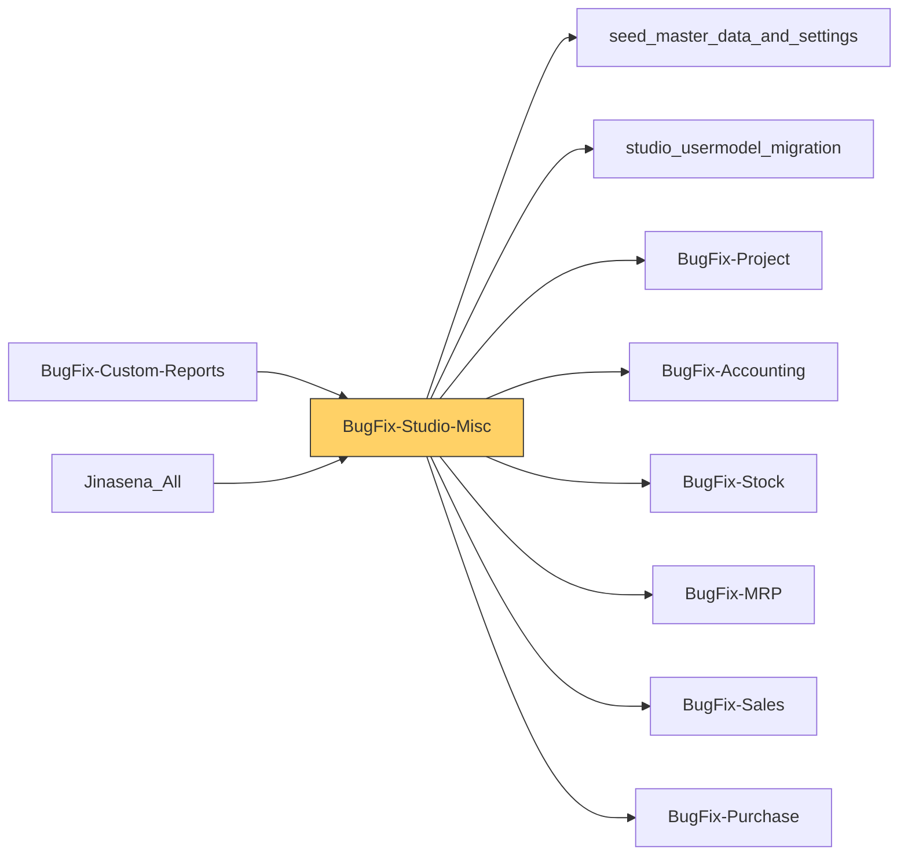

# Functional Documentation — BugFix-Studio-Misc

> Generated by `scripts/generate_functional_docs.py` from branch `Visual_Migration_02` (commit 0fba9d6 2026-10-08) and the installed module on the clean environment. For every attribute: **Function** = what it does, **Depends on** = the attributes it relies on (owning module in brackets when it is not this repo), **Used by** = the attributes in any Jinasena repo that rely on it.

| Item | Value |
|---|---|
| Technical name | `BugFix-Studio-Misc` |
| Title | Jinasena : Module : Studio-Misc |
| Version | `17.0.0.0.119` |
| Category | Extra Tools |
| License | LGPL-3 |
| Installed on environment | installed 17.0.0.0.119 |
| History | [CHANGELOG.md](CHANGELOG.md) |

## Purpose

<!-- SUMMARY:repo -->
Catch-all Jinasena module that holds the Odoo Studio customisations which do not belong to any of the domain repos (Sales, Purchase, Accounting, Stock, MRP, HR, Project and the others). It is used by administrators and power users rather than one business team: it carries Studio test and scratch apps, extra list and menu shortcuts on standard models, many Jinasena security groups with their access rights, and record rules for CRM, POS, loyalty, calendar and expenses. It installs after the domain repos and, through its post-install hook, re-attaches automation trigger and action links that BugFix-Sales, BugFix-Stock and BugFix-Accounting had to ship without in order to avoid install cycles.

- Studio-created custom models (28), mostly test or scratch apps such as TEST02, Test Layout, Test Model Link, website FAQ, Work Center Costing and the BVE sales reports, with their views, menus and default values.
- 38 security groups (Accounting, Helpdesk repair, Maintenance, Manufacturing, Purchase, Sales and others) and the access rights that use them.
- Record rules for CRM, sales teams, calendar, loyalty, POS, expenses and purchase requests.
- Window actions and 309 menus, including the Test App 05 menu tree over standard models.
- Studio list and form tweaks on technical models (actions, views, menus, sequences, access rights).
- Expense controls (block negative quantities, block deleting attachments of approved expenses) and approval rules on purchase requests and test models.
- Printed reports (helpdesk repair letters, budget, helpdesk team), numbering sequences and Studio default values.
<!-- /SUMMARY -->

## Module dependencies

| Kind | Modules |
|---|---|
| Odoo standard / enterprise | `maintenance`, `base_setup`, `base_automation`, `mail`, `hr_expense`, `documents_hr_expense`, `helpdesk`, `purchase_requisition`, `mrp_plm`, `mrp_landed_costs`, `stock_landed_costs`, `account_edi`, `industry_fsm_sale`, `hr_attendance`, `project`, `crm`, `sale_crm`, `sales_team`, `calendar`, `loyalty`, `point_of_sale`, `pos_sale`, `pos_loyalty`, `pos_mercury`, `pos_restaurant`, `pos_restaurant_appointment`, `pos_online_payment`, `website`, `website_sale`, `website_sale_loyalty`, `delivery`, `stock`, `sale`, `purchase`, `account` |
| Jinasena repos | `seed_master_data_and_settings`, `studio_usermodel_migration`, `BugFix-Project`, `BugFix-Accounting`, `BugFix-Stock`, `BugFix-MRP`, `BugFix-Sales`, `BugFix-Purchase` |
| Third-party apps |  |
| Used by (Jinasena repos that depend on this one) | `BugFix-Custom-Reports`, `Jinasena_All` |

## Contents at a glance

| Attribute type | Count |
|---|---|
| Models created | 28 |
| Models extended | 127 |
| Fields | 618 |
| Views | 638 |
| Window actions | 99 |
| Server actions | 24 |
| Automations | 7 |
| Approval rules | 7 |
| Menus | 309 |
| Reports | 78 |
| Security groups | 38 |
| Access rights | 237 |
| Record rules | 29 |
| Install hooks | 1 |
| Migration scripts | 4 |

## Models

Each model has its own page (the full reference is too large for one GitHub page).

| Model | Description | Created / extends | Fields | Views | Actions + automations | Approvals |
|---|---|---|---|---|---|---|
| [`account.account`](functional_docs/account.account.md) | Account | extends (account) | 0 | 0 | 0 | 0 |
| [`account.bank.statement`](functional_docs/account.bank.statement.md) | Bank Statement | extends (account) | 0 | 0 | 0 | 0 |
| [`account.edi.document`](functional_docs/account.edi.document.md) | Electronic Document for an account.move | extends (account_edi) | 0 | 0 | 0 | 0 |
| [`account.journal`](functional_docs/account.journal.md) | Journal | extends (account) | 0 | 0 | 0 | 0 |
| [`account.payment.method.line`](functional_docs/account.payment.method.line.md) | Payment Methods | extends (account) | 0 | 0 | 0 | 0 |
| [`account.payment.term`](functional_docs/account.payment.term.md) | Payment Terms | extends (account) | 0 | 0 | 1 | 0 |
| [`account.tax`](functional_docs/account.tax.md) | Tax | extends (account) | 0 | 0 | 0 | 0 |
| [`account.tax.group`](functional_docs/account.tax.group.md) | Tax Group | extends (account) | 0 | 0 | 0 | 0 |
| [`account.tax.repartition.line`](functional_docs/account.tax.repartition.line.md) | Tax Repartition Line | extends (account) | 0 | 0 | 0 | 0 |
| [`account.tax.unit`](functional_docs/account.tax.unit.md) | Tax Unit | extends (account_reports) | 0 | 0 | 0 | 0 |
| [`base.automation`](functional_docs/base.automation.md) | Automation Rule | extends (base_automation) | 0 | 1 | 0 | 0 |
| [`calendar.attendee`](functional_docs/calendar.attendee.md) | Calendar Attendee Information | extends (calendar) | 0 | 0 | 0 | 0 |
| [`calendar.event`](functional_docs/calendar.event.md) | Calendar Event | extends (calendar) | 0 | 0 | 0 | 0 |
| [`calendar.filters`](functional_docs/calendar.filters.md) | Calendar Filters | extends (calendar) | 0 | 1 | 0 | 0 |
| [`crm.activity.report`](functional_docs/crm.activity.report.md) | CRM Activity Analysis | extends (crm) | 0 | 0 | 0 | 0 |
| [`crm.lead`](functional_docs/crm.lead.md) | Lead/Opportunity | extends (crm) | 0 | 0 | 1 | 0 |
| [`crm.team`](functional_docs/crm.team.md) | Sales Team | extends (sales_team) | 0 | 2 | 0 | 0 |
| [`crm.team.member`](functional_docs/crm.team.member.md) | Sales Team Member | extends (sales_team) | 0 | 1 | 0 | 0 |
| [`crossovered.budget`](functional_docs/crossovered.budget.md) | Budget | extends (account_budget) | 0 | 0 | 0 | 0 |
| [`expiry.picking.confirmation`](functional_docs/expiry.picking.confirmation.md) | Confirm Expiry | extends (product_expiry) | 0 | 0 | 0 | 0 |
| [`helpdesk.team`](functional_docs/helpdesk.team.md) | Helpdesk Team | extends (helpdesk) | 0 | 1 | 0 | 0 |
| [`helpdesk.ticket`](functional_docs/helpdesk.ticket.md) | Helpdesk Ticket | extends (helpdesk) | 0 | 0 | 0 | 0 |
| [`hr.attendance.overtime`](functional_docs/hr.attendance.overtime.md) | Attendance Overtime | extends (hr_attendance) | 0 | 0 | 0 | 0 |
| [`hr.expense`](functional_docs/hr.expense.md) | Expense | extends (hr_expense) | 0 | 1 | 2 | 0 |
| [`hr.expense.sheet`](functional_docs/hr.expense.sheet.md) | Expense Report | extends (hr_expense) | 0 | 1 | 0 | 0 |
| [`ir.actions.act_window`](functional_docs/ir.actions.act_window.md) | Action Window | extends (base) | 0 | 1 | 0 | 0 |
| [`ir.actions.actions`](functional_docs/ir.actions.actions.md) | Actions | extends (base) | 0 | 1 | 0 | 0 |
| [`ir.actions.server`](functional_docs/ir.actions.server.md) | Server Action | extends (base) | 0 | 2 | 0 | 0 |
| [`ir.attachment`](functional_docs/ir.attachment.md) | Attachment | extends (base) | 0 | 0 | 3 | 0 |
| [`ir.config_parameter`](functional_docs/ir.config_parameter.md) | System Parameter | extends (base) | 0 | 1 | 0 | 0 |
| [`ir.cron`](functional_docs/ir.cron.md) | Scheduled Actions | extends (base) | 0 | 1 | 0 | 0 |
| [`ir.default`](functional_docs/ir.default.md) | Default Values | extends (base) | 0 | 1 | 0 | 0 |
| [`ir.model`](functional_docs/ir.model.md) | Models | extends (base) | 0 | 1 | 0 | 0 |
| [`ir.model.access`](functional_docs/ir.model.access.md) | Model Access | extends (base) | 0 | 2 | 0 | 0 |
| [`ir.model.data`](functional_docs/ir.model.data.md) | Model Data | extends (base) | 0 | 1 | 0 | 0 |
| [`ir.module.category`](functional_docs/ir.module.category.md) | Application | extends (base) | 0 | 0 | 0 | 0 |
| [`ir.property`](functional_docs/ir.property.md) | Company Property | extends (base) | 0 | 0 | 0 | 0 |
| [`ir.rule`](functional_docs/ir.rule.md) | Rule | extends (base) | 0 | 2 | 0 | 0 |
| [`ir.sequence`](functional_docs/ir.sequence.md) | Sequence | extends (base) | 0 | 2 | 0 | 0 |
| [`ir.ui.menu`](functional_docs/ir.ui.menu.md) | Menu | extends (base) | 0 | 1 | 0 | 0 |
| [`ir.ui.view`](functional_docs/ir.ui.view.md) | View | extends (base) | 0 | 1 | 0 | 0 |
| [`loyalty.card`](functional_docs/loyalty.card.md) | Loyalty Coupon | extends (loyalty) | 0 | 0 | 0 | 0 |
| [`loyalty.generate.wizard`](functional_docs/loyalty.generate.wizard.md) | Generate Coupons | extends (loyalty) | 0 | 0 | 0 | 0 |
| [`loyalty.program`](functional_docs/loyalty.program.md) | Loyalty Program | extends (loyalty) | 0 | 0 | 0 | 0 |
| [`loyalty.reward`](functional_docs/loyalty.reward.md) | Loyalty Reward | extends (loyalty) | 0 | 0 | 0 | 0 |
| [`loyalty.rule`](functional_docs/loyalty.rule.md) | Loyalty Rule | extends (loyalty) | 0 | 0 | 0 | 0 |
| [`mail.activity`](functional_docs/mail.activity.md) | Activity | extends (mail) | 0 | 0 | 0 | 0 |
| [`mail.template`](functional_docs/mail.template.md) | Email Templates | extends (mail) | 0 | 1 | 0 | 0 |
| [`mrp.eco.bom.change`](functional_docs/mrp.eco.bom.change.md) | ECO BoM changes | extends (mrp_plm) | 0 | 0 | 0 | 0 |
| [`pos.config`](functional_docs/pos.config.md) | Point of Sale Configuration | extends (point_of_sale) | 0 | 0 | 0 | 0 |
| [`pos.order`](functional_docs/pos.order.md) | Point of Sale Orders | extends (point_of_sale) | 0 | 0 | 0 | 0 |
| [`pos.payment`](functional_docs/pos.payment.md) | Point of Sale Payments | extends (point_of_sale) | 0 | 0 | 0 | 0 |
| [`pos.session`](functional_docs/pos.session.md) | Point of Sale Session | extends (point_of_sale) | 0 | 0 | 0 | 0 |
| [`product.category`](functional_docs/product.category.md) | Product Category | extends (product) | 2 | 2 | 0 | 0 |
| [`product.product`](functional_docs/product.product.md) | Product Variant | extends (product) | 0 | 0 | 0 | 0 |
| [`product.template.attribute.exclusion`](functional_docs/product.template.attribute.exclusion.md) | Product Template Attribute Exclusion | extends (product) | 0 | 0 | 0 | 0 |
| [`project.milestone`](functional_docs/project.milestone.md) | Project Milestone | extends (project) | 0 | 0 | 0 | 0 |
| [`project.project.stage`](functional_docs/project.project.stage.md) | Project Stage | extends (project) | 0 | 1 | 0 | 0 |
| [`project.sale.line.employee.map`](functional_docs/project.sale.line.employee.map.md) | Project Sales line, employee mapping | extends (sale_timesheet) | 0 | 1 | 0 | 0 |
| [`project.task`](functional_docs/project.task.md) | Task | extends (project) | 0 | 1 | 0 | 0 |
| [`purchase.order`](functional_docs/purchase.order.md) | Purchase Order | extends (purchase) | 0 | 0 | 0 | 0 |
| [`purchase.order.line`](functional_docs/purchase.order.line.md) | Purchase Order Line | extends (purchase) | 0 | 0 | 0 | 0 |
| [`purchase.report`](functional_docs/purchase.report.md) | Purchase Report | extends (purchase) | 0 | 0 | 0 | 0 |
| [`purchase.requisition`](functional_docs/purchase.requisition.md) | Purchase Requisition | extends (purchase_requisition) | 0 | 0 | 0 | 1 |
| [`purchase.requisition.line`](functional_docs/purchase.requisition.line.md) | Purchase Requisition Line | extends (purchase_requisition) | 0 | 0 | 0 | 0 |
| [`purchase.requisition.type`](functional_docs/purchase.requisition.type.md) | Purchase Requisition Type | extends (purchase_requisition) | 0 | 0 | 0 | 0 |
| [`repair.order`](functional_docs/repair.order.md) | Repair Order | extends (repair) | 0 | 0 | 0 | 0 |
| [`res.config.settings`](functional_docs/res.config.settings.md) | Config Settings | extends (base) | 0 | 0 | 0 | 0 |
| [`res.currency`](functional_docs/res.currency.md) | Currency | extends (base) | 0 | 1 | 0 | 0 |
| [`res.groups`](functional_docs/res.groups.md) | Access Groups | extends (base) | 0 | 0 | 4 | 0 |
| [`res.users`](functional_docs/res.users.md) | User | extends (base) | 4 | 0 | 0 | 0 |
| [`sale.order`](functional_docs/sale.order.md) | Sales Order | extends (sale) | 0 | 0 | 0 | 0 |
| [`sale.order.line`](functional_docs/sale.order.line.md) | Sales Order Line | extends (sale) | 0 | 0 | 0 | 0 |
| [`sign.request.item`](functional_docs/sign.request.item.md) | Signature Request Item | extends (sign) | 0 | 0 | 0 | 0 |
| [`stock.landed.cost`](functional_docs/stock.landed.cost.md) | Stock Landed Cost | extends (stock_landed_costs) | 0 | 0 | 0 | 0 |
| [`stock.landed.cost.lines`](functional_docs/stock.landed.cost.lines.md) | Stock Landed Cost Line | extends (stock_landed_costs) | 0 | 0 | 0 | 0 |
| [`stock.quant`](functional_docs/stock.quant.md) | Quants | extends (stock) | 0 | 0 | 0 | 0 |
| [`stock.route`](functional_docs/stock.route.md) | Inventory Routes | extends (stock) | 0 | 0 | 0 | 0 |
| [`stock.rule`](functional_docs/stock.rule.md) | Stock Rule | extends (stock) | 0 | 0 | 0 | 0 |
| [`studio.approval.entry`](functional_docs/studio.approval.entry.md) | Studio Approval Entry | extends (web_studio) | 0 | 0 | 0 | 0 |
| [`uom.category`](functional_docs/uom.category.md) | Product UoM Categories | extends (uom) | 0 | 0 | 0 | 0 |
| [`x_account_winbooks_import_wizard`](functional_docs/x_account_winbooks_import_wizard.md) | Account Winbooks import wizard | created | 7 | 0 | 0 | 0 |
| [`x_bve.salesreport`](functional_docs/x_bve.salesreport.md) | Sales Report | created | 18 | 4 | 0 | 0 |
| [`x_bve.samplebalancemovementreport`](functional_docs/x_bve.samplebalancemovementreport.md) | Sample Balance Movement Report | created | 12 | 4 | 0 | 0 |
| [`x_bve.test1`](functional_docs/x_bve.test1.md) | Test 1 | created | 8 | 4 | 0 | 0 |
| [`x_con_consolidated_hea`](functional_docs/x_con_consolidated_hea.md) | Con. Consolidated Header | extends (BugFix-Stock) | 0 | 0 | 0 | 0 |
| [`x_con_consolidated_lin`](functional_docs/x_con_consolidated_lin.md) | Con. Consolidated Line | extends (BugFix-Stock) | 0 | 0 | 0 | 0 |
| [`x_consignment_charge_h`](functional_docs/x_consignment_charge_h.md) | Consignment Charge Header | extends (BugFix-Stock) | 0 | 0 | 0 | 0 |
| [`x_consignment_charge_l`](functional_docs/x_consignment_charge_l.md) | Consignment Charge Line | extends (BugFix-Stock) | 0 | 0 | 0 | 0 |
| [`x_consignment_header`](functional_docs/x_consignment_header.md) | Consignment Header | extends (BugFix-Stock) | 0 | 0 | 0 | 0 |
| [`x_consignment_line`](functional_docs/x_consignment_line.md) | Consignment Line | extends (BugFix-Stock) | 0 | 0 | 0 | 0 |
| [`x_custom_reports`](functional_docs/x_custom_reports.md) | Custom Reports | extends (BugFix-Custom-Reports) | 0 | 0 | 0 | 0 |
| [`x_custom_reports_line_c55e7`](functional_docs/x_custom_reports_line_c55e7.md) | custom_reports_line | created | 8 | 3 | 0 | 0 |
| [`x_custom_reports_tag`](functional_docs/x_custom_reports_tag.md) | Custom Reports Tags | created | 8 | 3 | 0 | 0 |
| [`x_customer_group`](functional_docs/x_customer_group.md) | Customer Group | extends (studio_usermodel_migration) | 0 | 1 | 0 | 0 |
| [`x_customer_groups`](functional_docs/x_customer_groups.md) | Customer Groups | created | 32 | 1 | 0 | 0 |
| [`x_departments`](functional_docs/x_departments.md) | Departments | extends (BugFix-Project) | 0 | 0 | 0 | 0 |
| [`x_import_rfq_charge_he`](functional_docs/x_import_rfq_charge_he.md) | Import RFQ Charge Header | extends (BugFix-Purchase) | 0 | 0 | 0 | 0 |
| [`x_import_rfq_charge_li`](functional_docs/x_import_rfq_charge_li.md) | Import RFQ Charge Line | extends (BugFix-Purchase) | 0 | 0 | 0 | 0 |
| [`x_mass_produce_serial`](functional_docs/x_mass_produce_serial.md) | Mass Produce Serial | extends (BugFix-MRP) | 0 | 0 | 0 | 0 |
| [`x_mass_produce_serial_`](functional_docs/x_mass_produce_serial_.md) | Mass Produce Serial Line | extends (BugFix-MRP) | 0 | 0 | 0 | 0 |
| [`x_material_request`](functional_docs/x_material_request.md) | Material Request | extends (BugFix-Stock) | 0 | 0 | 0 | 0 |
| [`x_material_request_mt`](functional_docs/x_material_request_mt.md) | Material Request MT | extends (BugFix-Stock) | 1 | 0 | 0 | 0 |
| [`x_material_request_mt_line_9a011`](functional_docs/x_material_request_mt_line_9a011.md) | material_request_mt_line | created | 9 | 3 | 0 | 0 |
| [`x_material_request_tes`](functional_docs/x_material_request_tes.md) | Material Request Test | extends (BugFix-Stock) | 1 | 0 | 0 | 0 |
| [`x_material_request_tes_line_3301b`](functional_docs/x_material_request_tes_line_3301b.md) | material_request_tes_line | created | 9 | 3 | 0 | 0 |
| [`x_mr_config`](functional_docs/x_mr_config.md) | MR config | extends (BugFix-Stock) | 0 | 0 | 0 | 0 |
| [`x_non_inventory_produc`](functional_docs/x_non_inventory_produc.md) | Non Inventory Product Code | extends (BugFix-Purchase) | 0 | 0 | 0 | 0 |
| [`x_po_line_non_inventor`](functional_docs/x_po_line_non_inventor.md) | Purchase Order Line (Non-Inventory) | extends (BugFix-Purchase) | 0 | 0 | 0 | 0 |
| [`x_po_non_inventory`](functional_docs/x_po_non_inventory.md) | Purchase Order (Non-Inventory) | extends (BugFix-Purchase) | 0 | 0 | 0 | 0 |
| [`x_pr_line_cash`](functional_docs/x_pr_line_cash.md) | Purchase Request Line Cash | extends (BugFix-Purchase) | 0 | 0 | 0 | 0 |
| [`x_pr_line_non_inventor`](functional_docs/x_pr_line_non_inventor.md) | Purchase Request Line (Non-Inventory) | extends (BugFix-Purchase) | 0 | 0 | 0 | 0 |
| [`x_pr_non_inventory`](functional_docs/x_pr_non_inventory.md) | Purchase Request (Non-Inventory) | extends (BugFix-Purchase) | 0 | 0 | 0 | 1 |
| [`x_product_product`](functional_docs/x_product_product.md) | product.product | created | 7 | 3 | 0 | 0 |
| [`x_product_test`](functional_docs/x_product_test.md) | product.test | created | 26 | 5 | 1 | 0 |
| [`x_project_category`](functional_docs/x_project_category.md) | Project Category | extends (BugFix-Project) | 0 | 0 | 0 | 0 |
| [`x_project_category_gro`](functional_docs/x_project_category_gro.md) | Project Category Group | extends (BugFix-Project) | 0 | 0 | 0 | 0 |
| [`x_project_groups`](functional_docs/x_project_groups.md) | Project Groups | extends (BugFix-Project) | 0 | 0 | 0 | 0 |
| [`x_project_task_worksheet_template_1`](functional_docs/x_project_task_worksheet_template_1.md) | Default Worksheet | created | 9 | 1 | 0 | 0 |
| [`x_purchase.request.line.make.purchase.order`](functional_docs/x_purchase.request.line.make.purchase.order.md) | Purchase Request Line Make Purchase Order | extends (BugFix-Purchase) | 0 | 0 | 0 | 0 |
| [`x_purchase.request.line.make.purchase.order.item`](functional_docs/x_purchase.request.line.make.purchase.order.item.md) | Purchase Request Line Make Purchase Order Item | extends (BugFix-Purchase) | 0 | 0 | 0 | 0 |
| [`x_purchase_request`](functional_docs/x_purchase_request.md) | Purchase Request | extends (BugFix-Purchase) | 0 | 0 | 0 | 2 |
| [`x_purchase_request_cas`](functional_docs/x_purchase_request_cas.md) | Purchase Request Cash | extends (BugFix-Purchase) | 0 | 0 | 0 | 0 |
| [`x_purchase_request_lin`](functional_docs/x_purchase_request_lin.md) | Purchase Request Line | extends (BugFix-Purchase) | 0 | 0 | 0 | 0 |
| [`x_res_config_settings`](functional_docs/x_res_config_settings.md) | res.config.settings | created | 8 | 4 | 0 | 0 |
| [`x_resolutions`](functional_docs/x_resolutions.md) | Resolutions | extends (Fix-repair) | 0 | 0 | 0 | 0 |
| [`x_sales_model_debug`](functional_docs/x_sales_model_debug.md) | Sales Model Debug | created | 35 | 4 | 0 | 0 |
| [`x_sales_report_model`](functional_docs/x_sales_report_model.md) | Sales Report Model | extends (Jinasena_Masterdata_Reporting) | 0 | 0 | 0 | 0 |
| [`x_studio_check_out_auto`](functional_docs/x_studio_check_out_auto.md) | Check Out Auto | created | 7 | 0 | 0 | 0 |
| [`x_tariff_date`](functional_docs/x_tariff_date.md) | Tariff Date | extends (BugFix-Purchase) | 0 | 0 | 0 | 0 |
| [`x_tariff_rates`](functional_docs/x_tariff_rates.md) | Tariff Rates | extends (BugFix-Purchase) | 0 | 0 | 0 | 0 |
| [`x_tariffmaster`](functional_docs/x_tariffmaster.md) | TariffMaster | extends (BugFix-Stock) | 0 | 0 | 0 | 0 |
| [`x_temp_actual_budget`](functional_docs/x_temp_actual_budget.md) | Temp_Actual_Budget | extends (BugFix-Accounting) | 0 | 0 | 0 | 0 |
| [`x_temp_con_conso_line`](functional_docs/x_temp_con_conso_line.md) | Temp Con. Conso. Line | extends (BugFix-Stock) | 0 | 0 | 0 | 0 |
| [`x_temp_con_consolidate`](functional_docs/x_temp_con_consolidate.md) | Temp Con. Consolidated Header | extends (BugFix-Stock) | 0 | 0 | 0 | 0 |
| [`x_temp_consignment_hea`](functional_docs/x_temp_consignment_hea.md) | Temp Consignment Header | extends (BugFix-Stock) | 0 | 0 | 0 | 0 |
| [`x_temp_consignment_lin`](functional_docs/x_temp_consignment_lin.md) | Temp Consignment Line | extends (BugFix-Stock) | 0 | 0 | 0 | 0 |
| [`x_temp_tp_invoice_head`](functional_docs/x_temp_tp_invoice_head.md) | Temp TP Invoice Header | extends (BugFix-Accounting) | 0 | 0 | 0 | 0 |
| [`x_temp_tp_invoice_line`](functional_docs/x_temp_tp_invoice_line.md) | Temp TP Invoice Line | extends (BugFix-Accounting) | 0 | 0 | 0 | 0 |
| [`x_test02`](functional_docs/x_test02.md) | TEST02 | created | 52 | 8 | 19 | 3 |
| [`x_test_1`](functional_docs/x_test_1.md) | TEST-1 | created | 21 | 4 | 0 | 0 |
| [`x_test_form`](functional_docs/x_test_form.md) | TEST FORM | created | 34 | 4 | 0 | 0 |
| [`x_test_layout`](functional_docs/x_test_layout.md) | Test Layout | created | 23 | 4 | 0 | 0 |
| [`x_test_model_link`](functional_docs/x_test_model_link.md) | TEST MODEL LINK | created | 34 | 5 | 0 | 0 |
| [`x_test_model_link_2`](functional_docs/x_test_model_link_2.md) | Test Model Link 2 | created | 35 | 4 | 0 | 0 |
| [`x_test_model_primary`](functional_docs/x_test_model_primary.md) | TEST MODEL PRIMARY | created | 35 | 5 | 0 | 0 |
| [`x_testapp`](functional_docs/x_testapp.md) | TestApp | created | 20 | 3 | 0 | 0 |
| [`x_testdepartment`](functional_docs/x_testdepartment.md) | TestDepartment | created | 25 | 5 | 0 | 0 |
| [`x_tp_invoice_header`](functional_docs/x_tp_invoice_header.md) | TP Invoice Header | extends (BugFix-Accounting) | 0 | 0 | 0 | 0 |
| [`x_tp_invoice_line`](functional_docs/x_tp_invoice_line.md) | TP Invoice Line | extends (BugFix-Accounting) | 0 | 0 | 0 | 0 |
| [`x_vendor_group`](functional_docs/x_vendor_group.md) | Vendor Group | extends (studio_usermodel_migration) | 0 | 0 | 0 | 0 |
| [`x_website_faq`](functional_docs/x_website_faq.md) | website.faq | created | 38 | 6 | 0 | 0 |
| [`x_website_faqs`](functional_docs/x_website_faqs.md) | website FAQs | created | 39 | 9 | 0 | 0 |
| [`x_work_center_costing`](functional_docs/x_work_center_costing.md) | Work Center Costing | created | 44 | 5 | 0 | 0 |
| [`x_x_studio_request_line`](functional_docs/x_x_studio_request_line.md) | x_studio_request_line | created | 7 | 0 | 0 | 0 |

## Menus

**Menus (309):**

| Name | Record name | State | Function | Depends on | Used by |
|---|---|---|---|---|---|
| Access Management | `menu_studio_test_app_05_access_management` |  | Menu **Access Management** — folder that groups the menus under it. |  |  |
| Accounting/Configuration/Accounting/Tax Units | `menu_f6_tax_units` | hidden | Menu **Accounting/Configuration/Accounting/Tax Units** — opens _Tax Units_. | `window action account_reports.action_view_tax_units` (account_reports) |  |
| Accounting/Taxes | `menu_f6_taxes` | hidden | Menu **Accounting/Taxes** — opens _Taxes_. | `window action BugFix-Accounting.action_2758_taxes` (BugFix-Accounting) |  |
| Accounting/Vendors/Employee Expenses | `menu_f6_employee_expenses` | hidden | Menu **Accounting/Vendors/Employee Expenses** — opens _Employee Expenses_. | `window action hr_expense.action_hr_expense_account` (hr_expense) |  |
| All Models | `menu_f6r3_all_models` |  | Menu **All Models** — folder that groups the menus under it. |  |  |
| Attendances/Update OT | `menu_1233_update_ot` |  | Menu **Attendances/Update OT** — folder that groups the menus under it. |  |  |
| Bulk Inputs Manager | `menu_studio_bulk_inputs_manager` |  | Menu **Bulk Inputs Manager** — folder that groups the menus under it. |  |  |
| CRM/Sales/Sales Team Member | `menu_f6_sales_team_member` |  | Menu **CRM/Sales/Sales Team Member** — opens _Sales Team Member_. | `window action BugFix-Studio-Misc.act_window_2882_sales_team_member_d7` |  |
| Consignment | `menu_f6url_consignment` | hidden | Menu **Consignment** — opens _Home Menu_. | `URL action base.action_open_website` (base) |  |
| Divisional P&L | `menu_studio_divisional_pl` |  | Menu **Divisional P&L** — folder that groups the menus under it. |  |  |
| Documents/Configuration/Jinasena Custom Reports Tags | `menu_f6_jinasena_custom_reports_tags` |  | Menu **Documents/Configuration/Jinasena Custom Reports Tags** — opens _Jinasena Custom Reports Tags_. | `window action BugFix-Studio-Misc.act_window_3349_jinasena_custom_reports_tags` |  |
| Employees/Bulk Inputs | `menu_f6r3_employees_bulk_inputs` |  | Menu **Employees/Bulk Inputs** — folder that groups the menus under it. |  |  |
| Employees/Bulk Inputs | `menu_f6url_bulk_inputs` |  | Menu **Employees/Bulk Inputs** — opens _Home Menu_. | `URL action base.action_open_website` (base) |  |
| Expenses/Expense Reports | `menu_f6_expense_reports` |  | Menu **Expenses/Expense Reports** — opens _All Reports_. | `window action hr_expense.action_hr_expense_sheet_all` (hr_expense) |  |
| Expenses/My Expenses/My Expenses | `menu_f6_my_expenses` |  | Menu **Expenses/My Expenses/My Expenses** — opens _My Expenses_. | `window action hr_expense.hr_expense_actions_my_all` (hr_expense) |  |
| Expenses/My Expenses/My Reports | `menu_f6_my_reports` |  | Menu **Expenses/My Expenses/My Reports** — opens _My Reports_. | `window action hr_expense.action_hr_expense_sheet_my_all` (hr_expense) |  |
| Expenses/Reporting/Expenses Analysis | `menu_f6_expenses_analysis` |  | Menu **Expenses/Reporting/Expenses Analysis** — opens _Expenses Analysis_. | `window action hr_expense.hr_expense_actions_all` (hr_expense) |  |
| FAQs | `menu_f6r3_faqs` | hidden | Menu **FAQs** — folder that groups the menus under it. |  |  |
| FAQs/website.faq | `menu_f6r3_faqs_website_faq` |  | Menu **FAQs/website.faq** — opens _website.faq_. | `window action BugFix-Studio-Misc.act_window_3205_website_faq` |  |
| Helpdesk/Repair Diagnosis | `menu_f6url_repair_diagnosis` |  | Menu **Helpdesk/Repair Diagnosis** — opens _Home Menu_. | `URL action base.action_open_website` (base) |  |
| Helpdesk/Reporting/Customer Letter Report | `menu_f6_customer_letter_report` |  | Menu **Helpdesk/Reporting/Customer Letter Report** — opens _Customer Letter Report_. | `window action Fix-repair.act_window_2239_customer_letter_report` (Fix-repair) |  |
| Helpdesk/Reporting/Repair Job Details | `menu_1087_repair_job_details` |  | Menu **Helpdesk/Reporting/Repair Job Details** — folder that groups the menus under it. |  |  |
| Import Bulk Inputs | `menu_studio_import_bulk_inputs_hr` |  | Menu **Import Bulk Inputs** — folder that groups the menus under it. |  |  |
| Import Bulk Inputs | `menu_studio_import_bulk_inputs_ot` |  | Menu **Import Bulk Inputs** — folder that groups the menus under it. |  |  |
| Inventory/Inventory Setup/Product Categories | `menu_f6_product_categories` |  | Menu **Inventory/Inventory Setup/Product Categories** — opens _Product Categories_. | `window action product.product_category_action_form` (product) |  |
| Inventory/Inventory Setup/UoM Categories | `menu_f6_uom_categories` |  | Menu **Inventory/Inventory Setup/UoM Categories** — opens _UoM Categories_. | `window action BugFix-Studio-Misc.act_window_2472_uom_categories` |  |
| Inventory/Overview/Test Menu | `menu_f6url_test_menu` | hidden | Menu **Inventory/Overview/Test Menu** — opens _Home Menu_. | `URL action base.action_open_website` (base) |  |
| Inventory/wAREHOUSE | `menu_f6r3_inventory_warehouse` |  | Menu **Inventory/wAREHOUSE** — folder that groups the menus under it. |  |  |
| Jinasena Reports | `menu_f6r3_jinasena_reports` |  | Menu **Jinasena Reports** — folder that groups the menus under it. |  |  |
| Jinasena Reports/Configuration | `menu_f6r3_jinasena_reports_configuration` |  | Menu **Jinasena Reports/Configuration** — folder that groups the menus under it. |  |  |
| Jinasena Reports/Configuration/Jinasena Custom Reports Tags | `menu_f6r3_jinasena_reports_configuration_jinasena_custom_reports_tags` |  | Menu **Jinasena Reports/Configuration/Jinasena Custom Reports Tags** — opens _Jinasena Custom Reports Tags_. | `window action BugFix-Studio-Misc.act_window_3349_jinasena_custom_reports_tags` |  |
| Manufacturing/Configuration/Work Center Costing | `menu_f6_work_center_costing` |  | Menu **Manufacturing/Configuration/Work Center Costing** — opens _Work Center Costing_. | `window action BugFix-Studio-Misc.act_window_1134_work_center_costing` |  |
| Manufacturing/Configuration/Work Center Costing | `menu_633_work_center_costing` |  | Menu **Manufacturing/Configuration/Work Center Costing** — folder that groups the menus under it. |  |  |
| Material Management Module/Configuration/Purchase Request MT Stages | `menu_1751_purchase_request_mt_stages` |  | Menu **Material Management Module/Configuration/Purchase Request MT Stages** — opens _Purchase Request MT Stages_. | `window action BugFix-Purchase.act_window_3388_purchase_request_mt_stages` (BugFix-Purchase) |  |
| Material Management Module/Configuration/Purchase Request MT Stages | `menu_f6_purchase_request_mt_stages` |  | Menu **Material Management Module/Configuration/Purchase Request MT Stages** — opens _Purchase Request MT Stages_. | `window action BugFix-Purchase.act_window_3388_purchase_request_mt_stages` (BugFix-Purchase) |  |
| Material Management Module/Configuration/Purchase Request MT Tags | `menu_1752_purchase_request_mt_tags` |  | Menu **Material Management Module/Configuration/Purchase Request MT Tags** — opens _Purchase Request MT Tags_. | `window action BugFix-Purchase.act_window_3389_purchase_request_mt_tags` (BugFix-Purchase) |  |
| Material Management Module/Configuration/Purchase Request MT Tags | `menu_f6_purchase_request_mt_tags` |  | Menu **Material Management Module/Configuration/Purchase Request MT Tags** — opens _Purchase Request MT Tags_. | `window action BugFix-Purchase.act_window_3389_purchase_request_mt_tags` (BugFix-Purchase) |  |
| Material Management Module/Configuration/Purchase Request T Stages | `menu_f6_purchase_request_t_stages` |  | Menu **Material Management Module/Configuration/Purchase Request T Stages** — opens _Purchase Request T Stages_. | `window action BugFix-Purchase.act_window_3378_purchase_request_t_stages` (BugFix-Purchase) |  |
| Material Management Module/Configuration/Purchase Request T Tags | `menu_f6_purchase_request_t_tags` |  | Menu **Material Management Module/Configuration/Purchase Request T Tags** — opens _Purchase Request T Tags_. | `window action BugFix-Purchase.act_window_3379_purchase_request_t_tags` (BugFix-Purchase) |  |
| Material Management Module/Purchase Request Line | `menu_f6_purchase_request_line` |  | Menu **Material Management Module/Purchase Request Line** — opens _Purchase Request Line_. | `window action BugFix-Purchase.action_3380_purchase_request_line` (BugFix-Purchase) |  |
| Material Management Module/Purchase Request MT | `menu_1750_purchase_request_mt` |  | Menu **Material Management Module/Purchase Request MT** — opens _Purchase Request MT_. | `window action BugFix-Purchase.action_3387_purchase_request_mt` (BugFix-Purchase) |  |
| Material Management Module/Purchase Request MT | `menu_f6_purchase_request_mt` |  | Menu **Material Management Module/Purchase Request MT** — opens _Purchase Request MT_. | `window action BugFix-Purchase.action_3387_purchase_request_mt` (BugFix-Purchase) |  |
| Material Management Module/Purchase Request Test | `menu_f6_purchase_request_test` |  | Menu **Material Management Module/Purchase Request Test** — opens _Purchase Request Test_. | `window action BugFix-Purchase.action_3377_purchase_request_test` (BugFix-Purchase) |  |
| Material Management/Configuration/MR config | `menu_830_mr_config` |  | Menu **Material Management/Configuration/MR config** — opens _MR config_. | `window action BugFix-Purchase.action_1565_mr_config` (BugFix-Purchase) |  |
| Material Management/Configuration/MR config | `menu_f6_mr_config` |  | Menu **Material Management/Configuration/MR config** — opens _MR config_. | `window action BugFix-Purchase.action_1565_mr_config` (BugFix-Purchase) |  |
| Material Management/Material Request | `menu_f6_material_request` |  | Menu **Material Management/Material Request** — opens _Material Request_. | `window action BugFix-Stock.act_window_1562_material_request` (BugFix-Stock) |  |
| My Menu 01 | `menu_f6url_my_menu_01` | hidden | Menu **My Menu 01** — opens _Home Menu_. | `URL action base.action_open_website` (base) |  |
| Payroll/Configuration/Custom Configuration | `menu_f6r3_payroll_configuration_custom_configuration` |  | Menu **Payroll/Configuration/Custom Configuration** — folder that groups the menus under it. |  |  |
| Payroll/Configuration/Custom Configuration/Paye Tax | `menu_f6r3_payroll_configuration_custom_configuration_paye_tax` |  | Menu **Payroll/Configuration/Custom Configuration/Paye Tax** — opens _Paye Tax_. | `window action BugFix-HR.act_window_1559_paye_tax` (BugFix-HR) |  |
| Payroll/Configuration/Custom Configuration/Paye Tax Tags | `menu_f6r3_payroll_configuration_custom_configuration_paye_tax_tags` |  | Menu **Payroll/Configuration/Custom Configuration/Paye Tax Tags** — opens _Paye Tax Tags_. | `window action BugFix-HR.act_window_1560_paye_tax_tags` (BugFix-HR) |  |
| Payroll/Configuration/Paymaster Config | `menu_1860_paymaster_config` |  | Menu **Payroll/Configuration/Paymaster Config** — opens _Paymaster Config_. | `window action bank-data.action_paymaster_config` (bank-data) |  |
| Posting Profiles | `menu_f6r3_posting_profiles` | hidden | Menu **Posting Profiles** — folder that groups the menus under it. |  |  |
| Posting Profiles/Customer Posting Profile | `menu_f6r3_posting_profiles_customer_posting_profile` |  | Menu **Posting Profiles/Customer Posting Profile** — opens _Customer Posting Profile_. | `window action BugFix-Accounting.action_779_customer_posting_profile` (BugFix-Accounting) |  |
| Profit and Loss (Rohana) | `menu_studio_profit_loss_rohana` |  | Menu **Profit and Loss (Rohana)** — folder that groups the menus under it. |  |  |
| Project/Projects/Helpdesk Team (helpdesk.team) | `menu_f6_helpdesk_team_helpdesk_team` |  | Menu **Project/Projects/Helpdesk Team (helpdesk.team)** — opens _Helpdesk Team (helpdesk.team)_. | `window action Fix-repair.act_window_2876_helpdesk_team_helpdesk_team` (Fix-repair) |  |
| Project/Projects/Project Stage (project.project.stage) | `menu_f6_project_stage_project_project_stage` |  | Menu **Project/Projects/Project Stage (project.project.stage)** — opens _Project Stage (project.project.stage)_. | `window action BugFix-Project.act_window_2878_project_stage_project_project_stage` (BugFix-Project) |  |
| Project/Projects/project.milestone | `menu_f6_project_milestone` |  | Menu **Project/Projects/project.milestone** — opens _project.milestone_. | `window action BugFix-Project.act_window_2805_project_milestone` (BugFix-Project) |  |
| Project/Projects/project.sale.line.employee.map | `menu_f6_project_sale_line_employee_map` |  | Menu **Project/Projects/project.sale.line.employee.map** — opens _project.sale.line.employee.map_. | `window action BugFix-Studio-Misc.act_window_2806_project_sale_line_employee_map_d7` |  |
| Project/Reporting/Project Budgeted Cash Flow | `menu_f6r3_project_reporting_project_budgeted_cash_flow` |  | Menu **Project/Reporting/Project Budgeted Cash Flow** — folder that groups the menus under it. |  |  |
| Purchase Requisition MGMT/Cash Purchases/Cash Purchase | `menu_f6r3_purchase_requisition_mgmt_cash_purchases_cash_purchase` |  | Menu **Purchase Requisition MGMT/Cash Purchases/Cash Purchase** — opens _Cash Purchase_. | `window action BugFix-Purchase.action_2076_cash_purchase` (BugFix-Purchase) |  |
| Purchase Requisition MGMT/Cash Purchases/Cash Purchase Line | `menu_f6r3_purchase_requisition_mgmt_cash_purchases_cash_purchase_line` |  | Menu **Purchase Requisition MGMT/Cash Purchases/Cash Purchase Line** — opens _Cash Purchase lines_. | `window action BugFix-Purchase.action_883_cash_purchase_lines` (BugFix-Purchase) |  |
| Purchase Requisition MGMT/Purchase Order (Non-Inventory)/Purchase Order | `menu_f6r3_purchase_requisition_mgmt_purchase_order_non_inventory_purch` |  | Menu **Purchase Requisition MGMT/Purchase Order (Non-Inventory)/Purchase Order** — opens _PO Non Inventory_. | `window action BugFix-Purchase.action_961_po_non_inventory` (BugFix-Purchase) |  |
| Purchase Requisition MGMT/Purchase Order (Non-Inventory)/Purchase Order Line | `menu_f6f_purchase_order_line` |  | Menu **Purchase Requisition MGMT/Purchase Order (Non-Inventory)/Purchase Order Line** — opens _PO Line Non Inventory_. | `window action BugFix-Purchase.action_962_po_line_non_inventory` (BugFix-Purchase) |  |
| Purchase Requisition/PR Type | `menu_f6_pr_type` |  | Menu **Purchase Requisition/PR Type** — opens _PR Type_. | `window action BugFix-Purchase.action_777_pr_type` (BugFix-Purchase) |  |
| Purchase Requisition/Purchase Requisition | `menu_f6_purchase_requisition` |  | Menu **Purchase Requisition/Purchase Requisition** — opens _Purchase Requisition_. | `window action BugFix-Purchase.action_776_purchase_requisition` (BugFix-Purchase) |  |
| Purchase/Cash purchase | `menu_f6r3_purchase_cash_purchase` | hidden | Menu **Purchase/Cash purchase** — folder that groups the menus under it. |  |  |
| Purchase/Cash purchase | `menu_f6url_cash_purchase` | hidden | Menu **Purchase/Cash purchase** — opens _Home Menu_. | `URL action base.action_open_website` (base) |  |
| Purchase/Cash purchase/Cash Purchase | `menu_f6r3_purchase_cash_purchase_cash_purchase` | hidden | Menu **Purchase/Cash purchase/Cash Purchase** — opens _Cash Purchase_. | `window action BugFix-Purchase.action_2076_cash_purchase` (BugFix-Purchase) |  |
| Purchase/Cash purchase/Cash Purchase Lines | `menu_f6r3_purchase_cash_purchase_cash_purchase_lines` | hidden | Menu **Purchase/Cash purchase/Cash Purchase Lines** — opens _Cash Purchase Lines_. | `window action BugFix-Purchase.action_2084_cash_purchase_lines` (BugFix-Purchase) |  |
| Purchase/Configuration/Imports Configurations | `menu_f6r3_purchase_configuration_imports_configurations` |  | Menu **Purchase/Configuration/Imports Configurations** — folder that groups the menus under it. |  |  |
| Purchase/Configuration/Imports Configurations | `menu_f6url_imports_configurations` | hidden | Menu **Purchase/Configuration/Imports Configurations** — opens _Home Menu_. | `URL action base.action_open_website` (base) |  |
| Purchase/Configuration/Imports Configurations/Charges | `menu_f6r3_purchase_configuration_imports_configurations_charges` |  | Menu **Purchase/Configuration/Imports Configurations/Charges** — folder that groups the menus under it. |  |  |
| Purchase/Configuration/Imports Configurations/Charges | `menu_f6url_charges` |  | Menu **Purchase/Configuration/Imports Configurations/Charges** — opens _Home Menu_. | `URL action base.action_open_website` (base) |  |
| Purchase/Configuration/Imports Configurations/Charges/Charges | `menu_f6r3_purchase_configuration_imports_configurations_charges_charge` |  | Menu **Purchase/Configuration/Imports Configurations/Charges/Charges** — opens _Charges_. | `window action BugFix-Purchase.action_1164_charges` (BugFix-Purchase) |  |
| Purchase/Configuration/Imports Configurations/Charges/Duties | `menu_f6r3_purchase_configuration_imports_configurations_charges_duties` |  | Menu **Purchase/Configuration/Imports Configurations/Charges/Duties** — opens _Duties_. | `window action BugFix-Purchase.action_1165_duties` (BugFix-Purchase) |  |
| Purchase/Configuration/Imports Configurations/Charges/Taxes | `menu_f6r3_purchase_configuration_imports_configurations_charges_taxes` |  | Menu **Purchase/Configuration/Imports Configurations/Charges/Taxes** — opens _Taxes_. | `window action BugFix-Purchase.action_2067_taxes` (BugFix-Purchase) |  |
| Purchase/Configuration/Imports Configurations/Custom Currency Rates | `menu_f6r3_purchase_configuration_imports_configurations_custom_currenc` |  | Menu **Purchase/Configuration/Imports Configurations/Custom Currency Rates** — opens _Custom Currency Rates_. | `window action BugFix-Accounting.action_2063_custom_currency_rates` (BugFix-Accounting) |  |
| Purchase/Configuration/Imports Configurations/Delivery Terms | `menu_f6r3_purchase_configuration_imports_configurations_delivery_terms` |  | Menu **Purchase/Configuration/Imports Configurations/Delivery Terms** — opens _Delivery Terms_. | `window action BugFix-Sales.act_window_2060_delivery_terms` (BugFix-Sales) |  |
| Purchase/Configuration/Imports Configurations/Import Charges | `menu_f6r3_purchase_configuration_imports_configurations_import_charges` |  | Menu **Purchase/Configuration/Imports Configurations/Import Charges** — opens _Import Charges_. | `window action BugFix-Purchase.action_2055_import_charges` (BugFix-Purchase) |  |
| Purchase/Configuration/Imports Configurations/Misc. Charge Codes | `menu_f6r3_purchase_configuration_imports_configurations_misc_charge_co` |  | Menu **Purchase/Configuration/Imports Configurations/Misc. Charge Codes** — opens _Misc. Charge Codes_. | `window action BugFix-Accounting.action_2061_misc_charge_codes` (BugFix-Accounting) |  |
| Purchase/Configuration/Imports Configurations/Payment Methods | `menu_f6r3_purchase_configuration_imports_configurations_payment_method` |  | Menu **Purchase/Configuration/Imports Configurations/Payment Methods** — opens _Payment Methods_. | `window action BugFix-Purchase.action_1388_payment_methods` (BugFix-Purchase) |  |
| Purchase/Configuration/Imports Configurations/Structures | `menu_f6r3_purchase_configuration_imports_configurations_structures` |  | Menu **Purchase/Configuration/Imports Configurations/Structures** — opens _Structures_. | `window action BugFix-Purchase.action_2056_structures` (BugFix-Purchase) |  |
| Purchase/Configuration/Imports Configurations/Tariff | `menu_f6r3_purchase_configuration_imports_configurations_tariff` |  | Menu **Purchase/Configuration/Imports Configurations/Tariff** — folder that groups the menus under it. |  |  |
| Purchase/Configuration/Imports Configurations/Tariff | `menu_f6url_tariff_1` |  | Menu **Purchase/Configuration/Imports Configurations/Tariff** — opens _Home Menu_. | `URL action base.action_open_website` (base) |  |
| Purchase/Configuration/Imports Configurations/Tariff/Tariff Master | `menu_f6r3_purchase_configuration_imports_configurations_tariff_tariff_` |  | Menu **Purchase/Configuration/Imports Configurations/Tariff/Tariff Master** — opens _Tariff Master_. | `window action BugFix-Stock.act_window_2069_tariff_master` (BugFix-Stock) |  |
| Purchase/Configuration/Imports Configurations/Tariff/Tariff Periods | `menu_f6f_tariff_periods` |  | Menu **Purchase/Configuration/Imports Configurations/Tariff/Tariff Periods** — opens _Tariff Periods_. | `window action BugFix-Purchase.act_window_2042_tariff_periods` (BugFix-Purchase) |  |
| Purchase/Configuration/Imports Configurations/Tariff/Tariff Rates | `menu_f6f_tariff_rates` |  | Menu **Purchase/Configuration/Imports Configurations/Tariff/Tariff Rates** — opens _Tariff Rates_. | `window action BugFix-Purchase.act_window_2047_tariff_rates` (BugFix-Purchase) |  |
| Purchase/Configuration/Setups/Charges | `menu_f6r3_purchase_configuration_setups_charges` |  | Menu **Purchase/Configuration/Setups/Charges** — opens _Charges_. | `window action BugFix-Purchase.action_1164_charges` (BugFix-Purchase) |  |
| Purchase/Configuration/Setups/Charges/Charges | `menu_f6r3_purchase_configuration_setups_charges_charges` |  | Menu **Purchase/Configuration/Setups/Charges/Charges** — opens _Charges_. | `window action BugFix-Purchase.action_1164_charges` (BugFix-Purchase) |  |
| Purchase/Configuration/Setups/Charges/Duties | `menu_f6r3_purchase_configuration_setups_charges_duties` |  | Menu **Purchase/Configuration/Setups/Charges/Duties** — opens _Duties_. | `window action BugFix-Purchase.action_1165_duties` (BugFix-Purchase) |  |
| Purchase/Configuration/Setups/Charges/Taxes | `menu_f6r3_purchase_configuration_setups_charges_taxes` |  | Menu **Purchase/Configuration/Setups/Charges/Taxes** — opens _Taxes_. | `window action BugFix-Purchase.action_2067_taxes` (BugFix-Purchase) |  |
| Purchase/Configuration/Setups/Custom Currency Rate | `menu_f6r3_purchase_configuration_setups_custom_currency_rate` |  | Menu **Purchase/Configuration/Setups/Custom Currency Rate** — opens _Custom Currency Rate_. | `window action BugFix-Accounting.action_1309_custom_currency_rate` (BugFix-Accounting) |  |
| Purchase/Configuration/Setups/Custom Currency Rates | `menu_f6r3_purchase_configuration_setups_custom_currency_rates` |  | Menu **Purchase/Configuration/Setups/Custom Currency Rates** — opens _Custom Currency_. | `window action BugFix-Accounting.action_1308_custom_currency` (BugFix-Accounting) |  |
| Purchase/Configuration/Setups/Delivery Term Charges | `menu_f6r3_purchase_configuration_setups_delivery_term_charges` |  | Menu **Purchase/Configuration/Setups/Delivery Term Charges** — opens _Delivery Term Charges_. | `window action BugFix-Purchase.action_1206_delivery_term_charges` (BugFix-Purchase) |  |
| Purchase/Configuration/Setups/Delivery Terms | `menu_f6r3_purchase_configuration_setups_delivery_terms` |  | Menu **Purchase/Configuration/Setups/Delivery Terms** — opens _Delivery Terms_. | `window action BugFix-Sales.act_window_2060_delivery_terms` (BugFix-Sales) |  |
| Purchase/Configuration/Setups/Import Charges | `menu_f6r3_purchase_configuration_setups_import_charges` |  | Menu **Purchase/Configuration/Setups/Import Charges** — opens _Import Charges_. | `window action BugFix-Purchase.action_2055_import_charges` (BugFix-Purchase) |  |
| Purchase/Configuration/Setups/Imports Ledger Setup | `menu_f6r3_purchase_configuration_setups_imports_ledger_setup` |  | Menu **Purchase/Configuration/Setups/Imports Ledger Setup** — opens _Imports Ledger Setup_. | `window action BugFix-Purchase.action_2062_imports_ledger_setup` (BugFix-Purchase) |  |
| Purchase/Configuration/Setups/Misc. Charges | `menu_f6r3_purchase_configuration_setups_misc_charges` |  | Menu **Purchase/Configuration/Setups/Misc. Charges** — opens _Misc. Charge Codes_. | `window action BugFix-Accounting.action_2061_misc_charge_codes` (BugFix-Accounting) |  |
| Purchase/Configuration/Setups/Misc. Charges/Misc Charge Codes | `menu_f6r3_purchase_configuration_setups_misc_charges_misc_charge_codes` |  | Menu **Purchase/Configuration/Setups/Misc. Charges/Misc Charge Codes** — opens _Misc. Charge Codes_. | `window action BugFix-Accounting.action_2061_misc_charge_codes` (BugFix-Accounting) |  |
| Purchase/Configuration/Setups/Structures | `menu_f6r3_purchase_configuration_setups_structures` |  | Menu **Purchase/Configuration/Setups/Structures** — opens _Structure Master_. | `window action BugFix-Purchase.action_1176_structure_master` (BugFix-Purchase) |  |
| Purchase/Configuration/Setups/Tariffs | `menu_f6r3_purchase_configuration_setups_tariffs` |  | Menu **Purchase/Configuration/Setups/Tariffs** — opens _TariffMaster_. | `window action BugFix-Stock.act_window_1159_tariffmaster` (BugFix-Stock) |  |
| Purchase/Configuration/Setups/Temp Structure Details 2 | `menu_f6r3_purchase_configuration_setups_temp_structure_details_2` |  | Menu **Purchase/Configuration/Setups/Temp Structure Details 2** — folder that groups the menus under it. |  |  |
| Purchase/Configuration/Setups/ttt structure master | `menu_f6r3_purchase_configuration_setups_ttt_structure_master` |  | Menu **Purchase/Configuration/Setups/ttt structure master** — opens _ttt structure master_. | `window action BugFix-Stock.act_window_1203_ttt_structure_master` (BugFix-Stock) |  |
| Purchase/Imports | `menu_f6r3_purchase_imports` |  | Menu **Purchase/Imports** — folder that groups the menus under it. |  |  |
| Purchase/Imports | `menu_f6url_imports` | hidden | Menu **Purchase/Imports** — opens _Home Menu_. | `URL action base.action_open_website` (base) |  |
| Purchase/Imports - 01/Con. Consolidated Line | `menu_f6r3_purchase_imports_01_con_consolidated_line` |  | Menu **Purchase/Imports - 01/Con. Consolidated Line** — opens _Con. Consolidated Line_. | `window action BugFix-Stock.action_1411_con_consolidated_line` (BugFix-Stock) |  |
| Purchase/Imports - 01/Consolidated Consignments | `menu_f6r3_purchase_imports_01_consolidated_consignments` |  | Menu **Purchase/Imports - 01/Consolidated Consignments** — opens _Con. Consolidated Header_. | `window action BugFix-Stock.action_1410_con_consolidated_header` (BugFix-Stock) |  |
| Purchase/Imports - 01/Imports Configuration | `menu_f6r3_purchase_imports_01_imports_configuration` |  | Menu **Purchase/Imports - 01/Imports Configuration** — folder that groups the menus under it. |  |  |
| Purchase/Imports - 01/Imports Configuration/Charges | `menu_f6r3_purchase_imports_01_imports_configuration_charges` |  | Menu **Purchase/Imports - 01/Imports Configuration/Charges** — folder that groups the menus under it. |  |  |
| Purchase/Imports - 01/Imports Configuration/Charges/Charges | `menu_f6r3_purchase_imports_01_imports_configuration_charges_charges` |  | Menu **Purchase/Imports - 01/Imports Configuration/Charges/Charges** — opens _Charges_. | `window action BugFix-Purchase.action_1164_charges` (BugFix-Purchase) |  |
| Purchase/Imports - 01/Imports Configuration/Charges/Duties | `menu_f6r3_purchase_imports_01_imports_configuration_charges_duties` |  | Menu **Purchase/Imports - 01/Imports Configuration/Charges/Duties** — opens _Duties_. | `window action BugFix-Purchase.action_1165_duties` (BugFix-Purchase) |  |
| Purchase/Imports - 01/Imports Configuration/Charges/Taxes | `menu_f6r3_purchase_imports_01_imports_configuration_charges_taxes` |  | Menu **Purchase/Imports - 01/Imports Configuration/Charges/Taxes** — opens _Taxes_. | `window action BugFix-Purchase.action_2067_taxes` (BugFix-Purchase) |  |
| Purchase/Imports - 01/Imports Configuration/Custom Currency Rates | `menu_f6r3_purchase_imports_01_imports_configuration_custom_currency_ra` |  | Menu **Purchase/Imports - 01/Imports Configuration/Custom Currency Rates** — opens _Custom Currency_. | `window action BugFix-Accounting.action_1308_custom_currency` (BugFix-Accounting) |  |
| Purchase/Imports - 01/Imports Configuration/Delivery Terms | `menu_f6r3_purchase_imports_01_imports_configuration_delivery_terms` |  | Menu **Purchase/Imports - 01/Imports Configuration/Delivery Terms** — opens _Delivery Terms_. | `window action BugFix-Sales.act_window_2060_delivery_terms` (BugFix-Sales) |  |
| Purchase/Imports - 01/Imports Configuration/Import Charges | `menu_f6r3_purchase_imports_01_imports_configuration_import_charges` |  | Menu **Purchase/Imports - 01/Imports Configuration/Import Charges** — opens _Import Charges_. | `window action BugFix-Purchase.action_2055_import_charges` (BugFix-Purchase) |  |
| Purchase/Imports - 01/Imports Configuration/Imports Ledger Setup | `menu_f6r3_purchase_imports_01_imports_configuration_imports_ledger_set` |  | Menu **Purchase/Imports - 01/Imports Configuration/Imports Ledger Setup** — opens _Imports Ledger Setup_. | `window action BugFix-Purchase.action_2062_imports_ledger_setup` (BugFix-Purchase) |  |
| Purchase/Imports - 01/Imports Configuration/Misc. Charge Codes | `menu_f6r3_purchase_imports_01_imports_configuration_misc_charge_codes` |  | Menu **Purchase/Imports - 01/Imports Configuration/Misc. Charge Codes** — opens _Misc. Charge Codes_. | `window action BugFix-Accounting.action_2061_misc_charge_codes` (BugFix-Accounting) |  |
| Purchase/Imports - 01/Imports Configuration/Payment Methods | `menu_f6r3_purchase_imports_01_imports_configuration_payment_methods` |  | Menu **Purchase/Imports - 01/Imports Configuration/Payment Methods** — opens _Payment Methods_. | `window action BugFix-Purchase.action_1388_payment_methods` (BugFix-Purchase) |  |
| Purchase/Imports - 01/Imports Configuration/Structures | `menu_f6r3_purchase_imports_01_imports_configuration_structures` |  | Menu **Purchase/Imports - 01/Imports Configuration/Structures** — opens _Structure Master_. | `window action BugFix-Purchase.action_1176_structure_master` (BugFix-Purchase) |  |
| Purchase/Imports - 01/Imports Configuration/Tariff | `menu_f6r3_purchase_imports_01_imports_configuration_tariff` |  | Menu **Purchase/Imports - 01/Imports Configuration/Tariff** — folder that groups the menus under it. |  |  |
| Purchase/Imports - 01/Imports Configuration/Tariff | `menu_f6url_tariff` |  | Menu **Purchase/Imports - 01/Imports Configuration/Tariff** — opens _Home Menu_. | `URL action base.action_open_website` (base) |  |
| Purchase/Imports - 01/Imports Configuration/Tariff/Tariff Master | `menu_f6r3_purchase_imports_01_imports_configuration_tariff_tariff_mast` |  | Menu **Purchase/Imports - 01/Imports Configuration/Tariff/Tariff Master** — opens _Tariff Master_. | `window action BugFix-Stock.act_window_2069_tariff_master` (BugFix-Stock) |  |
| Purchase/Imports - 01/Imports Configuration/Tariff/Tariff Periods | `menu_f6r3_purchase_imports_01_imports_configuration_tariff_tariff_peri` |  | Menu **Purchase/Imports - 01/Imports Configuration/Tariff/Tariff Periods** — opens _Tariff Periods_. | `window action BugFix-Purchase.act_window_2039_tariff_periods` (BugFix-Purchase) |  |
| Purchase/Imports - 01/Imports Configuration/Tariff/Tariff Rates | `menu_f6r3_purchase_imports_01_imports_configuration_tariff_tariff_rate` |  | Menu **Purchase/Imports - 01/Imports Configuration/Tariff/Tariff Rates** — opens _Tariff Rates_. | `window action BugFix-Purchase.act_window_1162_tariff_rates` (BugFix-Purchase) |  |
| Purchase/Imports - 01/Purchase Invoice Lines | `menu_f6r3_purchase_imports_01_purchase_invoice_lines` |  | Menu **Purchase/Imports - 01/Purchase Invoice Lines** — opens _Purchase Invoice Line_. | `window action BugFix-Stock.action_1663_purchase_invoice_line` (BugFix-Stock) |  |
| Purchase/Imports - 01/Purchase Invoices | `menu_f6r3_purchase_imports_01_purchase_invoices` |  | Menu **Purchase/Imports - 01/Purchase Invoices** — opens _Purchase Invoice Header_. | `window action BugFix-Stock.action_1256_purchase_invoice_header` (BugFix-Stock) |  |
| Purchase/Imports/Consolidated Consignments | `menu_f6r3_purchase_imports_consolidated_consignments` |  | Menu **Purchase/Imports/Consolidated Consignments** — opens _Consolidated Consignments_. | `window action BugFix-Stock.action_2054_consolidated_consignments` (BugFix-Stock) |  |
| Purchase/Imports/Letter of Credit | `menu_f6r3_purchase_imports_letter_of_credit` |  | Menu **Purchase/Imports/Letter of Credit** — opens _Letter of Credit_. | `window action BugFix-Accounting.action_2071_letter_of_credit` (BugFix-Accounting) |  |
| Purchase/Imports/Purchase Invoice Lines | `menu_f6r3_purchase_imports_purchase_invoice_lines` |  | Menu **Purchase/Imports/Purchase Invoice Lines** — opens _Purchase Invoice Lines_. | `window action BugFix-Stock.action_2886_purchase_invoice_lines` (BugFix-Stock) |  |
| Purchase/Imports/Purchase Invoices | `menu_f6r3_purchase_imports_purchase_invoices` |  | Menu **Purchase/Imports/Purchase Invoices** — opens _Purchase Invoices_. | `window action BugFix-Stock.action_2052_purchase_invoices` (BugFix-Stock) |  |
| Purchase/Purchase Request Cash | `menu_f6r3_purchase` | hidden | Menu **Purchase/Purchase Request Cash** — opens _Purchase Request Cash_. | `window action BugFix-Purchase.action_2493_purchase_request_cash` (BugFix-Purchase) |  |
| Reports | `menu_studio_manufacturing_reports` |  | Menu **Reports** — folder that groups the menus under it. |  |  |
| Sales/Configuration/Sales Configurations | `menu_f6r3_sales_configuration_sales_configurations` |  | Menu **Sales/Configuration/Sales Configurations** — opens _Sales Configurations_. | `window action BugFix-Sales.act_window_1750_sales_configurations` (BugFix-Sales) |  |
| Sales/Reporting/Project Budgeted Cash Flow | `menu_f6r3_sales_reporting_project_budgeted_cash_flow` |  | Menu **Sales/Reporting/Project Budgeted Cash Flow** — folder that groups the menus under it. |  |  |
| Sales/Reporting/Sales invoice lines | `menu_f6_sales_invoice_lines` | hidden | Menu **Sales/Reporting/Sales invoice lines** — opens _Sales invoice lines_. | `window action BugFix-Studio-Misc.act_window_1570_sales_invoice_lines_d7` |  |
| Settings/Application-1 | `menu_f6f_application_1` |  | Menu **Settings/Application-1** — opens _Application-1_. | `window action BugFix-Studio-Misc.aw_f4x_ir_module_category_application_1` |  |
| Structure Details | `menu_f6r3_` | hidden | Menu **Structure Details** — opens _Structure Details_. | `window action BugFix-Purchase.action_1194_structure_details` (BugFix-Purchase) |  |
| TEST APP | `menu_f6_test_app` | hidden | Menu **TEST APP** — opens _TEST APP_. | `window action BugFix-Studio-Misc.act_window_843_test_app` |  |
| TEST APP 05 | `menu_f6r2_test_app_05` |  | Menu **TEST APP 05** — folder that groups the menus under it. |  |  |
| TEST APP 05/ account.analytic.plan | `menu_f6r2_test_app_05_account_analytic_plan` |  | Menu **TEST APP 05/ account.analytic.plan** — opens _ account.analytic.plan_. | `window action BugFix-Accounting.action_3277_account_analytic_plan` (BugFix-Accounting) |  |
| TEST APP 05/ account.payment.method.line | `menu_f6r2_test_app_05_account_payment_method_line` |  | Menu **TEST APP 05/ account.payment.method.line** — opens _	account.payment.method.line_. | `window action BugFix-Accounting.act_window_2741_account_payment_method_line` (BugFix-Accounting) |  |
| TEST APP 05/ mrp.workcenter.productivity | `menu_f6r2_test_app_05_mrp_workcenter_productivity` |  | Menu **TEST APP 05/ mrp.workcenter.productivity** — opens _	mrp.workcenter.productivity_. | `window action BugFix-MRP.act_window_2555_mrp_workcenter_productivity` (BugFix-MRP) |  |
| TEST APP 05/Calendar Attendee Information - (calendar.attendee) | `menu_f6r2_test_app_05_calendar_attendee_information_calendar_attendee` |  | Menu **TEST APP 05/Calendar Attendee Information - (calendar.attendee)** — opens _Calendar Attendee Information - (calendar.attendee)_. | `window action BugFix-Studio-Misc.act_window_2829_calendar_attendee_information_calendar_attendee` |  |
| TEST APP 05/Calendar.filters | `menu_f6r2_test_app_05_calendar_filters` |  | Menu **TEST APP 05/Calendar.filters** — opens _Calendar.filters_. | `window action BugFix-Studio-Misc.act_window_2830_calendar_filters` |  |
| TEST APP 05/Companies (res.company) | `menu_f6r2_test_app_05_companies_res_company` |  | Menu **TEST APP 05/Companies (res.company)** — opens _Companies (res.company)_. | `window action BugFix-Sales.act_window_2840_companies_res_company` (BugFix-Sales) |  |
| TEST APP 05/Company Property | `menu_f6f_company_property` |  | Menu **TEST APP 05/Company Property** — opens _Company Property_. | `window action BugFix-Studio-Misc.aw_f4x_ir_property_company_property` |  |
| TEST APP 05/Costing Worksheet | `menu_f6r2_test_app_05_costing_worksheet` |  | Menu **TEST APP 05/Costing Worksheet** — opens _Costing Worksheet_. | `window action BugFix-Accounting.action_2529_costing_worksheet` (BugFix-Accounting) |  |
| TEST APP 05/Imp Temp | `menu_f6url_imp_temp` |  | Menu **TEST APP 05/Imp Temp** — opens _Home Menu_. | `URL action base.action_open_website` (base) |  |
| TEST APP 05/Imports | `menu_f6r2_test_app_05_imports` |  | Menu **TEST APP 05/Imports** — folder that groups the menus under it. |  |  |
| TEST APP 05/Imports | `menu_f6url_imports_1` |  | Menu **TEST APP 05/Imports** — opens _Home Menu_. | `URL action base.action_open_website` (base) |  |
| TEST APP 05/Imports/Consignment Charge Header | `menu_f6r2_test_app_05_imports_consignment_charge_header` |  | Menu **TEST APP 05/Imports/Consignment Charge Header** — opens _Consignment Charge Header_. | `window action BugFix-Accounting.action_2848_consignment_charge_header` (BugFix-Accounting) |  |
| TEST APP 05/Imports/Consignment Charge Line | `menu_f6r2_test_app_05_imports_consignment_charge_line` |  | Menu **TEST APP 05/Imports/Consignment Charge Line** — opens _Consignment Charge Line_. | `window action BugFix-Stock.action_2849_consignment_charge_line` (BugFix-Stock) |  |
| TEST APP 05/Imports/Consignment Header (x_consignment_header) | `menu_f6r2_test_app_05_imports_consignment_header_x_consignment_header` |  | Menu **TEST APP 05/Imports/Consignment Header (x_consignment_header)** — opens _Consignment Header (x_consignment_header)_. | `window action BugFix-Stock.action_2862_consignment_header_x_consignment_header` (BugFix-Stock) |  |
| TEST APP 05/Imports/Consignment Line (x_consignment_line) | `menu_f6r2_test_app_05_imports_consignment_line_x_consignment_line` |  | Menu **TEST APP 05/Imports/Consignment Line (x_consignment_line)** — opens _Consignment Line (x_consignment_line)_. | `window action BugFix-Stock.action_2863_consignment_line_x_consignment_line` (BugFix-Stock) |  |
| TEST APP 05/Imports/Consignment Lines | `menu_f6r2_test_app_05_imports_consignment_lines` |  | Menu **TEST APP 05/Imports/Consignment Lines** — opens _Consignment Lines_. | `window action BugFix-Stock.action_2857_consignment_lines` (BugFix-Stock) |  |
| TEST APP 05/Imports/Import RFQ Charge Header | `menu_f6r2_test_app_05_imports_import_rfq_charge_header` |  | Menu **TEST APP 05/Imports/Import RFQ Charge Header** — opens _Import RFQ Charge Header_. | `window action BugFix-Purchase.action_2855_import_rfq_charge_header` (BugFix-Purchase) |  |
| TEST APP 05/Imports/Import RFQ Charge Line | `menu_f6r2_test_app_05_imports_import_rfq_charge_line` |  | Menu **TEST APP 05/Imports/Import RFQ Charge Line** — opens _Import RFQ Charge Line_. | `window action BugFix-Purchase.action_2846_import_rfq_charge_line` (BugFix-Purchase) |  |
| TEST APP 05/Imports/Imports temp | `menu_f6url_imports_temp` |  | Menu **TEST APP 05/Imports/Imports temp** — opens _Home Menu_. | `URL action base.action_open_website` (base) |  |
| TEST APP 05/Imports/Purchase Agreement Types (purchase.requisition.type) | `menu_f6r2_test_app_05_imports_purchase_agreement_types_purchase_requis` |  | Menu **TEST APP 05/Imports/Purchase Agreement Types (purchase.requisition.type)** — opens _Purchase Agreement Types (purchase.requisition.type)_. | `window action BugFix-Purchase.action_2873_purchase_agreement_types_purchase_requisition_type` (BugFix-Purchase) |  |
| TEST APP 05/Imports/Structures | `menu_f6r2_test_app_05_imports_structures` |  | Menu **TEST APP 05/Imports/Structures** — folder that groups the menus under it. |  |  |
| TEST APP 05/Imports/Structures | `menu_f6url_structures` |  | Menu **TEST APP 05/Imports/Structures** — opens _Home Menu_. | `URL action base.action_open_website` (base) |  |
| TEST APP 05/Imports/Structures/Structure Details (x_structure_details) | `menu_f6r2_test_app_05_imports_structures_structure_details_x_structure` |  | Menu **TEST APP 05/Imports/Structures/Structure Details (x_structure_details)** — opens _Structure Details (x_structure_details)_. | `window action BugFix-Purchase.action_2870_structure_details_x_structure_details` (BugFix-Purchase) |  |
| TEST APP 05/Imports/Structures/Structure Master (x_structure_master) | `menu_f6r2_test_app_05_imports_structures_structure_master_x_structure_` |  | Menu **TEST APP 05/Imports/Structures/Structure Master (x_structure_master)** — opens _Structure Master (x_structure_master)_. | `window action BugFix-Purchase.action_2843_structure_master_x_structure_master` (BugFix-Purchase) |  |
| TEST APP 05/Imports/TP Invoice Header | `menu_f6r2_test_app_05_imports_tp_invoice_header` |  | Menu **TEST APP 05/Imports/TP Invoice Header** — opens _TP Invoice Header_. | `window action BugFix-Accounting.action_2864_tp_invoice_header` (BugFix-Accounting) |  |
| TEST APP 05/Imports/TP Invoice Line | `menu_f6r2_test_app_05_imports_tp_invoice_line` |  | Menu **TEST APP 05/Imports/TP Invoice Line** — opens _TP Invoice Line_. | `window action BugFix-Accounting.action_1380_tp_invoice_line` (BugFix-Accounting) |  |
| TEST APP 05/Imports/Tariff | `menu_f6r2_test_app_05_imports_tariff` |  | Menu **TEST APP 05/Imports/Tariff** — folder that groups the menus under it. |  |  |
| TEST APP 05/Imports/Tariff | `menu_f6url_tariff_2` |  | Menu **TEST APP 05/Imports/Tariff** — opens _Home Menu_. | `URL action base.action_open_website` (base) |  |
| TEST APP 05/Imports/Tariff/Tariff Dates | `menu_f6r2_test_app_05_imports_tariff_tariff_dates` |  | Menu **TEST APP 05/Imports/Tariff/Tariff Dates** — opens _Tariff Dates_. | `window action BugFix-Purchase.act_window_2070_tariff_dates` (BugFix-Purchase) |  |
| TEST APP 05/Imports/Tariff/Tariff Master | `menu_f6r2_test_app_05_imports_tariff_tariff_master` |  | Menu **TEST APP 05/Imports/Tariff/Tariff Master** — opens _Tariff Master_. | `window action BugFix-Stock.act_window_2041_tariff_master` (BugFix-Stock) |  |
| TEST APP 05/Imports/Tariff/Tariff Rates | `menu_f6r2_test_app_05_imports_tariff_tariff_rates` |  | Menu **TEST APP 05/Imports/Tariff/Tariff Rates** — opens _Tariff Rates_. | `window action BugFix-Purchase.act_window_2866_tariff_rates` (BugFix-Purchase) |  |
| TEST APP 05/Imports/Temp Consignment Header | `menu_f6r2_test_app_05_imports_temp_consignment_header` |  | Menu **TEST APP 05/Imports/Temp Consignment Header** — opens _Temp Consignment Header_. | `window action BugFix-Stock.action_1261_temp_consignment_header` (BugFix-Stock) |  |
| TEST APP 05/Imports/Temp Consignment Line | `menu_f6r2_test_app_05_imports_temp_consignment_line` |  | Menu **TEST APP 05/Imports/Temp Consignment Line** — opens _Temp Consignment Line_. | `window action BugFix-Stock.action_1262_temp_consignment_line` (BugFix-Stock) |  |
| TEST APP 05/Inventory routes | `menu_f6r2_test_app_05_inventory_routes` |  | Menu **TEST APP 05/Inventory routes** — opens _Inventory routes_. | `window action BugFix-Studio-Misc.act_window_2494_inventory_routes_d7` |  |
| TEST APP 05/Journal | `menu_f6r2_test_app_05_journal` |  | Menu **TEST APP 05/Journal** — opens _Journal_. | `window action BugFix-Accounting.action_3275_journal` (BugFix-Accounting) |  |
| TEST APP 05/Journal Item | `menu_f6r2_test_app_05_journal_item` |  | Menu **TEST APP 05/Journal Item** — opens _Journal Item_. | `window action BugFix-Accounting.act_window_2371_journal_item` (BugFix-Accounting) |  |
| TEST APP 05/Journal Item - 2 | `menu_f6r2_test_app_05_journal_item_2` |  | Menu **TEST APP 05/Journal Item - 2** — opens _Journal Item - 2_. | `window action BugFix-Accounting.act_window_2377_journal_item_2` (BugFix-Accounting) |  |
| TEST APP 05/LC Header | `menu_f6r2_test_app_05_lc_header` |  | Menu **TEST APP 05/LC Header** — opens _LC Header_. | `window action BugFix-Accounting.action_1401_lc_header` (BugFix-Accounting) |  |
| TEST APP 05/Mass Produce Serial | `menu_f6r2_test_app_05_mass_produce_serial` |  | Menu **TEST APP 05/Mass Produce Serial** — opens _Mass Produce Serial_. | `window action BugFix-MRP.act_window_1146_mass_produce_serial` (BugFix-MRP) |  |
| TEST APP 05/Mass Produce Serial Line | `menu_f6r2_test_app_05_mass_produce_serial_line` |  | Menu **TEST APP 05/Mass Produce Serial Line** — opens _Mass Produce Serial Line_. | `window action BugFix-MRP.act_window_1148_mass_produce_serial_line` (BugFix-MRP) |  |
| TEST APP 05/Product.Template | `menu_f6r2_test_app_05_product_template` |  | Menu **TEST APP 05/Product.Template** — opens _Product.Template_. | `window action BugFix-Accounting.aw_f4_product_template_product_template` (BugFix-Accounting) |  |
| TEST APP 05/Product.product | `menu_f6r2_test_app_05_product_product` |  | Menu **TEST APP 05/Product.product** — opens _Product.product_. | `window action BugFix-Sales.aw_f4_product_product_product_product_1` (BugFix-Sales) |  |
| TEST APP 05/Project Category (x_project_category) | `menu_f6r2_test_app_05_project_category_x_project_category` |  | Menu **TEST APP 05/Project Category (x_project_category)** — opens _Project Category (x_project_category)_. | `window action BugFix-Project.action_2879_project_category_x_project_category` (BugFix-Project) |  |
| TEST APP 05/Projects | `menu_f6r2_test_app_05_projects` |  | Menu **TEST APP 05/Projects** — folder that groups the menus under it. |  |  |
| TEST APP 05/Projects | `menu_f6url_projects` |  | Menu **TEST APP 05/Projects** — opens _Home Menu_. | `URL action base.action_open_website` (base) |  |
| TEST APP 05/Projects/Helpdesk Team (helpdesk.team) | `menu_f6r2_test_app_05_projects_helpdesk_team_helpdesk_team` |  | Menu **TEST APP 05/Projects/Helpdesk Team (helpdesk.team)** — opens _Helpdesk Team (helpdesk.team)_. | `window action Fix-repair.act_window_2876_helpdesk_team_helpdesk_team` (Fix-repair) |  |
| TEST APP 05/Projects/Project Stage (project.project.stage) | `menu_f6r2_test_app_05_projects_project_stage_project_project_stage` |  | Menu **TEST APP 05/Projects/Project Stage (project.project.stage)** — opens _Project Stage (project.project.stage)_. | `window action BugFix-Studio-Misc.act_window_2878_project_stage_project_project_stage_d7` |  |
| TEST APP 05/Projects/Projects (project.project) | `menu_f6r2_test_app_05_projects_projects_project_project` |  | Menu **TEST APP 05/Projects/Projects (project.project)** — opens _Projects (project.project)_. | `window action BugFix-Project.act_window_2877_projects_project_project` (BugFix-Project) |  |
| TEST APP 05/Projects/project.milestone | `menu_f6r2_test_app_05_projects_project_milestone` |  | Menu **TEST APP 05/Projects/project.milestone** — opens _project.milestone_. | `window action BugFix-Studio-Misc.act_window_2805_project_milestone_d7` |  |
| TEST APP 05/Projects/project.project | `menu_f6r2_test_app_05_projects_project_project` |  | Menu **TEST APP 05/Projects/project.project** — opens _project.project_. | `window action BugFix-Project.aw_f4_project_project_project_project` (BugFix-Project) |  |
| TEST APP 05/Projects/project.sale.line.employee.map | `menu_f6r2_test_app_05_projects_project_sale_line_employee_map` |  | Menu **TEST APP 05/Projects/project.sale.line.employee.map** — opens _project.sale.line.employee.map_. | `window action BugFix-Studio-Misc.act_window_2806_project_sale_line_employee_map_d7` |  |
| TEST APP 05/Projects/project.task | `menu_f6r2_test_app_05_projects_project_task` |  | Menu **TEST APP 05/Projects/project.task** — opens _project.task_. | `window action BugFix-Project.aw_f4_project_task_project_task` (BugFix-Project) |  |
| TEST APP 05/Projects/project.update | `menu_f6r2_test_app_05_projects_project_update` |  | Menu **TEST APP 05/Projects/project.update** — opens _project.update_. | `window action BugFix-Project.act_window_2803_project_update` (BugFix-Project) |  |
| TEST APP 05/Pump Price Costing | `menu_f6r2_test_app_05_pump_price_costing` |  | Menu **TEST APP 05/Pump Price Costing** — opens _Pump Price Costing_. | `window action BugFix-Accounting.action_2491_pump_price_costing` (BugFix-Accounting) |  |
| TEST APP 05/Purchase Agreement Type (purchase.requisition.type) | `menu_f6r2_test_app_05_purchase_agreement_type_purchase_requisition_typ` |  | Menu **TEST APP 05/Purchase Agreement Type (purchase.requisition.type)** — opens _Purchase Agreement Type (purchase.requisition.type)_. | `window action BugFix-Purchase.action_2874_purchase_agreement_type_purchase_requisition_type` (BugFix-Purchase) |  |
| TEST APP 05/Purchase Agreement Types (purchase.requisition.type) | `menu_f6r2_test_app_05_purchase_agreement_types_purchase_requisition_ty` |  | Menu **TEST APP 05/Purchase Agreement Types (purchase.requisition.type)** — opens _Purchase Agreement Types (purchase.requisition.type)_. | `window action BugFix-Studio-Misc.act_window_2875_purchase_agreement_types_purchase_requisition_type_d7` |  |
| TEST APP 05/RM Cust Invoice S1 | `menu_f6r2_test_app_05_rm_cust_invoice_s1` |  | Menu **TEST APP 05/RM Cust Invoice S1** — opens _RM Cust Invoice S1_. | `window action BugFix-Accounting.action_1683_rm_cust_invoice_s1` (BugFix-Accounting) |  |
| TEST APP 05/RM Customer wise Invoices | `menu_f6r2_test_app_05_rm_customer_wise_invoices` |  | Menu **TEST APP 05/RM Customer wise Invoices** — opens _RM Customer wise Invoices_. | `window action BugFix-Accounting.action_1682_rm_customer_wise_invoices` (BugFix-Accounting) |  |
| TEST APP 05/RM Daily S1 | `menu_f6r2_test_app_05_rm_daily_s1` |  | Menu **TEST APP 05/RM Daily S1** — opens _RM Daily S1_. | `window action BugFix-Accounting.action_1677_rm_daily_s1` (BugFix-Accounting) |  |
| TEST APP 05/RM Daily S2 | `menu_f6r2_test_app_05_rm_daily_s2` |  | Menu **TEST APP 05/RM Daily S2** — opens _RM Daily S2_. | `window action BugFix-Accounting.action_1678_rm_daily_s2` (BugFix-Accounting) |  |
| TEST APP 05/RM Daily S3 | `menu_f6r2_test_app_05_rm_daily_s3` |  | Menu **TEST APP 05/RM Daily S3** — opens _RM Daily S3_. | `window action BugFix-Accounting.action_1679_rm_daily_s3` (BugFix-Accounting) |  |
| TEST APP 05/RM Date Test | `menu_f6r2_test_app_05_rm_date_test` |  | Menu **TEST APP 05/RM Date Test** — opens _RM Date Test_. | `window action BugFix-Accounting.action_1744_rm_date_test` (BugFix-Accounting) |  |
| TEST APP 05/RM Gross Margin - Actuals | `menu_f6r2_test_app_05_rm_gross_margin_actuals` |  | Menu **TEST APP 05/RM Gross Margin - Actuals** — opens _RM Gross Margin - Actuals_. | `window action BugFix-Accounting.action_2100_rm_gross_margin_actuals` (BugFix-Accounting) |  |
| TEST APP 05/RM Gross Margin - Comparison | `menu_f6r2_test_app_05_rm_gross_margin_comparison` |  | Menu **TEST APP 05/RM Gross Margin - Comparison** — opens _RM Gross Margin - Comparison_. | `window action BugFix-Accounting.action_2186_rm_gross_margin_comparison` (BugFix-Accounting) |  |
| TEST APP 05/RM Gross Margin - Estimated | `menu_f6r2_test_app_05_rm_gross_margin_estimated` |  | Menu **TEST APP 05/RM Gross Margin - Estimated** — opens _RM Gross Margin - Estimated_. | `window action BugFix-Accounting.action_2099_rm_gross_margin_estimated` (BugFix-Accounting) |  |
| TEST APP 05/RM Gross Margin - Invoice Details | `menu_f6r2_test_app_05_rm_gross_margin_invoice_details` |  | Menu **TEST APP 05/RM Gross Margin - Invoice Details** — opens _RM Gross Margin - Invoice Details_. | `window action BugFix-Accounting.action_2101_rm_gross_margin_invoice_details` (BugFix-Accounting) |  |
| TEST APP 05/RM None Moving | `menu_f6r2_test_app_05_rm_none_moving` |  | Menu **TEST APP 05/RM None Moving** — opens _Slow Moving Items_. | `window action BugFix-Accounting.action_1741_slow_moving_items` (BugFix-Accounting) |  |
| TEST APP 05/RM Prod. Summary Split | `menu_f6r2_test_app_05_rm_prod_summary_split` |  | Menu **TEST APP 05/RM Prod. Summary Split** — opens _RM Prod. Summary Split_. | `window action BugFix-Accounting.action_1754_rm_prod_summary_split` (BugFix-Accounting) |  |
| TEST APP 05/RM Production Orders | `menu_f6r2_test_app_05_rm_production_orders` |  | Menu **TEST APP 05/RM Production Orders** — opens _WIP Production Orders_. | `window action BugFix-Accounting.action_1737_wip_production_orders` (BugFix-Accounting) |  |
| TEST APP 05/RM Production Variance | `menu_f6r2_test_app_05_rm_production_variance` |  | Menu **TEST APP 05/RM Production Variance** — opens _RM Production Variance_. | `window action BugFix-Accounting.action_1756_rm_production_variance` (BugFix-Accounting) |  |
| TEST APP 05/RM Sales Order Line | `menu_f6r2_test_app_05_rm_sales_order_line` |  | Menu **TEST APP 05/RM Sales Order Line** — opens _RM Sales Order Line_. | `window action BugFix-Accounting.action_1731_rm_sales_order_line` (BugFix-Accounting) |  |
| TEST APP 05/RM Sales Prod. Purch. | `menu_f6r2_test_app_05_rm_sales_prod_purch` |  | Menu **TEST APP 05/RM Sales Prod. Purch.** — opens _RM Sales Prod. Purch._. | `window action BugFix-Accounting.action_1753_rm_sales_prod_purch` (BugFix-Accounting) |  |
| TEST APP 05/SS | `menu_f6r2_test_app_05_ss` |  | Menu **TEST APP 05/SS** — opens _SS_. | `window action BugFix-Sales.act_window_2439_ss` (BugFix-Sales) |  |
| TEST APP 05/Sales | `menu_f6r2_test_app_05_sales` |  | Menu **TEST APP 05/Sales** — folder that groups the menus under it. |  |  |
| TEST APP 05/Sales | `menu_f6url_sales` |  | Menu **TEST APP 05/Sales** — opens _Home Menu_. | `URL action base.action_open_website` (base) |  |
| TEST APP 05/Sales Model Debug | `menu_f6r2_test_app_05_sales_model_debug` |  | Menu **TEST APP 05/Sales Model Debug** — opens _Sales Model Debug_. | `window action BugFix-Studio-Misc.act_window_2380_sales_model_debug` |  |
| TEST APP 05/Sales/Sales Team Member | `menu_f6r2_test_app_05_sales_sales_team_member` |  | Menu **TEST APP 05/Sales/Sales Team Member** — opens _Sales Team Member_. | `window action BugFix-Studio-Misc.act_window_2882_sales_team_member_d7` |  |
| TEST APP 05/Signature Request Item (sign.request.item) | `menu_f6f_signature_request_item_sign_request_item` |  | Menu **TEST APP 05/Signature Request Item (sign.request.item)** — opens _Signature Request Item (sign.request.item)_. | `window action BugFix-Studio-Misc.aw_f4x_sign_request_item_signature_request_item_sign_request_item` |  |
| TEST APP 05/Stock.Move | `menu_f6f_stock_move` |  | Menu **TEST APP 05/Stock.Move** — opens _Stock.Move_. | `window action BugFix-Stock.action_1757_stock_move` (BugFix-Stock) |  |
| TEST APP 05/Structure Master (x_structure_master) | `menu_f6r2_test_app_05_structure_master_x_structure_master` |  | Menu **TEST APP 05/Structure Master (x_structure_master)** — opens _Structure Master (x_structure_master)_. | `window action BugFix-Purchase.action_2843_structure_master_x_structure_master` (BugFix-Purchase) |  |
| TEST APP 05/Studio Approval Entry - (studio.approval.entry) | `menu_f6f_studio_approval_entry_studio_approval_entry` |  | Menu **TEST APP 05/Studio Approval Entry - (studio.approval.entry)** — opens _Studio Approval Entry - (studio.approval.entry)_. | `window action BugFix-Studio-Misc.aw_f4x_studio_approval_entry_studio_approval_entry_studio_approval_entry` |  |
| TEST APP 05/TEMP CONN LINE | `menu_f6r2_test_app_05_temp_conn_line` |  | Menu **TEST APP 05/TEMP CONN LINE** — opens _TEMP CONN LINE_. | `window action BugFix-Stock.action_1656_temp_conn_line` (BugFix-Stock) |  |
| TEST APP 05/TEMP123 | `menu_f6r2_test_app_05_temp123` |  | Menu **TEST APP 05/TEMP123** — opens _TEMP123_. | `window action BugFix-Stock.action_1657_temp123` (BugFix-Stock) |  |
| TEST APP 05/TEST FORM | `menu_f6r2_test_app_05_test_form` |  | Menu **TEST APP 05/TEST FORM** — opens _TEST FORM_. | `window action BugFix-Studio-Misc.act_window_1666_test_form` |  |
| TEST APP 05/TEST MODEL LINK | `menu_f6r2_test_app_05_test_model_link` |  | Menu **TEST APP 05/TEST MODEL LINK** — opens _TEST MODEL LINK_. | `window action BugFix-Studio-Misc.act_window_1686_test_model_link` |  |
| TEST APP 05/TEST MODEL PRIMARY | `menu_f6r2_test_app_05_test_model_primary` |  | Menu **TEST APP 05/TEST MODEL PRIMARY** — opens _TEST MODEL PRIMARY_. | `window action BugFix-Studio-Misc.act_window_1685_test_model_primary` |  |
| TEST APP 05/TEST02 | `menu_f6r2_test_app_05_test02` |  | Menu **TEST APP 05/TEST02** — opens _TEST02_. | `window action BugFix-Studio-Misc.act_window_848_test02` |  |
| TEST APP 05/Task Diagnosis | `menu_f6r2_test_app_05_task_diagnosis` |  | Menu **TEST APP 05/Task Diagnosis** — opens _Task Diagnosis_. | `window action Fix-repair.act_window_2217_task_diagnosis` (Fix-repair) |  |
| TEST APP 05/Temp Consignment Header | `menu_f6f_temp_consignment_header` |  | Menu **TEST APP 05/Temp Consignment Header** — opens _Temp Consignment Header_. | `window action BugFix-Stock.action_1259_temp_consignment_header` (BugFix-Stock) |  |
| TEST APP 05/Temp Consignment Line | `menu_f6r2_test_app_05_temp_consignment_line` |  | Menu **TEST APP 05/Temp Consignment Line** — opens _Temp Consignment Line_. | `window action BugFix-Stock.action_1262_temp_consignment_line` (BugFix-Stock) |  |
| TEST APP 05/Temp TP Invoice Header | `menu_f6r2_test_app_05_temp_tp_invoice_header` |  | Menu **TEST APP 05/Temp TP Invoice Header** — opens _Temp TP Invoice Header_. | `window action BugFix-Accounting.action_1375_temp_tp_invoice_header` (BugFix-Accounting) |  |
| TEST APP 05/Temp TP Invoice Line | `menu_f6r2_test_app_05_temp_tp_invoice_line` |  | Menu **TEST APP 05/Temp TP Invoice Line** — opens _Temp TP Invoice Line_. | `window action BugFix-Accounting.action_1376_temp_tp_invoice_line` (BugFix-Accounting) |  |
| TEST APP 05/Temp_Actual_Budget | `menu_f6r2_test_app_05_temp_actual_budget` |  | Menu **TEST APP 05/Temp_Actual_Budget** — opens _Temp_Actual_Budget_. | `window action BugFix-Accounting.action_2123_temp_actual_budget` (BugFix-Accounting) |  |
| TEST APP 05/Temp_Estimated | `menu_f6r2_test_app_05_temp_estimated` |  | Menu **TEST APP 05/Temp_Estimated** — opens _Temp_Estimated_. | `window action BugFix-Accounting.action_2122_temp_estimated` (BugFix-Accounting) |  |
| TEST APP 05/Test - RM Gross Margin - Actuals | `menu_f6r2_test_app_05_test_rm_gross_margin_actuals` |  | Menu **TEST APP 05/Test - RM Gross Margin - Actuals** — opens _Test - RM Gross Margin - Actuals_. | `window action BugFix-Accounting.action_3623_test_rm_gross_margin_actuals` (BugFix-Accounting) |  |
| TEST APP 05/Test Layout | `menu_f6r2_test_app_05_test_layout` |  | Menu **TEST APP 05/Test Layout** — opens _Test Layout_. | `window action BugFix-Studio-Misc.act_window_2109_test_layout` |  |
| TEST APP 05/Test Model Link 2 | `menu_f6r2_test_app_05_test_model_link_2` |  | Menu **TEST APP 05/Test Model Link 2** — opens _Test Model Link 2_. | `window action BugFix-Studio-Misc.act_window_1687_test_model_link_2` |  |
| TEST APP 05/User Group Access Rights | `menu_f6f_user_group_access_rights` |  | Menu **TEST APP 05/User Group Access Rights** — opens _User Group Access Rights_. | `window action BugFix-Studio-Misc.aw_f4x_ir_model_access_user_group_access_rights` |  |
| TEST APP 05/account.analytic.account | `menu_f6r2_test_app_05_account_analytic_account` |  | Menu **TEST APP 05/account.analytic.account** — opens _account.analytic.account_. | `window action BugFix-Analytics.act_window_3276_account_analytic_account` (BugFix-Analytics) |  |
| TEST APP 05/account.analytic.line | `menu_f6r2_test_app_05_account_analytic_line` |  | Menu **TEST APP 05/account.analytic.line** — opens _account.analytic.line_. | `window action BugFix-Accounting.aw_f4_account_analytic_line_account_analytic_line` (BugFix-Accounting) |  |
| TEST APP 05/account.bank.statement | `menu_f6r2_test_app_05_account_bank_statement` |  | Menu **TEST APP 05/account.bank.statement** — opens _account.bank.statement_. | `window action BugFix-Accounting.action_2815_account_bank_statement` (BugFix-Accounting) |  |
| TEST APP 05/account.move | `menu_f6r2_test_app_05_account_move` |  | Menu **TEST APP 05/account.move** — opens _account.move_. | `window action BugFix-Accounting.act_window_2628_account_move` (BugFix-Accounting) |  |
| TEST APP 05/account.move.line | `menu_f6r2_test_app_05_account_move_line` |  | Menu **TEST APP 05/account.move.line** — opens _account.move.line_. | `window action BugFix-Accounting.aw_f4_account_move_line_account_move_line` (BugFix-Accounting) |  |
| TEST APP 05/account.payment | `menu_f6r2_test_app_05_account_payment` |  | Menu **TEST APP 05/account.payment** — opens _account.payment_. | `window action BugFix-Accounting.action_1442_account_payment` (BugFix-Accounting) |  |
| TEST APP 05/calendar.attendee | `menu_f6r2_test_app_05_calendar_attendee` |  | Menu **TEST APP 05/calendar.attendee** — opens _calendar.attendee_. | `window action BugFix-Studio-Misc.act_window_2833_calendar_attendee_d7` |  |
| TEST APP 05/calendar.filters | `menu_f6f_calendar_filters` |  | Menu **TEST APP 05/calendar.filters** — opens _calendar.filters_. | `window action BugFix-Studio-Misc.act_window_2832_calendar_filters_d7` |  |
| TEST APP 05/config.settings | `menu_f6r2_test_app_05_config_settings` |  | Menu **TEST APP 05/config.settings** — opens _config.settings_. | `window action BugFix-Studio-Misc.act_window_1749_config_settings` |  |
| TEST APP 05/coupon.reward | `menu_f6r2_test_app_05_coupon_reward` |  | Menu **TEST APP 05/coupon.reward** — opens _coupon.reward_. | `window action BugFix-Studio-Misc.act_window_2842_coupon_reward` |  |
| TEST APP 05/coupon.rule | `menu_f6r2_test_app_05_coupon_rule` |  | Menu **TEST APP 05/coupon.rule** — opens _coupon.rule_. | `window action BugFix-Studio-Misc.act_window_2841_coupon_rule` |  |
| TEST APP 05/hr.attendance.overtime | `menu_f6r2_test_app_05_hr_attendance_overtime` |  | Menu **TEST APP 05/hr.attendance.overtime** — opens _hr.attendance.overtime_. | `window action BugFix-Studio-Misc.act_window_2557_hr_attendance_overtime_d7` |  |
| TEST APP 05/hr.expense | `menu_f6r2_test_app_05_hr_expense` |  | Menu **TEST APP 05/hr.expense** — opens _hr.expense_. | `window action BugFix-Studio-Misc.act_window_2816_hr_expense_d7` |  |
| TEST APP 05/hr.expense.sheet | `menu_f6r2_test_app_05_hr_expense_sheet` |  | Menu **TEST APP 05/hr.expense.sheet** — opens _hr.expense.sheet_. | `window action BugFix-HR.act_window_2596_hr_expense_sheet` (BugFix-HR) |  |
| TEST APP 05/ir.model | `menu_f6f_ir_model` |  | Menu **TEST APP 05/ir.model** — opens _ir.model_. | `window action BugFix-Studio-Misc.aw_f4x_ir_model_access_ir_model` |  |
| TEST APP 05/ir.model.access | `menu_f6f_ir_model_access` |  | Menu **TEST APP 05/ir.model.access** — opens _ir.model.access_. | `window action BugFix-Studio-Misc.aw_f4x_ir_model_access_ir_model_access` |  |
| TEST APP 05/ir.module.category | `menu_f6f_ir_module_category` |  | Menu **TEST APP 05/ir.module.category** — opens _ir.module.category_. | `window action BugFix-Studio-Misc.aw_f4x_ir_module_category_ir_module_category` |  |
| TEST APP 05/ir.module.cateory | `menu_f6f_ir_module_cateory` |  | Menu **TEST APP 05/ir.module.cateory** — opens _ir.module.cateory_. | `window action BugFix-Studio-Misc.aw_f4x_ir_module_category_ir_module_cateory` |  |
| TEST APP 05/ir.sequence | `menu_f6f_ir_sequence` |  | Menu **TEST APP 05/ir.sequence** — opens _ir.sequence_. | `window action BugFix-Studio-Misc.aw_f4x_ir_sequence_ir_sequence` |  |
| TEST APP 05/mail.activity | `menu_f6f_mail_activity` |  | Menu **TEST APP 05/mail.activity** — opens _mail.activity_. | `window action BugFix-Studio-Misc.aw_f4x_mail_activity_mail_activity` |  |
| TEST APP 05/mrp.bom | `menu_f6r2_test_app_05_mrp_bom` |  | Menu **TEST APP 05/mrp.bom** — opens _mrp.bom_. | `window action BugFix-MRP.action_2838_mrp_bom` (BugFix-MRP) |  |
| TEST APP 05/mrp.bom.general.cost | `menu_f6r2_test_app_05_mrp_bom_general_cost` |  | Menu **TEST APP 05/mrp.bom.general.cost** — opens _mrp.bom.general.cost_. | `window action BugFix-MRP.act_window_1053_mrp_bom_general_cost` (BugFix-MRP) |  |
| TEST APP 05/mrp.bom.labour.cost | `menu_f6r2_test_app_05_mrp_bom_labour_cost` |  | Menu **TEST APP 05/mrp.bom.labour.cost** — opens _mrp.bom.labour.cost_. | `window action BugFix-MRP.act_window_1014_mrp_bom_labour_cost` (BugFix-MRP) |  |
| TEST APP 05/mrp.bom.material.cost | `menu_f6r2_test_app_05_mrp_bom_material_cost` |  | Menu **TEST APP 05/mrp.bom.material.cost** — opens _mrp.bom.material.cost_. | `window action BugFix-MRP.act_window_1013_mrp_bom_material_cost` (BugFix-MRP) |  |
| TEST APP 05/mrp.bom.overhead.cost | `menu_f6r2_test_app_05_mrp_bom_overhead_cost` |  | Menu **TEST APP 05/mrp.bom.overhead.cost** — opens _mrp.bom.overhead.cost_. | `window action BugFix-MRP.act_window_1015_mrp_bom_overhead_cost` (BugFix-MRP) |  |
| TEST APP 05/mrp.eco.bom.change | `menu_f6r2_test_app_05_mrp_eco_bom_change` |  | Menu **TEST APP 05/mrp.eco.bom.change** — opens _mrp.eco.bom.change_. | `window action BugFix-Studio-Misc.act_window_2834_mrp_eco_bom_change_d7` |  |
| TEST APP 05/pos.config | `menu_f6r2_test_app_05_pos_config` |  | Menu **TEST APP 05/pos.config** — opens _pos.config_. | `window action BugFix-Studio-Misc.act_window_2818_pos_config` |  |
| TEST APP 05/pos.order | `menu_f6r2_test_app_05_pos_order` |  | Menu **TEST APP 05/pos.order** — opens _pos.order_. | `window action BugFix-Studio-Misc.act_window_2819_pos_order` |  |
| TEST APP 05/pos.payment | `menu_f6r2_test_app_05_pos_payment` |  | Menu **TEST APP 05/pos.payment** — opens _pos.payment_. | `window action BugFix-Studio-Misc.act_window_2820_pos_payment_d7` |  |
| TEST APP 05/pos.session | `menu_f6r2_test_app_05_pos_session` |  | Menu **TEST APP 05/pos.session** — opens _pos.session_. | `window action BugFix-Studio-Misc.act_window_2822_pos_session_d7` |  |
| TEST APP 05/product.product | `menu_f6f_product_product` |  | Menu **TEST APP 05/product.product** — opens _product.product_. | `window action BugFix-Sales.act_window_2588_product_product` (BugFix-Sales) |  |
| TEST APP 05/product.template | `menu_f6f_product_template` |  | Menu **TEST APP 05/product.template** — opens _product.template_. | `window action BugFix-Accounting.aw_f4_product_template_product_template_1` (BugFix-Accounting) |  |
| TEST APP 05/product.test | `menu_f6r2_test_app_05_product_test` |  | Menu **TEST APP 05/product.test** — opens _product.test_. | `window action BugFix-Studio-Misc.act_window_1139_product_test` |  |
| TEST APP 05/purchase.requisition | `menu_f6r2_test_app_05_purchase_requisition` |  | Menu **TEST APP 05/purchase.requisition** — opens _purchase.requisition_. | `window action BugFix-Studio-Misc.act_window_2812_purchase_requisition_d7` |  |
| TEST APP 05/purchase.requisition.line | `menu_f6r2_test_app_05_purchase_requisition_line` |  | Menu **TEST APP 05/purchase.requisition.line** — opens _purchase.requisition.line_. | `window action BugFix-Purchase.action_2811_purchase_requisition_line` (BugFix-Purchase) |  |
| TEST APP 05/repair.order | `menu_f6r2_test_app_05_repair_order` |  | Menu **TEST APP 05/repair.order** — opens _repair.order_. | `window action Fix-repair.act_window_2807_repair_order` (Fix-repair) |  |
| TEST APP 05/res.partner | `menu_f6r2_test_app_05_res_partner` |  | Menu **TEST APP 05/res.partner** — opens _res.partner_. | `window action BugFix-Sales.aw_f4_res_partner_res_partner` (BugFix-Sales) |  |
| TEST APP 05/sale.order | `menu_f6r2_test_app_05_sale_order` |  | Menu **TEST APP 05/sale.order** — opens _sale.order_. | `window action BugFix-Sales.aw_f4_sale_order_sale_order` (BugFix-Sales) |  |
| TEST APP 05/stock.landed.cos | `menu_f6r2_test_app_05_stock_landed_cos` |  | Menu **TEST APP 05/stock.landed.cos** — opens _stock.landed.cos_. | `window action BugFix-Studio-Misc.act_window_2813_stock_landed_cos_d7` |  |
| TEST APP 05/stock.landed.cost.line | `menu_f6r2_test_app_05_stock_landed_cost_line` |  | Menu **TEST APP 05/stock.landed.cost.line** — opens _stock.landed.cost.line_. | `window action BugFix-Stock.act_window_2814_stock_landed_cost_line` (BugFix-Stock) |  |
| TEST APP 05/stock.location | `menu_f6r2_test_app_05_stock_location` |  | Menu **TEST APP 05/stock.location** — opens _stock.location_. | `window action BugFix-Stock.action_2407_stock_location` (BugFix-Stock) |  |
| TEST APP 05/stock.location.route | `menu_f6r2_test_app_05_stock_location_route` |  | Menu **TEST APP 05/stock.location.route** — opens _stock.location.route_. | `window action BugFix-Studio-Misc.act_window_2095_stock_location_route_d7` |  |
| TEST APP 05/stock.move | `menu_f6r2_test_app_05_stock_move` |  | Menu **TEST APP 05/stock.move** — opens _stock.move_. | `window action BugFix-Stock.aw_f4_stock_move_stock_move_1` (BugFix-Stock) |  |
| TEST APP 05/stock.move.line | `menu_f6r2_test_app_05_stock_move_line` |  | Menu **TEST APP 05/stock.move.line** — opens _stock.move.line_. | `window action BugFix-Stock.aw_f4_stock_move_line_stock_move_line` (BugFix-Stock) |  |
| TEST APP 05/stock.picking | `menu_f6r2_test_app_05_stock_picking` |  | Menu **TEST APP 05/stock.picking** — opens _stock.picking_. | `window action BugFix-Stock.aw_f4_stock_picking_stock_picking` (BugFix-Stock) |  |
| TEST APP 05/stock.picking.type | `menu_f6r2_test_app_05_stock_picking_type` |  | Menu **TEST APP 05/stock.picking.type** — opens _stock.picking.type_. | `window action BugFix-Stock.action_2784_stock_picking_type` (BugFix-Stock) |  |
| TEST APP 05/stock.quant | `menu_f6r2_test_app_05_stock_quant` |  | Menu **TEST APP 05/stock.quant** — opens _stock.quant_. | `window action BugFix-Studio-Misc.act_window_2187_stock_quant_d7` |  |
| TEST APP 05/stock.rule | `menu_f6r2_test_app_05_stock_rule` |  | Menu **TEST APP 05/stock.rule** — opens _stock.rule_. | `window action BugFix-Stock.act_window_2835_stock_rule` (BugFix-Stock) |  |
| TEST APP 05/stock.valuation.layer | `menu_f6r2_test_app_05_stock_valuation_layer` |  | Menu **TEST APP 05/stock.valuation.layer** — opens _stock.valuation.layer_. | `window action BugFix-Stock.act_window_2809_stock_valuation_layer` (BugFix-Stock) |  |
| TEST APP 05/structure_details | `menu_f6r2_test_app_05_structure_details` |  | Menu **TEST APP 05/structure_details** — opens _structure_details_. | `window action BugFix-Purchase.action_1215_structure_details` (BugFix-Purchase) |  |
| TEST APP 05/temp Consignment Header | `menu_f6r2_test_app_05_temp_consignment_header` |  | Menu **TEST APP 05/temp Consignment Header** — opens _temp Consignment Header_. | `window action BugFix-Stock.action_1295_temp_consignment_header` (BugFix-Stock) |  |
| TEST APP 05/x_con_consolidated_lin | `menu_f6r2_test_app_05_x_con_consolidated_lin` |  | Menu **TEST APP 05/x_con_consolidated_lin** — opens _x_con_consolidated_lin_. | `window action BugFix-Stock.action_2610_x_con_consolidated_lin` (BugFix-Stock) |  |
| TEST APP 05/x_customer_groups | `menu_f6r2_test_app_05_x_customer_groups` |  | Menu **TEST APP 05/x_customer_groups** — opens _x_customer_groups_. | `window action BugFix-Studio-Misc.act_window_2677_x_customer_groups` |  |
| TEST APP 05/x_customer_posting_pro | `menu_f6r2_test_app_05_x_customer_posting_pro` |  | Menu **TEST APP 05/x_customer_posting_pro** — opens _x_customer_posting_pro_. | `window action BugFix-Accounting.action_2678_x_customer_posting_pro` (BugFix-Accounting) |  |
| TEST APP 05/x_material_request | `menu_f6r2_test_app_05_x_material_request` |  | Menu **TEST APP 05/x_material_request** — opens _x_material_request_. | `window action BugFix-Stock.act_window_2810_x_material_request` (BugFix-Stock) |  |
| TEST APP 05/x_po_line_non_inventor | `menu_f6r2_test_app_05_x_po_line_non_inventor` |  | Menu **TEST APP 05/x_po_line_non_inventor** — opens _x_po_line_non_inventor_. | `window action BugFix-Purchase.action_2603_x_po_line_non_inventor` (BugFix-Purchase) |  |
| TEST APP 05/x_po_non_inventory | `menu_f6r2_test_app_05_x_po_non_inventory` |  | Menu **TEST APP 05/x_po_non_inventory** — opens _x_po_non_inventory_. | `window action BugFix-Purchase.action_2602_x_po_non_inventory` (BugFix-Purchase) |  |
| TEST APP 05/x_pr_line_cash | `menu_f6r2_test_app_05_x_pr_line_cash` |  | Menu **TEST APP 05/x_pr_line_cash** — opens _x_pr_line_cash_. | `window action BugFix-Purchase.action_2594_x_pr_line_cash` (BugFix-Purchase) |  |
| TEST APP 05/x_purchase_request_cas | `menu_f6r2_test_app_05_x_purchase_request_cas` |  | Menu **TEST APP 05/x_purchase_request_cas** — opens _x_purchase_request_cas_. | `window action BugFix-Purchase.action_2592_x_purchase_request_cas` (BugFix-Purchase) |  |
| TEST APP 05/x_purchase_request_lin | `menu_f6r2_test_app_05_x_purchase_request_lin` |  | Menu **TEST APP 05/x_purchase_request_lin** — opens _x_purchase_request_lin_. | `window action BugFix-Purchase.action_2590_x_purchase_request_lin` (BugFix-Purchase) |  |
| TEST APP 05/x_structure_master | `menu_f6r2_test_app_05_x_structure_master` |  | Menu **TEST APP 05/x_structure_master** — opens _x_structure_master_. | `window action BugFix-Purchase.action_2869_x_structure_master` (BugFix-Purchase) |  |
| TEST APP 05/x_tp_invoice_header | `menu_f6r2_test_app_05_x_tp_invoice_header` |  | Menu **TEST APP 05/x_tp_invoice_header** — opens _x_tp_invoice_header_. | `window action BugFix-Accounting.action_2430_x_tp_invoice_header` (BugFix-Accounting) |  |
| Tariff | `menu_f6r3_tariff` | hidden | Menu **Tariff** — folder that groups the menus under it. |  |  |
| Tariff | `menu_f6url_tariff_3` | hidden | Menu **Tariff** — opens _Home Menu_. | `URL action base.action_open_website` (base) |  |
| Tariff 02 | `menu_f6url_tariff_02` | hidden | Menu **Tariff 02** — opens _Home Menu_. | `URL action base.action_open_website` (base) |  |
| Tariff/Tariff Master | `menu_f6r3_tariff_tariff_master` |  | Menu **Tariff/Tariff Master** — opens _Tariff Master_. | `window action BugFix-Stock.act_window_2069_tariff_master` (BugFix-Stock) |  |
| Tariff/Tariff Periods (x_tariff_date) | `menu_f6r3_tariff_tariff_periods_x_tariff_date` |  | Menu **Tariff/Tariff Periods (x_tariff_date)** — opens _Tariff Periods (x_tariff_date)_. | `window action BugFix-Purchase.act_window_2068_tariff_periods_x_tariff_date` (BugFix-Purchase) |  |
| Test App 02 | `menu_f6_test_app_02` | hidden | Menu **Test App 02** — opens _Test App 02_. | `window action BugFix-Studio-Misc.act_window_844_test_app_02` |  |
| Website FAQ | `menu_f6r3_website_faq` |  | Menu **Website FAQ** — folder that groups the menus under it. |  |  |
| Website FAQ | `menu_1644_website_faq` |  | Menu **Website FAQ** — folder that groups the menus under it. |  |  |
| Website FAQ/website FAQs | `menu_f6r3_website_faq_website_faqs` |  | Menu **Website FAQ/website FAQs** — opens _website FAQs_. | `window action BugFix-Studio-Misc.act_window_3206_website_faqs` |  |
| Website FAQ/website FAQs | `menu_1645_website_faqs` |  | Menu **Website FAQ/website FAQs** — folder that groups the menus under it. |  |  |

## Security groups

**Security groups (38):**

| Name | Record name | Function | Depends on | Used by |
|---|---|---|---|---|
| Accounting / Billing Limited (archived) | `group_g_accounting_billing_limited_archived` | Security group **Accounting / Billing Limited (archived)**. |  | `access right BugFix-Studio-Misc.access_g_account_tax_group_group_accounting_billing_limited_archived` `access right BugFix-Studio-Misc.access_g_account_tax_repartition_line_invoice_line_accounting_billing_limited_archived` |
| Accounting / Billing limited - Cashier | `group_g_accounting_billing_limited_cashier` | Security group **Accounting / Billing limited - Cashier**. |  | `access right BugFix-Studio-Misc.access_g_account_tax_group_group_accounting_billing_limited_cashier` `access right BugFix-Studio-Misc.access_g_account_tax_repartition_line_invoice_line_accounting_billing_limited_cashier` `access right BugFix-Studio-Misc.access_g_x_purchase_request_cas_x_purchase_request_cas_accounting_billing_limited_cashier` |
| Accounting / Jin - AccountExecutive | `group_g_accounting_jin_accountexecutive` |  Security group **Accounting / Jin - AccountExecutive**. |  | `access right BugFix-Studio-Misc.access_g_cash_purchase_x_purchase_request_cas_accounting_jin_accountexecutive` `access right BugFix-Studio-Misc.access_g_po_header_x_po_non_inventory_accounting_jin_accountexecutive` `access right BugFix-Studio-Misc.access_g_pr_line_cash_x_pr_line_cash_accounting_jin_accountexecutive` `access right BugFix-Studio-Misc.access_g_vendors_x_vendor_group_accounting_jin_accountexecutive` |
| Accounting / Jin - Cashier | `group_g_accounting_jin_cashier` | Security group **Accounting / Jin - Cashier**. |  | `access right BugFix-Studio-Misc.access_g_cash_purchase_x_purchase_request_cas_accounting_jin_cashier` `access right BugFix-Studio-Misc.access_g_hr_expense_expense_accounting_jin_cashier` `access right BugFix-Studio-Misc.access_g_hr_expense_sheet_sheet_accounting_jin_cashier` `access right BugFix-Studio-Misc.access_g_po_header_x_po_non_inventory_accounting_jin_cashier` `access right BugFix-Studio-Misc.access_g_pr_line_cash_x_pr_line_cash_accounting_jin_cashier` |
| Accounting / Jin - ProjectInvoice | `group_g_accounting_jin_projectinvoice` | Security group **Accounting / Jin - ProjectInvoice**. |  | `access right BugFix-Studio-Misc.access_g_proj_category_group_x_project_category_gro_accounting_jin_projectinvoice` `access right BugFix-Studio-Misc.access_g_proj_category_x_project_category_accounting_jin_projectinvoice` `access right BugFix-Studio-Misc.access_g_proj_groups_x_project_groups_accounting_jin_projectinvoice` `access right BugFix-Studio-Misc.access_g_temp_budget_x_temp_actual_budget_accounting_jin_projectinvoice` |
| Accounting / Test - Inheritance | `group_g_accounting_test_inheritance` | Security group **Accounting / Test - Inheritance**. |  | `access right BugFix-Studio-Misc.access_g_access_account_tax_unit_readonly_unit_accounting_test_inheritance` `access right BugFix-Studio-Misc.access_g_account_tax_group_group_accounting_test_inheritance` `access right BugFix-Studio-Misc.access_g_account_tax_repartition_line_invoice_line_accounting_test_inheritance` |
| Ajith - Super | `group_g_misc_ajith_super` | Security group **Ajith - Super**. |  | `access right BugFix-Studio-Misc.access_g_product_attribute_manager_filter_line_exclusion_ajith_super` |
| Helpdesk / Jin - Repair - Full Rights | `group_g_helpdesk_jin_repair_full_rights` | Security group **Helpdesk / Jin - Repair - Full Rights**. |  | `access right BugFix-Studio-Misc.access_g_jin_repair_minimum_rights_x_material_request_helpdesk_jin_repair_full_rights` |
| Helpdesk / Jin - Repair - Minimum Rights | `group_g_helpdesk_jin_repair_minimum_rights` | Security group **Helpdesk / Jin - Repair - Minimum Rights**. |  | `access right BugFix-Studio-Misc.access_g_jin_repair_minimum_rights_x_material_request_helpdesk_jin_repair_minimum_rights` |
| Helpdesk / Jin - Repair - Ticket Creater | `group_g_helpdesk_jin_repair_ticket_creater` | Security group **Helpdesk / Jin - Repair - Ticket Creater**. |  | `access right BugFix-Studio-Misc.access_g_user_x_material_request_helpdesk_jin_repair_ticket_creater` |
| Maintenance / Jin - Maintenance + Maintenance user | `group_g_maintenance_jin_maintenance_maintenance_user` | Security group **Maintenance / Jin - Maintenance + Maintenance user**. |  | `access right BugFix-Studio-Misc.access_g_jin_maintenance_maintenance_users_x_material_request_maintenance_jin_maintenance_` `access right BugFix-Studio-Misc.access_g_jin_maintenance_maintenance_users_x_mr_config_maintenance_jin_maintenance_mainten` `access right BugFix-Studio-Misc.access_g_jin_maintenance_maintenance_users_x_x_studio_request_line_maintenance_jin_mainten` |
| Maintenance / Jin - Maintenance - Minimum Rights | `group_g_maintenance_jin_maintenance_minimum_rights` | Security group **Maintenance / Jin - Maintenance - Minimum Rights**. |  | `access right BugFix-Studio-Misc.access_g_jin_maintenance_maintenance_users_x_material_request_maintenance_jin_maintenance__1` `access right BugFix-Studio-Misc.access_g_jin_maintenance_maintenance_users_x_mr_config_maintenance_jin_maintenance_minimum` `access right BugFix-Studio-Misc.access_g_jin_maintenance_maintenance_users_x_x_studio_request_line_maintenance_jin_mainten_1` |
| Manufacturing / Jin - Manufacturing - MO Creator | `group_g_manufacturing_jin_manufacturing_mo_creator` | Security group **Manufacturing / Jin - Manufacturing - MO Creator**. |  | `access right BugFix-Studio-Misc.access_g_mass_produce_serial_group_user_x_mass_produce_serial_manufacturing_jin_manufactur` `access right BugFix-Studio-Misc.access_g_mass_produce_serial_line_group_user_x_mass_produce_serial_manufacturing_jin_manuf` `access right BugFix-Studio-Misc.access_g_material_request_group_system_x_material_request_manufacturing_jin_manufacturing_` |
| Manufacturing / Jin - Manufacturing - MO Operator | `group_g_manufacturing_jin_manufacturing_mo_operator` | Security group **Manufacturing / Jin - Manufacturing - MO Operator**. |  | `access right BugFix-Studio-Misc.access_g_access_expiry_picking_confirmation_confirmation_manufacturing_jin_manufacturing_m` `access right BugFix-Studio-Misc.access_g_material_request_group_user_x_material_request_manufacturing_jin_manufacturing_mo` |
| Manufacturing / Jin - Manufacturing - Master Plan Creator [ Add a Product ] | `group_g_manufacturing_jin_manufacturing_master_plan_creator_add_a_product` | Security group **Manufacturing / Jin - Manufacturing - Master Plan Creator [ Add a Product ]**. |  | `access right BugFix-Studio-Misc.access_g_jin_manufacturing_mo_full_writes_mps_x_mass_produce_serial_manufacturing_jin_manu_2` `access right BugFix-Studio-Misc.access_g_jin_manufacturing_mo_full_writes_mps_x_mass_produce_serial_manufacturing_jin_manu` |
| Manufacturing / Jin - Manufacturing - Master Plan Operator [ Replenish ] | `group_g_manufacturing_jin_manufacturing_master_plan_operator_replenish` | Security group **Manufacturing / Jin - Manufacturing - Master Plan Operator [ Replenish ]**. |  | `access right BugFix-Studio-Misc.access_g_jin_manufacturing_mo_full_writes_mps_x_mass_produce_serial_manufacturing_jin_manu_1` `access right BugFix-Studio-Misc.access_g_jin_manufacturing_mo_full_writes_mps_x_mass_produce_serial_manufacturing_jin_manu_3` |
| Manufacturing / Jin - Manufacturing - Production Orders Dismantler | `group_g_manufacturing_jin_manufacturing_production_orders_dismantler` | Security group **Manufacturing / Jin - Manufacturing - Production Orders Dismantler**. |  | `access right BugFix-Studio-Misc.access_g_access_expiry_picking_confirmation_confirmation_manufacturing_jin_manufacturing_p` `access right BugFix-Studio-Misc.access_g_jin_manufacturing_mo_full_writes_x_material_request_manufacturing_jin_manufacturi` `approval rule BugFix-Approvals.rule_91_production_order_button_unbuild_manufacturing_jin_manufactur` (BugFix-Approvals) `approval rule BugFix-Approvals.rule_92_production_order_button_scrap_manufacturing_jin_manufacturin` (BugFix-Approvals) |
| Manufacturing / Jin - Manufacturing - Those with only view Rights | `group_g_manufacturing_jin_manufacturing_those_with_only_view_rights` | Security group **Manufacturing / Jin - Manufacturing - Those with only view Rights**. |  | `access right BugFix-Studio-Misc.access_g_access_expiry_picking_confirmation_confirmation_manufacturing_jin_manufacturing_t` `access right BugFix-Studio-Misc.access_g_jin_manufacturing_minimum_rights_x_material_request_manufacturing_jin_manufacturi` `access right BugFix-Studio-Misc.access_g_jin_manufacturing_minimum_rights_x_mr_config_manufacturing_jin_manufacturing_thos` |
| PR Approval | `group_g_misc_pr_approval` | Security group **PR Approval**. |  | `approval rule BugFix-Studio-Misc.ar_final_purchase_request_confirm_pr_purchase_pr_approval_9` `approval rule BugFix-Studio-Misc.ar_final_purchase_request_done_pr_copy_pr_to_rfq_purchase_pr_approval` |
| Purchase / # Jin - PO Invoicing & Payment - Inventory Credit | `group_g_purchase_jin_po_invoicing_payment_inventory_credit` | Original Name: Jin - PO Invoicing & Payment - Inventory Credit Security group **Purchase / # Jin - PO Invoicing & Payment - Inventory Credit**. |  | `access right BugFix-Studio-Misc.access_g_hr_expense_expense_purchase_jin_po_invoicing_payment_invent` `access right BugFix-Studio-Misc.access_g_hr_expense_sheet_sheet_purchase_jin_po_invoicing_payment_invent` |
| Purchase / Jin - Create NI Invoice Journal for NI Ca PO | `group_g_purchase_jin_create_ni_invoice_journal_for_ni_ca_po` | Security group **Purchase / Jin - Create NI Invoice Journal for NI Ca PO**. |  | `access right BugFix-Studio-Misc.access_g_x_non_inventory_produc_x_non_inventory_produc_purchase_jin_create_ni_invoice_jour` `access right BugFix-Studio-Misc.access_g_x_po_non_inventory_x_po_non_inventory_purchase_jin_create_ni_invoice_journal_f` |
| Purchase / Jin - Inv PR Creators | `group_g_purchase_jin_inv_pr_creators` | Security group **Purchase / Jin - Inv PR Creators**. |  | `access right BugFix-Studio-Misc.access_g_purchase_request_line_non_inventory_x_pr_line_non_inventor_purchase_jin_inv_pr_cr` `access right BugFix-Studio-Misc.access_g_purchase_request_line_x_purchase_request_lin_purchase_jin_inv_pr_creators` `access right BugFix-Studio-Misc.access_g_purchase_request_non_inventory_x_pr_non_inventory_purchase_jin_inv_pr_creators` `access right BugFix-Studio-Misc.access_g_purchase_request_x_purchase_request_purchase_jin_inv_pr_creators` `access right BugFix-Studio-Misc.access_g_x_non_inventory_produc_x_non_inventory_produc_purchase_jin_inv_pr_creators` |
| Purchase / Jin - Non-Inv PR Approvers | `group_g_purchase_jin_non_inv_pr_approvers` | Security group **Purchase / Jin - Non-Inv PR Approvers**. |  | `access right BugFix-Studio-Misc.access_g_purchase_request_x_purchase_request_purchase_jin_non_inv_pr_approvers` `access right BugFix-Studio-Misc.access_g_x_pr_non_inventory_x_pr_non_inventory_purchase_jin_non_inv_pr_approvers` `approval rule BugFix-Studio-Misc.ar_broader_purchase_request_non_inventory_approve_pr_non_inventory_purc` |
| Purchase / Jin - Non-Inv PR Creators | `group_g_purchase_jin_non_inv_pr_creators` | Security group **Purchase / Jin - Non-Inv PR Creators**. |  | `access right BugFix-Studio-Misc.access_g_purchase_request_line_non_inventory_x_pr_line_non_inventor_purchase_jin_non_inv_p` `access right BugFix-Studio-Misc.access_g_purchase_request_line_x_purchase_request_lin_purchase_jin_non_inv_pr_creators` `access right BugFix-Studio-Misc.access_g_purchase_request_non_inventory_x_pr_non_inventory_purchase_jin_non_inv_pr_creator` `access right BugFix-Studio-Misc.access_g_purchase_request_x_purchase_request_purchase_jin_non_inv_pr_creators` `access right BugFix-Studio-Misc.access_g_x_non_inventory_produc_x_non_inventory_produc_purchase_jin_non_inv_pr_creators` |
| Purchase / Jin - PO Goods Receivers | `group_g_purchase_jin_po_goods_receivers` | Security group **Purchase / Jin - PO Goods Receivers**. |  | `access right BugFix-Studio-Misc.access_g_access_expiry_picking_confirmation_confirmation_purchase_jin_po_goods_receivers` `access right BugFix-Studio-Misc.access_g_x_consignment_line_x_consignment_line_purchase_jin_po_goods_receivers` |
| Purchase / Jin - PO Invoicing & Payment - Imports | `group_g_purchase_jin_po_invoicing_payment_imports` | Security group **Purchase / Jin - PO Invoicing & Payment - Imports**. |  | `access right BugFix-Studio-Misc.access_g_x_consignment_charge_h_x_consignment_charge_h_purchase_jin_po_invoicing_payment_i` `access right BugFix-Studio-Misc.access_g_x_consignment_header_x_consignment_header_purchase_jin_po_invoicing_payment_impor` `access right BugFix-Studio-Misc.access_g_x_temp_tp_invoice_head_x_temp_tp_invoice_head_purchase_jin_po_invoicing_payment_i` `access right BugFix-Studio-Misc.access_g_x_temp_tp_invoice_line_x_temp_tp_invoice_line_purchase_jin_po_invoicing_payment_i` `access right BugFix-Studio-Misc.access_g_x_tp_invoice_header_x_tp_invoice_header_purchase_jin_po_invoicing_payment_import`

+1 more
`access right BugFix-Studio-Misc.access_g_x_tp_invoice_line_x_tp_invoice_line_purchase_jin_po_invoicing_payment_import`
 |
| Purchase / Jin - PO Invoicing & Payment - Non-Inventory Credit | `group_g_purchase_jin_po_invoicing_payment_non_inventory_credit` | Security group **Purchase / Jin - PO Invoicing & Payment - Non-Inventory Credit**. |  | `access right BugFix-Studio-Misc.access_g_hr_expense_expense_purchase_jin_po_invoicing_payment_non_in` `access right BugFix-Studio-Misc.access_g_hr_expense_sheet_sheet_purchase_jin_po_invoicing_payment_non_in` `access right BugFix-Studio-Misc.access_g_x_non_inventory_produc_x_non_inventory_produc_purchase_jin_po_invoicing_payment_n` `access right BugFix-Studio-Misc.access_g_x_po_non_inventory_x_po_non_inventory_purchase_jin_po_invoicing_payment_non_in` |
| Purchase / Jin - PO Invoicing & Payment - Non-Inventory Credit (copy) | `group_g_purchase_jin_po_invoicing_payment_non_inventory_credit_copy` | Security group **Purchase / Jin - PO Invoicing & Payment - Non-Inventory Credit (copy)**. |  | `access right BugFix-Studio-Misc.access_g_x_non_inventory_produc_x_non_inventory_produc_purchase_jin_po_invoicing_payment_n_1` `access right BugFix-Studio-Misc.access_g_x_po_non_inventory_x_po_non_inventory_purchase_jin_po_invoicing_payment_non_in_1` |
| Purchase / Jin - PR Administrator | `group_g_purchase_jin_pr_administrator` | Security group **Purchase / Jin - PR Administrator**. |  | `access right BugFix-Studio-Misc.access_g_purchase_request_cash_x_purchase_request_cas_purchase_jin_pr_administrator` `access right BugFix-Studio-Misc.access_g_purchase_request_line_cash_x_pr_line_cash_purchase_jin_pr_administrator` `access right BugFix-Studio-Misc.access_g_purchase_request_line_make_purchase_orde_item_purchase_jin_pr_administrator` `access right BugFix-Studio-Misc.access_g_purchase_request_line_make_purchase_orde_order_purchase_jin_pr_administrator` `access right BugFix-Studio-Misc.access_g_purchase_request_line_non_inventory_x_pr_line_non_inventor_purchase_jin_pr_admini`

+3 more
`access right BugFix-Studio-Misc.access_g_purchase_request_line_x_purchase_request_lin_purchase_jin_pr_administrator` `access right BugFix-Studio-Misc.access_g_purchase_request_non_inventory_x_pr_non_inventory_purchase_jin_pr_administrator` `access right BugFix-Studio-Misc.access_g_purchase_request_x_purchase_request_purchase_jin_pr_administrator`
 |
| Purchase / Jin - PR View Only | `group_g_purchase_jin_pr_view_only` | Security group **Purchase / Jin - PR View Only**. |  | `access right BugFix-Studio-Misc.access_g_purchase_order_line_non_inventory_x_po_line_non_inventor_purchase_jin_pr_view_onl` `access right BugFix-Studio-Misc.access_g_purchase_request_cash_x_purchase_request_cas_purchase_jin_pr_view_only` `access right BugFix-Studio-Misc.access_g_purchase_request_line_cash_x_pr_line_cash_purchase_jin_pr_view_only` `access right BugFix-Studio-Misc.access_g_purchase_request_line_make_purchase_orde_item_purchase_jin_pr_view_only` `access right BugFix-Studio-Misc.access_g_purchase_request_line_make_purchase_orde_order_purchase_jin_pr_view_only`

+8 more
`access right BugFix-Studio-Misc.access_g_purchase_request_line_non_inventory_x_pr_line_non_inventor_purchase_jin_pr_view_o` `access right BugFix-Studio-Misc.access_g_purchase_request_line_x_purchase_request_lin_purchase_jin_pr_view_only` `access right BugFix-Studio-Misc.access_g_purchase_request_non_inventory_x_pr_non_inventory_purchase_jin_pr_view_only` `access right BugFix-Studio-Misc.access_g_purchase_request_x_purchase_request_purchase_jin_pr_view_only` `access right BugFix-Studio-Misc.access_g_x_pr_non_inventory_non_inventory_pos_x_po_non_inventory_purchase_jin_pr_view_only` `access right BugFix-Studio-Misc.access_g_x_tariff_date_x_tariff_date_purchase_jin_pr_view_only` `access right BugFix-Studio-Misc.access_g_x_tariff_rates_x_tariff_rates_purchase_jin_pr_view_only` `access right BugFix-Studio-Misc.access_g_x_tariffmaster_x_tariffmaster_purchase_jin_pr_view_only`
 |
| Purchase / Jin - Procurement - End User - Imports | `group_g_purchase_jin_procurement_end_user_imports` | Security group **Purchase / Jin - Procurement - End User - Imports**. |  | `access right BugFix-Studio-Misc.access_g_cash_purchase_lines_x_pr_line_cash_purchase_jin_procurement_end_user_import` `access right BugFix-Studio-Misc.access_g_cash_purchase_x_purchase_request_cas_purchase_jin_procurement_end_user_import` `access right BugFix-Studio-Misc.access_g_non_inventory_po_lines_x_po_line_non_inventor_purchase_jin_procurement_end_user_i` `access right BugFix-Studio-Misc.access_g_non_inventory_po_x_po_non_inventory_purchase_jin_procurement_end_user_import` `access right BugFix-Studio-Misc.access_g_purchase_request_line_make_po_item_item_purchase_jin_procurement_end_user_import`

+21 more
`access right BugFix-Studio-Misc.access_g_purchase_request_lines_non_inventory_x_pr_line_non_inventor_purchase_jin_procurem` `access right BugFix-Studio-Misc.access_g_purchase_request_lines_x_purchase_request_lin_purchase_jin_procurement_end_user_i` `access right BugFix-Studio-Misc.access_g_purchase_request_non_inventory_x_pr_non_inventory_purchase_jin_procurement_end_us` `access right BugFix-Studio-Misc.access_g_purchase_request_x_purchase_request_purchase_jin_procurement_end_user_import` `access right BugFix-Studio-Misc.access_g_purchase_requisition_lines_order_purchase_jin_procurement_end_user_import` `access right BugFix-Studio-Misc.access_g_tariff_dates_x_tariff_date_purchase_jin_procurement_end_user_import` `access right BugFix-Studio-Misc.access_g_tariff_master_x_tariffmaster_purchase_jin_procurement_end_user_import` `access right BugFix-Studio-Misc.access_g_tariff_rates_x_tariff_rates_purchase_jin_procurement_end_user_import` `access right BugFix-Studio-Misc.access_g_x_con_consolidated_hea_x_con_consolidated_hea_purchase_jin_procurement_end_user_i` `access right BugFix-Studio-Misc.access_g_x_con_consolidated_line_x_con_consolidated_lin_purchase_jin_procurement_end_user_` `access right BugFix-Studio-Misc.access_g_x_consignment_charge_h_x_consignment_charge_h_purchase_jin_procurement_end_user_i` `access right BugFix-Studio-Misc.access_g_x_consignment_charge_l_x_consignment_charge_l_purchase_jin_procurement_end_user_i` `access right BugFix-Studio-Misc.access_g_x_consignment_header_x_consignment_header_purchase_jin_procurement_end_user_impor` `access right BugFix-Studio-Misc.access_g_x_consignment_line_x_consignment_line_purchase_jin_procurement_end_user_import` `access right BugFix-Studio-Misc.access_g_x_import_rfq_charge_he_x_import_rfq_charge_he_purchase_jin_procurement_end_user_i` `access right BugFix-Studio-Misc.access_g_x_import_rfq_charge_li_x_import_rfq_charge_li_purchase_jin_procurement_end_user_i` `access right BugFix-Studio-Misc.access_g_x_temp_con_conso_line_x_temp_con_conso_line_purchase_jin_procurement_end_user_imp` `access right BugFix-Studio-Misc.access_g_x_temp_con_consolidate_x_temp_con_consolidate_purchase_jin_procurement_end_user_i` `access right BugFix-Studio-Misc.access_g_x_temp_consignment_hea_x_temp_consignment_hea_purchase_jin_procurement_end_user_i` `access right BugFix-Studio-Misc.access_g_x_temp_consignment_lin_x_temp_consignment_lin_purchase_jin_procurement_end_user_i` `record rule BugFix-Studio-Misc.rule_448_import_purchase_requests_write`
 |
| Purchase / Jin - Procurement - End User - Local | `group_g_purchase_jin_procurement_end_user_local` | Testing the PO Approval Button: ========================== tab.Menus: Temporarily added 3 menus. - They are set in Purchase/Administrator.     1. Purchase/Reporting - 288     2. Purchase/Configuration - 274     3. Purchase/Reporting - 957 They have to be removed after testing.   - Already removed. Security group **Purchase / Jin - Procurement - End User - Local**. |  | `access right BugFix-Studio-Misc.access_g_non_inventory_po_lines_x_po_line_non_inventor_purchase_jin_procurement_end_user_l` `access right BugFix-Studio-Misc.access_g_non_inventory_po_x_po_non_inventory_purchase_jin_procurement_end_user_local` `access right BugFix-Studio-Misc.access_g_purchase_request_line_make_po_item_item_purchase_jin_procurement_end_user_local` `access right BugFix-Studio-Misc.access_g_purchase_request_lines_non_inventory_x_pr_line_non_inventor_purchase_jin_procurem_1` `access right BugFix-Studio-Misc.access_g_purchase_request_lines_x_purchase_request_lin_purchase_jin_procurement_end_user_l`

+6 more
`access right BugFix-Studio-Misc.access_g_purchase_request_non_inventory_x_pr_non_inventory_purchase_jin_procurement_end_us_1` `access right BugFix-Studio-Misc.access_g_purchase_request_x_purchase_request_purchase_jin_procurement_end_user_local` `access right BugFix-Studio-Misc.access_g_x_pr_line_cash_cash_purchase_lines_x_pr_line_cash_purchase_jin_procurement_end_us` `access right BugFix-Studio-Misc.access_g_x_purchase_request_cash_cash_purchase_x_purchase_request_cas_purchase_jin_procure` `access right BugFix-Studio-Misc.access_g_x_purchase_request_line_make_purchase_or_order_purchase_jin_procurement_end_user_` `record rule BugFix-Studio-Misc.rule_449_local_purchase_requests_write`
 |
| Purchase / Jin - Procurement - View Only | `group_g_purchase_jin_procurement_view_only` | Security group **Purchase / Jin - Procurement - View Only**. |  | `access right BugFix-Studio-Misc.access_g_cash_purchase_lines_x_pr_line_cash_purchase_jin_procurement_view_only` `access right BugFix-Studio-Misc.access_g_cash_purchase_x_purchase_request_cas_purchase_jin_procurement_view_only` `access right BugFix-Studio-Misc.access_g_non_inventory_po_lines_x_po_line_non_inventor_purchase_jin_procurement_view_only` `access right BugFix-Studio-Misc.access_g_non_inventory_po_x_po_non_inventory_purchase_jin_procurement_view_only` `access right BugFix-Studio-Misc.access_g_purchase_request_line_make_po_item_item_purchase_jin_procurement_view_only`

+5 more
`access right BugFix-Studio-Misc.access_g_purchase_request_lines_non_inventory_x_pr_line_non_inventor_purchase_jin_procurem_2` `access right BugFix-Studio-Misc.access_g_purchase_request_lines_x_purchase_request_lin_purchase_jin_procurement_view_only` `access right BugFix-Studio-Misc.access_g_purchase_request_non_inventory_x_pr_non_inventory_purchase_jin_procurement_view_o` `access right BugFix-Studio-Misc.access_g_purchase_request_x_purchase_request_purchase_jin_procurement_view_only` `access right BugFix-Studio-Misc.access_g_purchase_requisition_lines_order_purchase_jin_procurement_view_only`
 |
| Sales / Jin - Sales - Add/Edit/Del Ca Customers | `group_g_sales_jin_sales_add_edit_del_ca_customers` | Security group **Sales / Jin - Sales - Add/Edit/Del Ca Customers**. |  | `access right BugFix-Studio-Misc.access_g_x_purchase_request_x_purchase_request_sales_jin_sales_add_edit_del_ca_customer` |
| Sales / Jin - Sales - View Only | `group_g_sales_jin_sales_view_only` | Security group **Sales / Jin - Sales - View Only**. |  | `access right BugFix-Studio-Misc.access_g_account_tax_group_sale_manager_group_sales_jin_sales_view_only` `access right BugFix-Studio-Misc.access_g_x_purchase_request_x_purchase_request_sales_jin_sales_view_only` `access right BugFix-Studio-Misc.access_g_x_sales_model_debug_x_sales_model_debug_sales_jin_sales_view_only` |
| Sales User - New | `group_g_misc_sales_user_new` | Security group **Sales User - New**. |  | `access right BugFix-Studio-Misc.access_g_account_tax_group_sale_manager_group_sales_user_new` |
| Test_Department | `group_g_misc_test_department` | Security group **Test_Department**. |  | `access right BugFix-Studio-Misc.access_g_test_access_rights_x_departments_test_department` |
| Test_Department_2 | `group_g_misc_test_department_2` | Security group **Test_Department_2**. |  | `access right BugFix-Studio-Misc.access_g_test_access_rights_2_x_departments_test_department_2` |

## Templates and website pages

**Templates (501):**

| Name | Record name | Type | What it changes | Function | Depends on | Used by |
|---|---|---|---|---|---|---|
| Odoo Studio: report_purchasequotation_document customization | `view_qweb_odoo_studio_report_purchasequotation_document_customization` | qweb | after `/t/t/div/h2/span`: add span; remove `/t[1]/t[1]/div[1]/h2[1]/span[1]` | Studio customization of the Request for Quotation PDF: replaces the RFQ number in the heading with the Studio RFQ Number field (`x_studio_rfq_number`). | `view purchase.report_purchasequotation_document` (purchase) |  |
| Odoo Studio: report_saleorder_document copy(1) customization | `odoo_studio_report_s_e19d97ca_7ec3_431e_a6e4_3e03b6b858a3` | qweb | remove `/t[1]/t[1]/div[1]/div[3]/div[1]/div[1]/table[1]/tr[1]`; remove `/t[1]/t[1]/div[1]/div[3]/div[1]/div[1]/table[1]/t[1]`; remove `/t[1]/t[1]/div[1]/div[3]/div[1]/div[1]/table[1]/tr[1]`; after `/t/t/div/p[2]`: add div; set t-value=doc.amount_total on `/t/t/div/div[7]/div[2]/table//t[@t-set='total_amount_untaxed']`; set t-value=doc.amount_untaxed on `/t/t/div/div[7]/div[2]/table//t[@t-set='total_amount_untaxed']` | Studio customization of the 'report_saleorder_document copy(1)' body: removes the original totals rows and adds a new Subtotal / Taxes / Total block computed from the order's untaxed and total amounts. No report action in this repo prints that copy. | `view BugFix-Studio-Misc.report_saleorder_doc_c5e75404_19c5_4400_bbe1_d5c9d54d8f3a` |  |
| Odoo Studio: report_saleorder_document copy(3) customization | `odoo_studio_report_s_41208986_5ebe_49a7_82f1_4baeb6dd9764` | qweb | replace `/t/t/div/h2/t[1]/span[2]`: add span; replace `/t/t/div/h2/t[1]/span[1]`: add span; after `/t/t/div/div[2]`: add div; replace `/t/t/div/div[3]/div/span`: add span; after `/t/t/div/div[3]/div/span`: add span; after `/t/t/div/div[3]/div/span[1]`: add span | Studio customization of 'report_saleorder_document copy(3)': changes the heading to 'Sales Order #' for both quotation and confirmed states and adds a 'Valid for N days' line using the Sales Order Validity field. | `view BugFix-Studio-Misc.report_saleorder_doc_9a734b47_22b0_440a_b9d0_6fb0f5301219` |  |
| Odoo Studio: studio_customization.studio_report_docume_01559fbb-91f5-4c8c-ab49-885dde7da1f3_document customization | `odoo_studio_studio_c_73e8560d_051c_4016_86c8_72eb5a1ec427` | qweb | inside `/t/t/div`: add table; before `/t/t/div/table/thead/tr/th`: add th; before `/t/t/div/table/tbody/tr/td`: add td; remove `/t[1]/t[1]/div[1]/table[1]/thead[1]/tr[1]/th[2]`; remove `/t[1]/t[1]/div[1]/table[1]/tbody[1]/tr[1]/td[2]`; after `/t/t/div/table/thead/tr/th`: add th | Studio customization adding a sales order lines table (description, quantity, unit price, tax, subtotal, product category) to an empty Studio report body; the parent report has no report action in this repo. | `view BugFix-Studio-Misc.studio_report_docume_01559fbb_91f5_4c8c_ab49_885dde7da1f3` |  |
| Odoo Studio: studio_customization.studio_report_docume_05008680-4a72-4fc7-b020-c485d9a8f9ff_document customization | `odoo_studio_studio_c_c9125438_7276_4af7_a722_716aca43d3a2` | qweb | inside `/t/t/div`: add table; remove `/t[1]/t[1]/div[1]/table[1]/thead[1]`; after `/t/t/div/table`: add div; remove `/t[1]/t[1]/div[1]/div[1]/div[1]/span[1]`; remove `/t[1]/t[1]/div[1]/div[1]/div[1]`; before `/t/t/div/table`: add div | Studio customization adding a quotation header (ID, customer, quotation number) and order-line/project tables to an empty Studio report body; the parent report has no report action in this repo. | `view BugFix-Studio-Misc.studio_report_docume_05008680_4a72_4fc7_b020_c485d9a8f9ff` |  |
| Odoo Studio: studio_customization.studio_report_docume_0582785a-b7ef-48d1-9ee3-b0fe01626888_document customization | `odoo_studio_studio_c_2482f058_053f_4150_9e24_af192c98638c` | qweb | inside `/t/t/div`: add div; replace `/t/t/div/div/div/span`: add span; set class=o_bold on `/t/t/div/div/div`; after `/t/t/div/div`: add table; remove `/t[1]/t[1]/div[1]/table[1]/thead[1]`; after `/t/t/div/table`: add table | Studio customization of the 'Customer Invoice Details' report body (x_sales_report_model): adds the bold title 'Customer wise Invoice Details' and tables over the sales report line relations. | `view BugFix-Studio-Misc.studio_report_docume_0582785a_b7ef_48d1_9ee3_b0fe01626888` |  |
| Odoo Studio: studio_customization.studio_report_docume_1aa2ef46-1ca1-4d9a-bdcd-1fa5c397679d_document customization | `odoo_studio_studio_c_d6346645_64fe_466e_adba_90fef0f693ec` | qweb | inside `/t/div`: add table; before `/t/div/table/thead/tr/th`: add th; before `/t/div/table/thead/tr/th[1]`: add th | Studio customization of the 'Sales Report Model Report' body: adds a table over the Daily Sales Report lines with Created by, As on Date and Name columns. | `view BugFix-Studio-Misc.studio_report_docume_1aa2ef46_1ca1_4d9a_bdcd_1fa5c397679d` |  |
| Odoo Studio: studio_customization.studio_report_docume_1c323f95-bff0-4e36-b903-dc64854508a8_document copy(1) copy(1) copy(1) customization | `odoo_studio_studio_c_db5c3c6d_7463_460e_879c_e48954a39183` | qweb | replace `/t/t/div/div[3]/div/span/p`: add p; replace `/t/t/div/div[3]/div/span/p`: add p; remove `/t[1]/t[1]/div[1]/div[4]/div[1]`; remove `/t[1]/t[1]/div[1]/div[5]/div[1]`; remove `/t[1]/t[1]/div[1]/table[3]/thead[1]/tr[1]/th[1]`; remove `/t[1]/t[1]/div[1]/table[3]/thead[1]/tr[1]/th[1]` | Studio customization of the 'Production Order - WIP' report body: retitles it 'Production Order - WIP', removes the inherited sales columns and adds a table with Name, Start and End from a Studio one2many. | `view BugFix-Studio-Misc.studio_customization_52dc21f4_edab_4fdc_aeed_f915dc6b94b8` |  |
| Odoo Studio: studio_customization.studio_report_docume_1c323f95-bff0-4e36-b903-dc64854508a8_document copy(1) copy(1) customization | `odoo_studio_studio_c_4b190db3_faa5_42af_a04f_17272c907a60` | qweb | replace `/t/t/div/div[3]/div/span/p`: add p; replace `/t/t/div/div[3]/div/span/p`: add p; replace `/t/t/div/div[3]/div/span/p`: add p; replace `/t/t/div/div[3]/div/span/p`: add p; remove `/t[1]/t[1]/div[1]/table[4]/thead[1]/tr[1]/th[1]`; remove `/t[1]/t[1]/div[1]/table[4]/thead[1]/tr[1]/th[1]` | Studio customization of the 'Sales Details for Incentive Calculation' report body: sets that title, strips columns from the inherited tables and adds tables over a Studio one2many field. | `view BugFix-Studio-Misc.studio_customization_14b55225_a9cb_47c6_9021_ff1edf75c5f5` |  |
| Odoo Studio: studio_customization.studio_report_docume_1c323f95-bff0-4e36-b903-dc64854508a8_document copy(1) customization | `odoo_studio_studio_c_a41c1044_4088_47d7_a815_43c0af5977b6` | qweb | remove `/t[1]/t[1]/div[1]/div[4]/div[2]`; remove `/t[1]/t[1]/div[1]/div[4]/div[2]`; after `/t/t/div/div[5]`: add div; remove `/t[1]/t[1]/div[1]/div[6]/div[1]`; after `/t/t/div/div[4]`: add div; remove `/t[1]/t[1]/div[1]/table[1]/thead[1]/tr[1]/th[1]` | Studio customization of the 'Daily Sales Summary' body (printed by 'Daily Sales Report ' on x_sales_report_model): reshuffles the header rows, adds the As-on Date and removes columns from the inherited sales-centre tables, adding tables over the Daily Sales Report lines. | `view BugFix-Studio-Misc.studio_customization_e3c8bea6_14c4_4174_a0f7_eb13d5a14aac` |  |
| Odoo Studio: studio_customization.studio_report_docume_1c323f95-bff0-4e36-b903-dc64854508a8_document customization | `odoo_studio_studio_c_59374783_78ad_4e75_adfd_e068f5077baf` | qweb | inside `/t/t/div`: add div; after `/t/t/div/div`: add table; remove `/t[1]/t[1]/div[1]/table[1]/thead[1]`; after `/t/t/div/table`: add table; before `/t/t/div/table[2]/thead/tr/th`: add th; remove `/t[1]/t[1]/div[1]/table[2]/thead[1]/tr[1]/th[1]` | Studio customization of the 'Daily Sales Report' body (x_sales_report_model): adds the title 'Jinasena Limited - Daily Sales Summary', the As-on Date and Report Type, and tables over the Daily Sales Report lines. | `view BugFix-Studio-Misc.studio_report_docume_1c323f95_bff0_4e36_b903_dc64854508a8` |  |
| Odoo Studio: studio_customization.studio_report_docume_1ca14cc9-3f76-4518-8f18-c4b7418f09ce_document customization | `odoo_studio_studio_c_527878df_4a8a_4a6b_b909_8154cc93471b` | qweb | inside `/t/t/div`: add div; replace `/t/t/div/div/div/span`: add span; remove `/t[1]/t[1]/div[1]/div[1]/div[1]` | Studio customization adding only a 'Purchase Order Lines' title row to an empty Studio report body. Its parent report has no report action in this repo. | `view BugFix-Studio-Misc.studio_report_docume_1ca14cc9_3f76_4518_8f18_c4b7418f09ce` |  |
| Odoo Studio: studio_customization.studio_report_docume_2be3d602-6356-4576-afb3-159f22e3135d_document customization | `odoo_studio_studio_c_d80eb087_e85f_4b43_8cfb_18bbbd7b6f6d` | qweb | inside `/t/t/div`: add div; replace `/t/t/div/div/div/span`: add span; after `/t/t/div/div`: add table; before `/t/t/div/table/thead/tr/th`: add th; before `/t/t/div/table/thead/tr/th[1]`: add th; after `/t/t/div/table/thead/tr/th[2]`: add th | Studio customization of the 'Sales Order Lines' report body (sale.order.line): adds a 'Sales Lines Report' title and a table with Customer, Order Reference, Product and Name columns, but the table loops over an unrelated chain (warehouse creator's partner bank accounts), so it likely prints no meaningful rows. | `view BugFix-Studio-Misc.studio_report_docume_2be3d602_6356_4576_afb3_159f22e3135d` |  |
| Odoo Studio: studio_customization.studio_report_docume_2dbc48cc-8374-4344-a3c6-a3a5cbd38b0b_document customization | `odoo_studio_studio_c_e7ece274_d9a8_4c67_86fd_8ebdb89898e2` | qweb | inside `/t/t/div`: add table; after `/t/t/div/table/thead/tr/th`: add th; after `/t/t/div/table/tbody/tr/td`: add td; after `/t/t/div/table/thead/tr/th[1]`: add th; after `/t/t/div/table/tbody/tr/td[1]`: add td; after `/t/t/div/table`: add div | Studio customization adding a sales order lines table (Name, product ID, Untaxed Amount To Invoice) plus a Subtotal/Total block to an empty Studio report body. Its parent report has no report action in this repo. | `view BugFix-Studio-Misc.studio_report_docume_2dbc48cc_8374_4344_a3c6_a3a5cbd38b0b` |  |
| Odoo Studio: studio_customization.studio_report_docume_37ad8061-c594-4b2f-9519-2d44ab657bb5_document customization | `odoo_studio_studio_c_65a12a89_b480_499c_a040_6b0af21f995f` | qweb | inside `/t/t/div`: add div; replace `/t/t/div/div/div/span`: add span; after `/t/t/div/div`: add table; remove `/t[1]/t[1]/div[1]/table[1]/tbody[1]`; after `/t/t/div/table/thead/tr/th/span`: add span; remove `/t[1]/t[1]/div[1]/table[1]` | Studio customization of the 'Purchase Order List' report body (purchase.order): adds a 'Purchase Orders List' title and Order Reference, vendor Reference and Vendor Reference fields. | `view BugFix-Studio-Misc.studio_report_docume_37ad8061_c594_4b2f_9519_2d44ab657bb5` |  |
| Odoo Studio: studio_customization.studio_report_docume_39af7eba-e661-4a41-806f-d79c2de390c8_document customization | `odoo_studio_studio_c_094518fc_d226_4668_93a9_efa0389b9c5e` | qweb | inside `/t/t/div`: add div; replace `/t/t/div/div/div/span`: add span; remove `/t[1]/t[1]/div[1]/div[1]/div[1]`; after `/t/t/div/div`: add div; replace `/t/t/div/div[2]/div[2]/span`: add span; after `/t/t/div/div[2]/div[1]/span`: add span | Studio customization adding placeholder text blocks, a Date label and partner address blocks (name, address, phone, mobile) to an empty Studio report body. Its parent report has no report action in this repo. | `view BugFix-Studio-Misc.studio_report_docume_39af7eba_e661_4a41_806f_d79c2de390c8` |  |
| Odoo Studio: studio_customization.studio_report_docume_4271f2c9-24c7-4c75-911d-9d550305b31d_document customization | `odoo_studio_studio_c_d9083117_e0c1_46a1_b1e5_233525c38fe0` | qweb | inside `/t/t/div`: add div | Studio customization adding a single row showing the record ID to an empty Studio report body. Its parent report has no report action in this repo. | `view BugFix-Studio-Misc.studio_report_docume_4271f2c9_24c7_4c75_911d_9d550305b31d` |  |
| Odoo Studio: studio_customization.studio_report_docume_51c9e0e4-8f52-4b48-a344-8db5a8f2352a_document customization | `odoo_studio_studio_c_7a0cd37b_003f_45d2_be22_a8484cfc9844` | qweb | inside `/t/t/div`: add table; before `/t/t/div/table/thead/tr/th`: add th; before `/t/t/div/table/tbody/tr/td`: add td | Studio customization of the 'Purchase Order (Non-Inventory) Report' body: adds a lines table (Product/Desc. and Name) over a Studio one2many of the non-inventory PO. | `view BugFix-Studio-Misc.studio_report_docume_51c9e0e4_8f52_4b48_a344_8db5a8f2352a` |  |
| Odoo Studio: studio_customization.studio_report_docume_5bbc45eb-3fc4-45c3-a051-d728d238f95b_document customization | `odoo_studio_studio_c_15b6d0b3_f4e2_4fce_b856_729857a81be4` | qweb | inside `/t/div`: add div; after `/t/div/div`: add div; replace `/t/div/div[2]/div/span`: add span; remove `/t[1]/div[1]/div[1]/div[1]`; after `/t/div/div[2]/div/span`: add span; inside `/t/div/div[1]/div[2]`: add span | Studio customization adding a 'Sales Order Validity:' line with the Sales Order Validity value and placeholder text blocks to an empty Studio report body. Its parent report has no report action in this repo. | `view BugFix-Studio-Misc.studio_report_docume_5bbc45eb_3fc4_45c3_a051_d728d238f95b` |  |
| Odoo Studio: studio_customization.studio_report_docume_73c7b165-9179-4119-993c-d9ea506c43eb_document copy(1) copy(1) copy(1) customization | `odoo_studio_studio_c_ba347846_ff40_4e99_8010_77d737155c63` | qweb | after `/t/t/div/div[18]`: add div; replace `/t/t/div/div[19]/div/span`: add span; replace `/t/t/div/div[19]/div/span`: add span; replace `/t/t/div/div[19]/div/span/strong`: add strong; replace `/t/t/div/div[19]/div/span/strong`: add strong; replace `/t/t/div/div[19]/div/span/strong`: add strong | Studio customization turning a Repair Receipt copy into a 'NOTICE OF SCRAPPAGE' letter: states the pump (receipt and serial number) was not collected despite notices and has been scrapped. Its parent template is not called by any report action in the repos. | `view BugFix-Studio-Misc.studio_customization_22494c7a_28e3_4ef6_b584_064eda38ea58` |  |
| Odoo Studio: studio_customization.studio_report_docume_73c7b165-9179-4119-993c-d9ea506c43eb_document copy(1) copy(1) customization | `odoo_studio_studio_c_44aa5b45_80a7_4a40_890b_c0adb1b5d513` | qweb | replace `/t/t/div/div[23]/div/span/span[1]`: add span; remove `/t[1]/t[1]/div[1]/div[23]/div[1]/span[1]/span[2]`; after `/t/t/div/div[23]/div/span/span[1]`: add span; after `/t/t/div/div[23]/div/span/span[2]`: add span; replace `/t/t/div/div[23]/div/span/span[3]`: add span; after `/t/t/div/div[23]/div/span/span[3]`: add span | Studio customization turning a Repair Receipt copy into a collection reminder letter referring to the 'CENTRIC' pumping unit (product code and serial) repaired and not yet collected. Its parent template is not called by any report action in the repos. | `view BugFix-Studio-Misc.studio_customization_c43e7450_f2c2_4d3d_ad17_3254ba5424c2` |  |
| Odoo Studio: studio_customization.studio_report_docume_73c7b165-9179-4119-993c-d9ea506c43eb_document copy(1) customization | `odoo_studio_studio_c_e5c8d31e_a3f9_44f8_a7bc_6b222fc55057` | qweb | remove `/t[1]/t[1]/div[1]/div[19]/div[1]/span[1]/span[1]`; after `/t/t/div/div[19]`: add div; replace `/t/t/div/div[20]/div/span`: add span; remove `/t[1]/t[1]/div[1]/div[22]/div[1]`; replace `/t/t/div/div[23]/div/span/span[1]`: add span; replace `/t/t/div/div[23]/div/span/span[1]`: add span | Studio customization turning a Repair Receipt copy into a letter advising the customer that the pumping unit sent for repair is ready for collection. Its parent template is not called by any report action in the repos. | `view BugFix-Studio-Misc.studio_customization_c2f97a43_b240_4833_b33e_b0c0f51cfb40` |  |
| Odoo Studio: studio_customization.studio_report_docume_7e600042-d9b3-43a6-82b5-09d153937ffb_document customization | `odoo_studio_studio_c_e332ee8f_be15_4a15_b896_e22cf2e37d80` | qweb | inside `/t/t/div`: add div; replace `/t/t/div/div/div/span`: add span | Studio customization adding only an 'Indent Cost Estimation' title row to an empty Studio report body. Its parent report has no report action in this repo. | `view BugFix-Studio-Misc.studio_report_docume_7e600042_d9b3_43a6_82b5_09d153937ffb` |  |
| Odoo Studio: studio_customization.studio_report_docume_7f2cd4cb-39ee-4afa-b0c2-4f435abb4619_document customization | `odoo_studio_studio_c_22241ee3_678d_4dbe_ad15_5b06d6c718ba` | qweb | inside `/t/t/div`: add div; replace `/t/t/div/div/div/span`: add span; after `/t/t/div/div`: add div; after `/t/t/div/div[2]`: add div; after `/t/t/div/div[3]`: add table; remove `/t[1]/t[1]/div[1]/table[1]/tbody[1]` | Studio customization adding a 'Test Report' title, order and PR Type fields, a table over the company bank accounts and a Subtotal block to an empty Studio report body; looks like a test layout. Its parent report has no report action in this repo. | `view BugFix-Studio-Misc.studio_report_docume_7f2cd4cb_39ee_4afa_b0c2_4f435abb4619` |  |
| Odoo Studio: studio_customization.studio_report_docume_8730847d-290b-4196-ba35-861e99591d73_document customization | `odoo_studio_studio_c_f9cad3bd_7cfc_477f_8376_b3882793a6dc` | qweb | inside `/t/t/div`: add table; remove `/t[1]/t[1]/div[1]/table[1]/thead[1]`; before `/t/t/div/table/tbody/tr/td`: add td; after `/t/t/div/table/tbody/tr/td[2]`: add td; after `/t/t/div/table`: add div; set t-value= on `/t/t/div/div/div[2]/table//t[@t-set='total_amount_by_groups']` | Studio customization adding an order lines table (Name, tax) and a Subtotal/taxes/Total block to an empty Studio report body. Its parent report has no report action in this repo. | `view BugFix-Studio-Misc.studio_report_docume_8730847d_290b_4196_ba35_861e99591d73` |  |
| Odoo Studio: studio_customization.studio_report_docume_889bd190-016a-4aa3-a1aa-dad6e31bf4d3_document customization | `odoo_studio_studio_c_82bddb69_556e_445b_897f_1e125e828edb` | qweb | inside `/t/t/div`: add div | Studio customization of the 'Import RFQ Charge Line Report' body: adds a single row showing the Indent field. | `view BugFix-Studio-Misc.studio_report_docume_889bd190_016a_4aa3_a1aa_dad6e31bf4d3` |  |
| Odoo Studio: studio_customization.studio_report_docume_8a65ecd7-ad78-47e6-817e-7b59a80c4552_document copy(4) customization | `odoo_studio_studio_c_ac28ff42_7f4d_437c_b122_bdafef8999d9` | qweb | remove `/t[1]/t[1]/div[1]/div[4]/div[1]`; after `/t/t/div/div[4]`: add div; replace `/t/t/div/div[5]/div/span`: add span | Studio customization of the 'Purchase Order Lines - Backup' report body (purchase.order.line): replaces a header row with a 'Purchase Order Lines' title. | `view BugFix-Studio-Misc.studio_customization_68dacd5f_6ff2_45b9_ad76_83b24e878d9b` |  |
| Odoo Studio: studio_customization.studio_report_docume_8a65ecd7-ad78-47e6-817e-7b59a80c4552_document customization | `odoo_studio_studio_c_d430423e_afb2_4b9b_a61a_8f8643c35f6c` | qweb | inside `/t/t/div`: add div; after `/t/t/div/div`: add div; after `/t/t/div/div[2]`: add table; before `/t/t/div/table/thead/tr/th`: add th; before `/t/t/div/table/tbody/tr/td`: add td; after `/t/t/div/table/thead/tr/th[1]`: add th | Studio customization adding a table over the printed purchase order lines with Name, Order Reference, PR Type, vendor Reference and Vendor Reference columns to an empty Studio report body. Its parent report has no report action in this repo. | `view BugFix-Studio-Misc.studio_report_docume_8a65ecd7_ad78_47e6_817e_7b59a80c4552` |  |
| Odoo Studio: studio_customization.studio_report_docume_8e5bb340-e4f9-4a67-a37a-aaca87caebcc_document customization | `odoo_studio_studio_c_dfb4c6fb_e1f6_4489_a218_9b79d7f850cb` | qweb | inside `/t/t/div`: add div; after `/t/t/div/div`: add table | Studio customization of the 'Purchase Request Report - 12345' body (x_purchase_request): adds a placeholder text block and a table listing the request's order lines by name. | `view BugFix-Studio-Misc.studio_report_docume_8e5bb340_e4f9_4a67_a37a_aaca87caebcc` |  |
| Odoo Studio: studio_customization.studio_report_docume_90fbe3de-374e-45ef-83f3-402f3bd3542f_document customization | `odoo_studio_studio_c_f9ebb75f_45a8_492a_a7ee_cd7b9116d110` | qweb | inside `/t/t/div`: add div; remove `/t[1]/t[1]/div[1]/div[1]/div[1]`; after `/t/t/div/div`: add div; replace `/t/t/div/div[2]/div/span`: add span; replace `/t/t/div/div[2]/div/span`: add span; after `/t/t/div/div[2]`: add div | Studio customization building a 'Repair Status Details' page: Repair Receipt No, next activity state and summary, and a table of SLA statuses. Its parent report has no report action in this repo. | `view BugFix-Studio-Misc.studio_report_docume_90fbe3de_374e_45ef_83f3_402f3bd3542f` |  |
| Odoo Studio: studio_customization.studio_report_docume_a2ae4430-adbe-4daa-a5c5-e03e683ddc01_document customization | `odoo_studio_studio_c_a14d1e1f_c62d_4d8e_ba43_a599fecfb3a3` | qweb | inside `/t/t/div`: add div; replace `/t/t/div/div/div/span`: add span; set class=o_bold on `/t/t/div/div/div`; after `/t/t/div/div`: add div; replace `/t/t/div/div[1]/div/span`: add span; replace `/t/t/div/div[2]/div/span`: add span | Studio customization of the 'Purchase Order (Non-Inventory) Report' body: adds the bold title 'Non Inventory Purchase Order', the record name and the Vendor. | `view BugFix-Studio-Misc.studio_report_docume_a2ae4430_adbe_4daa_a5c5_e03e683ddc01` |  |
| Odoo Studio: studio_customization.studio_report_docume_a69780d2-1641-40be-9f08-d8ac1917a271_document customization | `odoo_studio_studio_c_031ebf41_60fd_4f2b_b8e1_955f4e7ba0a8` | qweb | inside `/t/t/div`: add div; replace `/t/t/div/div/div/span`: add span; replace `/t/t/div/div/div/span`: add span; after `/t/t/div/div`: add table; before `/t/t/div/table/thead/tr/th`: add th; before `/t/t/div/table/thead/tr/th[1]`: add th | Studio customization adding a 'Sales Order Lines' title and a table (Customer, Order Reference, Name) that loops over quality alerts of a Studio many2one, to an empty Studio report body. Its parent report has no report action in this repo. | `view BugFix-Studio-Misc.studio_report_docume_a69780d2_1641_40be_9f08_d8ac1917a271` |  |
| Odoo Studio: studio_customization.studio_report_docume_bbe16ed6-f933-48cc-8667-7d74a4173fd7_document customization | `odoo_studio_studio_c_39118f17_ddd1_4cfc_8997_a5059c7ef70d` | qweb | inside `/t/t/div`: add table; after `/t/t/div/table/thead/tr/th`: add th; after `/t/t/div/table/tbody/tr/td`: add td; after `/t/t/div/table/thead/tr/th[2]`: add th; after `/t/t/div/table/tbody/tr/td[2]`: add td; after `/t/t/div/table/thead/tr/th[3]`: add th | Studio customization adding an order lines table (Name, Quantity, Unit Price, Subtotal) and an undiscounted-amount Subtotal/Total block to an empty Studio report body. Its parent report has no report action in this repo. | `view BugFix-Studio-Misc.studio_report_docume_bbe16ed6_f933_48cc_8667_7d74a4173fd7` |  |
| Odoo Studio: studio_customization.studio_report_docume_c60b7e6a-dee4-416a-8c7d-136a80aef4a4_document customization | `odoo_studio_studio_c_4fa89f05_b484_452d_bd85_69b50ecd801f` | qweb | inside `/t/t/div`: add div; after `/t/t/div/div`: add table; before `/t/t/div/table/thead/tr/th`: add th; before `/t/t/div/table/tbody/tr/td`: add td; remove `/t[1]/t[1]/div[1]/table[1]/tbody[1]/tr[1]/td[2]` | Studio customization of the 'Purchase Order Lines - New' report body (purchase.order.line): adds a title and a table of the product's vendor pricelist entries with the line's Order Reference. | `view BugFix-Studio-Misc.studio_report_docume_c60b7e6a_dee4_416a_8c7d_136a80aef4a4` |  |
| Odoo Studio: studio_customization.studio_report_docume_c6838480-51c3-4695-8729-8025cbfd70a3_document customization | `odoo_studio_studio_c_b53edde0_d7d7_405c_a734_25ce3b07b251` | qweb |  | Empty Studio customization (arch is just <data/>); it changes nothing in its parent report body. | `view BugFix-Studio-Misc.studio_report_docume_c6838480_51c3_4695_8729_8025cbfd70a3` |  |
| Odoo Studio: studio_customization.studio_report_docume_cdd1aa9a-19c7-4db6-a36e-24faaefcf303_document customization | `odoo_studio_studio_c_788ffa8c_0af4_4d02_adcd_aefe75923667` | qweb | inside `/t/t/div`: add ; after `/t/t/div`: add div | Studio customization adding only a placeholder 'New Title' row after an empty Studio report body. Its parent report has no report action in this repo. | `view BugFix-Studio-Misc.studio_report_docume_cdd1aa9a_19c7_4db6_a36e_24faaefcf303` |  |
| Odoo Studio: studio_customization.studio_report_docume_d573c563-728c-4341-ab10-9845f7d721f0 customization | `odoo_studio_studio_c_de5f9339_3655_45b7_a088_f4d7a7bdacb1` | qweb | inside `/t/t/t/p`: add span; after `/t/t/t/p`: add span; remove `/t[1]/t[1]/t[1]/span[1]`; after `/t/t/t/p`: add span | Studio customization of the 'Budget Report' main template: prints the budget's message-needaction flag inside the page-break paragraph and its gross margin % field after it; looks like leftover test content. | `view BugFix-Studio-Misc.studio_main_report_8114d490_c5c3_4d6c_808a_e59830b8e190` |  |
| Odoo Studio: studio_customization.studio_report_docume_d573c563-728c-4341-ab10-9845f7d721f0_document customization | `odoo_studio_studio_c_bdb4da57_12fe_43ca_9d8e_73cbb4b4c673` | qweb | inside `/t/div`: add div | Studio customization of the 'Budget Report' body: adds one empty two-column row, so the printed page stays effectively blank. | `view BugFix-Studio-Misc.studio_report_docume_d573c563_728c_4341_ab10_9845f7d721f0` |  |
| Odoo Studio: studio_customization.studio_report_docume_df0fd28d-9e06-4113-a4d2-7b8efb8250a4_document customization | `odoo_studio_studio_c_5dc8943f_dc2a_42bf_a6f9_d1f083125db2` | qweb | inside `/t/t/div`: add div; replace `/t/t/div/div/div/span`: add span | Studio customization of the 'Import RFQ Charge Header Report' body: adds only an 'Indent Cost Estimation' title. | `view BugFix-Studio-Misc.studio_report_docume_df0fd28d_9e06_4113_a4d2_7b8efb8250a4` |  |
| Odoo Studio: studio_customization.studio_report_docume_e35b2999-abea-4330-ad6c-71fad437bf54_document customization | `odoo_studio_studio_c_910a9143_2ba2_45d3_913e_08ac1df79b3f` | qweb | inside `/t/t/div`: add div; replace `/t/t/div/div/div/span`: add span; replace `/t/t/div/div/div/span/strong/span`: add span; replace `/t/t/div/div/div/span/strong/span`: add span; after `/t/t/div/div`: add div; replace `/t/t/div/div[2]/div/span`: add span | Studio customization of the 'Project Gross Margin' report body (x_sales_report_model): adds the underlined 'Project Gross Margin' title and 'Quotation/ Estimated' column headings with fixed widths; no record fields are printed. | `view BugFix-Studio-Misc.studio_report_docume_e35b2999_abea_4330_ad6c_71fad437bf54` |  |
| Odoo Studio: studio_customization.studio_report_docume_f180ff3e-4244-4fd5-b147-ed1ebad9cd31_document copy(2) copy(2) copy(1) customization | `odoo_studio_studio_c_9a30e078_ea77_426d_8831_13a4b61bc62e` | qweb | after `/t/t/div/div[3]`: add table; remove `/t[1]/t[1]/div[1]/table[1]/thead[1]`; after `/t/t/div/table`: add table; before `/t/t/div/table[2]/thead/tr/th`: add th; remove `/t[1]/t[1]/div[1]/table[2]/thead[1]/tr[1]/th[1]`; remove `/t[1]/t[1]/div[1]/table[2]/thead[1]` | Studio customization of the 'Indent Cost Estimation' body (purchase.order): adds several tables over a Studio one2many of cost lines plus the order's display name. | `view BugFix-Studio-Misc.studio_customization_e6f471ae_804e_4a83_b220_c3e62975db70` |  |
| Odoo Studio: studio_customization.studio_report_docume_f180ff3e-4244-4fd5-b147-ed1ebad9cd31_document copy(2) customization | `odoo_studio_studio_c_c71a320f_0dae_4922_83e7_df8b3fe71634` | qweb | replace `/t/t/div/div[1]/div/span[1]`: add span; inside `/t/t/div/div[3]/div[3]`: add span; remove `/t[1]/t[1]/div[1]/div[3]/div[3]`; after `/t/t/div/div[3]`: add div; replace `/t/t/div/div[4]/div/span`: add span; after `/t/t/div/div[4]`: add div | Studio customization of an Indent Costing body copy: retitles it 'Indent Costing - Working', adds Status, PR Reference and a Header Charges section with an order lines table. Its parent is not printed by any report action in this repo. | `view BugFix-Studio-Misc.studio_customization_3a0946dd_78e9_4a0b_9451_7ee77c0c9d2a` |  |
| Odoo Studio: studio_customization.studio_report_docume_f180ff3e-4244-4fd5-b147-ed1ebad9cd31_document customization | `odoo_studio_studio_c_75e1eb8e_d6d5_400f_9929_623ea8c30936` | qweb | inside `/t/t/div`: add div; replace `/t/t/div/div/div/span`: add span; after `/t/t/div/div/div/span`: add span; remove `/t[1]/t[1]/div[1]/div[1]/div[1]/span[2]`; after `/t/t/div/div/div/span`: add span; after `/t/t/div/div`: add div | Studio customization adding the 'Indent Costing - Final' title, Order Reference, Indent and Delivery Date to the original Indent Costing report body. Its parent report has no report action in this repo. | `view BugFix-Studio-Misc.studio_report_docume_f180ff3e_4244_4fd5_b147_ed1ebad9cd31` |  |
| Odoo Studio: studio_customization.studio_report_docume_f42597b2-77c1-4142-8bfa-339ea0d0dbbb_document customization | `odoo_studio_studio_c_c49ca5bd_fa0a_461c_b2aa_ef3052e2fa58` | qweb | inside `/t/t/div`: add div; replace `/t/t/div/div/div/span`: add span; after `/t/t/div/div`: add div; replace `/t/t/div/div[2]/div[1]/span[1]/strong`: add strong; inside `/t/t/div/div[2]/div[2]`: add span; after `/t/t/div/div[1]/div/span`: add span | Studio customization adding an 'Indent Costing' title and Indent / Indent Number fields to an empty Studio report body. Its parent report has no report action in this repo. | `view BugFix-Studio-Misc.studio_report_docume_f42597b2_77c1_4142_8bfa_339ea0d0dbbb` |  |
| document_tax_totals copy(1) | `view_qweb_document_tax_totals_copy_1` | qweb | full t layout with 0 fields | Copied QWeb template of the standard tax-totals block (subtotals, tax groups and Total) for PDF reports, calling the copied tax-groups template. |  |  |
| report_purchasequotation copy(1) | `view_qweb_report_purchasequotation_copy_1` | qweb | full t layout with 0 fields | Wrapper report template (copy 1) that renders the purchase document copy 1 for each purchase order in the partner's language. |  |  |
| report_purchasequotation copy(2) | `view_qweb_report_purchasequotation_copy_2` | qweb | full t layout with 0 fields | Wrapper report template (copy 2) that renders the RFQ document copy 2 for each purchase order in the partner's language. |  |  |
| report_purchasequotation copy(3) | `view_report_8889_report_purchasequotation_copy_3` | qweb | full t layout with 0 fields | Report wrapper for 'report_purchasequotation copy(3)': prints each purchase order in the vendor's language using the copied quotation document template (copy_3). |  |  |
| report_purchasequotation copy(4) | `view_report_8897_report_purchasequotation_copy_4` | qweb | full t layout with 0 fields | Report wrapper for 'report_purchasequotation copy(4)': prints each purchase order in the vendor's language using the copied quotation document template (copy_4). |  |  |
| report_purchasequotation_document copy(1) | `view_qweb_report_purchasequotation_document_copy_1` | qweb | full t layout with 0 fields | Copied purchase document template (copy 1) redesigned as a 'Purchase Order' PDF with the Purchasing Dept. phone/fax header, vendor address, PO number and date. |  |  |
| report_purchasequotation_document copy(2) | `view_qweb_report_purchasequotation_document_copy_2` | qweb | full t layout with 0 fields | Copied Request for Quotation PDF body template (copy 2): standard RFQ layout titled with the Studio RFQ Number. | `group uom.group_uom` (uom) |  |
| report_purchasequotation_document copy(3) | `view_qweb_report_purchasequotation_document_copy_3` | qweb | full t layout with 0 fields | Copied purchase document template (copy 3) restyled as a 'Purchase Order' PDF with the Purchasing Dept. phone/fax header, shipping and order details. |  |  |
| report_purchasequotation_document copy(3) | `report_purchasequota_6d8e8720_3f12_486a_8a85_a22a8699cea0` | qweb | full t layout with 0 fields | Copy of the standard purchase quotation body reworked as 'Purchase Order' with a fixed Purchasing Dept. phone/fax line, vendor and warehouse shipping address, VAT and PO number; further rewritten by a Studio report-editor view. Printed by the 'C08 Purchase Order ' report on Purchase Orders. |  | `view BugFix-Studio-Misc.web_studio_report_ed_f0b78a90_11f7_4214_97ab_717ef85356ec` |
| report_purchasequotation_document copy(4) | `view_qweb_report_purchasequotation_document_copy_4` | qweb | full t layout with 0 fields | Copied Request for Quotation PDF body template (copy 4): standard RFQ layout with addresses, Incoterm and lines, titled with the Studio RFQ Number. | `group uom.group_uom` (uom) |  |
| report_purchasequotation_document copy(4) | `report_purchasequota_4a184d90_0fda_484d_b568_010c98eb96ab` | qweb | full t layout with 0 fields | Copy of the standard purchase quotation body titled 'Request for Quotation' with vendor and warehouse shipping address, RFQ Number and Incoterm; further rewritten by a Studio report-editor view. Printed by the 'C07 Request for Quotation' report on Purchase Orders. | `group uom.group_uom` (uom) | `view BugFix-Studio-Misc.web_studio_report_ed_4b97caa7_3200_48bc_ad4c_350caed39a26` |
| report_repairorder copy(1) | `view_qweb_report_repairorder_copy_1` | qweb | full t layout with 0 fields | Active Studio copy of the standard Repair Order PDF body (`repair.report_repairorder_copy_1`): prints the repair reference, customer, product, lot/serial, status, responsible user and a Parts table of the repair's stock moves, using the external company layout. | `group stock.group_production_lot` (stock) `group uom.group_uom` (uom) |  |
| report_repairorder copy(1) | `report_repairorder_5f10a0cb_44e1_42ee_befe_e825f2faf99a` | qweb | full t layout with 0 fields | Copy of the standard Repair Order body (number, customer, product, lot/serial, status, responsible, parts table from the repair moves); fully replaced by a Studio report-editor view. Printed by the 'Template C09 Repair Receipt' report on Repair Orders. | `group stock.group_production_lot` (stock) `group uom.group_uom` (uom) | `view BugFix-Studio-Misc.web_studio_report_ed_f2dfe00c_79e8_407d_8e0b_abddac81b21a` |
| report_repairorder copy(10) | `view_qweb_report_repairorder_copy_10` | qweb | full t layout with 0 fields | Active Studio copy of the standard Repair Order PDF body (`repair.report_repairorder_copy_10`): prints the repair reference, customer, product, lot/serial, status, responsible user and a Parts table of the repair's stock moves, using the external company layout. | `group stock.group_production_lot` (stock) `group uom.group_uom` (uom) |  |
| report_repairorder copy(11) | `view_qweb_report_repairorder_copy_11` | qweb | full t layout with 0 fields | Active Studio copy of the standard Repair Order PDF body (`repair.report_repairorder_copy_11`): prints the repair reference, customer, product, lot/serial, status, responsible user and a Parts table of the repair's stock moves, using the external company layout. | `group stock.group_production_lot` (stock) `group uom.group_uom` (uom) |  |
| report_repairorder copy(2) | `view_qweb_report_repairorder_copy_2` | qweb | full t layout with 0 fields | Active Studio copy of the standard Repair Order PDF body (`repair.report_repairorder_copy_2`): prints the repair reference, customer, product, lot/serial, status, responsible user and a Parts table of the repair's stock moves, using the external company layout. | `group stock.group_production_lot` (stock) `group uom.group_uom` (uom) |  |
| report_repairorder copy(2) | `report_repairorder_f604a71b_282c_46ee_8c29_2cec799cea1d` | qweb | full t layout with 0 fields | Copy of the standard Repair Order body (number, customer, product, lot/serial, status, responsible, parts table); fully replaced by a Studio report-editor view. Printed by the 'Template C10 Repair Estimate' report on Repair Orders. | `group stock.group_production_lot` (stock) `group uom.group_uom` (uom) | `view BugFix-Studio-Misc.web_studio_report_ed_198c3b36_11a5_4efc_a5d5_212e51ca4b55` |
| report_repairorder copy(3) | `view_qweb_report_repairorder_copy_3` | qweb | full t layout with 0 fields | Active Studio copy of the standard Repair Order PDF body (`repair.report_repairorder_copy_3`): prints the repair reference, customer, product, lot/serial, status, responsible user and a Parts table of the repair's stock moves, using the external company layout. | `group stock.group_production_lot` (stock) `group uom.group_uom` (uom) |  |
| report_repairorder copy(3) | `report_repairorder_ad64bed4_7375_4d2d_aabe_02e43482568e` | qweb | full t layout with 0 fields | Copy of the standard Repair Order body (number, customer, product, lot/serial, status, responsible, parts table); fully replaced by a Studio report-editor view. Printed by the 'Template C11 Repair Quotation' report on Repair Orders. | `group stock.group_production_lot` (stock) `group uom.group_uom` (uom) | `view BugFix-Studio-Misc.web_studio_report_ed_d429a4d5_76dc_4b15_a6c0_a04df0cbbce3` |
| report_repairorder copy(4) | `view_qweb_report_repairorder_copy_4` | qweb | full t layout with 0 fields | Active Studio copy of the standard Repair Order PDF body (`repair.report_repairorder_copy_4`): prints the repair reference, customer, product, lot/serial, status, responsible user and a Parts table of the repair's stock moves, using the external company layout. | `group stock.group_production_lot` (stock) `group uom.group_uom` (uom) |  |
| report_repairorder copy(4) | `report_repairorder_8d6acf7a_01ac_4f54_9ebb_8ecbea4e05f8` | qweb | full t layout with 0 fields | Copy of the standard Repair Order body (number, customer, product, lot/serial, status, responsible, parts table); fully replaced by a Studio report-editor view. Printed by the 'Template C12 Repair Invoice' report on Repair Orders. | `group stock.group_production_lot` (stock) `group uom.group_uom` (uom) | `view BugFix-Studio-Misc.web_studio_report_ed_820cf160_778f_4317_a607_71bd035062fc` |
| report_repairorder copy(5) | `view_qweb_report_repairorder_copy_5` | qweb | full t layout with 0 fields | Active Studio copy of the standard Repair Order PDF body (`repair.report_repairorder_copy_5`): prints the repair reference, customer, product, lot/serial, status, responsible user and a Parts table of the repair's stock moves, using the external company layout. | `group stock.group_production_lot` (stock) `group uom.group_uom` (uom) |  |
| report_repairorder copy(5) | `report_repairorder_0a55e338_417a_477d_9c3f_5e5054b8142f` | qweb | full t layout with 0 fields | Copy of the standard Repair Order body (number, customer, product, lot/serial, status, responsible, parts table); fully replaced by a Studio report-editor view. Printed by the 'Template C13 Repair AOD' report on Repair Orders. | `group stock.group_production_lot` (stock) `group uom.group_uom` (uom) | `view BugFix-Studio-Misc.web_studio_report_ed_5c8ed9aa_5a27_446f_8f25_fa687a05c57b` |
| report_repairorder copy(6) | `view_qweb_report_repairorder_copy_6` | qweb | full t layout with 0 fields | Active Studio copy of the repair report (`repair.report_repairorder_copy_6`) turned into a fixed customer letter, advising that a repaired "Centric" pump is ready for collection, with storage-charge and payment terms; customer address, date and reference are hard-coded sample text (AKRAMS HARDWARE, 00085010_158) rather than record fields. |  |  |
| report_repairorder copy(7) | `view_qweb_report_repairorder_copy_7` | qweb | full t layout with 0 fields | Active Studio copy of the repair report (`repair.report_repairorder_copy_7`) turned into a fixed customer letter, titled "Repairs to Centric Pump - Final Notice" requesting payment and collection within 2 weeks; customer address, date and reference are hard-coded sample text (AKRAMS HARDWARE, 00085010_158) rather than record fields. |  |  |
| report_repairorder copy(7) copy(1) | `view_qweb_report_repairorder_copy_7_copy_1` | qweb | full t layout with 0 fields | Active Studio copy of the repair report (`repair.report_repairorder_copy_7_copy_1`) turned into a fixed customer letter, a final notice that the repair quotation has lapsed and the pump must be collected within 10 days; customer address, date and reference are hard-coded sample text (AKRAMS HARDWARE, 00085010_158) rather than record fields. |  |  |
| report_repairorder copy(7) copy(2) | `view_qweb_report_repairorder_copy_7_copy_2` | qweb | full t layout with 0 fields | Active Studio copy of the repair report (`repair.report_repairorder_copy_7_copy_2`) turned into a fixed customer letter, a "Notice of Scrappage" stating the uncollected pump has been scrapped; customer address, date and reference are hard-coded sample text (AKRAMS HARDWARE, 00085010_158) rather than record fields. |  |  |
| report_repairorder copy(7) copy(3) | `view_qweb_report_repairorder_copy_7_copy_3` | qweb | full t layout with 0 fields | Active Studio letter template, a "Notice of Scrappage" for an uncollected Centric pump: prints the customer name and address from the record but date and reference are hard-coded. Its t-name points to `studio_report_docume_73c7b165..._copy_2_copy_5`, not to its own record name. |  |  |
| report_repairorder copy(7) copy(4) | `view_qweb_report_repairorder_copy_7_copy_4` | qweb | full t layout with 0 fields | Active Studio letter template (`studio_customization.report_repairorder_copy_7_copy_4`), a "Reminder" asking the customer to collect a repaired Centric pump: customer name and address come from the record, while date, reference and pump details are hard-coded text. |  |  |
| report_repairorder copy(8) | `view_qweb_report_repairorder_copy_8` | qweb | full t layout with 0 fields | Active Studio copy of the standard Repair Order PDF body (`repair.report_repairorder_copy_8`): prints the repair reference, customer, product, lot/serial, status, responsible user and a Parts table of the repair's stock moves, using the external company layout. | `group stock.group_production_lot` (stock) `group uom.group_uom` (uom) |  |
| report_repairorder copy(9) | `view_qweb_report_repairorder_copy_9` | qweb | full t layout with 0 fields | Active Studio copy of the standard Repair Order PDF body (`repair.report_repairorder_copy_9`): prints the repair reference, customer, product, lot/serial, status, responsible user and a Parts table of the repair's stock moves, using the external company layout. | `group stock.group_production_lot` (stock) `group uom.group_uom` (uom) |  |
| report_repairorder2 copy(1) | `view_report_8944_report_repairorder2_copy_1` | qweb | full t layout with 0 fields | Report wrapper for 'report_repairorder2 copy(1)': prints each repair order in the customer's language using the copied repair template 'repair.report_repairorder_copy_1'. |  |  |
| report_repairorder2 copy(10) | `view_qweb_report_repairorder2_copy_10` | qweb | full t layout with 0 fields | Active QWeb wrapper template (`repair.report_repairorder2_copy_10`) for a Studio-copied report: loops over the printed records inside `web.html_container` and renders `repair.report_repairorder_copy_10` for each, in the customer's language. |  |  |
| report_repairorder2 copy(11) | `view_qweb_report_repairorder2_copy_11` | qweb | full t layout with 0 fields | Wrapper report template (copy 11) that renders the repair order document copy 11 for each repair in the partner's language. |  |  |
| report_repairorder2 copy(2) | `view_report_8946_report_repairorder2_copy_2` | qweb | full t layout with 0 fields | Report wrapper for 'report_repairorder2 copy(2)': prints each repair order in the customer's language using the copied repair template 'repair.report_repairorder_copy_2'. |  |  |
| report_repairorder2 copy(3) | `view_report_8965_report_repairorder2_copy_3` | qweb | full t layout with 0 fields | Report wrapper for 'report_repairorder2 copy(3)': prints each repair order in the customer's language using the copied repair template 'repair.report_repairorder_copy_3'. |  |  |
| report_repairorder2 copy(4) | `view_report_8973_report_repairorder2_copy_4` | qweb | full t layout with 0 fields | Report wrapper for 'report_repairorder2 copy(4)': prints each repair order in the customer's language using the copied repair template 'repair.report_repairorder_copy_4'. |  |  |
| report_repairorder2 copy(5) | `view_report_8975_report_repairorder2_copy_5` | qweb | full t layout with 0 fields | Report wrapper for 'report_repairorder2 copy(5)': prints each repair order in the customer's language using the copied repair template 'repair.report_repairorder_copy_5'. |  |  |
| report_repairorder2 copy(6) | `view_report_9003_report_repairorder2_copy_6` | qweb | full t layout with 0 fields | Report wrapper for 'report_repairorder2 copy(6)': prints each repair order in the customer's language using the copied repair template 'repair.report_repairorder_copy_6'. |  |  |
| report_repairorder2 copy(7) | `view_report_9005_report_repairorder2_copy_7` | qweb | full t layout with 0 fields | Report wrapper for 'report_repairorder2 copy(7)': prints each repair order in the customer's language using the copied repair template 'repair.report_repairorder_copy_7'. |  |  |
| report_repairorder2 copy(7) copy(1) | `view_report_9017_report_repairorder2_copy_7_copy_1` | qweb | full t layout with 0 fields | Report wrapper for 'report_repairorder2 copy(7) copy(1)': prints each repair order in the customer's language using the copied repair template 'repair.report_repairorder_copy_7_copy_1'. |  |  |
| report_repairorder2 copy(7) copy(2) | `view_report_9019_report_repairorder2_copy_7_copy_2` | qweb | full t layout with 0 fields | Report wrapper for 'report_repairorder2 copy(7) copy(2)': prints each repair order in the customer's language using the copied repair template 'repair.report_repairorder_copy_7_copy_2'. |  |  |
| report_repairorder2 copy(7) copy(3) | `view_report_9021_report_repairorder2_copy_7_copy_3` | qweb | full t layout with 0 fields | Report wrapper for 'report_repairorder2 copy(7) copy(3)': prints each repair order in the customer's language using the copied repair template 'repair.report_repairorder_copy_7_copy_3'. |  |  |
| report_repairorder2 copy(7) copy(4) | `view_report_9023_report_repairorder2_copy_7_copy_4` | qweb | full t layout with 0 fields | Report wrapper for 'report_repairorder2 copy(7) copy(4)': prints each repair order in the customer's language using the copied repair template 'repair.report_repairorder_copy_7_copy_4'. |  |  |
| report_repairorder2 copy(8) | `view_qweb_report_repairorder2_copy_8` | qweb | full t layout with 0 fields | Active QWeb wrapper template (`repair.report_repairorder2_copy_8`) for a Studio-copied report: loops over the printed records inside `web.html_container` and renders `repair.report_repairorder_copy_8` for each, in the customer's language. |  |  |
| report_repairorder2 copy(9) | `view_qweb_report_repairorder2_copy_9` | qweb | full t layout with 0 fields | Active QWeb wrapper template (`repair.report_repairorder2_copy_9`) for a Studio-copied report: loops over the printed records inside `web.html_container` and renders `repair.report_repairorder_copy_9` for each, in the customer's language. |  |  |
| report_saleorder copy(1) | `view_qweb_report_saleorder_copy_1` | qweb | full t layout with 0 fields | Active QWeb wrapper template (`sale.report_saleorder_copy_1`) for a Studio-copied report: loops over the printed records inside `web.html_container` and renders `sale.report_saleorder_document_copy_1` for each, in the customer's language. |  |  |
| report_saleorder copy(2) | `view_qweb_report_saleorder_copy_2` | qweb | full t layout with 0 fields | Active QWeb wrapper template (`sale.report_saleorder_copy_2`) for a Studio-copied report: loops over the printed records inside `web.html_container` and renders `sale.report_saleorder_document_copy_2` for each, in the customer's language. |  |  |
| report_saleorder copy(3) | `view_qweb_report_saleorder_copy_3` | qweb | full t layout with 0 fields | Active QWeb wrapper template (`sale.report_saleorder_copy_3`) for a Studio-copied report: loops over the printed records inside `web.html_container` and renders `sale.report_saleorder_document_copy_3` for each, in the customer's language. |  |  |
| report_saleorder_document copy(1) | `view_qweb_report_saleorder_document_copy_1` | qweb | full t layout with 0 fields | Active Studio copy of the standard Sales Order/Quotation PDF body (`sale.report_saleorder_document_copy_1`): prints customer, invoicing/shipping addresses, Order/Quotation/Pro-Forma number, customer reference and lines in the external company layout. | `group product.group_discount_per_so_line` (product) `record account.group_show_line_subtotals_tax_excluded` (account) `record account.group_show_line_subtotals_tax_included` (account) `record sale_stock.group_display_incoterm` (sale_stock) |  |
| report_saleorder_document copy(1) | `report_saleorder_doc_c5e75404_19c5_4400_bbe1_d5c9d54d8f3a` | qweb | full t layout with 0 fields | Copy of the standard Sales quotation/order PDF document (sale.report_saleorder_document_copy_1): customer and invoicing/shipping addresses, Quotation/Order/Pro-Forma number, references and order lines. | `group product.group_discount_per_so_line` (product) `record account.group_show_line_subtotals_tax_excluded` (account) `record account.group_show_line_subtotals_tax_included` (account) `record sale_stock.group_display_incoterm` (sale_stock) | `view BugFix-Studio-Misc.odoo_studio_report_s_e19d97ca_7ec3_431e_a6e4_3e03b6b858a3` |
| report_saleorder_document copy(2) | `view_qweb_report_saleorder_document_copy_2` | qweb | full t layout with 0 fields | Active Studio copy of the standard Sales Order/Quotation PDF body (`sale.report_saleorder_document_copy_2`): prints customer, invoicing/shipping addresses, Order/Quotation/Pro-Forma number, customer reference and lines in the external company layout. | `group product.group_discount_per_so_line` (product) `record account.group_show_line_subtotals_tax_excluded` (account) `record account.group_show_line_subtotals_tax_included` (account) `record sale_stock.group_display_incoterm` (sale_stock) |  |
| report_saleorder_document copy(3) | `view_qweb_report_saleorder_document_copy_3` | qweb | full t layout with 0 fields | Active Studio copy of the standard Sales Order/Quotation PDF body (`sale.report_saleorder_document_copy_3`): prints customer, invoicing/shipping addresses, Order/Quotation/Pro-Forma number, with fiscal-position foreign VAT in the footer, and lines in the external company layout. | `group product.group_discount_per_so_line` (product) `record account.group_show_line_subtotals_tax_excluded` (account) `record account.group_show_line_subtotals_tax_included` (account) `record sale_stock.group_display_incoterm` (sale_stock) |  |
| report_saleorder_document copy(3) | `report_saleorder_doc_9a734b47_22b0_440a_b9d0_6fb0f5301219` | qweb | full t layout with 0 fields | Copy of the standard Sales Order/Quotation document body (addresses, Quotation/Order/Pro-Forma number, lines, totals); its Studio customization relabels the title 'Sales Order #' and adds the Sales Order Validity. Only a main template without a report action calls it in this repo. | `group product.group_discount_per_so_line` (product) `record account.group_show_line_subtotals_tax_excluded` (account) `record account.group_show_line_subtotals_tax_included` (account) `record sale_stock.group_display_incoterm` (sale_stock) | `view BugFix-Studio-Misc.odoo_studio_report_s_41208986_5ebe_49a7_82f1_4baeb6dd9764` |
| studio_customization.studio_report_docume_01559fbb-91f5-4c8c-ab49-885dde7da1f3 | `view_report_3108_studio_customization_studio_report_docume_01559fbb_91f5_4c8c` | qweb | full t layout with 0 fields | Studio report wrapper that loops over the selected records and renders the document template 'studio_customization.studio_report_docume_01559fbb-91f5-4c8c-ab49-885dde7da1f3_document' for each inside the HTML container. |  |  |
| studio_customization.studio_report_docume_01559fbb-91f5-4c8c-ab49-885dde7da1f3_document | `view_qweb_studio_customization_studio_report_docume_01559fbb_91f5_4c8c` | qweb | full t layout with 0 fields | Active Studio report body that is empty: a blank page in the external company layout (header and footer), with no fields or text, so the report prints nothing useful. |  |  |
| studio_customization.studio_report_docume_01559fbb-91f5-4c8c-ab49-885dde7da1f3_document | `studio_report_docume_01559fbb_91f5_4c8c_ab49_885dde7da1f3` | qweb | full t layout with 0 fields | Studio report document template containing only an empty page in the external layout; produces a blank document body. |  | `view BugFix-Studio-Misc.odoo_studio_studio_c_73e8560d_051c_4016_86c8_72eb5a1ec427` |
| studio_customization.studio_report_docume_05008680-4a72-4fc7-b020-c485d9a8f9ff | `view_qweb_studio_customization_studio_report_docume_05008680_4a72_4fc7` | qweb | full t layout with 0 fields | Active main QWeb template of a Studio report: inside `web.html_container` it loops over the printed records and renders the `studio_report_docume_05008680..._document` body for each. |  |  |
| studio_customization.studio_report_docume_05008680-4a72-4fc7-b020-c485d9a8f9ff_document | `view_qweb_studio_customization_studio_report_docume_05008680_4a72_4fc7_1` | qweb | full t layout with 0 fields | Active Studio report body that is empty: a blank page in the external company layout (header and footer), with no fields or text, so the report prints nothing useful. |  |  |
| studio_customization.studio_report_docume_05008680-4a72-4fc7-b020-c485d9a8f9ff_document | `studio_report_docume_05008680_4a72_4fc7_b020_c485d9a8f9ff` | qweb | full t layout with 0 fields | Studio report document template containing only an empty page in the external layout; produces a blank document body. |  | `view BugFix-Studio-Misc.odoo_studio_studio_c_c9125438_7276_4af7_a722_716aca43d3a2` |
| studio_customization.studio_report_docume_0582785a-b7ef-48d1-9ee3-b0fe01626888 | `view_report_3825_studio_customization_studio_report_docume_0582785a_b7ef_48d1` | qweb | full t layout with 0 fields | Studio report wrapper that loops over the selected records and renders the document template 'studio_customization.studio_report_docume_0582785a-b7ef-48d1-9ee3-b0fe01626888_document' for each inside the HTML container. |  |  |
| studio_customization.studio_report_docume_0582785a-b7ef-48d1-9ee3-b0fe01626888_document | `view_qweb_studio_customization_studio_report_docume_0582785a_b7ef_48d1` | qweb | full t layout with 0 fields | Active Studio report body that is empty: a blank page in the external company layout (header and footer), with no fields or text, so the report prints nothing useful. |  |  |
| studio_customization.studio_report_docume_0582785a-b7ef-48d1-9ee3-b0fe01626888_document | `studio_report_docume_0582785a_b7ef_48d1_9ee3_b0fe01626888` | qweb | full t layout with 0 fields | Empty Studio report body template (company external layout with a blank page); all visible content comes from its Studio customization view. Printed by the 'Customer Invoice Details' report on x_sales_report_model. |  | `view BugFix-Studio-Misc.odoo_studio_studio_c_2482f058_053f_4150_9e24_af192c98638c` |
| studio_customization.studio_report_docume_16b39d57-fc89-4495-9376-4b6cc443b8f0 | `view_qweb_studio_customization_studio_report_docume_16b39d57_fc89_4495` | qweb | full t layout with 0 fields | Active main QWeb template of a Studio report: inside `web.html_container` it loops over the printed records and renders the `studio_report_docume_16b39d57..._document` body for each. |  |  |
| studio_customization.studio_report_docume_16b39d57-fc89-4495-9376-4b6cc443b8f0_document | `view_qweb_studio_customization_studio_report_docume_16b39d57_fc89_4495_1` | qweb | full t layout with 0 fields | Active Studio report body that is empty: a blank page in the internal layout, with no fields or text, so the report prints nothing useful. |  |  |
| studio_customization.studio_report_docume_1793edd0-e445-4f56-b379-a606cc6d4b30 | `view_qweb_studio_customization_studio_report_docume_1793edd0_e445_4f56` | qweb | full t layout with 0 fields | Active main QWeb template of a Studio report: inside `web.html_container` it loops over the printed records and renders the `studio_report_docume_1793edd0..._document` body for each. |  |  |
| studio_customization.studio_report_docume_1793edd0-e445-4f56-b379-a606cc6d4b30_document | `view_qweb_studio_customization_studio_report_docume_1793edd0_e445_4f56_1` | qweb | full t layout with 0 fields | Active Studio report body that is empty: a blank page in the external company layout (header and footer), with no fields or text, so the report prints nothing useful. |  |  |
| studio_customization.studio_report_docume_1aa2ef46-1ca1-4d9a-bdcd-1fa5c397679d | `view_report_3855_studio_customization_studio_report_docume_1aa2ef46_1ca1_4d9a` | qweb | full t layout with 0 fields | Studio report wrapper that prints each selected record on its own page (basic layout) using the document template 'studio_customization.studio_report_docume_1aa2ef46-1ca1-4d9a-bdcd-1fa5c397679d_document'. |  |  |
| studio_customization.studio_report_docume_1aa2ef46-1ca1-4d9a-bdcd-1fa5c397679d_document | `view_qweb_studio_customization_studio_report_docume_1aa2ef46_1ca1_4d9a` | qweb | full t layout with 0 fields | Active Studio report body that is empty: a blank page in the no layout at all, with no fields or text, so the report prints nothing useful. |  |  |
| studio_customization.studio_report_docume_1aa2ef46-1ca1-4d9a-bdcd-1fa5c397679d_document | `studio_report_docume_1aa2ef46_1ca1_4d9a_bdcd_1fa5c397679d` | qweb | full t layout with 0 fields | Empty Studio report body template (blank page, no layout); its Studio customization adds the line table. Printed by the 'Sales Report Model Report' report on x_sales_report_model. |  | `view BugFix-Studio-Misc.odoo_studio_studio_c_d6346645_64fe_466e_adba_90fef0f693ec` |
| studio_customization.studio_report_docume_1c323f95-bff0-4e36-b903-dc64854508a8 | `view_report_3801_studio_customization_studio_report_docume_1c323f95_bff0_4e36` | qweb | full t layout with 0 fields | Studio report wrapper that loops over the selected records and renders the document template 'studio_customization.studio_report_docume_1c323f95-bff0-4e36-b903-dc64854508a8_document' for each inside the HTML container. |  |  |
| studio_customization.studio_report_docume_1c323f95-bff0-4e36-b903-dc64854508a8 copy(1) | `view_report_3889_studio_customization_studio_report_docume_1c323f95_bff0_4e36` | qweb | full t layout with 0 fields | Studio report wrapper that loops over the selected records and renders the document template 'studio_customization.studio_report_docume_1c323f95-bff0-4e36-b903-dc64854508a8_document_copy_1' for each inside the HTML container. |  |  |
| studio_customization.studio_report_docume_1c323f95-bff0-4e36-b903-dc64854508a8 copy(1) copy(1) | `view_report_3896_studio_customization_studio_report_docume_1c323f95_bff0_4e36` | qweb | full t layout with 0 fields | Studio report wrapper that loops over the selected records and renders the document template 'studio_customization.studio_report_docume_1c323f95-bff0-4e36-b903-dc64854508a8_document_copy_1_copy_1' for each inside the HTML container. |  |  |
| studio_customization.studio_report_docume_1c323f95-bff0-4e36-b903-dc64854508a8 copy(1) copy(1) copy(1) | `view_report_3903_studio_customization_studio_report_docume_1c323f95_bff0_4e36` | qweb | full t layout with 0 fields | Studio report wrapper that loops over the selected records and renders the document template 'studio_customization.studio_report_docume_1c323f95-bff0-4e36-b903-dc64854508a8_document_copy_1_copy_1_copy_1' for each inside the HTML container. |  |  |
| studio_customization.studio_report_docume_1c323f95-bff0-4e36-b903-dc64854508a8_document | `view_qweb_studio_customization_studio_report_docume_1c323f95_bff0_4e36_3` | qweb | full t layout with 0 fields | Active Studio report body that is empty: a blank page in the external company layout (header and footer), with no fields or text, so the report prints nothing useful. |  |  |
| studio_customization.studio_report_docume_1c323f95-bff0-4e36-b903-dc64854508a8_document | `studio_report_docume_1c323f95_bff0_4e36_b903_dc64854508a8` | qweb | full t layout with 0 fields | Empty Studio report body template (company external layout with a blank page); all visible content comes from its Studio customization view. Printed by the 'Daily Sales Report' report on x_sales_report_model. |  | `view BugFix-Studio-Misc.odoo_studio_studio_c_59374783_78ad_4e75_adfd_e068f5077baf` |
| studio_customization.studio_report_docume_1c323f95-bff0-4e36-b903-dc64854508a8_document copy(1) | `view_qweb_studio_customization_studio_report_docume_1c323f95_bff0_4e36_2` | qweb | full t layout with 0 fields | Active Studio "Jinasena Limited - Daily Sales Summary" document (copy 1): shows the As-On date and a table of daily sales lines per sales centre with day/month net invoice values, targets, achievement and cumulative figures. |  |  |
| studio_customization.studio_report_docume_1c323f95-bff0-4e36-b903-dc64854508a8_document copy(1) | `studio_customization_e3c8bea6_14c4_4174_a0f7_eb13d5a14aac` | qweb | full t layout with 0 fields | Report body 'Jinasena Limited - Daily Sales Summary': for each Daily Sales Report line shows Sales Centre, day/month net invoice value, monthly target, achievement %, cumulative value, cumulative target and cumulative achievement %. Printed by the 'Daily Sales Report ' report on x_sales_report_model. |  | `view BugFix-Studio-Misc.odoo_studio_studio_c_a41c1044_4088_47d7_a815_43c0af5977b6` |
| studio_customization.studio_report_docume_1c323f95-bff0-4e36-b903-dc64854508a8_document copy(1) copy(1) | `view_qweb_studio_customization_studio_report_docume_1c323f95_bff0_4e36` | qweb | full t layout with 0 fields | Active Studio "Jinasena Limited - Daily Sales Summary" document: shows the As-On date and a table of daily sales lines per sales centre (day and month net invoice value, monthly target, achievement %, cumulative value, target and achievement), plus further line tables. |  |  |
| studio_customization.studio_report_docume_1c323f95-bff0-4e36-b903-dc64854508a8_document copy(1) copy(1) | `studio_customization_14b55225_a9cb_47c6_9021_ff1edf75c5f5` | qweb | full t layout with 0 fields | Report body copied from the Daily Sales Summary, showing the As-on Date and sales-centre achievement tables plus invoice-level lines; its Studio customization retitles it 'Sales Details for Incentive Calculation'. Printed by the 'Sales Details for Incentive Calculation ' report on x_sales_report_model. |  | `view BugFix-Studio-Misc.odoo_studio_studio_c_4b190db3_faa5_42af_a04f_17272c907a60` |
| studio_customization.studio_report_docume_1c323f95-bff0-4e36-b903-dc64854508a8_document copy(1) copy(1) copy(1) | `view_qweb_studio_customization_studio_report_docume_1c323f95_bff0_4e36_1` | qweb | full t layout with 0 fields | Active Studio "Sales Details for Incentive Calculation" document: shows the As-On date, a table of daily sales lines per sales centre (day/month net invoice value, targets, achievement, cumulative figures) and a detail table of customer, group, product, sales order, invoice and date. |  |  |
| studio_customization.studio_report_docume_1c323f95-bff0-4e36-b903-dc64854508a8_document copy(1) copy(1) copy(1) | `studio_customization_52dc21f4_edab_4fdc_aeed_f915dc6b94b8` | qweb | full t layout with 0 fields | Report body titled 'Sales Details for Incentive Calculation' listing customer, customer group, product, sales order, invoice, date and category per line; its Studio customization retitles it 'Production Order - WIP'. Printed by the 'Production Order - WIP' report on x_sales_report_model. |  | `view BugFix-Studio-Misc.odoo_studio_studio_c_db5c3c6d_7463_460e_879c_e48954a39183` |
| studio_customization.studio_report_docume_1ca14cc9-3f76-4518-8f18-c4b7418f09ce | `view_qweb_studio_customization_studio_report_docume_1ca14cc9_3f76_4518` | qweb | full t layout with 0 fields | Active main QWeb template of a Studio report: inside `web.html_container` it loops over the printed records and renders the `studio_report_docume_1ca14cc9..._document` body for each. |  |  |
| studio_customization.studio_report_docume_1ca14cc9-3f76-4518-8f18-c4b7418f09ce_document | `view_qweb_studio_customization_studio_report_docume_1ca14cc9_3f76_4518_1` | qweb | full t layout with 0 fields | Active Studio report body that is empty: a blank page in the internal layout, with no fields or text, so the report prints nothing useful. |  |  |
| studio_customization.studio_report_docume_1ca14cc9-3f76-4518-8f18-c4b7418f09ce_document | `studio_report_docume_1ca14cc9_3f76_4518_8f18_c4b7418f09ce` | qweb | full t layout with 0 fields | Studio report document template containing only an empty page in the internal layout; produces a blank document body. |  | `view BugFix-Studio-Misc.odoo_studio_studio_c_527878df_4a8a_4a6b_b909_8154cc93471b` |
| studio_customization.studio_report_docume_1cf74e61-31b6-45b4-99c1-692feaceaac0 | `view_qweb_studio_customization_studio_report_docume_1cf74e61_31b6_45b4` | qweb | full t layout with 0 fields | Active main QWeb template of a Studio report: for each printed record it renders the `studio_report_docume_1cf74e61..._document` body inside the basic layout (no company header/footer) and adds a page break. |  |  |
| studio_customization.studio_report_docume_1cf74e61-31b6-45b4-99c1-692feaceaac0_document | `view_qweb_studio_customization_studio_report_docume_1cf74e61_31b6_45b4_1` | qweb | full t layout with 0 fields | Active Studio report body that is empty: a blank page in the no layout at all, with no fields or text, so the report prints nothing useful. |  |  |
| studio_customization.studio_report_docume_1e3ae6de-34bc-47b4-9a66-98921759e346 | `view_qweb_studio_customization_studio_report_docume_1e3ae6de_34bc_47b4` | qweb | full t layout with 0 fields | Active main QWeb template of a Studio report: inside `web.html_container` it loops over the printed records and renders the `studio_report_docume_1e3ae6de..._document` body for each. |  |  |
| studio_customization.studio_report_docume_1e3ae6de-34bc-47b4-9a66-98921759e346_document | `view_qweb_studio_customization_studio_report_docume_1e3ae6de_34bc_47b4_1` | qweb | full t layout with 0 fields | Active Studio report body that is empty: a blank page in the internal layout, with no fields or text, so the report prints nothing useful. |  |  |
| studio_customization.studio_report_docume_1e8a3306-4e92-495b-8a91-4500d25b9d84 | `view_qweb_studio_customization_studio_report_docume_1e8a3306_4e92_495b` | qweb | full t layout with 0 fields | Active main QWeb template of a Studio report: inside `web.html_container` it loops over the printed records and renders the `studio_report_docume_1e8a3306..._document` body for each. |  |  |
| studio_customization.studio_report_docume_1e8a3306-4e92-495b-8a91-4500d25b9d84_document | `view_qweb_studio_customization_studio_report_docume_1e8a3306_4e92_495b_1` | qweb | full t layout with 0 fields | Active Studio report body in the internal layout showing only a centred 'Purchase Order' heading; it prints no record data. |  |  |
| studio_customization.studio_report_docume_1f67a143-7e16-46dc-b40f-124d08b273a9 | `view_qweb_studio_customization_studio_report_docume_1f67a143_7e16_46dc` | qweb | full t layout with 0 fields | Active main QWeb template of a Studio report: inside `web.html_container` it loops over the printed records and renders the `studio_report_docume_1f67a143..._document` body for each. |  |  |
| studio_customization.studio_report_docume_1f67a143-7e16-46dc-b40f-124d08b273a9_document | `view_qweb_studio_customization_studio_report_docume_1f67a143_7e16_46dc_1` | qweb | full t layout with 0 fields | Active Studio report body that is empty: a blank page in the external company layout (header and footer), with no fields or text, so the report prints nothing useful. |  |  |
| studio_customization.studio_report_docume_2201dd3d-bdcc-4e2b-ae6d-4f515a355487 | `view_qweb_studio_customization_studio_report_docume_2201dd3d_bdcc_4e2b` | qweb | full t layout with 0 fields | Active main QWeb template of a Studio report: inside `web.html_container` it loops over the printed records and renders the `studio_report_docume_2201dd3d..._document` body for each. |  |  |
| studio_customization.studio_report_docume_2201dd3d-bdcc-4e2b-ae6d-4f515a355487_document | `view_qweb_studio_customization_studio_report_docume_2201dd3d_bdcc_4e2b_1` | qweb | full t layout with 0 fields | Active Studio report body that is empty: a blank page in the external company layout (header and footer), with no fields or text, so the report prints nothing useful. |  |  |
| studio_customization.studio_report_docume_2be3d602-6356-4576-afb3-159f22e3135d | `view_report_3378_studio_customization_studio_report_docume_2be3d602_6356_4576` | qweb | full t layout with 0 fields | Studio report wrapper that loops over the selected records and renders the document template 'studio_customization.studio_report_docume_2be3d602-6356-4576-afb3-159f22e3135d_document' for each inside the HTML container. |  |  |
| studio_customization.studio_report_docume_2be3d602-6356-4576-afb3-159f22e3135d_document | `view_qweb_studio_customization_studio_report_docume_2be3d602_6356_4576` | qweb | full t layout with 0 fields | Active Studio report body that is empty: a blank page in the internal layout, with no fields or text, so the report prints nothing useful. |  |  |
| studio_customization.studio_report_docume_2be3d602-6356-4576-afb3-159f22e3135d_document | `studio_report_docume_2be3d602_6356_4576_afb3_159f22e3135d` | qweb | full t layout with 0 fields | Studio report document template containing only an empty page in the internal layout; produces a blank document body. |  | `view BugFix-Studio-Misc.odoo_studio_studio_c_d80eb087_e85f_4b43_8cfb_18bbbd7b6f6d` |
| studio_customization.studio_report_docume_2bf89ea3-bcea-48f3-a307-2e06f35414be | `view_qweb_studio_customization_studio_report_docume_2bf89ea3_bcea_48f3` | qweb | full t layout with 0 fields | Active main QWeb template of a Studio report: inside `web.html_container` it loops over the printed records and renders the `studio_report_docume_2bf89ea3..._document` body for each. |  |  |
| studio_customization.studio_report_docume_2bf89ea3-bcea-48f3-a307-2e06f35414be_document | `view_qweb_studio_customization_studio_report_docume_2bf89ea3_bcea_48f3_1` | qweb | full t layout with 0 fields | Active Studio report body that is empty: a blank page in the internal layout, with no fields or text, so the report prints nothing useful. |  |  |
| studio_customization.studio_report_docume_2ca36fe5-f729-4e78-8750-bcc89bc436d5 | `view_qweb_studio_customization_studio_report_docume_2ca36fe5_f729_4e78` | qweb | full t layout with 0 fields | Active main QWeb template of a Studio report: inside `web.html_container` it loops over the printed records and renders the `studio_report_docume_2ca36fe5..._document` body for each. |  |  |
| studio_customization.studio_report_docume_2ca36fe5-f729-4e78-8750-bcc89bc436d5_document | `view_qweb_studio_customization_studio_report_docume_2ca36fe5_f729_4e78_1` | qweb | full t layout with 0 fields | Active Studio half-page "Receipt" document with a hard-coded Jinasena company header: prints Receipt No (record name) and 'Received with thanks from' the customer's name and address, using company details from the record. Its body loops over all `docs` itself, so when its wrapper (which also loops) prints several records, each record's page repeats every record. |  |  |
| studio_customization.studio_report_docume_2dbc48cc-8374-4344-a3c6-a3a5cbd38b0b | `view_qweb_studio_customization_studio_report_docume_2dbc48cc_8374_4344` | qweb | full t layout with 0 fields | Active main QWeb template of a Studio report: inside `web.html_container` it loops over the printed records and renders the `studio_report_docume_2dbc48cc..._document` body for each. |  |  |
| studio_customization.studio_report_docume_2dbc48cc-8374-4344-a3c6-a3a5cbd38b0b_document | `view_qweb_studio_customization_studio_report_docume_2dbc48cc_8374_4344_1` | qweb | full t layout with 0 fields | Active Studio report body that is empty: a blank page in the external company layout (header and footer), with no fields or text, so the report prints nothing useful. |  |  |
| studio_customization.studio_report_docume_2dbc48cc-8374-4344-a3c6-a3a5cbd38b0b_document | `studio_report_docume_2dbc48cc_8374_4344_a3c6_a3a5cbd38b0b` | qweb | full t layout with 0 fields | Studio report document template containing only an empty page in the external layout; produces a blank document body. |  | `view BugFix-Studio-Misc.odoo_studio_studio_c_e7ece274_d9a8_4c67_86fd_8ebdb89898e2` |
| studio_customization.studio_report_docume_2eed4aa6-549b-46a1-9d61-9a206e5f675d | `view_report_8958_studio_customization_studio_report_docume_2eed4aa6_549b_46a1` | qweb | full t layout with 0 fields | Studio report wrapper that loops over the selected records and renders the document template 'studio_customization.studio_report_docume_2eed4aa6-549b-46a1-9d61-9a206e5f675d_document' for each inside the HTML container. |  |  |
| studio_customization.studio_report_docume_2eed4aa6-549b-46a1-9d61-9a206e5f675d copy(1) | `view_report_8963_studio_customization_studio_report_docume_2eed4aa6_549b_46a1` | qweb | full t layout with 0 fields | Studio report wrapper that loops over the selected records and renders the document template 'studio_customization.studio_report_docume_2eed4aa6-549b-46a1-9d61-9a206e5f675d_document_copy_1' for each inside the HTML container. |  |  |
| studio_customization.studio_report_docume_2eed4aa6-549b-46a1-9d61-9a206e5f675d_document | `view_qweb_studio_customization_studio_report_docume_2eed4aa6_549b_46a1_1` | qweb | full t layout with 0 fields | Active Studio "Quotation" document with a hard-coded Jinasena company header (address, hotlines, registration and VAT numbers): customer name, address and VAT, quotation number, date, deadline (`validity_date`) and payment terms, then lines. Its body loops over all `docs` itself, so when its wrapper (which also loops) prints several records, each record's page repeats every record. |  |  |
| studio_customization.studio_report_docume_2eed4aa6-549b-46a1-9d61-9a206e5f675d_document copy(1) | `view_qweb_studio_customization_studio_report_docume_2eed4aa6_549b_46a1` | qweb | full t layout with 0 fields | Active Studio "Confirmation" sales document (copy 1) with its own styled header: customer name, address and VAT, order number, confirmation date (`date_order`) and payment terms (default '30 Days Credit'), followed by order lines. Its body loops over all `docs` itself, so if called from a looping wrapper for several records, each record's page repeats every record. |  |  |
| studio_customization.studio_report_docume_33324e75-c153-4215-a12f-111c967fa10a | `view_qweb_studio_customization_studio_report_docume_33324e75_c153_4215` | qweb | full t layout with 0 fields | Active main QWeb template of a Studio report: for each printed record it renders the `studio_report_docume_33324e75..._document` body inside the basic layout (no company header/footer) and adds a page break. |  |  |
| studio_customization.studio_report_docume_33324e75-c153-4215-a12f-111c967fa10a_document | `view_qweb_studio_customization_studio_report_docume_33324e75_c153_4215_1` | qweb | full t layout with 0 fields | Active Studio report body that is empty: a blank page in the no layout at all, with no fields or text, so the report prints nothing useful. |  |  |
| studio_customization.studio_report_docume_37ad8061-c594-4b2f-9519-2d44ab657bb5 | `view_report_3381_studio_customization_studio_report_docume_37ad8061_c594_4b2f` | qweb | full t layout with 0 fields | Studio report wrapper that loops over the selected records and renders the document template 'studio_customization.studio_report_docume_37ad8061-c594-4b2f-9519-2d44ab657bb5_document' for each inside the HTML container. |  |  |
| studio_customization.studio_report_docume_37ad8061-c594-4b2f-9519-2d44ab657bb5_document | `view_qweb_studio_customization_studio_report_docume_37ad8061_c594_4b2f` | qweb | full t layout with 0 fields | Active Studio report body that is empty: a blank page in the internal layout, with no fields or text, so the report prints nothing useful. |  |  |
| studio_customization.studio_report_docume_37ad8061-c594-4b2f-9519-2d44ab657bb5_document | `studio_report_docume_37ad8061_c594_4b2f_9519_2d44ab657bb5` | qweb | full t layout with 0 fields | Studio report document template containing only an empty page in the internal layout; produces a blank document body. |  | `view BugFix-Studio-Misc.odoo_studio_studio_c_65a12a89_b480_499c_a040_6b0af21f995f` |
| studio_customization.studio_report_docume_37e05fae-856e-4e18-9878-42eb76265802 | `view_qweb_studio_customization_studio_report_docume_37e05fae_856e_4e18_2` | qweb | full t layout with 0 fields | Active main QWeb template of a Studio report: inside `web.html_container` it loops over the printed records and renders the `studio_report_docume_37e05fae..._document` body for each. |  |  |
| studio_customization.studio_report_docume_37e05fae-856e-4e18-9878-42eb76265802 copy(1) | `view_qweb_studio_customization_studio_report_docume_37e05fae_856e_4e18_1` | qweb | full t layout with 0 fields | Active QWeb wrapper template for a Studio report: inside `web.html_container`, loops over the printed records and renders the `studio_report_docume_37e05fae..._document_copy_1` document body for each. |  |  |
| studio_customization.studio_report_docume_37e05fae-856e-4e18-9878-42eb76265802_document | `view_qweb_studio_customization_studio_report_docume_37e05fae_856e_4e18_3` | qweb | full t layout with 0 fields | Active Studio Purchase Order document body containing only fixed text: 'Purchase Order' title, delivery terms and conditions, closing and 'Approved By' note; it prints no order fields. |  |  |
| studio_customization.studio_report_docume_37e05fae-856e-4e18-9878-42eb76265802_document copy(1) | `view_qweb_studio_customization_studio_report_docume_37e05fae_856e_4e18` | qweb | full t layout with 0 fields | Active Studio Purchase Order document body containing only fixed text: 'Purchase Order' title, delivery terms and conditions, a closing and an 'Approved By' note; it prints no order fields. |  |  |
| studio_customization.studio_report_docume_380ab12f-645f-4686-b80b-28ac698e840c | `view_qweb_studio_customization_studio_report_docume_380ab12f_645f_4686` | qweb | full t layout with 0 fields | Active main QWeb template of a Studio report: for each printed record it renders the `studio_report_docume_380ab12f..._document` body inside the basic layout (no company header/footer) and adds a page break. |  |  |
| studio_customization.studio_report_docume_380ab12f-645f-4686-b80b-28ac698e840c_document | `view_qweb_studio_customization_studio_report_docume_380ab12f_645f_4686_1` | qweb | full t layout with 0 fields | Active Studio report body that is empty: a blank page in the no layout at all, with no fields or text, so the report prints nothing useful. |  |  |
| studio_customization.studio_report_docume_39af7eba-e661-4a41-806f-d79c2de390c8 | `view_qweb_studio_customization_studio_report_docume_39af7eba_e661_4a41` | qweb | full t layout with 0 fields | Active main QWeb template of a Studio report: inside `web.html_container` it loops over the printed records and renders the `studio_report_docume_39af7eba..._document` body for each. |  |  |
| studio_customization.studio_report_docume_39af7eba-e661-4a41-806f-d79c2de390c8_document | `view_qweb_studio_customization_studio_report_docume_39af7eba_e661_4a41_1` | qweb | full t layout with 0 fields | Active Studio report body that is empty: a blank page in the external company layout (header and footer), with no fields or text, so the report prints nothing useful. |  |  |
| studio_customization.studio_report_docume_39af7eba-e661-4a41-806f-d79c2de390c8_document | `studio_report_docume_39af7eba_e661_4a41_806f_d79c2de390c8` | qweb | full t layout with 0 fields | Empty Studio report body template (external layout, blank page); its Studio customization adds partner address blocks and placeholder text. Only a main template with no report action calls it, so it is not printable from any menu in this repo. |  | `view BugFix-Studio-Misc.odoo_studio_studio_c_094518fc_d226_4668_93a9_efa0389b9c5e` |
| studio_customization.studio_report_docume_42161fef-4356-4034-8d01-05f7aa0b2103 | `view_qweb_studio_customization_studio_report_docume_42161fef_4356_4034` | qweb | full t layout with 0 fields | Active main QWeb template of a Studio report: inside `web.html_container` it loops over the printed records and renders the `studio_report_docume_42161fef..._document` body for each. |  |  |
| studio_customization.studio_report_docume_42161fef-4356-4034-8d01-05f7aa0b2103_document | `view_qweb_studio_customization_studio_report_docume_42161fef_4356_4034_1` | qweb | full t layout with 0 fields | Active Studio report body that is empty: a blank page in the internal layout, with no fields or text, so the report prints nothing useful. |  |  |
| studio_customization.studio_report_docume_4271f2c9-24c7-4c75-911d-9d550305b31d | `view_qweb_studio_customization_studio_report_docume_4271f2c9_24c7_4c75` | qweb | full t layout with 0 fields | Active main QWeb template of a Studio report: inside `web.html_container` it loops over the printed records and renders the `studio_report_docume_4271f2c9..._document` body for each. |  |  |
| studio_customization.studio_report_docume_4271f2c9-24c7-4c75-911d-9d550305b31d_document | `view_qweb_studio_customization_studio_report_docume_4271f2c9_24c7_4c75_1` | qweb | full t layout with 0 fields | Active Studio report body that is empty: a blank page in the external company layout (header and footer), with no fields or text, so the report prints nothing useful. |  |  |
| studio_customization.studio_report_docume_4271f2c9-24c7-4c75-911d-9d550305b31d_document | `studio_report_docume_4271f2c9_24c7_4c75_911d_9d550305b31d` | qweb | full t layout with 0 fields | Studio report document template containing only an empty page in the external layout; produces a blank document body. |  | `view BugFix-Studio-Misc.odoo_studio_studio_c_d9083117_e0c1_46a1_b1e5_233525c38fe0` `view BugFix-Studio-Misc.web_studio_report_ed_50cfeea6_d032_449f_b433_075945a6b96e` |
| studio_customization.studio_report_docume_42c807e1-c6af-42c6-a5d7-2bd73600988d | `view_qweb_studio_customization_studio_report_docume_42c807e1_c6af_42c6` | qweb | full t layout with 0 fields | Active main QWeb template of a Studio report: inside `web.html_container` it loops over the printed records and renders the `studio_report_docume_42c807e1..._document` body for each. |  |  |
| studio_customization.studio_report_docume_42c807e1-c6af-42c6-a5d7-2bd73600988d_document | `view_qweb_studio_customization_studio_report_docume_42c807e1_c6af_42c6_1` | qweb | full t layout with 0 fields | Active Studio report body that is empty: a blank page in the internal layout, with no fields or text, so the report prints nothing useful. |  |  |
| studio_customization.studio_report_docume_45c43da2-023d-4ca9-ac2c-a2d48e31e8bc | `view_qweb_studio_customization_studio_report_docume_45c43da2_023d_4ca9` | qweb | full t layout with 0 fields | Active main QWeb template of a Studio report: inside `web.html_container` it loops over the printed records and renders the `studio_report_docume_45c43da2..._document` body for each. |  |  |
| studio_customization.studio_report_docume_45c43da2-023d-4ca9-ac2c-a2d48e31e8bc_document | `view_qweb_studio_customization_studio_report_docume_45c43da2_023d_4ca9_1` | qweb | full t layout with 0 fields | Active Studio "Quotation" document with a hard-coded JINASENA (PVT) header (address, contact and VAT numbers): customer name, address and VAT, quotation number, date, deadline (`validity_date`) and payment terms (default '30 Days Credit'), then lines. Its body loops over all `docs` itself, so when its wrapper (which also loops) prints several records, each record's page repeats every record. |  |  |
| studio_customization.studio_report_docume_4ba14515-b356-4e1d-8b52-1811bba71761 | `view_report_4861_studio_customization_studio_report_docume_4ba14515_b356_4e1d` | qweb | full t layout with 0 fields | Studio report wrapper that loops over the selected records and renders the document template 'Fix-repair.studio_report_docume_4ba14515-b356-4e1d-8b52-1811bba71761_document' for each inside the HTML container. |  |  |
| studio_customization.studio_report_docume_4ba14515-b356-4e1d-8b52-1811bba71761_document | `view_qweb_studio_customization_studio_report_docume_4ba14515_b356_4e1d` | qweb | full t layout with 0 fields | Studio report template that renders an empty page inside the external layout; produces a blank document body. |  |  |
| studio_customization.studio_report_docume_4efc8736-12b5-44fc-97b7-def40ea490cf | `view_qweb_studio_customization_studio_report_docume_4efc8736_12b5_44fc` | qweb | full t layout with 0 fields | Active main QWeb template of a Studio report: inside `web.html_container` it loops over the printed records and renders the `studio_report_docume_4efc8736..._document` body for each. |  |  |
| studio_customization.studio_report_docume_4efc8736-12b5-44fc-97b7-def40ea490cf_document | `view_qweb_studio_customization_studio_report_docume_4efc8736_12b5_44fc_1` | qweb | full t layout with 0 fields | Active Studio report body that is empty: a blank page in the external company layout (header and footer), with no fields or text, so the report prints nothing useful. |  |  |
| studio_customization.studio_report_docume_4efc8736-12b5-44fc-97b7-def40ea490cf_document | `studio_report_docume_4efc8736_12b5_44fc_97b7_def40ea490cf` | qweb | full t layout with 0 fields | Empty Studio report body template (external layout, blank page with an editable structure block); its report-editor customization replaces the whole body. Only a main template with no report action calls it. |  | `view BugFix-Studio-Misc.web_studio_report_ed_70a55ef5_9c0b_4cc0_ac00_d97c5ad85d33` |
| studio_customization.studio_report_docume_50c3b9df-c892-4cb5-97d5-e049b72e9f8b | `view_report_9099_studio_customization_studio_report_docume_50c3b9df_c892_4cb5` | qweb | full t layout with 0 fields | Studio report wrapper that loops over the selected records and renders the document template 'studio_customization.studio_report_docume_50c3b9df-c892-4cb5-97d5-e049b72e9f8b_document' for each inside the HTML container. |  |  |
| studio_customization.studio_report_docume_50c3b9df-c892-4cb5-97d5-e049b72e9f8b_document | `view_qweb_studio_customization_studio_report_docume_50c3b9df_c892_4cb5` | qweb | full t layout with 0 fields | Active Studio report body that is empty: a blank page in the external company layout (header and footer), with no fields or text, so the report prints nothing useful. |  |  |
| studio_customization.studio_report_docume_51c9e0e4-8f52-4b48-a344-8db5a8f2352a | `view_report_5024_studio_customization_studio_report_docume_51c9e0e4_8f52_4b48` | qweb | full t layout with 0 fields | Studio report wrapper that loops over the selected records and renders the document template 'studio_customization.studio_report_docume_51c9e0e4-8f52-4b48-a344-8db5a8f2352a_document' for each inside the HTML container. |  |  |
| studio_customization.studio_report_docume_51c9e0e4-8f52-4b48-a344-8db5a8f2352a_document | `view_qweb_studio_customization_studio_report_docume_51c9e0e4_8f52_4b48` | qweb | full t layout with 0 fields | Active Studio report body that is empty: a blank page in the internal layout, with no fields or text, so the report prints nothing useful. |  |  |
| studio_customization.studio_report_docume_51c9e0e4-8f52-4b48-a344-8db5a8f2352a_document | `studio_report_docume_51c9e0e4_8f52_4b48_a344_8db5a8f2352a` | qweb | full t layout with 0 fields | Empty Studio report body template (internal layout with a blank page); all visible content comes from its Studio customization view. Printed by the 'Purchase Order (Non-Inventory) Report' report on x_po_non_inventory. |  | `view BugFix-Studio-Misc.odoo_studio_studio_c_7a0cd37b_003f_45d2_be22_a8484cfc9844` |
| studio_customization.studio_report_docume_599c1af7-146b-44f2-adea-85c3d21058aa | `view_qweb_studio_customization_studio_report_docume_599c1af7_146b_44f2` | qweb | full t layout with 0 fields | Active main QWeb template of a Studio report: inside `web.html_container` it loops over the printed records and renders the `studio_report_docume_599c1af7..._document` body for each. |  |  |
| studio_customization.studio_report_docume_599c1af7-146b-44f2-adea-85c3d21058aa_document | `view_qweb_studio_customization_studio_report_docume_599c1af7_146b_44f2_1` | qweb | full t layout with 0 fields | Active Studio report body that is empty: a blank page in the internal layout, with no fields or text, so the report prints nothing useful. |  |  |
| studio_customization.studio_report_docume_5bbc45eb-3fc4-45c3-a051-d728d238f95b | `view_qweb_studio_customization_studio_report_docume_5bbc45eb_3fc4_45c3` | qweb | full t layout with 0 fields | Active main QWeb template of a Studio report: for each printed record it renders the `studio_report_docume_5bbc45eb..._document` body inside the basic layout (no company header/footer) and adds a page break. |  |  |
| studio_customization.studio_report_docume_5bbc45eb-3fc4-45c3-a051-d728d238f95b_document | `view_qweb_studio_customization_studio_report_docume_5bbc45eb_3fc4_45c3_1` | qweb | full t layout with 0 fields | Active Studio report body that is empty: a blank page in the no layout at all, with no fields or text, so the report prints nothing useful. |  |  |
| studio_customization.studio_report_docume_5bbc45eb-3fc4-45c3-a051-d728d238f95b_document | `studio_report_docume_5bbc45eb_3fc4_45c3_a051_d728d238f95b` | qweb | full t layout with 0 fields | Empty Studio report body template (blank page, no layout); its Studio customization adds a 'Sales Order Validity' line. Only a main template with no report action calls it, so it is not printable from any menu in this repo. |  | `view BugFix-Studio-Misc.odoo_studio_studio_c_15b6d0b3_f4e2_4fce_b856_729857a81be4` |
| studio_customization.studio_report_docume_5beecb7c-3184-45c9-b2ed-2b6f709186da | `view_report_8888_studio_customization_studio_report_docume_5beecb7c_3184_45c9` | qweb | full t layout with 0 fields | Studio report wrapper that loops over the selected records and renders the document template 'studio_customization.studio_report_docume_5beecb7c-3184-45c9-b2ed-2b6f709186da_document' for each inside the HTML container. |  |  |
| studio_customization.studio_report_docume_5beecb7c-3184-45c9-b2ed-2b6f709186da_document | `view_qweb_studio_customization_studio_report_docume_5beecb7c_3184_45c9` | qweb | full t layout with 0 fields | Active Studio report body that is empty: a blank page in the external company layout (header and footer), with no fields or text, so the report prints nothing useful. |  |  |
| studio_customization.studio_report_docume_5d598073-6b78-41c5-9f7e-436b2dcdb5d6 | `view_qweb_studio_customization_studio_report_docume_5d598073_6b78_41c5` | qweb | full t layout with 0 fields | Active main QWeb template of a Studio report: inside `web.html_container` it loops over the printed records and renders the `studio_report_docume_5d598073..._document` body for each. |  |  |
| studio_customization.studio_report_docume_5d598073-6b78-41c5-9f7e-436b2dcdb5d6_document | `view_qweb_studio_customization_studio_report_docume_5d598073_6b78_41c5_1` | qweb | full t layout with 0 fields | Body template of a Studio-created PDF report: an empty page inside the internal (plain header) layout, as created by Studio with no content added, so it prints a blank page. |  |  |
| studio_customization.studio_report_docume_648d8300-c9d4-47cf-a453-5875d321930f | `view_qweb_studio_customization_studio_report_docume_648d8300_c9d4_47cf` | qweb | full t layout with 0 fields | Active main QWeb template of a Studio report: inside `web.html_container` it loops over the printed records and renders the `studio_report_docume_648d8300..._document` body for each. |  |  |
| studio_customization.studio_report_docume_648d8300-c9d4-47cf-a453-5875d321930f_document | `view_qweb_studio_customization_studio_report_docume_648d8300_c9d4_47cf_1` | qweb | full t layout with 0 fields | Body template of a Studio-created PDF report: an empty page inside the company external layout (letterhead header/footer), as created by Studio with no content added. |  |  |
| studio_customization.studio_report_docume_66f3d18c-016c-424e-8062-0867a4f89689 | `view_qweb_studio_customization_studio_report_docume_66f3d18c_016c_424e` | qweb | full t layout with 0 fields | Active main QWeb template of a Studio report: inside `web.html_container` it loops over the printed records and renders the `studio_report_docume_66f3d18c..._document` body for each. |  |  |
| studio_customization.studio_report_docume_66f3d18c-016c-424e-8062-0867a4f89689_document | `view_qweb_studio_customization_studio_report_docume_66f3d18c_016c_424e_1` | qweb | full t layout with 0 fields | Body template of a Studio-created PDF report: an empty page inside the company external layout (letterhead header/footer), as created by Studio with no content added. |  |  |
| studio_customization.studio_report_docume_67942c03-d21d-483b-b660-f5b891360a14 | `view_qweb_studio_customization_studio_report_docume_67942c03_d21d_483b` | qweb | full t layout with 0 fields | Active main QWeb template of a Studio report: inside `web.html_container` it loops over the printed records and renders the `studio_report_docume_67942c03..._document` body for each. |  |  |
| studio_customization.studio_report_docume_67942c03-d21d-483b-b660-f5b891360a14_document | `view_qweb_studio_customization_studio_report_docume_67942c03_d21d_483b_1` | qweb | full t layout with 0 fields | Body template of a Studio-created PDF report: an empty page inside the company external layout (letterhead header/footer), as created by Studio with no content added. |  |  |
| studio_customization.studio_report_docume_73c7b165-9179-4119-993c-d9ea506c43eb | `view_report_4864_studio_customization_studio_report_docume_73c7b165_9179_4119` | qweb | full t layout with 0 fields | Studio report wrapper that loops over the selected records and renders the document template 'Fix-repair.studio_report_docume_73c7b165-9179-4119-993c-d9ea506c43eb_document' for each inside the HTML container. |  |  |
| studio_customization.studio_report_docume_73c7b165-9179-4119-993c-d9ea506c43eb copy(1) | `view_report_5033_studio_customization_studio_report_docume_73c7b165_9179_4119` | qweb | full t layout with 0 fields | Studio report wrapper that loops over the selected records and renders the document template 'Fix-repair.studio_report_docume_73c7b165-9179-4119-993c-d9ea506c43eb_document_copy_1' for each inside the HTML container. |  |  |
| studio_customization.studio_report_docume_73c7b165-9179-4119-993c-d9ea506c43eb copy(1) copy(1) | `view_report_5036_studio_customization_studio_report_docume_73c7b165_9179_4119` | qweb | full t layout with 0 fields | Studio report wrapper that loops over the selected records and renders the document template 'Fix-repair.studio_report_docume_73c7b165-9179-4119-993c-d9ea506c43eb_document_copy_1_copy_1' for each inside the HTML container. |  |  |
| studio_customization.studio_report_docume_73c7b165-9179-4119-993c-d9ea506c43eb copy(1) copy(1) copy(1) | `view_report_5039_studio_customization_studio_report_docume_73c7b165_9179_4119` | qweb | full t layout with 0 fields | Studio report wrapper that loops over the selected records and renders the document template 'Fix-repair.studio_report_docume_73c7b165-9179-4119-993c-d9ea506c43eb_document_copy_1_copy_1_copy_1' for each inside the HTML container. |  |  |
| studio_customization.studio_report_docume_73c7b165-9179-4119-993c-d9ea506c43eb copy(2) | `view_report_9100_studio_customization_studio_report_docume_73c7b165_9179_4119` | qweb | full t layout with 0 fields | Report wrapper that loops over the selected records and renders the Repair Receipt document template (copy_2) for each. |  |  |
| studio_customization.studio_report_docume_73c7b165-9179-4119-993c-d9ea506c43eb copy(2) copy(1) | `view_report_9110_studio_customization_studio_report_docume_73c7b165_9179_4119` | qweb | full t layout with 0 fields | Report wrapper that loops over the selected records and renders the Repair Receipt document template (copy_2_copy_1) for each. |  |  |
| studio_customization.studio_report_docume_73c7b165-9179-4119-993c-d9ea506c43eb copy(2) copy(10) | `view_report_9185_studio_customization_studio_report_docume_73c7b165_9179_4119` | qweb | full t layout with 0 fields | Studio report wrapper that loops over the selected records and renders the document template 'Fix-repair.studio_report_docume_73c7b165-9179-4119-993c-d9ea506c43eb_document_copy_2_copy_10' for each inside the HTML container. |  |  |
| studio_customization.studio_report_docume_73c7b165-9179-4119-993c-d9ea506c43eb copy(2) copy(2) | `view_report_9113_studio_customization_studio_report_docume_73c7b165_9179_4119` | qweb | full t layout with 0 fields | Studio report wrapper that loops over the selected records and renders the document template 'Fix-repair.studio_report_docume_73c7b165-9179-4119-993c-d9ea506c43eb_document_copy_2_copy_2' for each inside the HTML container. |  |  |
| studio_customization.studio_report_docume_73c7b165-9179-4119-993c-d9ea506c43eb copy(2) copy(3) | `view_report_9116_studio_customization_studio_report_docume_73c7b165_9179_4119` | qweb | full t layout with 0 fields | Studio report wrapper that loops over the selected records and renders the document template 'Fix-repair.studio_report_docume_73c7b165-9179-4119-993c-d9ea506c43eb_document_copy_2_copy_3' for each inside the HTML container. |  |  |
| studio_customization.studio_report_docume_73c7b165-9179-4119-993c-d9ea506c43eb copy(2) copy(4) | `view_report_9157_studio_customization_studio_report_docume_73c7b165_9179_4119` | qweb | full t layout with 0 fields | Studio report wrapper that loops over the selected records and renders the document template 'Fix-repair.studio_report_docume_73c7b165-9179-4119-993c-d9ea506c43eb_document_copy_2_copy_4' for each inside the HTML container. |  |  |
| studio_customization.studio_report_docume_73c7b165-9179-4119-993c-d9ea506c43eb copy(2) copy(5) | `view_report_9163_studio_customization_studio_report_docume_73c7b165_9179_4119` | qweb | full t layout with 0 fields | Studio report wrapper that loops over the selected records and renders the document template 'Fix-repair.studio_report_docume_73c7b165-9179-4119-993c-d9ea506c43eb_document_copy_2_copy_5' for each inside the HTML container. |  |  |
| studio_customization.studio_report_docume_73c7b165-9179-4119-993c-d9ea506c43eb copy(2) copy(6) | `view_report_9169_studio_customization_studio_report_docume_73c7b165_9179_4119` | qweb | full t layout with 0 fields | Studio report wrapper that loops over the selected records and renders the document template 'Fix-repair.studio_report_docume_73c7b165-9179-4119-993c-d9ea506c43eb_document_copy_2_copy_6' for each inside the HTML container. |  |  |
| studio_customization.studio_report_docume_73c7b165-9179-4119-993c-d9ea506c43eb copy(2) copy(7) | `view_report_9174_studio_customization_studio_report_docume_73c7b165_9179_4119` | qweb | full t layout with 0 fields | Studio report wrapper that loops over the selected records and renders the document template 'Fix-repair.studio_report_docume_73c7b165-9179-4119-993c-d9ea506c43eb_document_copy_2_copy_7' for each inside the HTML container. |  |  |
| studio_customization.studio_report_docume_73c7b165-9179-4119-993c-d9ea506c43eb copy(2) copy(8) | `view_report_9178_studio_customization_studio_report_docume_73c7b165_9179_4119` | qweb | full t layout with 0 fields | Studio report wrapper that loops over the selected records and renders the document template 'Fix-repair.studio_report_docume_73c7b165-9179-4119-993c-d9ea506c43eb_document_copy_2_copy_8' for each inside the HTML container. |  |  |
| studio_customization.studio_report_docume_73c7b165-9179-4119-993c-d9ea506c43eb copy(2) copy(9) | `view_report_9182_studio_customization_studio_report_docume_73c7b165_9179_4119` | qweb | full t layout with 0 fields | Studio report wrapper that loops over the selected records and renders the document template 'Fix-repair.studio_report_docume_73c7b165-9179-4119-993c-d9ea506c43eb_document_copy_2_copy_9' for each inside the HTML container. |  |  |
| studio_customization.studio_report_docume_73c7b165-9179-4119-993c-d9ea506c43eb copy(3) | `view_qweb_studio_customization_studio_report_docume_73c7b165_9179_4119_11` | qweb | full t layout with 0 fields | Active QWeb wrapper template for a Studio report: inside `web.html_container`, loops over the printed records and renders the `studio_report_docume_73c7b165..._document_copy_3` document body for each. |  |  |
| studio_customization.studio_report_docume_73c7b165-9179-4119-993c-d9ea506c43eb_document | `view_qweb_studio_customization_studio_report_docume_73c7b165_9179_4119_16` | qweb | full t layout with 0 fields | Studio report template that renders an empty page inside the external layout; produces a blank document body. |  |  |
| studio_customization.studio_report_docume_73c7b165-9179-4119-993c-d9ea506c43eb_document copy(1) | `view_qweb_studio_customization_studio_report_docume_73c7b165_9179_4119_13` | qweb | full t layout with 0 fields | Active Studio Repair Receipt document (copy 1): prints a 'Repair Receipt' heading, Repair Receipt No (record name), creation date and the customer's name and address, in the external company layout. |  |  |
| studio_customization.studio_report_docume_73c7b165-9179-4119-993c-d9ea506c43eb_document copy(1) | `studio_customization_c2f97a43_b240_4833_b33e_b0c0f51cfb40` | qweb | full t layout with 0 fields | Repair Receipt body (external layout) showing receipt number, date and customer name, address, phone and mobile; its Studio customization turns it into a 'ready for collection' letter. No main template or report action in the repos calls this key, so it is not printable as shipped. |  | `view BugFix-Studio-Misc.odoo_studio_studio_c_e5c8d31e_a3f9_44f8_a7bc_6b222fc55057` |
| studio_customization.studio_report_docume_73c7b165-9179-4119-993c-d9ea506c43eb_document copy(1) copy(1) | `view_qweb_studio_customization_studio_report_docume_73c7b165_9179_4119_14` | qweb | full t layout with 0 fields | Active Studio Repair Receipt document (copy 1/1): prints Repair Receipt No (record name), creation date and the customer's name and address, in the external company layout. |  |  |
| studio_customization.studio_report_docume_73c7b165-9179-4119-993c-d9ea506c43eb_document copy(1) copy(1) | `studio_customization_c43e7450_f2c2_4d3d_ad17_3254ba5424c2` | qweb | full t layout with 0 fields | Repair Receipt-style body (external layout) with receipt number, date and customer contact/email details; its Studio customization adds a reminder letter asking the customer to collect a repaired pump. No main template or report action in the repos calls this key. |  | `view BugFix-Studio-Misc.odoo_studio_studio_c_44aa5b45_80a7_4a40_890b_c0adb1b5d513` |
| studio_customization.studio_report_docume_73c7b165-9179-4119-993c-d9ea506c43eb_document copy(1) copy(1) copy(1) | `view_qweb_studio_customization_studio_report_docume_73c7b165_9179_4119_2` | qweb | full t layout with 0 fields | Active Studio Repair Receipt document: prints Repair Receipt No (record name), creation date, customer name and full address, plus customer phone and email, in the external company layout. |  |  |
| studio_customization.studio_report_docume_73c7b165-9179-4119-993c-d9ea506c43eb_document copy(1) copy(1) copy(1) | `studio_customization_22494c7a_28e3_4ef6_b584_064eda38ea58` | qweb | full t layout with 0 fields | Repair Receipt-style body (external layout) with receipt number, date and customer contact details; its Studio customization adds a 'Notice of Scrappage' letter for uncollected pumps. No main template or report action in the repos calls this key. |  | `view BugFix-Studio-Misc.odoo_studio_studio_c_ba347846_ff40_4e99_8010_77d737155c63` |
| studio_customization.studio_report_docume_73c7b165-9179-4119-993c-d9ea506c43eb_document copy(2) | `view_qweb_studio_customization_studio_report_docume_73c7b165_9179_4119_15` | qweb | full t layout with 0 fields | Active Studio "Repair Receipt" document (copy 2): customer name, address, phone, mobile and email, item code and name, Serial Number (`x_studio_serial_no`), receipt id (record name) and date, followed by the fixed repair-acceptance conditions the customer agrees to. |  |  |
| studio_customization.studio_report_docume_73c7b165-9179-4119-993c-d9ea506c43eb_document copy(2) | `studio_customization_f2ddc019_4852_49de_9d3e_dd48479a9290` | qweb | full t layout with 0 fields | Repair Receipt body: customer name, address, phone, mobile, e-mail, item id/name, serial number, receipt id and date, followed by the customer acceptance conditions for pump repairs. No main template or report action in the repos calls this key (Fix-repair reports use their own copies). |  | `view BugFix-Studio-Misc.web_studio_report_ed_fe03557d_a201_4f1c_856a_a4fbb4ca175f` |
| studio_customization.studio_report_docume_73c7b165-9179-4119-993c-d9ea506c43eb_document copy(2) copy(1) | `view_qweb_studio_customization_studio_report_docume_73c7b165_9179_4119_8` | qweb | full t layout with 0 fields | Active Studio "Estimated Sheet" repair document: customer number and name, product code, and a 'Work to be done and materials consumed' table that only fills the product; the other columns are empty placeholders. |  |  |
| studio_customization.studio_report_docume_73c7b165-9179-4119-993c-d9ea506c43eb_document copy(2) copy(10) | `view_qweb_studio_customization_studio_report_docume_73c7b165_9179_4119_5` | qweb | full t layout with 0 fields | Active Studio "Repair Advice of dispatch" document: customer address, Reference Number and Repair Sales Id (record name) and Invoice ID (record id), followed by a dispatch (AOD) table whose rows are hard-coded sample values, not record data. |  |  |
| studio_customization.studio_report_docume_73c7b165-9179-4119-993c-d9ea506c43eb_document copy(2) copy(2) | `view_qweb_studio_customization_studio_report_docume_73c7b165_9179_4119_3` | qweb | full t layout with 0 fields | Active Studio "Repair Quotation" document: customer address and VAT, creation date, Sales/Repairs Id (record name) and Serial Number (`x_studio_serial_no`), followed by an item table (number, description, quantity, unit, unit price, discount); several header labels are left blank. |  |  |
| studio_customization.studio_report_docume_73c7b165-9179-4119-993c-d9ea506c43eb_document copy(2) copy(3) | `view_qweb_studio_customization_studio_report_docume_73c7b165_9179_4119_4` | qweb | full t layout with 0 fields | Active Studio "Repair Invoice" document: customer address and VAT, invoice number (record name), creation date and Serial Number (`x_studio_serial_no`), followed by an item table; many header labels (sales order, payment, warehouse, company VAT) are empty placeholders. |  |  |
| studio_customization.studio_report_docume_73c7b165-9179-4119-993c-d9ea506c43eb_document copy(2) copy(4) | `view_qweb_studio_customization_studio_report_docume_73c7b165_9179_4119_1` | qweb | full t layout with 0 fields | Active Studio "Reminder" letter asking the customer to collect a repaired Centric pump: prints customer address, Date (`close_date`), Ref.No (record name) and Job No. (`x_studio_job_location`) from the record; the letter body is fixed text. |  |  |
| studio_customization.studio_report_docume_73c7b165-9179-4119-993c-d9ea506c43eb_document copy(2) copy(5) | `view_qweb_studio_customization_studio_report_docume_73c7b165_9179_4119_12` | qweb | full t layout with 0 fields | Active Studio repair letter (copy 2/5) titled "Centric Pumps Handed in for Repairs - Notice of Scrappage" for a Centric pump: prints customer address, Date (`close_date`), Ref.No (record name) and Job No. (`x_studio_job_location`) from the record; the letter body is fixed text. |  |  |
| studio_customization.studio_report_docume_73c7b165-9179-4119-993c-d9ea506c43eb_document copy(2) copy(6) | `view_qweb_studio_customization_studio_report_docume_73c7b165_9179_4119_7` | qweb | full t layout with 0 fields | Active Studio repair letter (copy 2/6) titled "Notice of Scrappage" for a Centric pump: prints customer address, Date (`close_date`), Ref.No (record name) and Job No. (`x_studio_job_location`) from the record; the letter body is fixed text. |  |  |
| studio_customization.studio_report_docume_73c7b165-9179-4119-993c-d9ea506c43eb_document copy(2) copy(7) | `view_qweb_studio_customization_studio_report_docume_73c7b165_9179_4119_9` | qweb | full t layout with 0 fields | Active Studio repair letter (copy 2/7) titled "Centric Pumps Handed in for Repairs - Final Notice" for a Centric pump: prints customer address, Date (`close_date`), Ref.No (record name) and Job No. (`x_studio_job_location`) from the record; the letter body is fixed text. |  |  |
| studio_customization.studio_report_docume_73c7b165-9179-4119-993c-d9ea506c43eb_document copy(2) copy(8) | `view_qweb_studio_customization_studio_report_docume_73c7b165_9179_4119_6` | qweb | full t layout with 0 fields | Active Studio repair letter (copy 2/8) titled "Repairs to Centric Pump - Final Notice" for a Centric pump: prints customer address, Date (`close_date`), Ref.No (record name) and Job No. (`x_studio_job_location`) from the record; the letter body is fixed text. |  |  |
| studio_customization.studio_report_docume_73c7b165-9179-4119-993c-d9ea506c43eb_document copy(2) copy(9) | `view_qweb_studio_customization_studio_report_docume_73c7b165_9179_4119` | qweb | full t layout with 0 fields | Active Studio letter template advising that a repaired Centric pump is ready for collection: prints customer name and address, Date (`close_date`) and Ref.No (record name) from the record; the rest of the letter body is fixed text. |  |  |
| studio_customization.studio_report_docume_73c7b165-9179-4119-993c-d9ea506c43eb_document copy(3) | `view_qweb_studio_customization_studio_report_docume_73c7b165_9179_4119_10` | qweb | full t layout with 0 fields | Active Studio Repair Receipt document (copy 3): prints a 'Repair Receipt' heading, Repair Receipt No (record name), creation date and the customer's name and address, in the external company layout. |  |  |
| studio_customization.studio_report_docume_78e655c4-b305-48ac-95e4-92166e28f8f8 | `view_report_5304_studio_customization_studio_report_docume_78e655c4_b305_48ac` | qweb | full t layout with 0 fields | Studio report wrapper that prints each selected record on its own page (basic layout) using the document template 'Fix-repair.studio_report_docume_78e655c4-b305-48ac-95e4-92166e28f8f8_document'. |  |  |
| studio_customization.studio_report_docume_78e655c4-b305-48ac-95e4-92166e28f8f8_document | `view_qweb_studio_customization_studio_report_docume_78e655c4_b305_48ac` | qweb | full t layout with 0 fields | Studio report template containing only an empty page with no layout; produces a blank document. |  |  |
| studio_customization.studio_report_docume_7d191b57-7743-4c00-a3f5-e588ed834f9e | `view_qweb_studio_customization_studio_report_docume_7d191b57_7743_4c00` | qweb | full t layout with 0 fields | Active main QWeb template of a Studio report: inside `web.html_container` it loops over the printed records and renders the `studio_report_docume_7d191b57..._document` body for each. |  |  |
| studio_customization.studio_report_docume_7d191b57-7743-4c00-a3f5-e588ed834f9e_document | `view_qweb_studio_customization_studio_report_docume_7d191b57_7743_4c00_1` | qweb | full t layout with 0 fields | Body template of a Studio-created PDF report: an empty page inside the company external layout (letterhead header/footer), as created by Studio with no content added. |  |  |
| studio_customization.studio_report_docume_7e600042-d9b3-43a6-82b5-09d153937ffb | `view_qweb_studio_customization_studio_report_docume_7e600042_d9b3_43a6` | qweb | full t layout with 0 fields | Active main QWeb template of a Studio report: inside `web.html_container` it loops over the printed records and renders the `studio_report_docume_7e600042..._document` body for each. |  |  |
| studio_customization.studio_report_docume_7e600042-d9b3-43a6-82b5-09d153937ffb_document | `view_qweb_studio_customization_studio_report_docume_7e600042_d9b3_43a6_1` | qweb | full t layout with 0 fields | Body template of a Studio-created PDF report: an empty page inside the internal (plain header) layout, as created by Studio with no content added, so it prints a blank page. |  |  |
| studio_customization.studio_report_docume_7e600042-d9b3-43a6-82b5-09d153937ffb_document | `studio_report_docume_7e600042_d9b3_43a6_82b5_09d153937ffb` | qweb | full t layout with 0 fields | Empty Studio report body template (internal layout, blank page); its Studio customization adds an 'Indent Cost Estimation' title. Only a main template with no report action calls it, so it is not printable from any menu in this repo. |  | `view BugFix-Studio-Misc.odoo_studio_studio_c_e332ee8f_be15_4a15_b896_e22cf2e37d80` |
| studio_customization.studio_report_docume_7f2cd4cb-39ee-4afa-b0c2-4f435abb4619 | `view_qweb_studio_customization_studio_report_docume_7f2cd4cb_39ee_4afa` | qweb | full t layout with 0 fields | Active main QWeb template of a Studio report: inside `web.html_container` it loops over the printed records and renders the `studio_report_docume_7f2cd4cb..._document` body for each. |  |  |
| studio_customization.studio_report_docume_7f2cd4cb-39ee-4afa-b0c2-4f435abb4619_document | `view_qweb_studio_customization_studio_report_docume_7f2cd4cb_39ee_4afa_1` | qweb | full t layout with 0 fields | Body template of a Studio-created PDF report: an empty page inside the internal (plain header) layout, as created by Studio with no content added, so it prints a blank page. |  |  |
| studio_customization.studio_report_docume_7f2cd4cb-39ee-4afa-b0c2-4f435abb4619_document | `studio_report_docume_7f2cd4cb_39ee_4afa_b0c2_4f435abb4619` | qweb | full t layout with 0 fields | Studio report document template containing only an empty page in the internal layout; produces a blank document body. |  | `view BugFix-Studio-Misc.odoo_studio_studio_c_22241ee3_678d_4dbe_ad15_5b06d6c718ba` |
| studio_customization.studio_report_docume_8730847d-290b-4196-ba35-861e99591d73 | `view_qweb_studio_customization_studio_report_docume_8730847d_290b_4196` | qweb | full t layout with 0 fields | Active main QWeb template of a Studio report: inside `web.html_container` it loops over the printed records and renders the `studio_report_docume_8730847d..._document` body for each. |  |  |
| studio_customization.studio_report_docume_8730847d-290b-4196-ba35-861e99591d73_document | `view_qweb_studio_customization_studio_report_docume_8730847d_290b_4196_1` | qweb | full t layout with 0 fields | Body template of a Studio-created PDF report: an empty page inside the company external layout (letterhead header/footer), as created by Studio with no content added. |  |  |
| studio_customization.studio_report_docume_8730847d-290b-4196-ba35-861e99591d73_document | `studio_report_docume_8730847d_290b_4196_ba35_861e99591d73` | qweb | full t layout with 0 fields | Studio report document template containing only an empty page in the external layout; produces a blank document body. |  | `view BugFix-Studio-Misc.odoo_studio_studio_c_f9cad3bd_7cfc_477f_8376_b3882793a6dc` |
| studio_customization.studio_report_docume_889bd190-016a-4aa3-a1aa-dad6e31bf4d3 | `view_report_5021_studio_customization_studio_report_docume_889bd190_016a_4aa3` | qweb | full t layout with 0 fields | Studio report wrapper that loops over the selected records and renders the document template 'studio_customization.studio_report_docume_889bd190-016a-4aa3-a1aa-dad6e31bf4d3_document' for each inside the HTML container. |  |  |
| studio_customization.studio_report_docume_889bd190-016a-4aa3-a1aa-dad6e31bf4d3_document | `view_qweb_studio_customization_studio_report_docume_889bd190_016a_4aa3` | qweb | full t layout with 0 fields | Body template for the Studio report 'Import RFQ Charge Line Report' (`x_import_rfq_charge_li`): an empty page inside the internal (plain header) layout, as created by Studio with no content added, so it prints a blank page. |  |  |
| studio_customization.studio_report_docume_889bd190-016a-4aa3-a1aa-dad6e31bf4d3_document | `studio_report_docume_889bd190_016a_4aa3_a1aa_dad6e31bf4d3` | qweb | full t layout with 0 fields | Empty Studio report body template (internal layout with a blank page); all visible content comes from its Studio customization view. Printed by the 'Import RFQ Charge Line Report' report on x_import_rfq_charge_li. |  | `view BugFix-Studio-Misc.odoo_studio_studio_c_82bddb69_556e_445b_897f_1e125e828edb` |
| studio_customization.studio_report_docume_8a65ecd7-ad78-47e6-817e-7b59a80c4552 | `view_qweb_studio_customization_studio_report_docume_8a65ecd7_ad78_47e6_8` | qweb | full t layout with 0 fields | Active main QWeb template of a Studio report: inside `web.html_container` it loops over the printed records and renders the `studio_report_docume_8a65ecd7..._document` body for each. |  |  |
| studio_customization.studio_report_docume_8a65ecd7-ad78-47e6-817e-7b59a80c4552 copy(1) | `view_qweb_studio_customization_studio_report_docume_8a65ecd7_ad78_47e6_4` | qweb | full t layout with 0 fields | Active QWeb wrapper template for a Studio report: inside `web.html_container`, loops over the printed records and renders the `studio_report_docume_8a65ecd7..._document_copy_1` document body for each. |  |  |
| studio_customization.studio_report_docume_8a65ecd7-ad78-47e6-817e-7b59a80c4552 copy(2) | `view_qweb_studio_customization_studio_report_docume_8a65ecd7_ad78_47e6_1` | qweb | full t layout with 0 fields | Active QWeb wrapper template for a Studio report (copy 2): inside `web.html_container`, renders the matching `studio_report_docume_8a65ecd7..._document_copy_2` body for each printed record. |  |  |
| studio_customization.studio_report_docume_8a65ecd7-ad78-47e6-817e-7b59a80c4552 copy(3) | `view_qweb_studio_customization_studio_report_docume_8a65ecd7_ad78_47e6` | qweb | full t layout with 0 fields | Active QWeb wrapper template for a Studio report (copy 3): inside `web.html_container`, renders the matching `studio_report_docume_8a65ecd7..._document_copy_3` body for each printed record. |  |  |
| studio_customization.studio_report_docume_8a65ecd7-ad78-47e6-817e-7b59a80c4552 copy(4) | `view_report_3729_studio_customization_studio_report_docume_8a65ecd7_ad78_47e6` | qweb | full t layout with 0 fields | Studio report wrapper that loops over the selected records and renders the document template 'studio_customization.studio_report_docume_8a65ecd7-ad78-47e6-817e-7b59a80c4552_document_copy_4' for each inside the HTML container. |  |  |
| studio_customization.studio_report_docume_8a65ecd7-ad78-47e6-817e-7b59a80c4552 copy(4) copy(1) | `view_report_3738_studio_customization_studio_report_docume_8a65ecd7_ad78_47e6` | qweb | full t layout with 0 fields | Studio report wrapper that loops over the selected records and renders the document template 'studio_customization.studio_report_docume_8a65ecd7-ad78-47e6-817e-7b59a80c4552_document_copy_4_copy_1' for each inside the HTML container. |  |  |
| studio_customization.studio_report_docume_8a65ecd7-ad78-47e6-817e-7b59a80c4552_document | `view_qweb_studio_customization_studio_report_docume_8a65ecd7_ad78_47e6_9` | qweb | full t layout with 0 fields | Body template for the Studio report 'Purchase Order Lines - Backup' (`purchase.order.line`): an empty page inside the internal (plain header) layout, as created by Studio with no content added, so it prints a blank page. |  |  |
| studio_customization.studio_report_docume_8a65ecd7-ad78-47e6-817e-7b59a80c4552_document | `studio_report_docume_8a65ecd7_ad78_47e6_817e_7b59a80c4552` | qweb | full t layout with 0 fields | Studio report document template containing only an empty page in the internal layout; produces a blank document body. |  | `view BugFix-Studio-Misc.odoo_studio_studio_c_d430423e_afb2_4b9b_a61a_8f8643c35f6c` |
| studio_customization.studio_report_docume_8a65ecd7-ad78-47e6-817e-7b59a80c4552_document copy(1) | `view_qweb_studio_customization_studio_report_docume_8a65ecd7_ad78_47e6_3` | qweb | full t layout with 0 fields | Active Studio "Purchase Order Lines" list report (copy 1) in the internal layout: one row per selected purchase order line with order, PR Type, vendor, item, unit price, quantity, received qty, Deliver Remainder, billed qty, Invoice Remainder (to invoice), UoM and amount. |  |  |
| studio_customization.studio_report_docume_8a65ecd7-ad78-47e6-817e-7b59a80c4552_document copy(2) | `view_qweb_studio_customization_studio_report_docume_8a65ecd7_ad78_47e6_5` | qweb | full t layout with 0 fields | Active Studio "Purchase Order Lines" list report (copy 2) in the internal layout: one row per selected purchase order line with order, PR Type, vendor, item, unit price, quantity, received qty, Deliver Remainder, billed qty, Invoice Remainder (to invoice), UoM and amount. |  |  |
| studio_customization.studio_report_docume_8a65ecd7-ad78-47e6-817e-7b59a80c4552_document copy(3) | `view_qweb_studio_customization_studio_report_docume_8a65ecd7_ad78_47e6_7` | qweb | full t layout with 0 fields | Active Studio "Purchase Order lines" list report (copy 3) in the internal layout: one row per selected purchase order line with order, PR Type, vendor, item, unit price, quantity, received qty, Deliver Remainder, billed qty, Invoice Remainder, UoM and amount. |  |  |
| studio_customization.studio_report_docume_8a65ecd7-ad78-47e6-817e-7b59a80c4552_document copy(4) | `view_qweb_studio_customization_studio_report_docume_8a65ecd7_ad78_47e6_2` | qweb | full t layout with 0 fields | Active Studio "Purchase Order Lines" list report (copy 4) in the internal layout: one row per selected purchase order line with order, PR Type, vendor, item, unit price, quantity, received qty, Deliver Remainder, billed qty, Invoice Remainder (to invoice), UoM and amount. |  |  |
| studio_customization.studio_report_docume_8a65ecd7-ad78-47e6-817e-7b59a80c4552_document copy(4) | `studio_customization_68dacd5f_6ff2_45b9_ad76_83b24e878d9b` | qweb | full t layout with 0 fields | Studio PDF template 'Purchase Order lines' (internal layout) listing purchase order lines in a table: order reference, PR type, vendor, item, unit price, quantity, received, deliver remainder, billed, invoice remainder, UoM and amount. |  | `view BugFix-Studio-Misc.odoo_studio_studio_c_ac28ff42_7f4d_437c_b122_bdafef8999d9` |
| studio_customization.studio_report_docume_8a65ecd7-ad78-47e6-817e-7b59a80c4552_document copy(4) copy(1) | `view_qweb_studio_customization_studio_report_docume_8a65ecd7_ad78_47e6_6` | qweb | full t layout with 0 fields | Active Studio "Purchase Order Lines" list report (copy 4/1) in the internal layout: one row per selected purchase order line with order, PR Type, vendor, item, unit price, quantity, received qty, Deliver Remainder, billed qty, Invoice Remainder, UoM and amount. |  |  |
| studio_customization.studio_report_docume_8e5bb340-e4f9-4a67-a37a-aaca87caebcc | `view_report_3147_studio_customization_studio_report_docume_8e5bb340_e4f9_4a67` | qweb | full t layout with 0 fields | Studio report wrapper that loops over the selected records and renders the document template 'studio_customization.studio_report_docume_8e5bb340-e4f9-4a67-a37a-aaca87caebcc_document' for each inside the HTML container. |  |  |
| studio_customization.studio_report_docume_8e5bb340-e4f9-4a67-a37a-aaca87caebcc_document | `view_qweb_studio_customization_studio_report_docume_8e5bb340_e4f9_4a67` | qweb | full t layout with 0 fields | Body template for the Studio report 'Purchase Request Report - 12345' (`x_purchase_request`): an empty page inside the company external layout (letterhead header/footer), as created by Studio with no content added. |  |  |
| studio_customization.studio_report_docume_8e5bb340-e4f9-4a67-a37a-aaca87caebcc_document | `studio_report_docume_8e5bb340_e4f9_4a67_a37a_aaca87caebcc` | qweb | full t layout with 0 fields | Studio report document template containing only an empty page in the external layout; produces a blank document body. |  | `view BugFix-Studio-Misc.odoo_studio_studio_c_dfb4c6fb_e1f6_4489_a218_9b79d7f850cb` |
| studio_customization.studio_report_docume_8f032a01-f27a-4dc4-aeed-141989c9ca9b | `view_qweb_studio_customization_studio_report_docume_8f032a01_f27a_4dc4` | qweb | full t layout with 0 fields | Active main QWeb template of a Studio report: inside `web.html_container` it loops over the printed records and renders the `studio_report_docume_8f032a01..._document` body for each. |  |  |
| studio_customization.studio_report_docume_8f032a01-f27a-4dc4-aeed-141989c9ca9b_document | `view_qweb_studio_customization_studio_report_docume_8f032a01_f27a_4dc4_1` | qweb | full t layout with 0 fields | Body template of a Studio-created PDF report: an empty page inside the internal (plain header) layout, as created by Studio with no content added, so it prints a blank page. |  |  |
| studio_customization.studio_report_docume_90fbe3de-374e-45ef-83f3-402f3bd3542f | `view_qweb_studio_customization_studio_report_docume_90fbe3de_374e_45ef` | qweb | full t layout with 0 fields | Active main QWeb template of a Studio report: inside `web.html_container` it loops over the printed records and renders the `studio_report_docume_90fbe3de..._document` body for each. |  |  |
| studio_customization.studio_report_docume_90fbe3de-374e-45ef-83f3-402f3bd3542f_document | `view_qweb_studio_customization_studio_report_docume_90fbe3de_374e_45ef_1` | qweb | full t layout with 0 fields | Body template of a Studio-created PDF report: an empty page inside the company external layout (letterhead header/footer), as created by Studio with no content added. |  |  |
| studio_customization.studio_report_docume_90fbe3de-374e-45ef-83f3-402f3bd3542f_document | `studio_report_docume_90fbe3de_374e_45ef_83f3_402f3bd3542f` | qweb | full t layout with 0 fields | Empty Studio report body template (external layout, blank page); its Studio customization builds a 'Repair Status Details' page. Only a main template with no report action calls it, so it is not printable from any menu in this repo. |  | `view BugFix-Studio-Misc.odoo_studio_studio_c_f9ebb75f_45a8_492a_a7ee_cd7b9116d110` |
| studio_customization.studio_report_docume_96136e4a-ca46-4d87-890d-01114a610c91 | `view_report_8883_studio_customization_studio_report_docume_96136e4a_ca46_4d87` | qweb | full t layout with 0 fields | Studio report wrapper that prints each selected record on its own page (basic layout) using the document template 'studio_customization.studio_report_docume_96136e4a-ca46-4d87-890d-01114a610c91_document'. |  |  |
| studio_customization.studio_report_docume_96136e4a-ca46-4d87-890d-01114a610c91_document | `view_qweb_studio_customization_studio_report_docume_96136e4a_ca46_4d87` | qweb | full t layout with 0 fields | Body template for the Studio report 'Custom Reports Report' (`x_custom_reports`): an empty page with no layout and no content, as created by Studio; prints a blank page. |  |  |
| studio_customization.studio_report_docume_9b09ab9d-d084-4b15-a08e-921b8501f976 | `view_qweb_studio_customization_studio_report_docume_9b09ab9d_d084_4b15` | qweb | full t layout with 0 fields | Active main QWeb template of a Studio report: inside `web.html_container` it loops over the printed records and renders the `studio_report_docume_9b09ab9d..._document` body for each. |  |  |
| studio_customization.studio_report_docume_9b09ab9d-d084-4b15-a08e-921b8501f976_document | `view_qweb_studio_customization_studio_report_docume_9b09ab9d_d084_4b15_1` | qweb | full t layout with 0 fields | Body template of a Studio PDF report printing a half-letter (5.5 x 8.5 in) 'Pro Forma Invoice' for invoices: customer id/VAT, invoice number, date, sales order, payment terms, warehouse, item lines with discounts, and net, VAT and total values. |  |  |
| studio_customization.studio_report_docume_a2ae4430-adbe-4daa-a5c5-e03e683ddc01 | `view_report_5017_studio_customization_studio_report_docume_a2ae4430_adbe_4daa` | qweb | full t layout with 0 fields | Studio report wrapper that loops over the selected records and renders the document template 'studio_customization.studio_report_docume_a2ae4430-adbe-4daa-a5c5-e03e683ddc01_document' for each inside the HTML container. |  |  |
| studio_customization.studio_report_docume_a2ae4430-adbe-4daa-a5c5-e03e683ddc01_document | `view_qweb_studio_customization_studio_report_docume_a2ae4430_adbe_4daa` | qweb | full t layout with 0 fields | Body template for the Studio report 'Purchase Order (Non-Inventory) Report' (`x_po_non_inventory`): an empty page inside the internal (plain header) layout, as created by Studio with no content added, so it prints a blank page. |  |  |
| studio_customization.studio_report_docume_a2ae4430-adbe-4daa-a5c5-e03e683ddc01_document | `studio_report_docume_a2ae4430_adbe_4daa_a5c5_e03e683ddc01` | qweb | full t layout with 0 fields | Empty Studio report body template (internal layout with a blank page); all visible content comes from its Studio customization view. Printed by the 'Purchase Order (Non-Inventory) Report' report on x_po_non_inventory. |  | `view BugFix-Studio-Misc.odoo_studio_studio_c_a14d1e1f_c62d_4d8e_ba43_a599fecfb3a3` |
| studio_customization.studio_report_docume_a69780d2-1641-40be-9f08-d8ac1917a271 | `view_qweb_studio_customization_studio_report_docume_a69780d2_1641_40be` | qweb | full t layout with 0 fields | Active main QWeb template of a Studio report: inside `web.html_container` it loops over the printed records and renders the `studio_report_docume_a69780d2..._document` body for each. |  |  |
| studio_customization.studio_report_docume_a69780d2-1641-40be-9f08-d8ac1917a271_document | `view_qweb_studio_customization_studio_report_docume_a69780d2_1641_40be_1` | qweb | full t layout with 0 fields | Body template of a Studio-created PDF report: an empty page inside the internal (plain header) layout, as created by Studio with no content added, so it prints a blank page. |  |  |
| studio_customization.studio_report_docume_a69780d2-1641-40be-9f08-d8ac1917a271_document | `studio_report_docume_a69780d2_1641_40be_9f08_d8ac1917a271` | qweb | full t layout with 0 fields | Studio report document template containing only an empty page in the internal layout; produces a blank document body. |  | `view BugFix-Studio-Misc.odoo_studio_studio_c_031ebf41_60fd_4f2b_b8e1_955f4e7ba0a8` |
| studio_customization.studio_report_docume_ae400924-613e-49e9-aa88-745e33ce9c48 | `view_qweb_studio_customization_studio_report_docume_ae400924_613e_49e9` | qweb | full t layout with 0 fields | Active main QWeb template of a Studio report: for each printed record it renders the `studio_report_docume_ae400924..._document` body inside the basic layout (no company header/footer) and adds a page break. |  |  |
| studio_customization.studio_report_docume_ae400924-613e-49e9-aa88-745e33ce9c48_document | `view_qweb_studio_customization_studio_report_docume_ae400924_613e_49e9_1` | qweb | full t layout with 0 fields | Body template of a Studio-created PDF report: an empty page with no layout and no content, as created by Studio; prints a blank page. |  |  |
| studio_customization.studio_report_docume_ae8c07cd-bfdc-44bd-bac8-55e32df187c2 | `view_qweb_studio_customization_studio_report_docume_ae8c07cd_bfdc_44bd` | qweb | full t layout with 0 fields | Active main QWeb template of a Studio report: inside `web.html_container` it loops over the printed records and renders the `studio_report_docume_ae8c07cd..._document` body for each. |  |  |
| studio_customization.studio_report_docume_ae8c07cd-bfdc-44bd-bac8-55e32df187c2_document | `view_qweb_studio_customization_studio_report_docume_ae8c07cd_bfdc_44bd_1` | qweb | full t layout with 0 fields | Body template of a Studio-created PDF report: an empty page inside the company external layout (letterhead header/footer), as created by Studio with no content added. |  |  |
| studio_customization.studio_report_docume_b00e12f5-d579-4de3-b18b-c1aa681ba384 | `view_qweb_studio_customization_studio_report_docume_b00e12f5_d579_4de3` | qweb | full t layout with 0 fields | Active main QWeb template of a Studio report: inside `web.html_container` it loops over the printed records and renders the `studio_report_docume_b00e12f5..._document` body for each. |  |  |
| studio_customization.studio_report_docume_b00e12f5-d579-4de3-b18b-c1aa681ba384_document | `view_qweb_studio_customization_studio_report_docume_b00e12f5_d579_4de3_1` | qweb | full t layout with 0 fields | Body template of a Studio-created PDF report: an empty page inside the company external layout (letterhead header/footer), as created by Studio with no content added. |  |  |
| studio_customization.studio_report_docume_b0cc4641-17fe-4787-9113-3469754efb02 | `view_qweb_studio_customization_studio_report_docume_b0cc4641_17fe_4787` | qweb | full t layout with 0 fields | Active main QWeb template of a Studio report: inside `web.html_container` it loops over the printed records and renders the `studio_report_docume_b0cc4641..._document` body for each. |  |  |
| studio_customization.studio_report_docume_b0cc4641-17fe-4787-9113-3469754efb02_document | `view_qweb_studio_customization_studio_report_docume_b0cc4641_17fe_4787_1` | qweb | full t layout with 0 fields | Body template of a Studio-created PDF report: an empty page inside the company external layout (letterhead header/footer), as created by Studio with no content added. |  |  |
| studio_customization.studio_report_docume_b589ee56-493a-4d58-b45a-fa099d95dbf9 | `view_qweb_studio_customization_studio_report_docume_b589ee56_493a_4d58` | qweb | full t layout with 0 fields | Active main QWeb template of a Studio report: for each printed record it renders the `studio_report_docume_b589ee56..._document` body inside the basic layout (no company header/footer) and adds a page break. |  |  |
| studio_customization.studio_report_docume_b589ee56-493a-4d58-b45a-fa099d95dbf9_document | `view_qweb_studio_customization_studio_report_docume_b589ee56_493a_4d58_1` | qweb | full t layout with 0 fields | Body template of a Studio-created PDF report: an empty page with no layout and no content, as created by Studio; prints a blank page. |  |  |
| studio_customization.studio_report_docume_bbe16ed6-f933-48cc-8667-7d74a4173fd7 | `view_qweb_studio_customization_studio_report_docume_bbe16ed6_f933_48cc` | qweb | full t layout with 0 fields | Active main QWeb template of a Studio report: inside `web.html_container` it loops over the printed records and renders the `studio_report_docume_bbe16ed6..._document` body for each. |  |  |
| studio_customization.studio_report_docume_bbe16ed6-f933-48cc-8667-7d74a4173fd7_document | `view_qweb_studio_customization_studio_report_docume_bbe16ed6_f933_48cc_1` | qweb | full t layout with 0 fields | Body template of a Studio-created PDF report: an empty page inside the company external layout (letterhead header/footer), as created by Studio with no content added. |  |  |
| studio_customization.studio_report_docume_bbe16ed6-f933-48cc-8667-7d74a4173fd7_document | `studio_report_docume_bbe16ed6_f933_48cc_8667_7d74a4173fd7` | qweb | full t layout with 0 fields | Studio report document template containing only an empty page in the external layout; produces a blank document body. |  | `view BugFix-Studio-Misc.odoo_studio_studio_c_39118f17_ddd1_4cfc_8997_a5059c7ef70d` |
| studio_customization.studio_report_docume_bd0f3923-a7f4-4086-bb6a-899bb01fd315 | `view_report_8697_studio_customization_studio_report_docume_bd0f3923_a7f4_4086` | qweb | full t layout with 0 fields | Studio report wrapper that loops over the selected records and renders the document template 'studio_customization.studio_report_docume_bd0f3923-a7f4-4086-bb6a-899bb01fd315_document' for each inside the HTML container. |  |  |
| studio_customization.studio_report_docume_bd0f3923-a7f4-4086-bb6a-899bb01fd315_document | `view_qweb_studio_customization_studio_report_docume_bd0f3923_a7f4_4086` | qweb | full t layout with 0 fields | Body template for the Studio report 'Custom Reports Report' (`x_custom_reports`): an empty page inside the company external layout (letterhead header/footer), as created by Studio with no content added. |  |  |
| studio_customization.studio_report_docume_c10929ff-9e4d-4dfc-b92c-2270c737ff72 | `view_qweb_studio_customization_studio_report_docume_c10929ff_9e4d_4dfc` | qweb | full t layout with 0 fields | Active main QWeb template of a Studio report: for each printed record it renders the `studio_report_docume_c10929ff..._document` body inside the basic layout (no company header/footer) and adds a page break. |  |  |
| studio_customization.studio_report_docume_c10929ff-9e4d-4dfc-b92c-2270c737ff72_document | `view_qweb_studio_customization_studio_report_docume_c10929ff_9e4d_4dfc_1` | qweb | full t layout with 0 fields | Body template of a Studio-created PDF report: an empty page with no layout and no content, as created by Studio; prints a blank page. |  |  |
| studio_customization.studio_report_docume_c5719c77-3a10-4707-aa7f-ac107f54932f | `view_report_8940_studio_customization_studio_report_docume_c5719c77_3a10_4707` | qweb | full t layout with 0 fields | Studio report wrapper that loops over the selected records and renders the document template 'studio_customization.studio_report_docume_c5719c77-3a10-4707-aa7f-ac107f54932f_document' for each inside the HTML container. |  |  |
| studio_customization.studio_report_docume_c5719c77-3a10-4707-aa7f-ac107f54932f_document | `view_qweb_studio_customization_studio_report_docume_c5719c77_3a10_4707` | qweb | full t layout with 0 fields | Body template of the 'Jinasena Quotation 1' sales-order PDF: Jinasena (Pvt) letterhead with logo, addresses, hotlines and registration numbers, a QUOTATION title, customer address block and the quotation details. |  |  |
| studio_customization.studio_report_docume_c5719c77-3a10-4707-aa7f-ac107f54932f_document | `studio_report_docume_c5719c77_3a10_4707_aa7f_ac107f54932f` | qweb | full t layout with 0 fields | Custom 'Jinasena Quotation' body: company logo and hard-coded Jinasena address, hotlines, e-mail and registration numbers, then a QUOTATION section with the customer's name and address. Printed by the 'Jinasena Quotation 1' report on Sales Orders. |  | `view BugFix-Studio-Misc.web_studio_report_ed_6865a6b5_4380_4425_b452_725a62d4f821` |
| studio_customization.studio_report_docume_c60b7e6a-dee4-416a-8c7d-136a80aef4a4 | `view_report_3736_studio_customization_studio_report_docume_c60b7e6a_dee4_416a` | qweb | full t layout with 0 fields | Studio report wrapper that loops over the selected records and renders the document template 'studio_customization.studio_report_docume_c60b7e6a-dee4-416a-8c7d-136a80aef4a4_document' for each inside the HTML container. |  |  |
| studio_customization.studio_report_docume_c60b7e6a-dee4-416a-8c7d-136a80aef4a4_document | `view_qweb_studio_customization_studio_report_docume_c60b7e6a_dee4_416a` | qweb | full t layout with 0 fields | Body template for the Studio report 'Purchase Order Lines - New' (`purchase.order.line`): an empty page inside the internal (plain header) layout, as created by Studio with no content added, so it prints a blank page. |  |  |
| studio_customization.studio_report_docume_c60b7e6a-dee4-416a-8c7d-136a80aef4a4_document | `studio_report_docume_c60b7e6a_dee4_416a_8c7d_136a80aef4a4` | qweb | full t layout with 0 fields | Studio report document template containing only an empty page in the internal layout; produces a blank document body. |  | `view BugFix-Studio-Misc.odoo_studio_studio_c_4fa89f05_b484_452d_bd85_69b50ecd801f` |
| studio_customization.studio_report_docume_c6838480-51c3-4695-8729-8025cbfd70a3 | `view_qweb_studio_customization_studio_report_docume_c6838480_51c3_4695` | qweb | full t layout with 0 fields | Active main QWeb template of a Studio report: inside `web.html_container` it loops over the printed records and renders the `studio_report_docume_c6838480..._document` body for each. |  |  |
| studio_customization.studio_report_docume_c6838480-51c3-4695-8729-8025cbfd70a3_document | `view_qweb_studio_customization_studio_report_docume_c6838480_51c3_4695_1` | qweb | full t layout with 0 fields | Body template of a Studio-created PDF report: an empty page inside the internal (plain header) layout, as created by Studio with no content added, so it prints a blank page. |  |  |
| studio_customization.studio_report_docume_c6838480-51c3-4695-8729-8025cbfd70a3_document | `studio_report_docume_c6838480_51c3_4695_8729_8025cbfd70a3` | qweb | full t layout with 0 fields | Empty Studio report body template (internal layout, blank page); its only customization view is empty, so it renders a blank page. Only a main template with no report action calls it. |  | `view BugFix-Studio-Misc.odoo_studio_studio_c_b53edde0_d7d7_405c_a734_25ce3b07b251` |
| studio_customization.studio_report_docume_c7ca354f-58cc-4fdd-9121-455c94642383 | `view_qweb_studio_customization_studio_report_docume_c7ca354f_58cc_4fdd_2` | qweb | full t layout with 0 fields | Active main QWeb template of a Studio report: inside `web.html_container` it loops over the printed records and renders the `studio_report_docume_c7ca354f..._document` body for each. |  |  |
| studio_customization.studio_report_docume_c7ca354f-58cc-4fdd-9121-455c94642383 copy(1) | `view_qweb_studio_customization_studio_report_docume_c7ca354f_58cc_4fdd_1` | qweb | full t layout with 0 fields | Active QWeb wrapper template for a Studio report: inside `web.html_container`, loops over the printed records and renders the `studio_report_docume_c7ca354f..._document_copy_1` document body for each. |  |  |
| studio_customization.studio_report_docume_c7ca354f-58cc-4fdd-9121-455c94642383_document | `view_qweb_studio_customization_studio_report_docume_c7ca354f_58cc_4fdd_3` | qweb | full t layout with 0 fields | Body template of a Studio-created PDF report: an empty page inside the company external layout (letterhead header/footer), as created by Studio with no content added. |  |  |
| studio_customization.studio_report_docume_c7ca354f-58cc-4fdd-9121-455c94642383_document copy(1) | `view_qweb_studio_customization_studio_report_docume_c7ca354f_58cc_4fdd` | qweb | full t layout with 0 fields | Active Studio report body that is empty: only the external company layout with a blank page, so it prints header and footer with no content. |  |  |
| studio_customization.studio_report_docume_cdd1aa9a-19c7-4db6-a36e-24faaefcf303 | `view_qweb_studio_customization_studio_report_docume_cdd1aa9a_19c7_4db6` | qweb | full t layout with 0 fields | Active main QWeb template of a Studio report: inside `web.html_container` it loops over the printed records and renders the `studio_report_docume_cdd1aa9a..._document` body for each. |  |  |
| studio_customization.studio_report_docume_cdd1aa9a-19c7-4db6-a36e-24faaefcf303_document | `view_qweb_studio_customization_studio_report_docume_cdd1aa9a_19c7_4db6_1` | qweb | full t layout with 0 fields | Body template of a Studio-created PDF report: an empty page inside the internal (plain header) layout, as created by Studio with no content added, so it prints a blank page. |  |  |
| studio_customization.studio_report_docume_cdd1aa9a-19c7-4db6-a36e-24faaefcf303_document | `studio_report_docume_cdd1aa9a_19c7_4db6_a36e_24faaefcf303` | qweb | full t layout with 0 fields | Studio report document template containing only an empty page in the internal layout; produces a blank document body. |  | `view BugFix-Studio-Misc.odoo_studio_studio_c_788ffa8c_0af4_4d02_adcd_aefe75923667` |
| studio_customization.studio_report_docume_d573c563-728c-4341-ab10-9845f7d721f0 | `view_report_6065_studio_customization_studio_report_docume_d573c563_728c_4341` | qweb | full t layout with 0 fields | Studio report wrapper that prints each record on its own page using the basic layout and the matching Studio document template. |  |  |
| studio_customization.studio_report_docume_d573c563-728c-4341-ab10-9845f7d721f0 | `studio_main_report_8114d490_c5c3_4d6c_808a_e59830b8e190` | qweb | full t layout with 0 fields | Main template of the 'Budget Report' PDF on Budgets (crossovered.budget): loops over the selected budgets, renders each with the basic layout and the Budget Report body, and inserts a page break after each. |  | `view BugFix-Studio-Misc.odoo_studio_studio_c_de5f9339_3655_45b7_a088_f4d7a7bdacb1` |
| studio_customization.studio_report_docume_d573c563-728c-4341-ab10-9845f7d721f0_document | `view_qweb_studio_customization_studio_report_docume_d573c563_728c_4341` | qweb | full t layout with 0 fields | Body template for the Studio report 'Budget Report' (`crossovered.budget`): an empty page with no layout and no content, as created by Studio; prints a blank page. |  |  |
| studio_customization.studio_report_docume_d573c563-728c-4341-ab10-9845f7d721f0_document | `studio_report_docume_d573c563_728c_4341_ab10_9845f7d721f0` | qweb | full t layout with 0 fields | Empty Studio report body template (blank page, no layout); its Studio customization only adds an empty two-column row. Called by the 'Budget Report' main template on Budgets (crossovered.budget). |  | `view BugFix-Studio-Misc.odoo_studio_studio_c_bdb4da57_12fe_43ca_9d8e_73cbb4b4c673` |
| studio_customization.studio_report_docume_dcb81ec9-d265-44f7-96c9-29d8101e38c0 | `view_qweb_studio_customization_studio_report_docume_dcb81ec9_d265_44f7` | qweb | full t layout with 0 fields | Active main QWeb template of a Studio report: inside `web.html_container` it loops over the printed records and renders the `studio_report_docume_dcb81ec9..._document` body for each. |  |  |
| studio_customization.studio_report_docume_dcb81ec9-d265-44f7-96c9-29d8101e38c0_document | `view_qweb_studio_customization_studio_report_docume_dcb81ec9_d265_44f7_1` | qweb | full t layout with 0 fields | Body template of a Studio-created PDF report: an empty page inside the company external layout (letterhead header/footer), as created by Studio with no content added. |  |  |
| studio_customization.studio_report_docume_df0fd28d-9e06-4113-a4d2-7b8efb8250a4 | `view_report_3758_studio_customization_studio_report_docume_df0fd28d_9e06_4113` | qweb | full t layout with 0 fields | Studio report wrapper that loops over the selected records and renders the document template 'studio_customization.studio_report_docume_df0fd28d-9e06-4113-a4d2-7b8efb8250a4_document' for each inside the HTML container. |  |  |
| studio_customization.studio_report_docume_df0fd28d-9e06-4113-a4d2-7b8efb8250a4_document | `view_qweb_studio_customization_studio_report_docume_df0fd28d_9e06_4113` | qweb | full t layout with 0 fields | Body template for the Studio report 'Import RFQ Charge Header Report' (`x_import_rfq_charge_he`): an empty page inside the internal (plain header) layout, as created by Studio with no content added, so it prints a blank page. |  |  |
| studio_customization.studio_report_docume_df0fd28d-9e06-4113-a4d2-7b8efb8250a4_document | `studio_report_docume_df0fd28d_9e06_4113_a4d2_7b8efb8250a4` | qweb | full t layout with 0 fields | Empty Studio report body template (internal layout with a blank page); all visible content comes from its Studio customization view. Printed by the 'Import RFQ Charge Header Report' report on x_import_rfq_charge_he. |  | `view BugFix-Studio-Misc.odoo_studio_studio_c_5dc8943f_dc2a_42bf_a6f9_d1f083125db2` |
| studio_customization.studio_report_docume_e0221f08-22e8-499c-b4d8-aa7a69096dc9 | `view_qweb_studio_customization_studio_report_docume_e0221f08_22e8_499c` | qweb | full t layout with 0 fields | Active main QWeb template of a Studio report: inside `web.html_container` it loops over the printed records and renders the `studio_report_docume_e0221f08..._document` body for each. |  |  |
| studio_customization.studio_report_docume_e0221f08-22e8-499c-b4d8-aa7a69096dc9_document | `view_qweb_studio_customization_studio_report_docume_e0221f08_22e8_499c_1` | qweb | full t layout with 0 fields | Body template of a Studio-created PDF report: an empty page inside the internal (plain header) layout, as created by Studio with no content added, so it prints a blank page. |  |  |
| studio_customization.studio_report_docume_e35b2999-abea-4330-ad6c-71fad437bf54 | `view_report_4890_studio_customization_studio_report_docume_e35b2999_abea_4330` | qweb | full t layout with 0 fields | Studio report wrapper that loops over the selected records and renders the document template 'studio_customization.studio_report_docume_e35b2999-abea-4330-ad6c-71fad437bf54_document' for each inside the HTML container. |  |  |
| studio_customization.studio_report_docume_e35b2999-abea-4330-ad6c-71fad437bf54_document | `view_qweb_studio_customization_studio_report_docume_e35b2999_abea_4330` | qweb | full t layout with 0 fields | Body template for the Studio report 'Project Gross Margin' (`x_sales_report_model`): an empty page inside the company external layout (letterhead header/footer), as created by Studio with no content added. |  |  |
| studio_customization.studio_report_docume_e35b2999-abea-4330-ad6c-71fad437bf54_document | `studio_report_docume_e35b2999_abea_4330_ad6c_71fad437bf54` | qweb | full t layout with 0 fields | Empty Studio report body template (company external layout with a blank page); all visible content comes from its Studio customization view. Printed by the 'Project Gross Margin' report on x_sales_report_model. |  | `view BugFix-Studio-Misc.odoo_studio_studio_c_910a9143_2ba2_45d3_913e_08ac1df79b3f` |
| studio_customization.studio_report_docume_e6601e89-775c-4221-ae07-7bdeb3b6ea53 | `view_report_3145_studio_customization_studio_report_docume_e6601e89_775c_4221` | qweb | full t layout with 0 fields | Studio report wrapper that loops over the selected records and renders the document template 'studio_customization.studio_report_docume_e6601e89-775c-4221-ae07-7bdeb3b6ea53_document' for each inside the HTML container. |  |  |
| studio_customization.studio_report_docume_e6601e89-775c-4221-ae07-7bdeb3b6ea53_document | `view_qweb_studio_customization_studio_report_docume_e6601e89_775c_4221` | qweb | full t layout with 0 fields | Body template for the Studio report 'Purchase Report Report' (`purchase.report`): an empty page inside the internal (plain header) layout, as created by Studio with no content added, so it prints a blank page. |  |  |
| studio_customization.studio_report_docume_e996c666-0ac8-4b32-a472-c92b4d11fdc1 | `view_report_9090_studio_customization_studio_report_docume_e996c666_0ac8_4b32` | qweb | full t layout with 0 fields | Studio report wrapper that loops over the selected records and renders the document template 'studio_customization.studio_report_docume_e996c666-0ac8-4b32-a472-c92b4d11fdc1_document' for each inside the HTML container. |  |  |
| studio_customization.studio_report_docume_e996c666-0ac8-4b32-a472-c92b4d11fdc1_document | `view_qweb_studio_customization_studio_report_docume_e996c666_0ac8_4b32` | qweb | full t layout with 0 fields | Body template of the 'Resolutions Report' (`x_resolutions`): a 'Repair Receipt' layout with customer/item placeholders containing hard-coded sample phone numbers, a declaration line and the numbered pump repair CONDITIONS text. Mostly static text, no record fields. |  |  |
| studio_customization.studio_report_docume_ed99f184-744e-48de-8322-5ec18a0634af | `view_qweb_studio_customization_studio_report_docume_ed99f184_744e_48de` | qweb | full t layout with 0 fields | Active main QWeb template of a Studio report: inside `web.html_container` it loops over the printed records and renders the `studio_report_docume_ed99f184..._document` body for each. |  |  |
| studio_customization.studio_report_docume_ed99f184-744e-48de-8322-5ec18a0634af_document | `view_qweb_studio_customization_studio_report_docume_ed99f184_744e_48de_1` | qweb | full t layout with 0 fields | Body template of a Studio-created PDF report: an empty page inside the company external layout (letterhead header/footer), as created by Studio with no content added. |  |  |
| studio_customization.studio_report_docume_ef77bdb2-9ac7-4021-b3df-50f85b984a85 | `view_qweb_studio_customization_studio_report_docume_ef77bdb2_9ac7_4021` | qweb | full t layout with 0 fields | Active main QWeb template of a Studio report: inside `web.html_container` it loops over the printed records and renders the `studio_report_docume_ef77bdb2..._document` body for each. |  |  |
| studio_customization.studio_report_docume_ef77bdb2-9ac7-4021-b3df-50f85b984a85_document | `view_qweb_studio_customization_studio_report_docume_ef77bdb2_9ac7_4021_1` | qweb | full record layout with 8 fields | Malformed: instead of a QWeb template, its arch holds an `ir.actions.report` record definition for a 'Jinasena Quotation' sale.order PDF (report_jinasena_quotation). It renders nothing useful and should be reviewed. |  |  |
| studio_customization.studio_report_docume_f180ff3e-4244-4fd5-b147-ed1ebad9cd31 | `view_qweb_studio_customization_studio_report_docume_f180ff3e_4244_4fd5_10` | qweb | full t layout with 0 fields | Active main QWeb template of a Studio report: inside `web.html_container` it loops over the printed records and renders the `studio_report_docume_f180ff3e..._document` body for each. |  |  |
| studio_customization.studio_report_docume_f180ff3e-4244-4fd5-b147-ed1ebad9cd31 copy(1) | `view_qweb_studio_customization_studio_report_docume_f180ff3e_4244_4fd5_2` | qweb | full t layout with 0 fields | Active QWeb wrapper template for a Studio report: inside `web.html_container`, loops over the printed records and renders the `studio_report_docume_f180ff3e..._document_copy_1` document body for each. |  |  |
| studio_customization.studio_report_docume_f180ff3e-4244-4fd5-b147-ed1ebad9cd31 copy(2) | `view_qweb_studio_customization_studio_report_docume_f180ff3e_4244_4fd5_5` | qweb | full t layout with 0 fields | Active QWeb wrapper template for a Studio report: inside `web.html_container`, loops over the printed records and renders the `studio_report_docume_f180ff3e..._document_copy_2` document body for each. |  |  |
| studio_customization.studio_report_docume_f180ff3e-4244-4fd5-b147-ed1ebad9cd31 copy(2) copy(1) | `view_qweb_studio_customization_studio_report_docume_f180ff3e_4244_4fd5_4` | qweb | full t layout with 0 fields | Active QWeb wrapper template for a Studio report: inside `web.html_container`, loops over the printed records and renders the `studio_report_docume_f180ff3e..._document_copy_2_copy_1` document body for each. |  |  |
| studio_customization.studio_report_docume_f180ff3e-4244-4fd5-b147-ed1ebad9cd31 copy(2) copy(2) | `view_report_3766_studio_customization_studio_report_docume_f180ff3e_4244_4fd5` | qweb | full t layout with 0 fields | Studio report wrapper that loops over the selected records and renders the document template 'studio_customization.studio_report_docume_f180ff3e-4244-4fd5-b147-ed1ebad9cd31_document_copy_2_copy_2' for each inside the HTML container. |  |  |
| studio_customization.studio_report_docume_f180ff3e-4244-4fd5-b147-ed1ebad9cd31 copy(2) copy(2) copy(1) | `view_report_3768_studio_customization_studio_report_docume_f180ff3e_4244_4fd5` | qweb | full t layout with 0 fields | Studio report wrapper that loops over the selected records and renders the document template 'studio_customization.studio_report_docume_f180ff3e-4244-4fd5-b147-ed1ebad9cd31_document_copy_2_copy_2_copy_1' for each inside the HTML container. |  |  |
| studio_customization.studio_report_docume_f180ff3e-4244-4fd5-b147-ed1ebad9cd31 copy(3) | `view_qweb_studio_customization_studio_report_docume_f180ff3e_4244_4fd5_3` | qweb | full t layout with 0 fields | Active QWeb wrapper template for a Studio report: inside `web.html_container`, loops over the printed records and renders the `studio_report_docume_f180ff3e..._document_copy_3` document body for each. |  |  |
| studio_customization.studio_report_docume_f180ff3e-4244-4fd5-b147-ed1ebad9cd31_document | `view_qweb_studio_customization_studio_report_docume_f180ff3e_4244_4fd5_11` | qweb | full t layout with 0 fields | Body template for the Studio report 'Indent Cost Estimation - Working - Backup' (`purchase.order`): an empty page inside the internal (plain header) layout, as created by Studio with no content added, so it prints a blank page. |  |  |
| studio_customization.studio_report_docume_f180ff3e-4244-4fd5-b147-ed1ebad9cd31_document | `studio_report_docume_f180ff3e_4244_4fd5_b147_ed1ebad9cd31` | qweb | full t layout with 0 fields | Studio report document template containing only an empty page in the internal layout; produces a blank document body. |  | `view BugFix-Studio-Misc.odoo_studio_studio_c_75e1eb8e_d6d5_400f_9929_623ea8c30936` |
| studio_customization.studio_report_docume_f180ff3e-4244-4fd5-b147-ed1ebad9cd31_document copy(1) | `view_qweb_studio_customization_studio_report_docume_f180ff3e_4244_4fd5_9` | qweb | full t layout with 0 fields | Active Studio report body (copy 1) in the internal layout containing only the heading 'Indent Costing'; it prints no record data. |  |  |
| studio_customization.studio_report_docume_f180ff3e-4244-4fd5-b147-ed1ebad9cd31_document copy(2) | `view_qweb_studio_customization_studio_report_docume_f180ff3e_4244_4fd5` | qweb | full t layout with 0 fields | Active Studio "Indent Costing" document in the internal layout: shows the Indent (`x_studio_indent`), Order Reference (`name`) and Delivery Date (`x_studio_delivery_date`) of the printed record; no line details. |  |  |
| studio_customization.studio_report_docume_f180ff3e-4244-4fd5-b147-ed1ebad9cd31_document copy(2) | `studio_customization_3a0946dd_78e9_4a0b_9451_7ee77c0c9d2a` | qweb | full t layout with 0 fields | Report body 'Indent Costing' (internal layout) showing the order's Indent, Order Reference and Delivery Date; extended by a Studio customization. Only a main template without a report action calls it, so no print menu entry uses it in this repo. |  | `view BugFix-Studio-Misc.odoo_studio_studio_c_c71a320f_0dae_4922_83e7_df8b3fe71634` |
| studio_customization.studio_report_docume_f180ff3e-4244-4fd5-b147-ed1ebad9cd31_document copy(2) copy(1) | `view_qweb_studio_customization_studio_report_docume_f180ff3e_4244_4fd5_7` | qweb | full t layout with 0 fields | Active Studio "Indent Costing" document (copy 2/1) in the internal layout: shows the Indent (`x_studio_indent`), Order Reference (`name`) and Delivery Date (`x_studio_delivery_date`) of the printed record; no line details. |  |  |
| studio_customization.studio_report_docume_f180ff3e-4244-4fd5-b147-ed1ebad9cd31_document copy(2) copy(2) | `view_qweb_studio_customization_studio_report_docume_f180ff3e_4244_4fd5_6` | qweb | full t layout with 0 fields | Active Studio "Indent Costing - Working" document in the internal layout: shows the Indent (`x_studio_indent`), Order Reference (`name`) and Delivery Date (`x_studio_delivery_date`) of the printed record; no line details. |  |  |
| studio_customization.studio_report_docume_f180ff3e-4244-4fd5-b147-ed1ebad9cd31_document copy(2) copy(2) copy(1) | `view_qweb_studio_customization_studio_report_docume_f180ff3e_4244_4fd5_8` | qweb | full t layout with 0 fields | Active Studio "Indent Costing - Working" document (copy 2/2/1) in the internal layout: shows the Indent (`x_studio_indent`), Order Reference (`name`) and Delivery Date (`x_studio_delivery_date`) of the printed record. |  |  |
| studio_customization.studio_report_docume_f180ff3e-4244-4fd5-b147-ed1ebad9cd31_document copy(2) copy(2) copy(1) | `studio_customization_e6f471ae_804e_4a83_b220_c3e62975db70` | qweb | full t layout with 0 fields | Report body 'Indent Costing - Working' (internal layout) showing the purchase order's Indent, Order Reference and Delivery Date, extended by a Studio customization with line tables. Printed by the 'Indent Cost Estimation' report on Purchase Orders. |  | `view BugFix-Studio-Misc.odoo_studio_studio_c_9a30e078_ea77_426d_8831_13a4b61bc62e` |
| studio_customization.studio_report_docume_f180ff3e-4244-4fd5-b147-ed1ebad9cd31_document copy(3) | `view_qweb_studio_customization_studio_report_docume_f180ff3e_4244_4fd5_1` | qweb | full t layout with 0 fields | Active Studio "Indent Costing Final" document in the internal layout: shows the Indent (`x_studio_indent`) (printed twice), Order Reference (`name`) and Delivery Date (`x_studio_delivery_date`) of the printed record; no line details. |  |  |
| studio_customization.studio_report_docume_f2b09337-839b-4d5d-80f0-96399d88273d | `view_report_8943_studio_customization_studio_report_docume_f2b09337_839b_4d5d` | qweb | full t layout with 0 fields | Studio report wrapper that loops over the selected records and renders the document template 'studio_customization.studio_report_docume_f2b09337-839b-4d5d-80f0-96399d88273d_document' for each inside the HTML container. |  |  |
| studio_customization.studio_report_docume_f2b09337-839b-4d5d-80f0-96399d88273d copy(1) | `view_qweb_studio_customization_studio_report_docume_f2b09337_839b_4d5d_19` | qweb | full t layout with 0 fields | Active QWeb wrapper template for a Studio report: inside `web.html_container`, loops over the printed records and renders the `studio_report_docume_f2b09337..._document_copy_1` document body for each. |  |  |
| studio_customization.studio_report_docume_f2b09337-839b-4d5d-80f0-96399d88273d copy(1) copy(1) | `view_qweb_studio_customization_studio_report_docume_f2b09337_839b_4d5d_11` | qweb | full t layout with 0 fields | Active QWeb wrapper template for a Studio report: inside `web.html_container`, loops over the printed records and renders the `studio_report_docume_f2b09337..._document_copy_1_copy_1` document body for each. |  |  |
| studio_customization.studio_report_docume_f2b09337-839b-4d5d-80f0-96399d88273d copy(1) copy(2) | `view_qweb_studio_customization_studio_report_docume_f2b09337_839b_4d5d_14` | qweb | full t layout with 0 fields | Active QWeb wrapper template for a Studio report: inside `web.html_container`, loops over the printed records and renders the `studio_report_docume_f2b09337..._document_copy_1_copy_2` document body for each. |  |  |
| studio_customization.studio_report_docume_f2b09337-839b-4d5d-80f0-96399d88273d copy(1) copy(3) | `view_qweb_studio_customization_studio_report_docume_f2b09337_839b_4d5d_9` | qweb | full t layout with 0 fields | Active QWeb wrapper template for a Studio report: inside `web.html_container`, loops over the printed records and renders the `studio_report_docume_f2b09337..._document_copy_1_copy_3` document body for each. |  |  |
| studio_customization.studio_report_docume_f2b09337-839b-4d5d-80f0-96399d88273d copy(1) copy(4) | `view_qweb_studio_customization_studio_report_docume_f2b09337_839b_4d5d_21` | qweb | full t layout with 0 fields | Active QWeb wrapper template for a Studio report: inside `web.html_container`, loops over the printed records and renders the `studio_report_docume_f2b09337..._document_copy_1_copy_4` document body for each. |  |  |
| studio_customization.studio_report_docume_f2b09337-839b-4d5d-80f0-96399d88273d copy(1) copy(4) copy(1) | `view_report_9049_studio_customization_studio_report_docume_f2b09337_839b_4d5d` | qweb | full t layout with 0 fields | Studio report wrapper that loops over the selected records and renders the Invoice-style document template variant 'copy_1_copy_4_copy_1' for each inside the HTML container. |  |  |
| studio_customization.studio_report_docume_f2b09337-839b-4d5d-80f0-96399d88273d copy(1) copy(4) copy(1) copy(1) | `view_report_9053_studio_customization_studio_report_docume_f2b09337_839b_4d5d` | qweb | full t layout with 0 fields | Studio report wrapper that loops over the selected records and renders the document template 'studio_customization.studio_report_docume_f2b09337-839b-4d5d-80f0-96399d88273d_document_copy_1_copy_4_copy_1_copy_1' for each inside the HTML container. |  |  |
| studio_customization.studio_report_docume_f2b09337-839b-4d5d-80f0-96399d88273d copy(1) copy(4) copy(1) copy(1) copy(1) | `view_report_9055_studio_customization_studio_report_docume_f2b09337_839b_4d5d` | qweb | full t layout with 0 fields | Studio report wrapper that loops over the selected records and renders the document template 'studio_customization.studio_report_docume_f2b09337-839b-4d5d-80f0-96399d88273d_document_copy_1_copy_4_copy_1_copy_1_copy_1' for each inside the HTML container. |  |  |
| studio_customization.studio_report_docume_f2b09337-839b-4d5d-80f0-96399d88273d copy(1) copy(4) copy(1) copy(1) copy(1) copy(1) | `view_report_9057_studio_customization_studio_report_docume_f2b09337_839b_4d5d` | qweb | full t layout with 0 fields | Studio report wrapper that loops over the selected records and renders the document template 'studio_customization.studio_report_docume_f2b09337-839b-4d5d-80f0-96399d88273d_document_copy_1_copy_4_copy_1_copy_1_copy_1_copy_1' for each inside the HTML container. |  |  |
| studio_customization.studio_report_docume_f2b09337-839b-4d5d-80f0-96399d88273d copy(1) copy(4) copy(1) copy(1) copy(1) copy(1) copy(1) | `view_report_9059_studio_customization_studio_report_docume_f2b09337_839b_4d5d` | qweb | full t layout with 0 fields | Studio report wrapper that loops over the selected records and renders the document template 'studio_customization.studio_report_docume_f2b09337-839b-4d5d-80f0-96399d88273d_document_copy_1_copy_4_copy_1_copy_1_copy_1_copy_1_copy_1' for each inside the HTML container. |  |  |
| studio_customization.studio_report_docume_f2b09337-839b-4d5d-80f0-96399d88273d copy(1) copy(4) copy(1) copy(1) copy(1) copy(1) copy(1) copy(1) | `view_report_9061_studio_customization_studio_report_docume_f2b09337_839b_4d5d` | qweb | full t layout with 0 fields | Studio report wrapper that loops over the selected records and renders the document template 'studio_customization.studio_report_docume_f2b09337-839b-4d5d-80f0-96399d88273d_document_copy_1_copy_4_copy_1_copy_1_copy_1_copy_1_copy_1_copy_1' for each inside the HTML container. |  |  |
| studio_customization.studio_report_docume_f2b09337-839b-4d5d-80f0-96399d88273d copy(1) copy(4) copy(1) copy(1) copy(2) | `view_qweb_studio_customization_studio_report_docume_f2b09337_839b_4d5d_26` | qweb | full t layout with 0 fields | Active main QWeb template of a Studio report: inside `web.html_container` it loops over the printed records and renders the `studio_report_docume_f2b09337..._document_copy_1_copy_4_copy_1_copy_1_copy_2` body for each. |  |  |
| studio_customization.studio_report_docume_f2b09337-839b-4d5d-80f0-96399d88273d copy(1) copy(4) copy(1) copy(2) | `view_report_9063_studio_customization_studio_report_docume_f2b09337_839b_4d5d` | qweb | full t layout with 0 fields | Studio report wrapper that loops over the selected records and renders the Invoice-style document template variant 'copy_1_copy_4_copy_1_copy_2' for each inside the HTML container. |  |  |
| studio_customization.studio_report_docume_f2b09337-839b-4d5d-80f0-96399d88273d copy(1) copy(4) copy(1) copy(2) copy(1) | `view_report_9065_studio_customization_studio_report_docume_f2b09337_839b_4d5d` | qweb | full t layout with 0 fields | Studio report wrapper that loops over the selected records and renders the Invoice-style document template variant 'copy_1_copy_4_copy_1_copy_2_copy_1' for each inside the HTML container. |  |  |
| studio_customization.studio_report_docume_f2b09337-839b-4d5d-80f0-96399d88273d copy(1) copy(4) copy(1) copy(2) copy(1) copy(1) | `view_report_9067_studio_customization_studio_report_docume_f2b09337_839b_4d5d` | qweb | full t layout with 0 fields | Studio report wrapper that loops over the selected records and renders the Invoice-style document template variant 'copy_1_copy_4_copy_1_copy_2_copy_1_copy_1' for each inside the HTML container. |  |  |
| studio_customization.studio_report_docume_f2b09337-839b-4d5d-80f0-96399d88273d copy(1) copy(4) copy(1) copy(2) copy(1) copy(1) copy(1) | `view_report_9069_studio_customization_studio_report_docume_f2b09337_839b_4d5d` | qweb | full t layout with 0 fields | Studio report wrapper that loops over the selected records and renders the Invoice-style document template variant 'copy_1_copy_4_copy_1_copy_2_copy_1_copy_1_copy_1' for each inside the HTML container. |  |  |
| studio_customization.studio_report_docume_f2b09337-839b-4d5d-80f0-96399d88273d copy(1) copy(4) copy(1) copy(2) copy(1) copy(1) copy(1) copy(1) | `view_report_9071_studio_customization_studio_report_docume_f2b09337_839b_4d5d` | qweb | full t layout with 0 fields | Studio report wrapper that loops over the selected records and renders the Invoice-style document template variant 'copy_1_copy_4_copy_1_copy_2_copy_1_copy_1_copy_1_copy_1' for each inside the HTML container. |  |  |
| studio_customization.studio_report_docume_f2b09337-839b-4d5d-80f0-96399d88273d copy(1) copy(4) copy(1) copy(3) | `view_report_9277_studio_customization_studio_report_docume_f2b09337_839b_4d5d` | qweb | full t layout with 0 fields | Studio report wrapper that loops over the selected records and renders the Invoice-style document template variant 'copy_1_copy_4_copy_1_copy_3' for each inside the HTML container. |  |  |
| studio_customization.studio_report_docume_f2b09337-839b-4d5d-80f0-96399d88273d copy(1) copy(4) copy(1) copy(4) | `view_report_9279_studio_customization_studio_report_docume_f2b09337_839b_4d5d` | qweb | full t layout with 0 fields | Studio report wrapper that loops over the selected records and renders the Invoice-style document template variant 'copy_1_copy_4_copy_1_copy_4' for each inside the HTML container. |  |  |
| studio_customization.studio_report_docume_f2b09337-839b-4d5d-80f0-96399d88273d copy(1) copy(4) copy(1) copy(5) | `view_report_9281_studio_customization_studio_report_docume_f2b09337_839b_4d5d` | qweb | full t layout with 0 fields | Studio report wrapper that loops over the selected records and renders the Invoice-style document template variant 'copy_1_copy_4_copy_1_copy_5' for each inside the HTML container. |  |  |
| studio_customization.studio_report_docume_f2b09337-839b-4d5d-80f0-96399d88273d copy(1) copy(4) copy(1) copy(6) | `view_report_9283_studio_customization_studio_report_docume_f2b09337_839b_4d5d` | qweb | full t layout with 0 fields | Studio report wrapper that loops over the selected records and renders the Invoice-style document template variant 'copy_1_copy_4_copy_1_copy_6' for each inside the HTML container. |  |  |
| studio_customization.studio_report_docume_f2b09337-839b-4d5d-80f0-96399d88273d copy(1) copy(4) copy(1) copy(7) | `view_report_9285_studio_customization_studio_report_docume_f2b09337_839b_4d5d` | qweb | full t layout with 0 fields | Studio report wrapper that loops over the selected records and renders the Invoice-style document template variant 'copy_1_copy_4_copy_1_copy_7' for each inside the HTML container. |  |  |
| studio_customization.studio_report_docume_f2b09337-839b-4d5d-80f0-96399d88273d copy(1) copy(4) copy(1) copy(8) | `view_report_9292_studio_customization_studio_report_docume_f2b09337_839b_4d5d` | qweb | full t layout with 0 fields | Studio report wrapper that loops over the selected records and renders the document template 'studio_customization.studio_report_docume_f2b09337-839b-4d5d-80f0-96399d88273d_document_copy_1_copy_4_copy_1_copy_8' for each inside the HTML container. |  |  |
| studio_customization.studio_report_docume_f2b09337-839b-4d5d-80f0-96399d88273d_document | `view_qweb_studio_customization_studio_report_docume_f2b09337_839b_4d5d_29` | qweb | full t layout with 0 fields | Body template for the Studio report 'Template C06.6 Sales Invoice - SVAT Spares Sale' (`sale.order`): an empty page inside the company external layout (letterhead header/footer), as created by Studio with no content added. |  |  |
| studio_customization.studio_report_docume_f2b09337-839b-4d5d-80f0-96399d88273d_document copy(1) | `view_qweb_studio_customization_studio_report_docume_f2b09337_839b_4d5d_17` | qweb | full t layout with 0 fields | Active Studio report body (copy 1) that is empty: only the external company layout around a blank page, so it prints header and footer with no content. |  |  |
| studio_customization.studio_report_docume_f2b09337-839b-4d5d-80f0-96399d88273d_document copy(1) copy(1) | `view_qweb_studio_customization_studio_report_docume_f2b09337_839b_4d5d_13` | qweb | full t layout with 0 fields | Active Studio report body (copy 1/1) that is empty: only the external company layout around a blank page, so it prints header and footer with no content. |  |  |
| studio_customization.studio_report_docume_f2b09337-839b-4d5d-80f0-96399d88273d_document copy(1) copy(2) | `view_qweb_studio_customization_studio_report_docume_f2b09337_839b_4d5d_25` | qweb | full t layout with 0 fields | Active Studio report body that is empty: a blank page in the external company layout (header and footer), with no fields or text, so the report prints nothing useful. |  |  |
| studio_customization.studio_report_docume_f2b09337-839b-4d5d-80f0-96399d88273d_document copy(1) copy(3) | `view_qweb_studio_customization_studio_report_docume_f2b09337_839b_4d5d_23` | qweb | full t layout with 0 fields | Active Studio report body (copy 1/3) that is empty: only the external company layout around a blank page, so it prints header and footer with no content. |  |  |
| studio_customization.studio_report_docume_f2b09337-839b-4d5d-80f0-96399d88273d_document copy(1) copy(4) | `view_qweb_studio_customization_studio_report_docume_f2b09337_839b_4d5d_24` | qweb | full t layout with 0 fields | Active Studio report body that is empty: a blank page in the external company layout (header and footer), with no fields or text, so the report prints nothing useful. |  |  |
| studio_customization.studio_report_docume_f2b09337-839b-4d5d-80f0-96399d88273d_document copy(1) copy(4) copy(1) | `view_qweb_studio_customization_studio_report_docume_f2b09337_839b_4d5d_4` | qweb | full t layout with 0 fields | Active Studio invoice-style document (copy 1/4/1): heading 'Invoice' with customer id, name, address and VAT, invoice/sales order number (both from `name`), payment terms (default '30 Days Credit') and warehouse, in the external company layout. |  |  |
| studio_customization.studio_report_docume_f2b09337-839b-4d5d-80f0-96399d88273d_document copy(1) copy(4) copy(1) copy(1) | `view_qweb_studio_customization_studio_report_docume_f2b09337_839b_4d5d_20` | qweb | full t layout with 0 fields | Active Studio invoice-style document (copy 1/4/1/1) whose header is hard-coded sample data (Purchasing Dept. contact, customer D and D ENTERPRISES, sample invoice and VAT numbers) rather than record fields; effectively a layout mock-up. |  |  |
| studio_customization.studio_report_docume_f2b09337-839b-4d5d-80f0-96399d88273d_document copy(1) copy(4) copy(1) copy(1) copy(1) | `view_qweb_studio_customization_studio_report_docume_f2b09337_839b_4d5d_12` | qweb | full t layout with 0 fields | Active Studio invoice-style document (copy 1/4/1/1/1) whose header is hard-coded sample data (Purchasing Dept. contact, customer D and D ENTERPRISES, sample invoice and VAT numbers) rather than record fields; effectively a layout mock-up. |  |  |
| studio_customization.studio_report_docume_f2b09337-839b-4d5d-80f0-96399d88273d_document copy(1) copy(4) copy(1) copy(1) copy(1) copy(1) | `view_qweb_studio_customization_studio_report_docume_f2b09337_839b_4d5d_10` | qweb | full t layout with 0 fields | Active Studio invoice-style document (copy 1/4/1/1/1/1) whose header is hard-coded sample data (Purchasing Dept. contact, customer D and D ENTERPRISES, sample invoice and VAT numbers) rather than record fields; effectively a layout mock-up. |  |  |
| studio_customization.studio_report_docume_f2b09337-839b-4d5d-80f0-96399d88273d_document copy(1) copy(4) copy(1) copy(1) copy(1) copy(1) copy(1) | `view_qweb_studio_customization_studio_report_docume_f2b09337_839b_4d5d_7` | qweb | full t layout with 0 fields | Active Studio invoice-style document (copy 1/4/1/1/1/1/1) whose header is hard-coded sample data (Purchasing Dept. contact, customer D and D ENTERPRISES, sample invoice and VAT numbers) rather than record fields; effectively a layout mock-up. |  |  |
| studio_customization.studio_report_docume_f2b09337-839b-4d5d-80f0-96399d88273d_document copy(1) copy(4) copy(1) copy(1) copy(1) copy(1) copy(1) copy(1) | `view_qweb_studio_customization_studio_report_docume_f2b09337_839b_4d5d_15` | qweb | full t layout with 0 fields | Active Studio invoice-style document (copy 1/4/1/1/1/1/1/1) whose header is hard-coded sample data (Purchasing Dept. contact, customer D and D ENTERPRISES, sample invoice and VAT numbers) rather than record fields; effectively a layout mock-up. |  |  |
| studio_customization.studio_report_docume_f2b09337-839b-4d5d-80f0-96399d88273d_document copy(1) copy(4) copy(1) copy(1) copy(2) | `view_qweb_studio_customization_studio_report_docume_f2b09337_839b_4d5d` | qweb | full t layout with 0 fields | Active Studio invoice-style document whose header is entirely hard-coded sample data (customer D and D ENTERPRISES, invoice BR-EK-001006-25, dates, VAT numbers) rather than record fields; looks like a layout mock-up. |  |  |
| studio_customization.studio_report_docume_f2b09337-839b-4d5d-80f0-96399d88273d_document copy(1) copy(4) copy(1) copy(2) | `view_qweb_studio_customization_studio_report_docume_f2b09337_839b_4d5d_6` | qweb | full t layout with 0 fields | Active Studio invoice-style document (copy 1/4/1/2): heading 'Pro forma Invoice' with customer id, name, address and VAT, invoice/sales order number (both from `name`), payment terms (default '30 Days Credit') and warehouse, in the external company layout. |  |  |
| studio_customization.studio_report_docume_f2b09337-839b-4d5d-80f0-96399d88273d_document copy(1) copy(4) copy(1) copy(2) copy(1) | `view_qweb_studio_customization_studio_report_docume_f2b09337_839b_4d5d_22` | qweb | full t layout with 0 fields | Active Studio invoice-style document (copy 1/4/1/2/1) whose header is hard-coded sample data (Purchasing Dept. contact, customer D and D ENTERPRISES, sample invoice and VAT numbers) rather than record fields; effectively a layout mock-up. |  |  |
| studio_customization.studio_report_docume_f2b09337-839b-4d5d-80f0-96399d88273d_document copy(1) copy(4) copy(1) copy(2) copy(1) | `studio_customization_a9fa811b_a727_45ac_933c_8a2795e2abe6` | qweb | full t layout with 0 fields | Invoice-style mock-up body containing hard-coded sample text (customer 'D and D ENTERPRISES', invoice BR-EK-001006-25, fixed dates) rather than record fields; replaced by a report-editor view. Printed by the 'C04 Sales Order - Delivery Order (Packing Slip)' report on Sales Orders. |  | `view BugFix-Studio-Misc.web_studio_report_ed_2929ac5c_0911_46d2_91d6_9b2de2e5d84d` |
| studio_customization.studio_report_docume_f2b09337-839b-4d5d-80f0-96399d88273d_document copy(1) copy(4) copy(1) copy(2) copy(1) copy(1) | `view_qweb_studio_customization_studio_report_docume_f2b09337_839b_4d5d_5` | qweb | full t layout with 0 fields | Active Studio invoice-style document (copy 1/4/1/2/1/1) whose header is hard-coded sample data (Purchasing Dept. contact, customer D and D ENTERPRISES, sample invoice and VAT numbers) rather than record fields; effectively a layout mock-up. |  |  |
| studio_customization.studio_report_docume_f2b09337-839b-4d5d-80f0-96399d88273d_document copy(1) copy(4) copy(1) copy(2) copy(1) copy(1) | `studio_customization_2ff9e7b2_65d5_4092_a0f5_1c938ef9d3eb` | qweb | full t layout with 0 fields | Invoice-style mock-up body with hard-coded sample customer, invoice and order values instead of record fields; replaced by a report-editor view. Printed by the 'C03 Customer Payment Receipt' report on Sales Orders. |  | `view BugFix-Studio-Misc.web_studio_report_ed_72bae608_be2b_4b42_aeda_7cc98c10a47d` |
| studio_customization.studio_report_docume_f2b09337-839b-4d5d-80f0-96399d88273d_document copy(1) copy(4) copy(1) copy(2) copy(1) copy(1) copy(1) | `view_qweb_studio_customization_studio_report_docume_f2b09337_839b_4d5d_16` | qweb | full t layout with 0 fields | Active Studio "Confirmation" document: Purchasing Dept. contact line, then customer id, name (bold) and address from the printed record's partner, plus order details, in the external company layout. |  |  |
| studio_customization.studio_report_docume_f2b09337-839b-4d5d-80f0-96399d88273d_document copy(1) copy(4) copy(1) copy(2) copy(1) copy(1) copy(1) copy(1) | `view_qweb_studio_customization_studio_report_docume_f2b09337_839b_4d5d_18` | qweb | full t layout with 0 fields | Active Studio "Quotation" document: customer id, name and address, order date (`date_order`), sales order number (`name`) and references; 'Invoice Number' oddly prints the invoice partner's id. Its t-name is `studio_customization.studio_report_document_C1`, not its own record name. |  |  |
| studio_customization.studio_report_docume_f2b09337-839b-4d5d-80f0-96399d88273d_document copy(1) copy(4) copy(1) copy(3) | `view_qweb_studio_customization_studio_report_docume_f2b09337_839b_4d5d_27` | qweb | full t layout with 0 fields | Active Studio invoice-style document (copy 1/4/1/3): heading 'Invoice' with customer id, name, address and VAT, invoice/sales order number (both from `name`), payment terms (default '30 Days Credit') and warehouse, in the external company layout. |  |  |
| studio_customization.studio_report_docume_f2b09337-839b-4d5d-80f0-96399d88273d_document copy(1) copy(4) copy(1) copy(4) | `view_qweb_studio_customization_studio_report_docume_f2b09337_839b_4d5d_1` | qweb | full t layout with 0 fields | Active Studio-built invoice-style document (`..._copy_1_copy_4_copy_1_copy_4`): heading 'Invoice' with customer id, name, address and VAT, invoice/sales order number (both from `name`), payment terms (default '30 Days Credit') and warehouse, in the external layout. |  |  |
| studio_customization.studio_report_docume_f2b09337-839b-4d5d-80f0-96399d88273d_document copy(1) copy(4) copy(1) copy(5) | `view_qweb_studio_customization_studio_report_docume_f2b09337_839b_4d5d_2` | qweb | full t layout with 0 fields | Active Studio-built invoice-style document (`..._copy_1_copy_4_copy_1_copy_5`): heading 'Invoice' with customer id, name, address and VAT, invoice/sales order number (both from `name`), payment terms (default '30 Days Credit') and warehouse, in the external layout. |  |  |
| studio_customization.studio_report_docume_f2b09337-839b-4d5d-80f0-96399d88273d_document copy(1) copy(4) copy(1) copy(6) | `view_qweb_studio_customization_studio_report_docume_f2b09337_839b_4d5d_8` | qweb | full t layout with 0 fields | Active Studio invoice-style document (copy 1/4/1/6): heading 'Invoice' with customer id, name, address and VAT, invoice/sales order number (both from `name`), payment terms (default '30 Days Credit') and warehouse, in the external company layout. |  |  |
| studio_customization.studio_report_docume_f2b09337-839b-4d5d-80f0-96399d88273d_document copy(1) copy(4) copy(1) copy(7) | `view_qweb_studio_customization_studio_report_docume_f2b09337_839b_4d5d_28` | qweb | full t layout with 0 fields | Active Studio invoice-style document (copy 1/4/1/7): heading 'Invoice' with customer id, name, address, customer VAT (SVAT left blank), invoice/sales order number (both from `name`), payment terms (default '30 Days Credit') and warehouse, in the external company layout. |  |  |
| studio_customization.studio_report_docume_f2b09337-839b-4d5d-80f0-96399d88273d_document copy(1) copy(4) copy(1) copy(8) | `view_qweb_studio_customization_studio_report_docume_f2b09337_839b_4d5d_3` | qweb | full t layout with 0 fields | Active Studio-built invoice-style document (`..._copy_1_copy_4_copy_1_copy_8`): heading 'Invoice' with customer id, name, address and VAT, invoice/sales order number (both from `name`), payment terms (default '30 Days Credit') and warehouse, in the external layout. |  |  |
| studio_customization.studio_report_docume_f42597b2-77c1-4142-8bfa-339ea0d0dbbb | `view_qweb_studio_customization_studio_report_docume_f42597b2_77c1_4142` | qweb | full t layout with 0 fields | Active main QWeb template of a Studio report: inside `web.html_container` it loops over the printed records and renders the `studio_report_docume_f42597b2..._document` body for each. |  |  |
| studio_customization.studio_report_docume_f42597b2-77c1-4142-8bfa-339ea0d0dbbb_document | `view_qweb_studio_customization_studio_report_docume_f42597b2_77c1_4142_1` | qweb | full t layout with 0 fields | Body template of a Studio-created PDF report: an empty page inside the internal (plain header) layout, as created by Studio with no content added, so it prints a blank page. |  |  |
| studio_customization.studio_report_docume_f42597b2-77c1-4142-8bfa-339ea0d0dbbb_document | `studio_report_docume_f42597b2_77c1_4142_8bfa_339ea0d0dbbb` | qweb | full t layout with 0 fields | Studio report document template containing only an empty page in the internal layout; produces a blank document body. |  | `view BugFix-Studio-Misc.odoo_studio_studio_c_c49ca5bd_fa0a_461c_b2aa_ef3052e2fa58` |
| studio_customization.studio_report_docume_f65e00b0-a1eb-4dc8-be6b-246e5514146b | `view_qweb_studio_customization_studio_report_docume_f65e00b0_a1eb_4dc8` | qweb | full t layout with 0 fields | Active main QWeb template of a Studio report: for each printed record it renders the `studio_report_docume_f65e00b0..._document` body inside the basic layout (no company header/footer) and adds a page break. |  |  |
| studio_customization.studio_report_docume_f65e00b0-a1eb-4dc8-be6b-246e5514146b_document | `view_qweb_studio_customization_studio_report_docume_f65e00b0_a1eb_4dc8_1` | qweb | full t layout with 0 fields | Body template of a Studio-created PDF report: an empty page with no layout and no content, as created by Studio; prints a blank page. |  |  |
| studio_customization.studio_report_docume_f6ae6474-631e-4a8a-a139-c3b015e2e80d | `view_qweb_studio_customization_studio_report_docume_f6ae6474_631e_4a8a` | qweb | full t layout with 0 fields | Active main QWeb template of a Studio report: inside `web.html_container` it loops over the printed records and renders the `studio_report_docume_f6ae6474..._document` body for each. |  |  |
| studio_customization.studio_report_docume_f6ae6474-631e-4a8a-a139-c3b015e2e80d_document | `view_qweb_studio_customization_studio_report_docume_f6ae6474_631e_4a8a_1` | qweb | full t layout with 0 fields | Body template of a Studio-created PDF report: an empty page inside the company external layout (letterhead header/footer), as created by Studio with no content added. |  |  |
| studio_customization.studio_report_docume_f865ee07-5757-4db7-9af6-8b6a307241e4 | `view_qweb_studio_customization_studio_report_docume_f865ee07_5757_4db7` | qweb | full t layout with 0 fields | Active main QWeb template of a Studio report: for each printed record it renders the `studio_report_docume_f865ee07..._document` body inside the basic layout (no company header/footer) and adds a page break. |  |  |
| studio_customization.studio_report_docume_f865ee07-5757-4db7-9af6-8b6a307241e4_document | `view_qweb_studio_customization_studio_report_docume_f865ee07_5757_4db7_1` | qweb | full t layout with 0 fields | Body template of a Studio-created PDF report: an empty page with no layout and no content, as created by Studio; prints a blank page. |  |  |
| studio_customization.studio_report_docume_ff3abb7a-b545-42bf-bc98-d5312049bfd4 | `view_qweb_studio_customization_studio_report_docume_ff3abb7a_b545_42bf` | qweb | full t layout with 0 fields | Active main QWeb template of a Studio report: inside `web.html_container` it loops over the printed records and renders the `studio_report_docume_ff3abb7a..._document` body for each. |  |  |
| studio_customization.studio_report_docume_ff3abb7a-b545-42bf-bc98-d5312049bfd4_document | `view_qweb_studio_customization_studio_report_docume_ff3abb7a_b545_42bf_1` | qweb | full t layout with 0 fields | Body template of a Studio-created PDF report: an empty page inside the company external layout (letterhead header/footer), as created by Studio with no content added. |  |  |
| tax_groups_totals copy(1) | `view_qweb_tax_groups_totals_copy_1` | qweb | full t layout with 0 fields | Copied QWeb template of the standard tax-groups totals rows for PDF reports (each tax group name, base amount and tax amount for a subtotal); called by the copied tax-totals template. |  |  |
| web_studio.report_editor_customization_full.view._purchase.report_purchasequotation_document | `view_qweb_web_studio_report_editor_customization_full_view_purchase_re` | qweb | replace `/t[@t-name='purchase.report_purchasequotation_document']`: add t | Active Studio report-editor customization that fully replaces the standard Purchase 'Request for Quotation' PDF body (vendor address, shipping address or warehouse address, order lines). Changes what every printed RFQ looks like. | `group uom.group_uom` (uom) `view purchase.report_purchasequotation_document` (purchase) |  |
| web_studio.report_editor_customization_full.view._purchase.report_purchasequotation_document_copy_3 | `web_studio_report_ed_f0b78a90_11f7_4214_97ab_717ef85356ec` | qweb | replace `/t[@t-name='purchase.report_purchasequotation_document_copy_3']`: add t | Studio report-editor override that fully replaces the 'C08 Purchase Order ' body (purchase.order): Purchasing Dept. contact line, vendor address and VAT, PO Number, Delivery Date, vendor reference and Payment Term. | `view BugFix-Studio-Misc.report_purchasequota_6d8e8720_3f12_486a_8a85_a22a8699cea0` |  |
| web_studio.report_editor_customization_full.view._purchase.report_purchasequotation_document_copy_4 | `web_studio_report_ed_4b97caa7_3200_48bc_ad4c_350caed39a26` | qweb | replace `/t[@t-name='purchase.report_purchasequotation_document_copy_4']`: add t | Studio report-editor override that fully replaces the 'C07 Request for Quotation' body (purchase.order) with a 'Request for Quotation - Remainder' layout: vendor address, RFQ Number, order and delivery dates, warehouse delivery address. | `view BugFix-Studio-Misc.report_purchasequota_4a184d90_0fda_484d_b568_010c98eb96ab` |  |
| web_studio.report_editor_customization_full.view._repair.report_repairorder_copy_1 | `web_studio_report_ed_f2dfe00c_79e8_407d_8e0b_abddac81b21a` | qweb | replace `/t[@t-name='repair.report_repairorder_copy_1']`: add t, t | Studio report-editor override replacing the 'Template C09 Repair Receipt' body (repair.order) with a Repair Receipt layout and acceptance conditions; phone, fax, mobile and e-mail lines contain hard-coded sample values. | `view BugFix-Studio-Misc.report_repairorder_5f10a0cb_44e1_42ee_befe_e825f2faf99a` |  |
| web_studio.report_editor_customization_full.view._repair.report_repairorder_copy_2 | `web_studio_report_ed_198c3b36_11a5_4efc_a5d5_212e51ca4b55` | qweb | replace `/t[@t-name='repair.report_repairorder_copy_2']`: add t, t | Studio report-editor override that fully replaces the 'Template C10 Repair Estimate' body (repair.order) with an 'Estimated Sheet': repair order, customer and product numbers, and a table of work and materials (item, name, quantity, units, sales price, net amount). | `view BugFix-Studio-Misc.report_repairorder_f604a71b_282c_46ee_8c29_2cec799cea1d` |  |
| web_studio.report_editor_customization_full.view._repair.report_repairorder_copy_3 | `web_studio_report_ed_d429a4d5_76dc_4b15_a6c0_a04df0cbbce3` | qweb | replace `/t[@t-name='repair.report_repairorder_copy_3']`: add t, t | Studio report-editor override replacing the 'Template C11 Repair Quotation' body (repair.order) with a 'Repair Quotation' layout; aside from customer, company and date, the address and reference values are hard-coded sample text. | `view BugFix-Studio-Misc.report_repairorder_ad64bed4_7375_4d2d_aabe_02e43482568e` |  |
| web_studio.report_editor_customization_full.view._repair.report_repairorder_copy_4 | `web_studio_report_ed_820cf160_778f_4317_a607_71bd035062fc` | qweb | replace `/t[@t-name='repair.report_repairorder_copy_4']`: add t, t | Studio report-editor override replacing the 'Template C12 Repair Invoice' body (repair.order) with a 'Repair Invoice' layout; apart from customer and scheduled date, customer, invoice and reference values are hard-coded sample text. | `view BugFix-Studio-Misc.report_repairorder_8d6acf7a_01ac_4f54_9ebb_8ecbea4e05f8` |  |
| web_studio.report_editor_customization_full.view._repair.report_repairorder_copy_5 | `web_studio_report_ed_5c8ed9aa_5a27_446f_8f25_fa687a05c57b` | qweb | replace `/t[@t-name='repair.report_repairorder_copy_5']`: add t, t | Studio report-editor override replacing the 'Template C13 Repair AOD' body with a 'Repair Advice of dispatch' layout (customer address, AOD table); it contains hard-coded sample customer and reference values alongside real fields. | `view BugFix-Studio-Misc.report_repairorder_0a55e338_417a_477d_9c3f_5e5054b8142f` |  |
| web_studio.report_editor_customization_full.view._studio_customization.studio_report_docume_4271f2c9-24c7-4c75-911d-9d550305b31d_document | `web_studio_report_ed_50cfeea6_d032_449f_b433_075945a6b96e` | qweb | replace `/t[@t-name='studio_report_document']`: add t | Studio report-editor override that replaces an empty Studio report body with a page showing only the record ID. The report it belongs to has no report action in this repo. | `view BugFix-Studio-Misc.studio_report_docume_4271f2c9_24c7_4c75_911d_9d550305b31d` |  |
| web_studio.report_editor_customization_full.view._studio_customization.studio_report_docume_4efc8736-12b5-44fc-97b7-def40ea490cf_document | `web_studio_report_ed_70a55ef5_9c0b_4cc0_ac00_d97c5ad85d33` | qweb | replace `/t[@t-name='studio_report_document']`: add t | Studio report-editor override that replaces an empty Studio report body with another essentially empty page. The report it belongs to has no report action in this repo. | `view BugFix-Studio-Misc.studio_report_docume_4efc8736_12b5_44fc_97b7_def40ea490cf` |  |
| web_studio.report_editor_customization_full.view._studio_customization.studio_report_docume_73c7b165-9179-4119-993c-d9ea506c43eb_document_copy_2 | `web_studio_report_ed_fe03557d_a201_4f1c_856a_a4fbb4ca175f` | qweb | replace `/t[@t-name='studio_customization.studio_report_docume_73c7b165-9179-4119-993c-d9ea506c43eb_document_copy_2']`: add t | Studio report-editor override of a Repair Receipt body copy: customer contact details, item, serial number, receipt id/date and acceptance conditions. Its parent template is not called by any report action in the repos. | `view BugFix-Studio-Misc.studio_customization_f2ddc019_4852_49de_9d3e_dd48479a9290` |  |
| web_studio.report_editor_customization_full.view._studio_customization.studio_report_docume_c5719c77-3a10-4707-aa7f-ac107f54932f_document | `web_studio_report_ed_6865a6b5_4380_4425_b452_725a62d4f821` | qweb | replace `/t[@t-name='studio_report_document']`: add t | Studio report-editor override that fully replaces the 'Jinasena Quotation 1' body (sale.order): Jinasena letterhead with hard-coded address, hotlines and registration numbers, then the QUOTATION section with customer details. | `view BugFix-Studio-Misc.studio_report_docume_c5719c77_3a10_4707_aa7f_ac107f54932f` |  |
| web_studio.report_editor_customization_full.view._studio_customization.studio_report_docume_f2b09337-839b-4d5d-80f0-96399d88273d_document_copy_1_copy_4_copy_1_copy_2_copy_1 | `web_studio_report_ed_2929ac5c_0911_46d2_91d6_9b2de2e5d84d` | qweb | replace `/t[@t-name='studio_customization.studio_report_docume_f2b09337-839b-4d5d-80f0-96399d88273d_document_copy_1_copy_4_copy_1_copy_2_copy_1']`: add t | Studio report-editor override that fully replaces the 'C04 Sales Order - Delivery Order (Packing Slip)' body with a 'Packing slip' layout: customer id, bill-to address, order number, warehouse and delivery fields. | `view BugFix-Studio-Misc.studio_customization_a9fa811b_a727_45ac_933c_8a2795e2abe6` |  |
| web_studio.report_editor_customization_full.view._studio_customization.studio_report_docume_f2b09337-839b-4d5d-80f0-96399d88273d_document_copy_1_copy_4_copy_1_copy_2_copy_1_copy_1 | `web_studio_report_ed_72bae608_be2b_4b42_aeda_7cc98c10a47d` | qweb | replace `/t[@t-name='studio_customization.studio_report_docume_f2b09337-839b-4d5d-80f0-96399d88273d_document_copy_1_copy_4_copy_1_copy_2_copy_1_copy_1']`: add t | Studio report-editor override replacing the 'C03 Customer Payment Receipt' body (sale.order) with a 'Customer Payment Receipt' mock-up marked '*No reference Report sample--'; all customer, invoice and order values are hard-coded sample text. | `view BugFix-Studio-Misc.studio_customization_2ff9e7b2_65d5_4092_a0f5_1c938ef9d3eb` |  |
| web_studio.report_editor_customization_full.view._web.address_layout | `view_qweb_web_studio_report_editor_customization_full_view_web_address` | qweb | replace `/t[@t-name='web.address_layout']`: add t, div | Active Studio report-editor customization of the standard address block layout used in PDF reports; it keeps the information-block column but renders the address column empty, so the default address block no longer prints there. | `view web.address_layout` (web) |  |
| web_studio.report_editor_customization_full.view._web.external_layout_standard | `view_qweb_web_studio_report_editor_customization_full_view_web_externa` | qweb | replace `/t[@t-name='web.external_layout_standard']`: add div, t, div, div | Active Studio report-editor customization that replaces the standard external report header used by PDF documents: keeps company logo/tagline with an underline; an older hard-coded Jinasena address/hotline header is left commented out. | `view web.external_layout_standard` (web) |  |
| web_studio_backup__address_layout | `view_qweb_web_studio_backup_address_layout` | qweb | full t layout with 0 fields | Inactive Studio backup of the standard `web.address_layout` template (address and information block placement in reports). Kept only as a backup; has no effect. |  |  |
| web_studio_backup__basic_layout | `view_qweb_web_studio_backup_basic_layout` | qweb | full t layout with 0 fields | Inactive Studio backup of the standard `web.basic_layout` report wrapper. Kept only as a backup; has no effect. |  |  |
| web_studio_backup__external_layout_standard | `view_qweb_web_studio_backup_external_layout_standard` | qweb | full t layout with 0 fields | Inactive Studio backup of the standard `web.external_layout_standard` letterhead (logo, tagline, company address, footer). Kept only as a backup; has no effect. |  |  |
| web_studio_backup__report_payslip | `view_qweb_web_studio_backup_report_payslip` | qweb | full t layout with 0 fields | Inactive Studio backup of the standard payslip PDF template (`hr_payroll.report_payslip`). Kept only as a backup; has no effect. |  |  |
| web_studio_backup__report_purchasequotation_document | `view_qweb_web_studio_backup_report_purchasequotation_document` | qweb | full t layout with 0 fields | Inactive Studio backup of the standard Request for Quotation PDF body (`purchase.report_purchasequotation_document`). Kept only as a backup; has no effect. | `group uom.group_uom` (uom) |  |
| web_studio_backup__report_purchasequotation_document copy(1) | `view_qweb_web_studio_backup_report_purchasequotation_document_copy_1` | qweb | full t layout with 0 fields | Inactive Studio backup of the copied purchase document template copy 1. Kept only as a backup; has no effect. | `group uom.group_uom` (uom) |  |
| web_studio_backup__report_purchasequotation_document copy(3) | `view_qweb_web_studio_backup_report_purchasequotation_document_copy_3` | qweb | full t layout with 0 fields | Inactive Studio backup of the copied purchase document template copy 3. Kept only as a backup; has no effect. | `group uom.group_uom` (uom) |  |
| web_studio_backup__report_purchasequotation_document copy(4) | `view_qweb_web_studio_backup_report_purchasequotation_document_copy_4` | qweb | full t layout with 0 fields | Inactive Studio backup of the copied Request for Quotation document template copy 4. Kept only as a backup; has no effect. | `group uom.group_uom` (uom) |  |
| web_studio_backup__report_repairorder copy(1) | `view_qweb_web_studio_backup_report_repairorder_copy_1` | qweb | full t layout with 0 fields | Inactive Studio backup of repair order report copy(1), a copy of the standard repair order PDF (order number, customer, product, lot/serial and lines). Kept only as a backup; has no effect. | `group stock.group_production_lot` (stock) `group uom.group_uom` (uom) |  |
| web_studio_backup__report_repairorder copy(2) | `view_qweb_web_studio_backup_report_repairorder_copy_2` | qweb | full t layout with 0 fields | Inactive Studio backup of repair order report copy(2), a copy of the standard repair order PDF (order number, customer, product, lot/serial and lines). Kept only as a backup; has no effect. | `group stock.group_production_lot` (stock) `group uom.group_uom` (uom) |  |
| web_studio_backup__report_repairorder copy(3) | `view_qweb_web_studio_backup_report_repairorder_copy_3` | qweb | full t layout with 0 fields | Inactive Studio backup of repair order report copy(3), a copy of the standard repair order PDF (order number, customer, product, lot/serial and lines). Kept only as a backup; has no effect. | `group stock.group_production_lot` (stock) `group uom.group_uom` (uom) |  |
| web_studio_backup__report_repairorder copy(4) | `view_qweb_web_studio_backup_report_repairorder_copy_4` | qweb | full t layout with 0 fields | Inactive Studio backup of repair order report copy(4), a copy of the standard repair order PDF (order number, customer, product, lot/serial and lines). Kept only as a backup; has no effect. | `group stock.group_production_lot` (stock) `group uom.group_uom` (uom) |  |
| web_studio_backup__report_repairorder copy(5) | `view_qweb_web_studio_backup_report_repairorder_copy_5` | qweb | full t layout with 0 fields | Inactive Studio backup of repair order report copy(5), a copy of the standard repair order PDF (order number, customer, product, lot/serial and lines). Kept only as a backup; has no effect. | `group stock.group_production_lot` (stock) `group uom.group_uom` (uom) |  |
| web_studio_backup__report_repairorder copy(6) | `view_qweb_web_studio_backup_report_repairorder_copy_6` | qweb | full t layout with 0 fields | Inactive Studio backup of repair order report copy(6), a copy of the standard repair order PDF (order number, customer, product, lot/serial and lines). Kept only as a backup; has no effect. | `group stock.group_production_lot` (stock) `group uom.group_uom` (uom) |  |
| web_studio_backup__report_repairorder copy(7) | `view_qweb_web_studio_backup_report_repairorder_copy_7` | qweb | full t layout with 0 fields | Inactive Studio backup of repair order report copy(7), a copy of the standard repair order PDF (order number, customer, product, lot/serial and lines). Kept only as a backup; has no effect. | `group stock.group_production_lot` (stock) `group uom.group_uom` (uom) |  |
| web_studio_backup__report_repairorder copy(7) copy(1) | `view_qweb_web_studio_backup_report_repairorder_copy_7_copy_1` | qweb | full t layout with 0 fields | Inactive Studio backup of repair order report copy(7) copy(1): a 'Repairs to CENTRIC pump - final notice' letter with hard-coded sample customer, date and reference text. Kept only as a backup; has no effect. |  |  |
| web_studio_backup__report_repairorder copy(7) copy(2) | `view_qweb_web_studio_backup_report_repairorder_copy_7_copy_2` | qweb | full t layout with 0 fields | Inactive Studio backup of repair order report copy(7) copy(2): a 'Repairs to CENTRIC pump - final notice' letter with hard-coded sample customer, date and reference text. Kept only as a backup; has no effect. |  |  |
| web_studio_backup__report_repairorder copy(7) copy(3) | `view_qweb_web_studio_backup_report_repairorder_copy_7_copy_3` | qweb | full t layout with 0 fields | Inactive Studio backup of repair order report copy(7) copy(3): a 'Repairs to CENTRIC pump - final notice' letter with hard-coded sample customer, date and reference text. Kept only as a backup; has no effect. |  |  |
| web_studio_backup__report_repairorder copy(7) copy(4) | `view_qweb_web_studio_backup_report_repairorder_copy_7_copy_4` | qweb | full t layout with 0 fields | Inactive Studio backup of repair order report copy(7) copy(4): a 'Repairs to CENTRIC pump - final notice' letter with hard-coded sample customer, date and reference text. Kept only as a backup; has no effect. |  |  |
| web_studio_backup__studio_customization.studio_report_docume_1e8a3306-4e92-495b-8a91-4500d25b9d84_document | `view_qweb_web_studio_backup_studio_customization_studio_report_docume__32` | qweb | full t layout with 0 fields | Inactive Studio backup of an empty report template (internal layout with a blank page). Archived history only; renders nothing and is not used. |  |  |
| web_studio_backup__studio_customization.studio_report_docume_2ca36fe5-f729-4e78-8750-bcc89bc436d5_document | `view_qweb_web_studio_backup_studio_customization_studio_report_docume__8` | qweb | full t layout with 0 fields | Inactive Studio backup of an empty report template (internal layout with a blank page). Archived history only; renders nothing and is not used. |  |  |
| web_studio_backup__studio_customization.studio_report_docume_2eed4aa6-549b-46a1-9d61-9a206e5f675d_document | `view_qweb_web_studio_backup_studio_customization_studio_report_docume__33` | qweb | full t layout with 0 fields | Inactive Studio backup of an empty report template (internal layout with a blank page). Archived history only; renders nothing and is not used. |  |  |
| web_studio_backup__studio_customization.studio_report_docume_2eed4aa6-549b-46a1-9d61-9a206e5f675d_document copy(1) | `view_qweb_web_studio_backup_studio_customization_studio_report_docume__30` | qweb | full t layout with 0 fields | Inactive Studio backup of a custom QUOTATION PDF template (customer address/VAT, quotation number, order date, quotation deadline, payment terms defaulting to '30 Days Credit'). Archived history only; not used by any report. |  |  |
| web_studio_backup__studio_customization.studio_report_docume_37e05fae-856e-4e18-9878-42eb76265802_document | `view_qweb_web_studio_backup_studio_customization_studio_report_docume__15` | qweb | full t layout with 0 fields | Inactive Studio backup of an empty report template (external layout with a blank page). Archived history only; renders nothing and is not used. |  |  |
| web_studio_backup__studio_customization.studio_report_docume_4271f2c9-24c7-4c75-911d-9d550305b31d_document | `view_qweb_web_studio_backup_studio_customization_studio_report_docume__21` | qweb | full t layout with 0 fields | Inactive Studio backup of an empty report template (external layout with a blank page). Archived history only; renders nothing and is not used. |  |  |
| web_studio_backup__studio_customization.studio_report_docume_45c43da2-023d-4ca9-ac2c-a2d48e31e8bc_document | `view_qweb_web_studio_backup_studio_customization_studio_report_docume__2` | qweb | full t layout with 0 fields | Inactive Studio backup of an empty Studio report body (empty page in the internal layout). Has no effect. |  |  |
| web_studio_backup__studio_customization.studio_report_docume_4efc8736-12b5-44fc-97b7-def40ea490cf_document | `view_qweb_web_studio_backup_studio_customization_studio_report_docume_` | qweb | full t layout with 0 fields | Inactive Studio backup of an empty Studio report body (empty page in the external layout). Has no effect. |  |  |
| web_studio_backup__studio_customization.studio_report_docume_73c7b165-9179-4119-993c-d9ea506c43eb_document copy(2) | `view_qweb_web_studio_backup_studio_customization_studio_report_docume__25` | qweb | full t layout with 0 fields | Inactive Studio backup copy of a custom Repair Receipt PDF template (customer name/address/phone/email, item code and name, Studio serial number, receipt id and date). Archived history only; not used by any report. |  |  |
| web_studio_backup__studio_customization.studio_report_docume_73c7b165-9179-4119-993c-d9ea506c43eb_document copy(2) copy(1) | `view_qweb_web_studio_backup_studio_customization_studio_report_docume__12` | qweb | full t layout with 0 fields | Inactive Studio backup copy of a custom Repair Receipt PDF template (customer name/address/phone/email, item code and name, Studio serial number, receipt id and date). Archived history only; not used by any report. |  |  |
| web_studio_backup__studio_customization.studio_report_docume_73c7b165-9179-4119-993c-d9ea506c43eb_document copy(2) copy(10) | `view_qweb_web_studio_backup_studio_customization_studio_report_docume__9` | qweb | full t layout with 0 fields | Inactive Studio backup copy of a custom Repair Receipt PDF template (customer name/address/phone/email, item code and name, Studio serial number, receipt id and date). Archived history only; not used by any report. |  |  |
| web_studio_backup__studio_customization.studio_report_docume_73c7b165-9179-4119-993c-d9ea506c43eb_document copy(2) copy(2) | `view_qweb_web_studio_backup_studio_customization_studio_report_docume__10` | qweb | full t layout with 0 fields | Inactive Studio backup copy of a custom Repair Receipt PDF template (customer name/address/phone/email, item code and name, Studio serial number, receipt id and date). Archived history only; not used by any report. |  |  |
| web_studio_backup__studio_customization.studio_report_docume_73c7b165-9179-4119-993c-d9ea506c43eb_document copy(2) copy(3) | `view_qweb_web_studio_backup_studio_customization_studio_report_docume__20` | qweb | full t layout with 0 fields | Inactive Studio backup copy of a custom Repair Receipt PDF template (customer name/address/phone/email, item code and name, Studio serial number, receipt id and date). Archived history only; not used by any report. |  |  |
| web_studio_backup__studio_customization.studio_report_docume_73c7b165-9179-4119-993c-d9ea506c43eb_document copy(2) copy(4) | `view_qweb_web_studio_backup_studio_customization_studio_report_docume__1` | qweb | full t layout with 0 fields | Inactive Studio backup of a copy of the helpdesk 'Repair Receipt' report body (customer, address, phone, item and serial details plus conditions). Has no effect. |  |  |
| web_studio_backup__studio_customization.studio_report_docume_73c7b165-9179-4119-993c-d9ea506c43eb_document copy(2) copy(5) | `view_qweb_web_studio_backup_studio_customization_studio_report_docume__4` | qweb | full t layout with 0 fields | Inactive Studio backup copy of a custom Repair Receipt PDF template (customer name/address/phone/email, item code and name, Studio serial number, receipt id and date). Archived history only; not used by any report. |  |  |
| web_studio_backup__studio_customization.studio_report_docume_73c7b165-9179-4119-993c-d9ea506c43eb_document copy(2) copy(6) | `view_qweb_web_studio_backup_studio_customization_studio_report_docume__14` | qweb | full t layout with 0 fields | Inactive Studio backup copy of a custom Repair Receipt PDF template (customer name/address/phone/email, item code and name, Studio serial number, receipt id and date). Archived history only; not used by any report. |  |  |
| web_studio_backup__studio_customization.studio_report_docume_73c7b165-9179-4119-993c-d9ea506c43eb_document copy(2) copy(7) | `view_qweb_web_studio_backup_studio_customization_studio_report_docume__3` | qweb | full t layout with 0 fields | Inactive Studio backup copy of a custom Repair Receipt PDF template (customer name/address/phone/email, item code and name, Studio serial number, receipt id and date). Archived history only; not used by any report. |  |  |
| web_studio_backup__studio_customization.studio_report_docume_73c7b165-9179-4119-993c-d9ea506c43eb_document copy(2) copy(8) | `view_qweb_web_studio_backup_studio_customization_studio_report_docume__7` | qweb | full t layout with 0 fields | Inactive Studio backup copy of a custom Repair Receipt PDF template (customer name/address/phone/email, item code and name, Studio serial number, receipt id and date). Archived history only; not used by any report. |  |  |
| web_studio_backup__studio_customization.studio_report_docume_73c7b165-9179-4119-993c-d9ea506c43eb_document copy(2) copy(9) | `view_qweb_web_studio_backup_studio_customization_studio_report_docume__11` | qweb | full t layout with 0 fields | Inactive Studio backup copy of a custom Repair Receipt PDF template (customer name/address/phone/email, item code and name, Studio serial number, receipt id and date). Archived history only; not used by any report. |  |  |
| web_studio_backup__studio_customization.studio_report_docume_9b09ab9d-d084-4b15-a08e-921b8501f976_document | `view_qweb_web_studio_backup_studio_customization_studio_report_docume__16` | qweb | full t layout with 0 fields | Inactive Studio backup of an empty report template (internal layout with a blank page). Archived history only; renders nothing and is not used. |  |  |
| web_studio_backup__studio_customization.studio_report_docume_c5719c77-3a10-4707-aa7f-ac107f54932f_document | `view_qweb_web_studio_backup_studio_customization_studio_report_docume__23` | qweb | full t layout with 0 fields | Inactive Studio backup of an empty report template (internal layout with a blank page). Archived history only; renders nothing and is not used. |  |  |
| web_studio_backup__studio_customization.studio_report_docume_e996c666-0ac8-4b32-a472-c92b4d11fdc1_document | `view_qweb_web_studio_backup_studio_customization_studio_report_docume__27` | qweb | full t layout with 0 fields | Inactive Studio backup of an empty report template (external layout with a blank page). Archived history only; renders nothing and is not used. |  |  |
| web_studio_backup__studio_customization.studio_report_docume_ef77bdb2-9ac7-4021-b3df-50f85b984a85_document | `view_qweb_web_studio_backup_studio_customization_studio_report_docume__19` | qweb | full t layout with 0 fields | Inactive Studio backup of an empty report template (external layout with a blank page). Archived history only; renders nothing and is not used. |  |  |
| web_studio_backup__studio_customization.studio_report_docume_f2b09337-839b-4d5d-80f0-96399d88273d_document copy(1) copy(4) copy(1) | `view_qweb_web_studio_backup_studio_customization_studio_report_docume__22` | qweb | full t layout with 0 fields | Inactive Studio backup of an Invoice report template copy that contains only an empty page in the external layout. Archived history only; renders nothing. |  |  |
| web_studio_backup__studio_customization.studio_report_docume_f2b09337-839b-4d5d-80f0-96399d88273d_document copy(1) copy(4) copy(1) copy(2) | `view_qweb_web_studio_backup_studio_customization_studio_report_docume__24` | qweb | full t layout with 0 fields | Inactive Studio backup copy of an Invoice PDF template draft whose body mostly contains hard-coded sample values (invoice no., sales order, dates, Jinasena VAT numbers, purchasing-dept contact). Archived history only; not used by any report. |  |  |
| web_studio_backup__studio_customization.studio_report_docume_f2b09337-839b-4d5d-80f0-96399d88273d_document copy(1) copy(4) copy(1) copy(2) copy(1) | `view_qweb_web_studio_backup_studio_customization_studio_report_docume__17` | qweb | full t layout with 0 fields | Inactive Studio backup copy of an Invoice PDF template draft whose body mostly contains hard-coded sample values (invoice no., sales order, dates, Jinasena VAT numbers, purchasing-dept contact). Archived history only; not used by any report. |  |  |
| web_studio_backup__studio_customization.studio_report_docume_f2b09337-839b-4d5d-80f0-96399d88273d_document copy(1) copy(4) copy(1) copy(2) copy(1) copy(1) | `view_qweb_web_studio_backup_studio_customization_studio_report_docume__34` | qweb | full t layout with 0 fields | Inactive Studio backup copy of an Invoice PDF template draft whose body mostly contains hard-coded sample values (invoice no., sales order, dates, Jinasena VAT numbers, purchasing-dept contact). Archived history only; not used by any report. |  |  |
| web_studio_backup__studio_customization.studio_report_docume_f2b09337-839b-4d5d-80f0-96399d88273d_document copy(1) copy(4) copy(1) copy(2) copy(1) copy(1) copy(1) | `view_qweb_web_studio_backup_studio_customization_studio_report_docume__29` | qweb | full t layout with 0 fields | Inactive Studio backup copy of an Invoice PDF template draft whose body mostly contains hard-coded sample values (invoice no., sales order, dates, Jinasena VAT numbers, purchasing-dept contact). Archived history only; not used by any report. |  |  |
| web_studio_backup__studio_customization.studio_report_docume_f2b09337-839b-4d5d-80f0-96399d88273d_document copy(1) copy(4) copy(1) copy(2) copy(1) copy(1) copy(1) copy(1) | `view_qweb_web_studio_backup_studio_customization_studio_report_docume__26` | qweb | full t layout with 0 fields | Inactive Studio backup copy of an Invoice PDF template draft whose body mostly contains hard-coded sample values (invoice no., sales order, dates, Jinasena VAT numbers, purchasing-dept contact). Archived history only; not used by any report. |  |  |
| web_studio_backup__studio_customization.studio_report_docume_f2b09337-839b-4d5d-80f0-96399d88273d_document copy(1) copy(4) copy(1) copy(3) | `view_qweb_web_studio_backup_studio_customization_studio_report_docume__31` | qweb | full t layout with 0 fields | Inactive Studio backup copy of a custom Invoice PDF template showing customer id/address/VAT, document number and payment terms in three columns. Archived history only; not used by any report. |  |  |
| web_studio_backup__studio_customization.studio_report_docume_f2b09337-839b-4d5d-80f0-96399d88273d_document copy(1) copy(4) copy(1) copy(4) | `view_qweb_web_studio_backup_studio_customization_studio_report_docume__13` | qweb | full t layout with 0 fields | Inactive Studio backup copy of a custom Invoice PDF template showing customer id/address/VAT, document number and payment terms in three columns. Archived history only; not used by any report. |  |  |
| web_studio_backup__studio_customization.studio_report_docume_f2b09337-839b-4d5d-80f0-96399d88273d_document copy(1) copy(4) copy(1) copy(5) | `view_qweb_web_studio_backup_studio_customization_studio_report_docume__5` | qweb | full t layout with 0 fields | Inactive Studio backup copy of a custom Invoice PDF template showing customer id/address/VAT, document number and payment terms in three columns. Archived history only; not used by any report. |  |  |
| web_studio_backup__studio_customization.studio_report_docume_f2b09337-839b-4d5d-80f0-96399d88273d_document copy(1) copy(4) copy(1) copy(6) | `view_qweb_web_studio_backup_studio_customization_studio_report_docume__6` | qweb | full t layout with 0 fields | Inactive Studio backup copy of a custom Invoice PDF template showing customer id/address/VAT, document number and payment terms in three columns. Archived history only; not used by any report. |  |  |
| web_studio_backup__studio_customization.studio_report_docume_f2b09337-839b-4d5d-80f0-96399d88273d_document copy(1) copy(4) copy(1) copy(7) | `view_qweb_web_studio_backup_studio_customization_studio_report_docume__28` | qweb | full t layout with 0 fields | Inactive Studio backup copy of a custom Invoice PDF template showing customer id/address/VAT, document number and payment terms in three columns. Archived history only; not used by any report. |  |  |
| web_studio_backup__studio_customization.studio_report_docume_f6ae6474-631e-4a8a-a139-c3b015e2e80d_document | `view_qweb_web_studio_backup_studio_customization_studio_report_docume__18` | qweb | full t layout with 0 fields | Inactive Studio backup of an empty report template (external layout with a blank page). Archived history only; renders nothing and is not used. |  |  |
| web_studio_backup__web_studio.report_editor_customization_full.view._purchase.report_purchasequotation_document_copy_3 | `view_qweb_web_studio_backup_web_studio_report_editor_customization_ful_5` | qweb | replace `/t[@t-name='purchase.report_purchasequotation_document_copy_3']`: add t | Inactive Studio report-editor backup that replaces 'purchase.report_purchasequotation_document_copy_3' with a Purchase Order layout (vendor address, shipping address, warehouse). Archived history only. |  |  |
| web_studio_backup__web_studio.report_editor_customization_full.view._purchase.report_purchasequotation_document_copy_4 | `view_qweb_web_studio_backup_web_studio_report_editor_customization_ful_6` | qweb | replace `/t[@t-name='purchase.report_purchasequotation_document_copy_4']`: add t | Inactive Studio report-editor backup that replaces 'purchase.report_purchasequotation_document_copy_4' with a 'Request for Quotation - Remainder' layout (vendor, shipping address, incoterm, Studio RFQ number). Archived history only. | `group uom.group_uom` (uom) |  |
| web_studio_backup__web_studio.report_editor_customization_full.view._repair.report_repairorder_copy_1 | `view_qweb_web_studio_backup_web_studio_report_editor_customization_ful` | qweb | replace `/t[@t-name='repair.report_repairorder_copy_1']`: add t, t | Inactive Studio report-editor backup that replaces the content of the 'repair.report_repairorder_copy_1' template with a Repair Receipt layout (customer, product, lot, responsible user, parts lines). Archived history only. | `group stock.group_production_lot` (stock) `group uom.group_uom` (uom) |  |
| web_studio_backup__web_studio.report_editor_customization_full.view._repair.report_repairorder_copy_2 | `view_qweb_web_studio_backup_web_studio_report_editor_customization_ful_8` | qweb | replace `/t[@t-name='repair.report_repairorder_copy_2']`: add t, t | Inactive Studio report-editor backup that replaces 'repair.report_repairorder_copy_2' with an Estimated Sheet layout for repair orders (customer, product, lot, status, responsible, parts lines). Archived history only. | `group stock.group_production_lot` (stock) `group uom.group_uom` (uom) |  |
| web_studio_backup__web_studio.report_editor_customization_full.view._repair.report_repairorder_copy_3 | `view_qweb_web_studio_backup_web_studio_report_editor_customization_ful_4` | qweb | replace `/t[@t-name='repair.report_repairorder_copy_3']`: add t, t | Inactive Studio report-editor backup that replaces 'repair.report_repairorder_copy_3' with a Repair Quotation layout (customer, product, lot, parts lines by repair line type). Archived history only. | `group stock.group_production_lot` (stock) `group uom.group_uom` (uom) |  |
| web_studio_backup__web_studio.report_editor_customization_full.view._repair.report_repairorder_copy_4 | `view_qweb_web_studio_backup_web_studio_report_editor_customization_ful_1` | qweb | replace `/t[@t-name='repair.report_repairorder_copy_4']`: add t, t | Inactive Studio report-editor backup that replaces 'repair.report_repairorder_copy_4' with a Repair Invoice layout (customer, product, lot, parts lines by repair line type). Archived history only. | `group stock.group_production_lot` (stock) `group uom.group_uom` (uom) |  |
| web_studio_backup__web_studio.report_editor_customization_full.view._repair.report_repairorder_copy_5 | `view_qweb_web_studio_backup_web_studio_report_editor_customization_ful_2` | qweb | replace `/t[@t-name='repair.report_repairorder_copy_5']`: add t, t | Inactive Studio report-editor backup that replaces 'repair.report_repairorder_copy_5' with a Repair Advice of Dispatch layout (customer, product, lot, parts lines). Archived history only. | `group stock.group_production_lot` (stock) `group uom.group_uom` (uom) |  |
| web_studio_backup__web_studio.report_editor_customization_full.view._studio_customization.studio_report_docume_73c7b165-9179-4119-993c-d9ea506c43eb_document_copy_2 | `view_qweb_web_studio_backup_web_studio_report_editor_customization_ful_9` | qweb | replace `/t[@t-name='studio_customization.studio_report_docume_73c7b165-9179-4119-993c-d9ea506c43eb_document_copy_2']`: add t | Inactive Studio report-editor backup of the custom Repair Receipt template (customer details, item, serial number, receipt id/date and handover conditions text). Archived history only; not applied. |  |  |
| web_studio_backup__web_studio.report_editor_customization_full.view._studio_customization.studio_report_docume_f2b09337-839b-4d5d-80f0-96399d88273d_document_copy_1_copy_4_copy_1_copy_2_copy_1 | `view_qweb_web_studio_backup_web_studio_report_editor_customization_ful_3` | qweb | replace `/t[@t-name='studio_customization.studio_report_docume_f2b09337-839b-4d5d-80f0-96399d88273d_document_copy_1_copy_4_copy_1_copy_2_copy_1']`: add t | Inactive Studio report-editor backup that replaces an Invoice template copy with a Packing Slip layout containing hard-coded sample values (e.g. Customer Id 0056550). Archived history only. |  |  |
| web_studio_backup__web_studio.report_editor_customization_full.view._studio_customization.studio_report_docume_f2b09337-839b-4d5d-80f0-96399d88273d_document_copy_1_copy_4_copy_1_copy_2_copy_1_copy_1 | `view_qweb_web_studio_backup_web_studio_report_editor_customization_ful_11` | qweb | replace `/t[@t-name='studio_customization.studio_report_docume_f2b09337-839b-4d5d-80f0-96399d88273d_document_copy_1_copy_4_copy_1_copy_2_copy_1_copy_1']`: add t | Inactive Studio report-editor backup of a 'Customer Payment Receipt' template draft filled with hard-coded sample values (customer D and D Enterprises, invoice BR-EK-001006-25, Jinasena VAT numbers). Archived history only. |  |  |
| web_studio_backup__web_studio.report_editor_customization_full.view._web.address_layout | `view_qweb_web_studio_backup_web_studio_report_editor_customization_ful_7` | qweb | replace `/t[@t-name='web.address_layout']`: add t, div, div | Inactive Studio report-editor backup of a change to the standard address block layout (web.address_layout) that leaves the address and information columns empty. Archived history only; has no effect. |  |  |
| web_studio_backup__web_studio.report_editor_customization_full.view._web.external_layout_standard | `view_qweb_web_studio_backup_web_studio_report_editor_customization_ful_10` | qweb | replace `/t[@t-name='web.external_layout_standard']`: add div, t, div, div | Inactive Studio report-editor backup of a modified standard external report header (logo, tagline, tax ID, document name, page x of y, print date and time). Archived history only; not applied. |  |  |

## Data records loaded (65)

Records this module creates on install (lookup values, sequences, defaults, companies, users …).

| Type | Record name | Function | Depends on | Used by |
|---|---|---|---|---|
| `ir.default` | `default_1_res_partner_lang` | Sets the default of **Language (Contact)** to `"en_US"`. | `res.partner.lang` (base) |  |
| `ir.default` | `default_2_product_template_invoice_policy` | Sets the default of **Invoicing Policy (Product)** to `"delivery"`. | `product.template.invoice_policy` (sale) |  |
| `ir.default` | `default_10_x_customer_groups_x_studio_sequence` | Sets the default of **Sequence (Customer Groups)** to `10`. | `x_customer_groups.x_studio_sequence` |  |
| `ir.default` | `default_16_x_testapp_x_active` | Sets the default of **Active (TestApp)** to `true`. | `x_testapp.x_active` |  |
| `ir.default` | `default_17_x_testapp_x_studio_sequence` | Sets the default of **Sequence (TestApp)** to `10`. | `x_testapp.x_studio_sequence` |  |
| `ir.default` | `default_18_x_testdepartment_x_active` | Sets the default of **Active (TestDepartment)** to `true`. | `x_testdepartment.x_active` |  |
| `ir.default` | `default_19_x_testdepartment_x_studio_sequence` | Sets the default of **Sequence (TestDepartment)** to `10`. | `x_testdepartment.x_studio_sequence` |  |
| `ir.default` | `default_29_x_test_1_x_active` | Sets the default of **Active (TEST-1)** to `true`. | `x_test_1.x_active` |  |
| `ir.default` | `default_30_x_test_1_x_studio_sequence` | Sets the default of **Sequence (TEST-1)** to `10`. | `x_test_1.x_studio_sequence` |  |
| `ir.default` | `default_31_x_test02_x_active` | Sets the default of **Active (TEST02)** to `true`. | `x_test02.x_active` |  |
| `ir.default` | `default_32_x_test02_x_studio_sequence` | Sets the default of **Sequence (TEST02)** to `10`. | `x_test02.x_studio_sequence` |  |
| `ir.default` | `default_76_x_work_center_costing_x_active` | Sets the default of **Active (Work Center Costing)** to `true`. | `x_work_center_costing.x_active` |  |
| `ir.default` | `default_77_x_work_center_costing_x_studio_sequence` | Sets the default of **Sequence (Work Center Costing)** to `10`. | `x_work_center_costing.x_studio_sequence` |  |
| `ir.default` | `default_78_x_product_test_x_active` | Sets the default of **Active (product.test)** to `true`. | `x_product_test.x_active` |  |
| `ir.default` | `default_79_x_product_test_x_studio_sequence` | Sets the default of **Sequence (product.test)** to `10`. | `x_product_test.x_studio_sequence` |  |
| `ir.default` | `default_243_x_test02_x_studio_pipeline_status_bar` | Sets the default of **Pipeline status bar (TEST02)** to `"status1"`. | `x_test02.x_studio_pipeline_status_bar` |  |
| `ir.default` | `default_248_x_test_form_x_active` | Sets the default of **Active (TEST FORM)** to `true`. | `x_test_form.x_active` |  |
| `ir.default` | `default_249_x_test_form_x_studio_sequence` | Sets the default of **Sequence (TEST FORM)** to `10`. | `x_test_form.x_studio_sequence` |  |
| `ir.default` | `default_267_x_test_model_primary_x_active` | Sets the default of **Active (TEST MODEL PRIMARY)** to `true`. | `x_test_model_primary.x_active` |  |
| `ir.default` | `default_268_x_test_model_primary_x_studio_sequence` | Sets the default of **Sequence (TEST MODEL PRIMARY)** to `10`. | `x_test_model_primary.x_studio_sequence` |  |
| `ir.default` | `default_269_x_test_model_link_x_active` | Sets the default of **Active (TEST MODEL LINK)** to `true`. | `x_test_model_link.x_active` |  |
| `ir.default` | `default_270_x_test_model_link_x_studio_sequence` | Sets the default of **Sequence (TEST MODEL LINK)** to `10`. | `x_test_model_link.x_studio_sequence` |  |
| `ir.default` | `default_271_x_test_model_link_2_x_active` | Sets the default of **Active (Test Model Link 2)** to `true`. | `x_test_model_link_2.x_active` |  |
| `ir.default` | `default_272_x_test_model_link_2_x_studio_sequence` | Sets the default of **Sequence (Test Model Link 2)** to `10`. | `x_test_model_link_2.x_studio_sequence` |  |
| `ir.default` | `default_314_x_test_layout_x_active` | Sets the default of **Active (Test Layout)** to `true`. | `x_test_layout.x_active` |  |
| `ir.default` | `default_315_x_test_layout_x_studio_sequence` | Sets the default of **Sequence (Test Layout)** to `10`. | `x_test_layout.x_studio_sequence` |  |
| `ir.default` | `default_379_x_sales_model_debug_x_active` | Sets the default of **Active (Sales Model Debug)** to `true`. | `x_sales_model_debug.x_active` |  |
| `ir.default` | `default_380_x_sales_model_debug_x_studio_sequence` | Sets the default of **Sequence (Sales Model Debug)** to `10`. | `x_sales_model_debug.x_studio_sequence` |  |
| `ir.default` | `default_472_x_test02_x_studio_test_value` | Sets the default of **Test Value (TEST02)** to `"0"`. | `x_test02.x_studio_test_value` |  |
| `ir.default` | `default_474_product_template_default_code` | Sets the default of **Internal Reference (Product)** to `""`. | `product.template.default_code` (product) |  |
| `ir.default` | `default_476_x_test02_x_studio_testing` | Sets the default of **Testing (TEST02)** to `"Testing"`. | `x_test02.x_studio_testing` |  |
| `ir.default` | `default_490_x_test02_x_studio_testing_02` | Sets the default of **Testing02 (TEST02)** to `"88"`. | `x_test02.x_studio_testing_02` |  |
| `ir.default` | `default_533_x_test02_x_test123` | Sets the default of **test123 (TEST02)** to `"3"`. | `x_test02.x_test123` |  |
| `ir.default` | `default_575_x_test02_x_studio_chk_atomated_action` | Sets the default of **CHK Atomated Action (TEST02)** to `"0"` for Jinasena (Pvt) Ltd.. | `x_test02.x_studio_chk_atomated_action` |  |
| `ir.default` | `default_576_x_test02_x_studio_chk_server_action` | Sets the default of **CHK Server Action (TEST02)** to `"0"` for Jinasena (Pvt) Ltd.. | `x_test02.x_studio_chk_server_action` |  |
| `ir.default` | `default_578_x_test02_x_currency_id` | Sets the default of **Currency (TEST02)** to `145` for Jinasena Agricultural Machinery (Pvt) Ltd.. | `x_test02.x_currency_id` |  |
| `ir.default` | `default_579_product_template_purchase_method` | Sets the default of **Control Policy (Product)** to `"receive"`. | `product.template.purchase_method` (purchase) |  |
| `ir.default` | `default_582_x_website_faq_x_active` | Sets the default of **Active (website.faq)** to `true`. | `x_website_faq.x_active` |  |
| `ir.default` | `default_583_x_website_faq_x_studio_sequence` | Sets the default of **Sequence (website.faq)** to `10`. | `x_website_faq.x_studio_sequence` |  |
| `ir.default` | `default_584_x_website_faqs_x_active` | Sets the default of **Active (website FAQs)** to `true`. | `x_website_faqs.x_active` |  |
| `ir.default` | `default_585_x_website_faqs_x_studio_sequence` | Sets the default of **Sequence (website FAQs)** to `10`. | `x_website_faqs.x_studio_sequence` |  |
| `ir.default` | `default_x_misc_charge_codes_x_active_109` | Sets the default of **Active (Misc Charge Codes)** to `true`. | `x_misc_charge_codes.x_active` (BugFix-Stock) |  |
| `ir.default` | `default_x_misc_charge_codes_x_studio_sequence_110` | Sets the default of **Sequence (Misc Charge Codes)** to `10`. | `x_misc_charge_codes.x_studio_sequence` (BugFix-Stock) |  |
| `ir.default` | `default_241_maintenance_request_name` | Sets the default of **Subjects (Maintenance Request)** to `"New"`. | `maintenance.request.name` (maintenance) |  |
| `ir.sequence` | `seq_233_con_consolidated_seq` | Numbering sequence `con.consolidated.seq` — prefix `CON/%(year)s/`, 5 digits, for Jinasena (Pvt) Ltd.. |  |  |
| `ir.sequence` | `seq_887_con_consolidated_seq` | Numbering sequence `con.consolidated.seq` — prefix `CON/%(year)s/`, 5 digits, for Jinasena Agricultural Machinery (Pvt) Ltd.. |  |  |
| `ir.sequence` | `seq_228_consignment_det_seq` | Numbering sequence `consignment.det.seq` — prefix `CON/%(year)s/`, 5 digits, for Jinasena (Pvt) Ltd.. |  |  |
| `ir.sequence` | `seq_888_consignment_det_seq` | Numbering sequence `consignment.det.seq` — prefix `CON/%(year)s/`, 5 digits, for Jinasena Agricultural Machinery (Pvt) Ltd.. |  |  |
| `ir.sequence` | `seq_230_custom_clearance_seq` | Numbering sequence `custom.clearance.seq` — prefix `CC/%(year)s/`, 5 digits, for Jinasena (Pvt) Ltd.. |  |  |
| `ir.sequence` | `seq_889_custom_clearance_seq` | Numbering sequence `custom.clearance.seq` — prefix `CC/%(year)s/`, 5 digits, for Jinasena Agricultural Machinery (Pvt) Ltd.. |  |  |
| `ir.sequence` | `seq_232_lc_registration_seq` | Numbering sequence `lc.registration.seq` — prefix `LC/%(year)s/`, 5 digits, for Jinasena (Pvt) Ltd.. |  |  |
| `ir.sequence` | `seq_890_lc_registration_seq` | Numbering sequence `lc.registration.seq` — prefix `LC/%(year)s/`, 5 digits, for Jinasena Agricultural Machinery (Pvt) Ltd.. |  |  |
| `ir.sequence` | `seq_1342_material_request_sequence` | Numbering sequence `material.request.sequence` — prefix `MR/%(year)s`, 5 digits, for Jinasena Agricultural Machinery (Pvt) Ltd.. |  |  |
| `ir.sequence` | `seq_248_mnt_req_seq` | Numbering sequence `mnt.req.seq` — prefix `MNT/%(year)s/`, 5 digits, for Jinasena (Pvt) Ltd.. |  |  |
| `ir.sequence` | `seq_891_mnt_req_seq` | Numbering sequence `mnt.req.seq` — prefix `MNT/%(year)s/`, 5 digits, for Jinasena Agricultural Machinery (Pvt) Ltd.. |  |  |
| `ir.sequence` | `seq_247_mtrl_req_seq` | Numbering sequence `mtrl.req.seq` — prefix `MR/%(year)s/`, 5 digits, for Jinasena (Pvt) Ltd.. |  |  |
| `ir.sequence` | `seq_892_mtrl_req_seq` | Numbering sequence `mtrl.req.seq` — prefix `MR/%(year)s/`, 5 digits, for Jinasena Agricultural Machinery (Pvt) Ltd.. |  |  |
| `ir.sequence` | `seq_557_ot_update_seq` | Numbering sequence `ot.update.seq` — prefix `OT/%(year)s/`, 5 digits, for Jinasena (Pvt) Ltd.. |  |  |
| `ir.sequence` | `seq_893_ot_update_seq` | Numbering sequence `ot.update.seq` — prefix `OT/%(year)s/`, 5 digits, for Jinasena Agricultural Machinery (Pvt) Ltd.. |  |  |
| `ir.sequence` | `seq_558_project_sale_order_seq` | Numbering sequence `project.sale.order.seq` — prefix `PSO`, 5 digits, for Jinasena (Pvt) Ltd.. |  |  |
| `ir.sequence` | `seq_896_project_sale_order_seq` | Numbering sequence `project.sale.order.seq` — prefix `PSO`, 5 digits, for Jinasena Agricultural Machinery (Pvt) Ltd.. |  |  |
| `ir.sequence` | `seq_271_report_model_seq` | Numbering sequence `report.model.seq` — prefix `RM/%(year)s/`, 5 digits, for Jinasena (Pvt) Ltd.. |  |  |
| `ir.sequence` | `seq_900_report_model_seq` | Numbering sequence `report.model.seq` — prefix `RM/%(year)s/`, 5 digits, for Jinasena Agricultural Machinery (Pvt) Ltd.. |  |  |
| `ir.sequence` | `seq_231_tp_invoice_seq` | Numbering sequence `tp.invoice.seq` — prefix `TP/%(year)s/`, 5 digits, for Jinasena (Pvt) Ltd.. |  |  |
| `ir.sequence` | `seq_899_tp_invoice_seq` | Numbering sequence `tp.invoice.seq` — prefix `TP/%(year)s/`, 5 digits, for Jinasena Agricultural Machinery (Pvt) Ltd.. |  |  |

## Install hooks (`hooks.py`)

Wired in the manifest: post_init_hook → `post_init_hook`.

| Function | Hook | What it does (docstring) | Lines |
|---|---|---|---|
| `post_init_hook` | post_init_hook |  | 19 |

## Migration scripts (4)

Run once when the module is upgraded past that version.

| Version | Script | What it does |
|---|---|---|
| `17.0.0.0.109` | `post-migrate.py` | v17.0.0.0.109: back-fill ir.actions.server.update_path from update_field_id.name. |
| `17.0.0.0.110` | `post-migrate.py` | v17.0.0.0.110: set evaluation_type='equation' on object_write actions whose `value` is a Python expression (not a literal). |
| `17.0.0.0.111` | `post-migrate.py` | v17.0.0.0.111: repair next_activity server actions broken by the 15->17 migration. |
| `17.0.0.0.112` | `pre-migrate.py` | v0.0.112: hand the sticky-`_unknown` Many2one(s) below over to BugFix-Custom-Reports v0.0.18. |

## Depends on other modules' attributes

Everything of other modules that this repo's attributes rely on. If one of these is removed or changed, this repo is affected.

| Module | Kind | Count | Attributes |
|---|---|---|---|
| `BugFix-Accounting` | Jinasena repo | 73 | model x_lc_header, model x_pump_price_costing, model x_rm_cust_invoice_s1, model x_rm_customer_wise_inv, model x_rm_daily_s1, model x_rm_daily_s2, model x_rm_daily_s3, model x_rm_daily_sales_repor, model x_rm_gross_margin_actu, model x_rm_gross_margin_comp, model x_rm_gross_margin_esti, model x_rm_gross_margin_esti_line_7e86d, model x_rm_gross_margin_invo, model x_rm_none_moving, model x_rm_prod_summary_spli, model x_rm_production_orders, model x_rm_production_varian, model x_rm_sales_order_line, model x_rm_sales_prod_purch, model x_temp_actual_budget, model x_temp_estimated, model x_temp_tp_invoice_head, model x_temp_tp_invoice_line, model x_tp_invoice_header, model x_tp_invoice_line

+48 more
window action BugFix-Accounting.act_window_2371_journal_item, window action BugFix-Accounting.act_window_2377_journal_item_2, window action BugFix-Accounting.act_window_2628_account_move, window action BugFix-Accounting.act_window_2741_account_payment_method_line, window action BugFix-Accounting.action_1308_custom_currency, window action BugFix-Accounting.action_1309_custom_currency_rate, window action BugFix-Accounting.action_1375_temp_tp_invoice_header, window action BugFix-Accounting.action_1376_temp_tp_invoice_line, window action BugFix-Accounting.action_1380_tp_invoice_line, window action BugFix-Accounting.action_1401_lc_header, window action BugFix-Accounting.action_1442_account_payment, window action BugFix-Accounting.action_1677_rm_daily_s1, window action BugFix-Accounting.action_1678_rm_daily_s2, window action BugFix-Accounting.action_1679_rm_daily_s3, window action BugFix-Accounting.action_1682_rm_customer_wise_invoices, window action BugFix-Accounting.action_1683_rm_cust_invoice_s1, window action BugFix-Accounting.action_1731_rm_sales_order_line, window action BugFix-Accounting.action_1737_wip_production_orders, window action BugFix-Accounting.action_1741_slow_moving_items, window action BugFix-Accounting.action_1744_rm_date_test, window action BugFix-Accounting.action_1753_rm_sales_prod_purch, window action BugFix-Accounting.action_1754_rm_prod_summary_split, window action BugFix-Accounting.action_1756_rm_production_variance, window action BugFix-Accounting.action_2061_misc_charge_codes, window action BugFix-Accounting.action_2063_custom_currency_rates, window action BugFix-Accounting.action_2071_letter_of_credit, window action BugFix-Accounting.action_2099_rm_gross_margin_estimated, window action BugFix-Accounting.action_2100_rm_gross_margin_actuals, window action BugFix-Accounting.action_2101_rm_gross_margin_invoice_details, window action BugFix-Accounting.action_2122_temp_estimated, window action BugFix-Accounting.action_2123_temp_actual_budget, window action BugFix-Accounting.action_2186_rm_gross_margin_comparison, window action BugFix-Accounting.action_2430_x_tp_invoice_header, window action BugFix-Accounting.action_2491_pump_price_costing, window action BugFix-Accounting.action_2529_costing_worksheet, window action BugFix-Accounting.action_2678_x_customer_posting_pro, window action BugFix-Accounting.action_2758_taxes, window action BugFix-Accounting.action_2815_account_bank_statement, window action BugFix-Accounting.action_2848_consignment_charge_header, window action BugFix-Accounting.action_2864_tp_invoice_header, window action BugFix-Accounting.action_3275_journal, window action BugFix-Accounting.action_3277_account_analytic_plan, window action BugFix-Accounting.action_3623_test_rm_gross_margin_actuals, window action BugFix-Accounting.action_779_customer_posting_profile, window action BugFix-Accounting.aw_f4_account_analytic_line_account_analytic_line, window action BugFix-Accounting.aw_f4_account_move_line_account_move_line, window action BugFix-Accounting.aw_f4_product_template_product_template, window action BugFix-Accounting.aw_f4_product_template_product_template_1
 |
| `BugFix-Analytics` | Jinasena repo | 1 | window action BugFix-Analytics.act_window_3276_account_analytic_account |
| `BugFix-Approvals` | Jinasena repo | 3 | group BugFix-Approvals.group_107_pr_approval, group BugFix-Approvals.group_132_jin_sales_pos_users, group BugFix-Approvals.group_204_test_sales_2 |
| `BugFix-Custom-Reports` | Jinasena repo | 1 | model x_custom_reports |
| `BugFix-HR` | Jinasena repo | 3 | window action BugFix-HR.act_window_1559_paye_tax, window action BugFix-HR.act_window_1560_paye_tax_tags, window action BugFix-HR.act_window_2596_hr_expense_sheet |
| `BugFix-MRP` | Jinasena repo | 14 | model x_mass_produce_serial, model x_mass_produce_serial_, model x_mrp_bom_general_cost, model x_mrp_bom_labour_cost, model x_mrp_bom_material_cos, model x_mrp_bom_overhead_cos, window action BugFix-MRP.act_window_1013_mrp_bom_material_cost, window action BugFix-MRP.act_window_1014_mrp_bom_labour_cost, window action BugFix-MRP.act_window_1015_mrp_bom_overhead_cost, window action BugFix-MRP.act_window_1053_mrp_bom_general_cost, window action BugFix-MRP.act_window_1146_mass_produce_serial, window action BugFix-MRP.act_window_1148_mass_produce_serial_line, window action BugFix-MRP.act_window_2555_mrp_workcenter_productivity, window action BugFix-MRP.action_2838_mrp_bom |
| `BugFix-Project` | Jinasena repo | 11 | model x_departments, model x_project_category, model x_project_category_gro, model x_project_groups, window action BugFix-Project.act_window_2803_project_update, window action BugFix-Project.act_window_2805_project_milestone, window action BugFix-Project.act_window_2877_projects_project_project, window action BugFix-Project.act_window_2878_project_stage_project_project_stage, window action BugFix-Project.action_2879_project_category_x_project_category, window action BugFix-Project.aw_f4_project_project_project_project, window action BugFix-Project.aw_f4_project_task_project_task |
| `BugFix-Purchase` | Jinasena repo | 68 | model x_import_rfq_charge_he, model x_import_rfq_charge_li, model x_non_inventory_produc, model x_po_line_non_inventor, model x_po_non_inventory, model x_pr_line_cash, model x_pr_line_non_inventor, model x_pr_non_inventory, model x_purchase.request.line.make.purchase.order, model x_purchase.request.line.make.purchase.order.item, model x_purchase_request, model x_purchase_request_cas, model x_purchase_request_lin, model x_structure_master, model x_tariff_date, model x_tariff_rates, model x_trf_charges, server action BugFix-Purchase.server_action_818_confirm_pr, server action BugFix-Purchase.server_action_831_done_pr_copy_pr_to_rfq, server action BugFix-Purchase.server_action_954_approve_pr_non_inventory, window action BugFix-Purchase.act_window_1162_tariff_rates, window action BugFix-Purchase.act_window_2039_tariff_periods, window action BugFix-Purchase.act_window_2042_tariff_periods, window action BugFix-Purchase.act_window_2047_tariff_rates, window action BugFix-Purchase.act_window_2068_tariff_periods_x_tariff_date

+43 more
window action BugFix-Purchase.act_window_2070_tariff_dates, window action BugFix-Purchase.act_window_2866_tariff_rates, window action BugFix-Purchase.act_window_3378_purchase_request_t_stages, window action BugFix-Purchase.act_window_3379_purchase_request_t_tags, window action BugFix-Purchase.act_window_3388_purchase_request_mt_stages, window action BugFix-Purchase.act_window_3389_purchase_request_mt_tags, window action BugFix-Purchase.action_1164_charges, window action BugFix-Purchase.action_1165_duties, window action BugFix-Purchase.action_1176_structure_master, window action BugFix-Purchase.action_1194_structure_details, window action BugFix-Purchase.action_1206_delivery_term_charges, window action BugFix-Purchase.action_1215_structure_details, window action BugFix-Purchase.action_1388_payment_methods, window action BugFix-Purchase.action_1565_mr_config, window action BugFix-Purchase.action_2055_import_charges, window action BugFix-Purchase.action_2056_structures, window action BugFix-Purchase.action_2062_imports_ledger_setup, window action BugFix-Purchase.action_2067_taxes, window action BugFix-Purchase.action_2076_cash_purchase, window action BugFix-Purchase.action_2084_cash_purchase_lines, window action BugFix-Purchase.action_2493_purchase_request_cash, window action BugFix-Purchase.action_2590_x_purchase_request_lin, window action BugFix-Purchase.action_2592_x_purchase_request_cas, window action BugFix-Purchase.action_2594_x_pr_line_cash, window action BugFix-Purchase.action_2602_x_po_non_inventory, window action BugFix-Purchase.action_2603_x_po_line_non_inventor, window action BugFix-Purchase.action_2811_purchase_requisition_line, window action BugFix-Purchase.action_2843_structure_master_x_structure_master, window action BugFix-Purchase.action_2846_import_rfq_charge_line, window action BugFix-Purchase.action_2855_import_rfq_charge_header, window action BugFix-Purchase.action_2869_x_structure_master, window action BugFix-Purchase.action_2870_structure_details_x_structure_details, window action BugFix-Purchase.action_2873_purchase_agreement_types_purchase_requisition_type, window action BugFix-Purchase.action_2874_purchase_agreement_type_purchase_requisition_type, window action BugFix-Purchase.action_3377_purchase_request_test, window action BugFix-Purchase.action_3380_purchase_request_line, window action BugFix-Purchase.action_3387_purchase_request_mt, window action BugFix-Purchase.action_776_purchase_requisition, window action BugFix-Purchase.action_777_pr_type, window action BugFix-Purchase.action_883_cash_purchase_lines, window action BugFix-Purchase.action_961_po_non_inventory, window action BugFix-Purchase.action_962_po_line_non_inventory, x_purchase_request.x_studio_type
 |
| `BugFix-Sales` | Jinasena repo | 9 | res.partner.x_studio_payment_method, window action BugFix-Sales.act_window_1750_sales_configurations, window action BugFix-Sales.act_window_2060_delivery_terms, window action BugFix-Sales.act_window_2439_ss, window action BugFix-Sales.act_window_2588_product_product, window action BugFix-Sales.act_window_2840_companies_res_company, window action BugFix-Sales.aw_f4_product_product_product_product_1, window action BugFix-Sales.aw_f4_res_partner_res_partner, window action BugFix-Sales.aw_f4_sale_order_sale_order |
| `BugFix-Stock` | Jinasena repo | 51 | model x_con_consolidated_hea, model x_con_consolidated_lin, model x_consignment_charge_h, model x_consignment_charge_l, model x_consignment_header, model x_consignment_line, model x_material_request, model x_material_request_mt, model x_material_request_tes, model x_misc_charge_codes, model x_mr_config, model x_tariffmaster, model x_temp_con_conso_line, model x_temp_con_consolidate, model x_temp_consignment_hea, model x_temp_consignment_lin, window action BugFix-Stock.act_window_1159_tariffmaster, window action BugFix-Stock.act_window_1203_ttt_structure_master, window action BugFix-Stock.act_window_1562_material_request, window action BugFix-Stock.act_window_2041_tariff_master, window action BugFix-Stock.act_window_2069_tariff_master, window action BugFix-Stock.act_window_2809_stock_valuation_layer, window action BugFix-Stock.act_window_2810_x_material_request, window action BugFix-Stock.act_window_2814_stock_landed_cost_line, window action BugFix-Stock.act_window_2835_stock_rule

+26 more
window action BugFix-Stock.action_1256_purchase_invoice_header, window action BugFix-Stock.action_1259_temp_consignment_header, window action BugFix-Stock.action_1261_temp_consignment_header, window action BugFix-Stock.action_1262_temp_consignment_line, window action BugFix-Stock.action_1295_temp_consignment_header, window action BugFix-Stock.action_1410_con_consolidated_header, window action BugFix-Stock.action_1411_con_consolidated_line, window action BugFix-Stock.action_1656_temp_conn_line, window action BugFix-Stock.action_1657_temp123, window action BugFix-Stock.action_1663_purchase_invoice_line, window action BugFix-Stock.action_1757_stock_move, window action BugFix-Stock.action_2052_purchase_invoices, window action BugFix-Stock.action_2054_consolidated_consignments, window action BugFix-Stock.action_2407_stock_location, window action BugFix-Stock.action_2610_x_con_consolidated_lin, window action BugFix-Stock.action_2784_stock_picking_type, window action BugFix-Stock.action_2849_consignment_charge_line, window action BugFix-Stock.action_2857_consignment_lines, window action BugFix-Stock.action_2862_consignment_header_x_consignment_header, window action BugFix-Stock.action_2863_consignment_line_x_consignment_line, window action BugFix-Stock.action_2886_purchase_invoice_lines, window action BugFix-Stock.aw_f4_stock_move_line_stock_move_line, window action BugFix-Stock.aw_f4_stock_move_stock_move_1, window action BugFix-Stock.aw_f4_stock_picking_stock_picking, x_misc_charge_codes.x_active, x_misc_charge_codes.x_studio_sequence
 |
| `Fix-repair` | Jinasena repo | 23 | model x_resolutions, model x_task_diagnosis, record Fix-repair.studio_report_docume_4ba14515-b356-4e1d-8b52-1811bba71761, record Fix-repair.studio_report_docume_73c7b165-9179-4119-993c-d9ea506c43eb, record Fix-repair.studio_report_docume_73c7b165-9179-4119-993c-d9ea506c43eb_copy_1, record Fix-repair.studio_report_docume_73c7b165-9179-4119-993c-d9ea506c43eb_copy_1_copy_1, record Fix-repair.studio_report_docume_73c7b165-9179-4119-993c-d9ea506c43eb_copy_1_copy_1_copy_1, record Fix-repair.studio_report_docume_73c7b165-9179-4119-993c-d9ea506c43eb_copy_2, record Fix-repair.studio_report_docume_73c7b165-9179-4119-993c-d9ea506c43eb_copy_2_copy_1, record Fix-repair.studio_report_docume_73c7b165-9179-4119-993c-d9ea506c43eb_copy_2_copy_10, record Fix-repair.studio_report_docume_73c7b165-9179-4119-993c-d9ea506c43eb_copy_2_copy_2, record Fix-repair.studio_report_docume_73c7b165-9179-4119-993c-d9ea506c43eb_copy_2_copy_3, record Fix-repair.studio_report_docume_73c7b165-9179-4119-993c-d9ea506c43eb_copy_2_copy_4, record Fix-repair.studio_report_docume_73c7b165-9179-4119-993c-d9ea506c43eb_copy_2_copy_5, record Fix-repair.studio_report_docume_73c7b165-9179-4119-993c-d9ea506c43eb_copy_2_copy_6, record Fix-repair.studio_report_docume_73c7b165-9179-4119-993c-d9ea506c43eb_copy_2_copy_7, record Fix-repair.studio_report_docume_73c7b165-9179-4119-993c-d9ea506c43eb_copy_2_copy_8, record Fix-repair.studio_report_docume_73c7b165-9179-4119-993c-d9ea506c43eb_copy_2_copy_9, record Fix-repair.studio_report_docume_78e655c4-b305-48ac-95e4-92166e28f8f8, window action Fix-repair.act_window_2217_task_diagnosis, window action Fix-repair.act_window_2239_customer_letter_report, window action Fix-repair.act_window_2807_repair_order, window action Fix-repair.act_window_2876_helpdesk_team_helpdesk_team |
| `Jinasena_Masterdata_Reporting` | Jinasena repo | 1 | model x_sales_report_model |
| `account` | Odoo | 14 | group account.group_account_manager, model account.account, model account.bank.statement, model account.journal, model account.move, model account.move.line, model account.payment.method.line, model account.payment.term, model account.tax, model account.tax.group, model account.tax.repartition.line, record account.group_show_line_subtotals_tax_excluded, record account.group_show_line_subtotals_tax_included, res.partner.credit |
| `account_budget` | Odoo | 1 | model crossovered.budget |
| `account_edi` | Odoo | 1 | model account.edi.document |
| `account_reports` | Odoo | 2 | model account.tax.unit, window action account_reports.action_view_tax_units |
| `analytic` | Odoo | 1 | model account.analytic.account |
| `bank-data` | Jinasena repo | 1 | window action bank-data.action_paymaster_config |
| `base` | Odoo | 53 | URL action base.action_open_website, group base.group_multi_company, group base.group_portal, group base.group_system, group base.group_user, ir.model.access.name, ir.model.data.res_id, ir.sequence.number_next, ir.sequence.number_next_actual, ir.ui.menu.parent_id, model ir.actions.act_window, model ir.actions.actions, model ir.actions.server, model ir.attachment, model ir.config_parameter, model ir.cron, model ir.default, model ir.model, model ir.model.access, model ir.model.data, model ir.module.category, model ir.property, model ir.rule, model ir.sequence, model ir.ui.menu

+28 more
model ir.ui.view, model res.company, model res.config.settings, model res.currency, model res.currency.rate, model res.groups, model res.partner, model res.users, res.partner.lang, res.partner.name, view base.action_view_tree, view base.edit_menu, view base.ir_access_view_search, view base.ir_access_view_tree_edition, view base.ir_cron_view_tree, view base.ir_default_tree_view, view base.sequence_view, view base.sequence_view_tree, view base.view_currency_tree, view base.view_ir_config_list, view base.view_model_data_search, view base.view_model_form, view base.view_rule_form, view base.view_rule_tree, view base.view_server_action_form, view base.view_server_action_tree, view base.view_view_tree, view base.view_window_action_tree
 |
| `base_automation` | Odoo | 2 | model base.automation, view base_automation.view_base_automation_tree |
| `calendar` | Odoo | 5 | calendar.event.partner_ids, calendar.event.privacy, model calendar.attendee, model calendar.event, model calendar.filters |
| `crm` | Odoo | 8 | crm.activity.report.company_id, crm.activity.report.user_id, crm.lead.activity_ids, crm.lead.company_id, crm.lead.user_id, model crm.activity.report, model crm.lead, view crm.crm_team_member_view_tree |
| `helpdesk` | Odoo | 4 | model helpdesk.team, model helpdesk.ticket, model helpdesk.ticket.type, view helpdesk.helpdesk_team_view_tree |
| `hr` | Odoo | 1 | hr.employee.user_id |
| `hr_attendance` | Odoo | 1 | model hr.attendance.overtime |
| `hr_expense` | Odoo | 11 | hr.expense.employee_id, hr.expense.quantity, hr.expense.state, model hr.expense, model hr.expense.sheet, view hr_expense.view_hr_expense_sheet_form, window action hr_expense.action_hr_expense_account, window action hr_expense.action_hr_expense_sheet_all, window action hr_expense.action_hr_expense_sheet_my_all, window action hr_expense.hr_expense_actions_all, window action hr_expense.hr_expense_actions_my_all |
| `hr_expense_extract` | Odoo | 1 | view hr_expense_extract.hr_expense_extract_view_form |
| `industry_fsm` | Odoo | 1 | group industry_fsm.group_fsm_user |
| `loyalty` | Odoo | 9 | loyalty.card.company_id, loyalty.program.company_id, loyalty.reward.company_id, loyalty.rule.company_id, model loyalty.card, model loyalty.generate.wizard, model loyalty.program, model loyalty.reward, model loyalty.rule |
| `mail` | Odoo | 11 | mail.activity.active, mail.activity.activity_type_id, mail.activity.icon, mail.activity.summary, model mail.activity, model mail.activity.type, model mail.followers, model mail.mail, model mail.message, model mail.template, view mail.email_template_tree |
| `maintenance` | Odoo | 1 | maintenance.request.name |
| `mrp` | Odoo | 3 | model mrp.bom, model mrp.production, model mrp.workcenter |
| `mrp_plm` | Odoo | 2 | model mrp.eco.bom.change, mrp.eco.bom.change.eco_id |
| `planning` | Odoo | 1 | model planning.slot |
| `point_of_sale` | Odoo | 8 | group point_of_sale.group_pos_manager, model pos.config, model pos.order, model pos.payment, model pos.session, pos.config.company_id, pos.order.company_id, pos.payment.company_id |
| `product` | Odoo | 10 | group product.group_discount_per_so_line, model product.category, model product.pricelist, model product.product, model product.template, model product.template.attribute.exclusion, product.template.default_code, view product.product_category_form_view, view product.product_category_list_view, window action product.product_category_action_form |
| `product_expiry` | Odoo | 1 | model expiry.picking.confirmation |
| `project` | Odoo | 9 | group project.group_project_manager, group project.group_project_user, model project.milestone, model project.project, model project.project.stage, model project.task, model project.update, project.task.name, view project.project_project_stage_view_tree |
| `purchase` | Odoo | 7 | model purchase.order, model purchase.order.line, model purchase.report, product.template.purchase_method, record purchase.report_purchasequotation_copy_3, record purchase.report_purchasequotation_copy_4, view purchase.report_purchasequotation_document |
| `purchase_requisition` | Odoo | 5 | model purchase.requisition, model purchase.requisition.line, model purchase.requisition.type, purchase.requisition.vendor_id, window action purchase_requisition.action_purchase_requisition_to_so |
| `rating` | Odoo | 1 | model rating.rating |
| `repair` | Odoo | 12 | model repair.order, record repair.report_repairorder2_copy_1, record repair.report_repairorder2_copy_2, record repair.report_repairorder2_copy_3, record repair.report_repairorder2_copy_4, record repair.report_repairorder2_copy_5, record repair.report_repairorder2_copy_6, record repair.report_repairorder2_copy_7, record repair.report_repairorder2_copy_7_copy_1, record repair.report_repairorder2_copy_7_copy_2, record repair.report_repairorder2_copy_7_copy_3, record repair.report_repairorder2_copy_7_copy_4 |
| `sale` | Odoo | 4 | model sale.order, model sale.order.line, product.template.invoice_policy, view sale.crm_team_salesteams_view_form |
| `sale_loyalty` | Odoo | 1 | window action sale_loyalty.sale_loyalty_coupon_wizard_action |
| `sale_stock` | Odoo | 1 | record sale_stock.group_display_incoterm |
| `sale_timesheet` | Odoo | 1 | model project.sale.line.employee.map |
| `sales_team` | Odoo | 9 | crm.team.active, crm.team.company_id, crm.team.member.company_id, crm.team.name, group sales_team.group_sale_salesman, group sales_team.group_sale_salesman_all_leads, model crm.team, model crm.team.member, view sales_team.crm_team_view_tree |
| `sign` | Odoo | 1 | model sign.request.item |
| `stock` | Odoo | 8 | group stock.group_production_lot, group stock.group_warning_stock, model stock.move, model stock.picking, model stock.quant, model stock.route, model stock.rule, model stock.warehouse |
| `stock_landed_costs` | Odoo | 2 | model stock.landed.cost, model stock.landed.cost.lines |
| `studio_customization` | Odoo | 48 | record studio_customization.studio_report_docume_01559fbb-91f5-4c8c-ab49-885dde7da1f3, record studio_customization.studio_report_docume_0582785a-b7ef-48d1-9ee3-b0fe01626888, record studio_customization.studio_report_docume_1aa2ef46-1ca1-4d9a-bdcd-1fa5c397679d, record studio_customization.studio_report_docume_1c323f95-bff0-4e36-b903-dc64854508a8, record studio_customization.studio_report_docume_1c323f95-bff0-4e36-b903-dc64854508a8_copy_1, record studio_customization.studio_report_docume_1c323f95-bff0-4e36-b903-dc64854508a8_copy_1_copy_1, record studio_customization.studio_report_docume_1c323f95-bff0-4e36-b903-dc64854508a8_copy_1_copy_1_copy_1, record studio_customization.studio_report_docume_2be3d602-6356-4576-afb3-159f22e3135d, record studio_customization.studio_report_docume_2eed4aa6-549b-46a1-9d61-9a206e5f675d, record studio_customization.studio_report_docume_2eed4aa6-549b-46a1-9d61-9a206e5f675d_copy_1, record studio_customization.studio_report_docume_37ad8061-c594-4b2f-9519-2d44ab657bb5, record studio_customization.studio_report_docume_50c3b9df-c892-4cb5-97d5-e049b72e9f8b, record studio_customization.studio_report_docume_51c9e0e4-8f52-4b48-a344-8db5a8f2352a, record studio_customization.studio_report_docume_5beecb7c-3184-45c9-b2ed-2b6f709186da, record studio_customization.studio_report_docume_889bd190-016a-4aa3-a1aa-dad6e31bf4d3, record studio_customization.studio_report_docume_8a65ecd7-ad78-47e6-817e-7b59a80c4552_copy_4, record studio_customization.studio_report_docume_8a65ecd7-ad78-47e6-817e-7b59a80c4552_copy_4_copy_1, record studio_customization.studio_report_docume_8e5bb340-e4f9-4a67-a37a-aaca87caebcc, record studio_customization.studio_report_docume_96136e4a-ca46-4d87-890d-01114a610c91, record studio_customization.studio_report_docume_a2ae4430-adbe-4daa-a5c5-e03e683ddc01, record studio_customization.studio_report_docume_bd0f3923-a7f4-4086-bb6a-899bb01fd315, record studio_customization.studio_report_docume_c5719c77-3a10-4707-aa7f-ac107f54932f, record studio_customization.studio_report_docume_c60b7e6a-dee4-416a-8c7d-136a80aef4a4, record studio_customization.studio_report_docume_d573c563-728c-4341-ab10-9845f7d721f0, record studio_customization.studio_report_docume_df0fd28d-9e06-4113-a4d2-7b8efb8250a4

+23 more
record studio_customization.studio_report_docume_e35b2999-abea-4330-ad6c-71fad437bf54, record studio_customization.studio_report_docume_e6601e89-775c-4221-ae07-7bdeb3b6ea53, record studio_customization.studio_report_docume_e996c666-0ac8-4b32-a472-c92b4d11fdc1, record studio_customization.studio_report_docume_f180ff3e-4244-4fd5-b147-ed1ebad9cd31_copy_2_copy_2, record studio_customization.studio_report_docume_f180ff3e-4244-4fd5-b147-ed1ebad9cd31_copy_2_copy_2_copy_1, record studio_customization.studio_report_docume_f2b09337-839b-4d5d-80f0-96399d88273d, record studio_customization.studio_report_docume_f2b09337-839b-4d5d-80f0-96399d88273d_copy_1_copy_4_copy_1, record studio_customization.studio_report_docume_f2b09337-839b-4d5d-80f0-96399d88273d_copy_1_copy_4_copy_1_copy_1, record studio_customization.studio_report_docume_f2b09337-839b-4d5d-80f0-96399d88273d_copy_1_copy_4_copy_1_copy_1_copy_1, record studio_customization.studio_report_docume_f2b09337-839b-4d5d-80f0-96399d88273d_copy_1_copy_4_copy_1_copy_1_copy_1_copy_1, record studio_customization.studio_report_docume_f2b09337-839b-4d5d-80f0-96399d88273d_copy_1_copy_4_copy_1_copy_1_copy_1_copy_1_copy_1, record studio_customization.studio_report_docume_f2b09337-839b-4d5d-80f0-96399d88273d_copy_1_copy_4_copy_1_copy_1_copy_1_copy_1_copy_1_copy_1, record studio_customization.studio_report_docume_f2b09337-839b-4d5d-80f0-96399d88273d_copy_1_copy_4_copy_1_copy_2, record studio_customization.studio_report_docume_f2b09337-839b-4d5d-80f0-96399d88273d_copy_1_copy_4_copy_1_copy_2_copy_1, record studio_customization.studio_report_docume_f2b09337-839b-4d5d-80f0-96399d88273d_copy_1_copy_4_copy_1_copy_2_copy_1_copy_1, record studio_customization.studio_report_docume_f2b09337-839b-4d5d-80f0-96399d88273d_copy_1_copy_4_copy_1_copy_2_copy_1_copy_1_copy_1, record studio_customization.studio_report_docume_f2b09337-839b-4d5d-80f0-96399d88273d_copy_1_copy_4_copy_1_copy_2_copy_1_copy_1_copy_1_copy_1, record studio_customization.studio_report_docume_f2b09337-839b-4d5d-80f0-96399d88273d_copy_1_copy_4_copy_1_copy_3, record studio_customization.studio_report_docume_f2b09337-839b-4d5d-80f0-96399d88273d_copy_1_copy_4_copy_1_copy_4, record studio_customization.studio_report_docume_f2b09337-839b-4d5d-80f0-96399d88273d_copy_1_copy_4_copy_1_copy_5, record studio_customization.studio_report_docume_f2b09337-839b-4d5d-80f0-96399d88273d_copy_1_copy_4_copy_1_copy_6, record studio_customization.studio_report_docume_f2b09337-839b-4d5d-80f0-96399d88273d_copy_1_copy_4_copy_1_copy_7, record studio_customization.studio_report_docume_f2b09337-839b-4d5d-80f0-96399d88273d_copy_1_copy_4_copy_1_copy_8
 |
| `studio_usermodel_migration` | Jinasena repo | 10 | model x_customer_group, model x_vendor_group, view studio_usermodel_migration.view_3114_default_form_view_for_x_customer_group_e, x_customer_group.x_studio_company_id, x_customer_group.x_studio_description, x_customer_group.x_studio_group_type, x_customer_group.x_studio_one2many_field_hfDGm, x_customer_group.x_studio_payment_term, x_customer_group.x_studio_receivable_account, x_customer_group.x_x_studio_customer_group__res_partner_count |
| `uom` | Odoo | 2 | group uom.group_uom, model uom.category |
| `web` | Odoo | 2 | view web.address_layout, view web.external_layout_standard |
| `web_studio` | Odoo | 1 | model studio.approval.entry |
| `website` | Odoo | 1 | group website.website_page_controller_expose |
| `website_event` | Odoo | 1 | window action website_event.event_registration_action_from_visitor |

## Used by other repos

This repo's attributes that other Jinasena repos rely on. Changing or removing one of these affects that repo.

| Repo | Kind | Count | This repo's attributes they use |
|---|---|---|---|
| `BugFix-Approvals` | Jinasena repo | 1 | group BugFix-Studio-Misc.group_g_manufacturing_jin_manufacturing_production_orders_dismantler |
| `BugFix-Sales` | Jinasena repo | 1 | product.category.x_studio_company_id |
